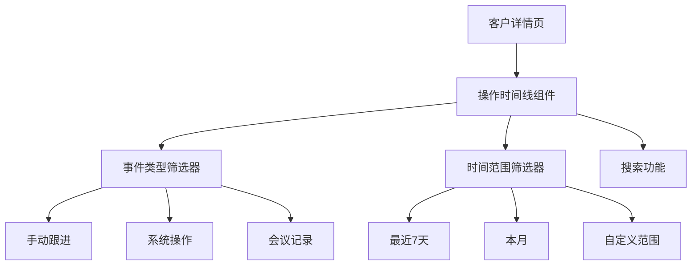

# 飞书轻量化CRM系统 - 用户跟进模块升级前端PRD

## 1. 文档概述

### 1.1 产品背景
基于已完成的统一操作记录审计服务端，现有用户跟进模块需从前端层面进行重大升级。本次升级旨在将原本单一的手动跟进记录，扩展为涵盖系统自动操作与人工跟进的完整客户时间线，实现对客户全生命周期的可视化追溯。

### 1.2 核心价值
- **全景可视化**：将离散的操作痕迹整合为连贯的客户故事线，消除信息断层
- **智能分类检索**：支持按事件类型、时间范围、操作人员等多维度筛选查询
- **操作便捷性**：在保留原有手动跟进功能基础上，新增自动化记录展示
- **团队协作增效**：为新成员快速熟悉客户背景、管理者审计流程提供完整依据

## 2. 模块架构设计

### 2.1 信息架构升级


### 2.2 组件层级结构
- **顶层容器**：客户详情页时间线区域（占位比提升至60%页面高度）
- **二级组件**：操作记录列表容器
- **三级组件**：单个事件记录卡片（根据event_type动态渲染）
- **辅助组件**：筛选栏、加载状态、空状态提示

## 3. 核心组件详述

### 3.1 操作时间线组件 (TimelineComponent)
**定位**：替换原有的简易跟进记录列表，作为客户详情页的核心信息面板。

#### 3.1.1 视觉设计
- **布局方案**：采用左右交错时间轴设计，左侧系统操作，右侧人工操作
- **视觉层次**：
    - 图标区分：系统事件用齿轮图标，人工跟进用对话图标，会议记录用日历图标
    - 颜色编码：成功操作绿色、待处理黄色、警告类红色、普通信息蓝色
    - 时间标注：精确到分钟，相邻同天事件折叠时间显示

#### 3.1.2 交互逻辑
```javascript
// 事件卡片动态渲染逻辑
const renderEventCard = (event) => {
  switch(event.event_type) {
    case 'MANUAL_FOLLOW_UP':
      return <FollowUpCard event={event} />;
    case 'LEAD_CONVERTED':
      return <SystemEventCard event={event} />;
    case 'CONTRACT_CREATED':
      return <SystemEventCard event={event} />;
    default:
      return <DefaultEventCard event={event} />;
  }
};
```

### 3.2 智能筛选栏 (FilterBarComponent)
**核心功能**：提供多维度筛选能力，确保用户快速定位目标信息。

#### 3.2.1 筛选条件组合
| 筛选维度 | 选项设置 | 交互方式 |
|---------|---------|---------|
| 事件类型 | 多选下拉（手动跟进、线索转化、商机创建、合同生成等） | 标签式选择 |
| 时间范围 | 预设选项（今天、本周、本月） + 自定义日期选择 | 下拉选择+日历组件 |
| 操作人员 | 搜索下拉（包含"系统操作"选项） | 支持拼音首字母搜索 |
| 关键词 | 全文搜索（匹配事件内容、备注字段） | 实时搜索联想 |

#### 3.2.2 筛选状态管理
- **即时生效**：任何筛选条件变化立即触发重新查询
- **状态持久化**：将筛选条件保存在URL参数中，支持链接分享当前视图
- **重置机制**：一键重置所有筛选条件

## 4. 界面交互规范

### 4.1 加载状态设计
- **骨架屏效果**：数据加载时显示仿照时间线结构的灰色占位块
- **分页加载**：首次加载20条，滚动至底部自动加载更多（无限滚动模式）
- **加载提示**：底部显示"加载中..."提示，网络延迟时显示旋转图标

### 4.2 空状态处理
- **默认空状态**：无任何记录时显示插画+文字引导"记录第一次客户互动"
- **筛选空状态**：有筛选条件无结果时显示"未找到匹配记录"+建议调整筛选条件

### 4.3 响应式适配
**移动端优化**：
- 时间轴改为垂直单列布局
- 筛选栏收起到"筛选"图标，点击后全屏浮层展开
- 事件卡片点击展开详情，而非悬停交互

## 5. API集成方案

### 5.1 接口调用时序
```javascript
// 组件初始化时
useEffect(() => {
  loadTimelineData();
}, [customerId, filterConditions]);

// 筛选条件变化时
const handleFilterChange = (newFilters) => {
  setFilterConditions(newFilters);
  // 重置分页，重新加载
  setCurrentPage(1);
  loadTimelineData(newFilters, 1);
};
```

### 5.2 错误处理机制
- **网络异常**：显示重试按钮，支持手动重新加载
- **数据格式错误**：跳过异常记录，在控制台输出警告日志
- **权限不足**：显示"无权限查看"提示，隐藏敏感信息

## 6. 可视化规范

### 6.1 事件类型图标映射表
| 事件类型 | 图标 | 颜色 | 说明 |
|---------|------|------|------|
| MANUAL_FOLLOW_UP | 💬 | #1890FF | 人工跟进记录 |
| LEAD_CONVERTED | 🔄 | #52C41A | 线索转化操作 |
| CONTRACT_CREATED | 📝 | #FA8C16 | 合同创建事件 |
| PAYMENT_RECEIVED | 💰 | #52C41A | 回款到账通知 |
| SYSTEM_ALERT | ⚠️ | #FAAD14 | 系统预警提示 |

### 6.2 动画效果设计
- **新增记录**：淡入动画，从顶部滑入
- **筛选切换**：淡出当前内容，淡入新内容（交叉淡化）
- **加载更多**：底部向上推入新内容

## 7. 数据统计与可访问性

### 7.1 关键指标埋点
- 时间线页面的访问次数和时长
- 各筛选条件的使用频率
- 不同类型事件的查看热度

### 7.2 可访问性支持
- 支持键盘导航（Tab键切换焦点事件）
- 为图标和颜色状态提供文字替代描述
- 高对比度模式支持（满足WCAG 2.1 AA标准）

## 8. 相关接口
请访问以下链接获取接口“获取资源操作记录”的接口定义信息：https://api.apifox.com/temp-links/api/417794075?t=4f424d5a-b5e5-4c23-ab25-c33fa077a52f
请访问以下链接获取接口“获取我的操作记录”的接口定义信息：https://api.apifox.com/temp-links/api/417794076?t=26407dc2-03b4-4f7a-8f7d-e0768f66d56d