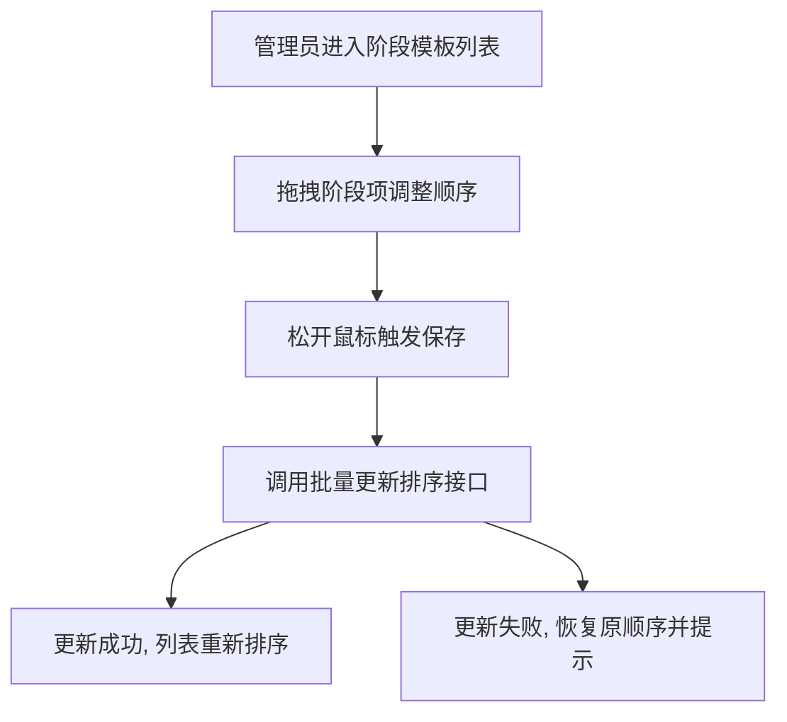
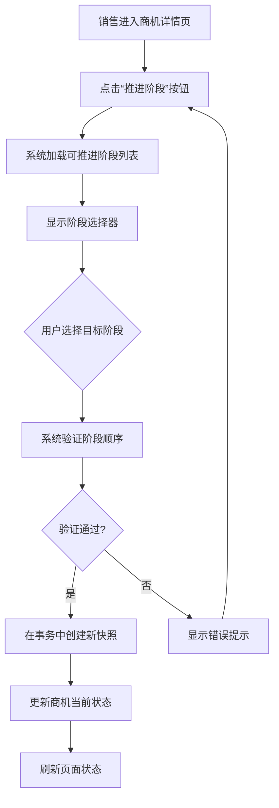
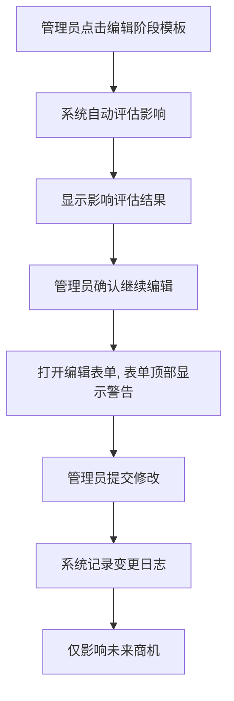

# 客户采购阶段管理模块前端PRD

## 1. 文档概述

### 1.1 模块定位
本模块是CRM系统中"客户采购阶段管理"的前端实现，负责将后端复杂灵活的采购流程配置能力和商机阶段管理能力，通过直观、易用的界面呈现给系统管理员、销售总监和销售成员。

### 1.2 核心价值
1. **配置可视化**：将抽象的采购方式和阶段模板配置转化为可视化的管理界面
2. **流程透明化**：清晰展示商机在不同采购方式下的阶段流程和推进路径
3. **操作简易化**：简化销售人员在复杂采购流程中的操作，提供智能引导
4. **数据可追溯**：完整记录和展示商机阶段历史，支持审计和分析

## 2. 页面架构与功能规划

### 2.1 系统管理员视角

#### 2.1.1 采购方式管理页面
**页面路径**：系统设置 → 流程配置 → 采购方式管理

**页面布局**：
- **左侧区域**：采购方式列表，以卡片或表格形式展示所有采购方式
- **右侧区域**：采购方式详情与操作区

**业务流程**：
1. 管理员进入页面，系统加载所有采购方式列表，按`sort_order`排序
2. 点击任一采购方式，右侧区域显示该采购方式的详细信息（编码、名称、状态、描述等）
3. 管理员可进行以下操作：
   - **新增采购方式**：点击"新增"按钮，在右侧区域打开表单
   - **编辑采购方式**：修改基本信息，但`code`字段不可编辑
   - **启用/停用采购方式**：切换状态开关
     - 停用前，系统需调用接口检查是否有活跃商机使用此方式
     - 若有，则显示不可停用提示，并提供"批量迁移工具"入口
   - **调整排序**：通过拖拽或上下箭头调整采购方式在列表中的顺序

#### 2.1.2 阶段模板管理页面
**页面路径**：系统设置 → 流程配置 → 采购方式管理 → [选择采购方式] → 阶段模板

**页面布局**：
- **顶部操作区**：采购方式名称、返回按钮、"新增阶段模板"按钮
- **主体区域**：阶段模板列表，以可排序的列表形式展示
- **右侧抽屉**：阶段模板编辑表单

**关键业务流程**：

**A. 查看阶段模板列表**
1. 进入页面后，系统加载该采购方式下的所有阶段模板
2. 列表显示每个模板的：阶段编码、阶段名称、赢率、是否默认起始阶段、是否可跳过
3. 管理员可通过拖拽直接调整阶段顺序

**B. 创建阶段模板**
1. 点击"新增阶段模板"按钮，右侧滑出抽屉表单
2. 填写表单字段，其中：
   - 阶段编码：需校验同一采购方式下唯一
   - 默认起始阶段：如果勾选，系统需提示"此操作将取消当前默认起始阶段"
3. 提交前，系统自动校验赢率范围（0-100）

**C. 编辑阶段模板**
1. 点击阶段模板行的"编辑"按钮，打开编辑抽屉
2. 系统在打开编辑界面前，自动调用"影响评估接口"，获取使用此模板的商机数量
3. 在编辑界面顶部显示影响评估结果：
   ```
   此模板已被 [X] 个商机使用
   其中活跃商机：[Y] 个
   [查看详情]
   ```
4. 管理员确认修改后，系统保存变更，仅对未来进入此阶段的商机生效

**D. 删除/停用阶段模板**
1. 点击"删除"按钮，实际执行逻辑删除（标记为停用）
2. 删除前校验：如果此模板已被任何商机使用，则不可删除，只能停用
3. 停用后，此模板不再出现在新商机的阶段选择列表中

#### 2.1.3 配置变更历史页面
**页面路径**：系统设置 → 流程配置 → 变更历史

**业务流程**：
1. 可按采购方式、变更时间、操作人筛选变更记录
2. 点击单条变更记录，可查看变更详情（旧值 vs 新值）
3. 提供"回滚"功能，可将阶段模板回滚到指定版本

### 2.2 销售成员视角

#### 2.2.1 客户详情页 - 采购方式设置
**页面位置**：客户详情页的"基本信息"区域

**业务流程**：
1. 在客户编辑模式下，"默认采购方式"显示为下拉选择器
2. 选择器仅显示已启用的采购方式，按`sort_order`排序
3. 此设置为建议值，不影响已存在的商机

#### 2.2.2 商机创建页面
**页面位置**：创建商机的表单中

**业务流程**：
1. 表单中包含"采购方式"字段
2. 如果客户有默认采购方式，则预选该方式
3. 销售人员可重新选择其他采购方式
4. 选择采购方式后，下方动态显示该采购方式的阶段流程图预览
5. 保存商机时，系统自动使用所选采购方式的默认起始阶段

#### 2.2.3 商机详情页 - 阶段管理
**页面位置**：商机详情页的核心区域

**页面布局**：
- **顶部状态栏**：显示当前阶段名称、赢率、进入时间
- **阶段流程图**：可视化展示该采购方式的完整阶段流程
- **操作区域**："推进阶段"按钮及相关操作

**关键业务流程**：

**A. 阶段流程图展示**
1. 系统加载商机所属采购方式的所有阶段模板
2. 以横向流程图示展示各个阶段，使用不同视觉状态区分：
   - 已完成阶段：灰色，带对勾图标
   - 当前阶段：高亮显示，显示当前赢率和进入时间
   - 未开始阶段：浅色
3. 在流程图上标注每个阶段的`sort_order`和赢率

**B. 阶段推进操作**
1. 点击"推进阶段"按钮，弹出阶段选择器
2. 阶段选择器中只显示"可推进到的阶段"：
   - 同一采购方式下的阶段
   - `sort_order`大于当前阶段`template_sort_order`
   - 或者`can_skip=1`的阶段
3. 选择目标阶段后，确认推进
4. 系统记录新阶段快照，更新商机当前状态
5. 页面实时刷新阶段流程图和状态栏

**C. 阶段历史查看**
1. 在阶段流程图下方提供"查看阶段历史"链接
2. 点击后以时间线形式展示所有阶段快照
3. 每个快照记录显示：阶段名称、赢率、进入时间、退出时间

### 2.3 销售总监视角

#### 2.3.1 采购流程分析看板
**页面路径**：数据分析 → 采购流程分析

**业务流程**：
1. 可按采购方式筛选查看不同流程的商机分布
2. 展示各采购方式的平均成交周期、阶段停留时间
3. 提供按阶段、时间维度的漏斗分析
4. 所有分析数据基于历史快照，确保数据准确性

## 3. 核心交互流程

### 3.1 阶段模板顺序调整流程


### 3.2 商机阶段推进流程


### 3.3 阶段模板修改影响评估流程


## 4. 状态管理与数据流

### 4.1 页面状态管理
- **采购方式列表页**：需要维护采购方式的排序状态，支持本地排序预览
- **阶段模板列表页**：需要维护阶段模板的拖拽排序状态
- **商机详情页**：需要维护当前阶段状态、阶段历史、可推进阶段列表

### 4.2 数据加载策略
- **配置数据**：采购方式、阶段模板等配置数据，采用缓存策略，减少重复请求
- **商机数据**：阶段历史和当前状态，采用按需加载
- **影响评估数据**：在需要时实时加载

### 4.3 实时性要求
- 阶段模板的修改需要实时反映在商机创建和阶段推进的选择列表中
- 但已存在的商机阶段快照不受影响，保持历史原貌

## 5. 错误处理与用户引导

### 5.1 配置冲突处理
- **采购方式停用冲突**：当存在活跃商机使用时，显示详细的冲突信息，并提供批量迁移工具入口
- **阶段模板删除冲突**：当模板被使用时，禁止删除，只能停用

### 5.2 操作失败处理
- **网络异常**：提供重试机制，保存用户已输入的数据
- **数据验证失败**：在表单字段旁显示具体的错误信息
- **权限不足**：显示友好的权限提示，并提供申请权限的途径

### 5.3 用户引导
- **新功能引导**：首次使用采购阶段管理功能时，提供功能引导
- **复杂操作引导**：对于批量迁移、配置回滚等复杂操作，提供分步引导
- **最佳实践提示**：在关键操作时提供最佳实践建议

## 6. 性能优化要求

### 6.1 加载性能
- 阶段模板列表采用虚拟滚动，支持大量模板的流畅展示
- 商机阶段历史采用分页加载，避免一次性加载大量历史记录
- 流程图渲染使用canvas或SVG，确保大量阶段的流畅展示

### 6.2 操作响应
- 阶段拖拽排序提供本地预览，减少服务端交互
- 阶段推进操作提供加载状态，防止重复提交
- 批量操作提供进度提示，支持中途取消

## 7. 权限控制

### 7.1 界面元素控制
- 系统管理员：可见所有配置管理功能
- 销售总监：可见采购流程分析看板
- 销售成员：仅可见与商机操作相关的功能

### 7.2 操作权限控制
- 阶段模板编辑：需二次确认，特别是修改被使用的模板时
- 配置回滚：需高级权限，并记录回滚操作日志
- 批量迁移：需单独授权，防止误操作

## 8. 与现有系统集成

### 8.1 与客户模块集成
- 在客户详情页无缝集成默认采购方式设置
- 在客户列表中支持按采购方式筛选

### 8.2 与商机模块集成
- 在商机列表中增加采购方式和当前阶段的筛选
- 在商机漏斗分析中支持按采购方式分组

### 8.3 与报表模块集成
- 提供采购流程分析专属报表
- 支持将采购阶段数据导出到现有报表系统