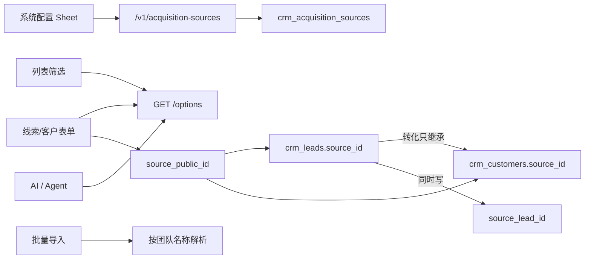

# 获客来源可配置化 TRD

将线索、客户共用的获客来源，从写死枚举改为按团队落库配置。本文承接 [获客来源可配置化 PRD v1.2](./2026-08-18-acquisition-source-configurable.md)，只写实现，不重写产品规则。

飞书原文：[获客来源可配置化](https://apifox666.feishu.cn/wiki/H3H9wCZhgis9lLkXAmocJwQGn0g)

飞书 TRD：[获客来源可配置化 TRD](https://apifox666.feishu.cn/wiki/JsMuwFmCUiSaEckumYJcoxy8ntd)

| 项 | 内容 |
| --- | --- |
| 文档类型 | 技术需求文档 TRD v1.1 |
| 状态 | 待开发 |
| 日期 | 2026-08-18 |
| 对应 PRD | v1.2，方案已评审 |
| 模块 | 系统配置 / 线索 / 客户 / AI |
| 读者 | 后端、前端、测试、实施 |
| Alembic 起点 | `095_agent_async_operation_collation` |
| 建议修订 | `096_acquisition_sources` |

| 本文写 | 本文不写 |
| --- | --- |
| 表、字段、索引、约束 | 产品规则正文（见 PRD） |
| 接口路径、请求响应、权限码 | 通用字典 / 行业 / 采购方式改造 |
| 双写、回填、发布回滚 | 跨团队共享、多语言选项名 |
| 文件级影响面与测试矩阵 | 具体补丁代码 |

PRD 已拍板、本文不得推翻的决策：专表、线索+客户共用、设置名「获客来源」、7 个系统默认项、「线索转化」不是用户选项、对外 `public_id`、对内真 id、改名跟读、一律不删除只启停、权限对齐采购方式但对外不用数字 id。

## 1. 范围与约束

| 类型 | 说明 |
| --- | --- |
| 范围内 | 新增 `crm_acquisition_sources`；线索/客户绑定 `source_id`；配置 API；表单/筛选/导入/AI/转化分析改走配置 |
| 范围内 | 创建团队种子；存量团队幂等回填；历史值扫描与映射 |
| 范围外 | 系统字典平台；公司规模、跟进方式、退回原因、行业、采购方式、客户/线索状态 |
| 约束 | 业务入口切换前，历史必须先对齐 |
| 约束 | 旧列清理与入口切换不在同一发布窗口 |
| 约束 | 种子必须与 `create_team` 同一事务，不能先交团队再补配置 |

## 2. 现状结论

### 2.1 存储不一致

| 对象 | 字段 | 类型 | 空值 | 实际写入 |
| --- | --- | --- | --- | --- |
| 线索 | `crm_leads.source` | `Enum(LeadSource)`，`nullable=False`，有 `idx_source` | 不允许 | SQLAlchemy 未配 `values_callable`，库内可能是成员名 `ONLINE_REGISTER`，不能假设只有中文 |
| 客户 | `crm_customers.source` | `String(50)`，`nullable=True` | 允许 | 存中文标签；转化路径写 `lead.source.value`（中文） |
| 客户 | `crm_customers.source_lead_id` | `BigInteger`，可空 | 允许 | 转化已写入，对外已转成线索 `public_id` |

模型与 schema 也不对齐：

| 位置 | 选项 |
| --- | --- |
| `app/models/lead.py` `LeadSource` | 7 项，value 为中文 |
| `app/models/customer.py` `CustomerSource` | 7 项，无「线索转化」 |
| `app/schemas/customer.py` `CustomerSource` | 8 项，多了 `LEAD_CONVERSION = "线索转化"` |
| 前端 `customer-form.ts` | 8 项，含「线索转化」，且表单必填 |
| 前端 `lead-form.ts` / `LeadFormDialog.vue` / `Leads.vue` | 7 项中文 |
| 前端 `schemas/common.ts` `LeadSourceSchema` | 另一套英文：`WEBSITE/REFERRAL/EVENT/...` |
| 前端 `previewFieldConfig.ts` | 第三套：`website/referral/event/cold_call` |

### 2.2 读写入口

| 入口 | 现状 | 问题 |
| --- | --- | --- |
| 线索创建 / 更新 / 批量导入 | `source: LeadSource` 枚举 | 导入按枚举校验，不是按团队名称匹配 |
| 线索列表筛选 | Query `source: LeadSource` | 只能筛写死 7 项 |
| 客户创建 / 更新 | `source: CustomerSource`，可空但前端必填 | 前端可提交「线索转化」 |
| 客户列表 | `source` / `source_exclude` 字符串 in/notin | 按中文标签过滤，改名即失效 |
| 线索转化 | `POST /v1/customers/convert-from-lead` | 已写 `source=lead.source.value` 和 `source_lead_id`，语义对，但继承的是中文标签 |
| `POST /v1/leads/{id}/convert` | 只改线索状态 | 真正建客户走 convert-from-lead |
| 转化分析 | `GET` 线索 analytics `/conversion` | `group by Lead.source`，返回 `source.value` |
| 创建团队 | `POST /v1/teams/` | 建团队 + 加成员 + `TEAM_ADMIN`，**不种任何配置** |

### 2.3 权限与采购方式参考

采购方式可参考，但不能照抄对外数字 id，也不能照抄权限缺口。

| 点 | 采购方式现状 | 本期做法 |
| --- | --- | --- |
| 表 | `crm_procurement_methods`，无 `public_id`，`team_id` 可空表示系统模板 | 专表必须有 `public_id`，`team_id` 必填，不做全局模板行 |
| 选项 | `GET /v1/procurement-methods/options`，登录成员，只返回启用项 | 同样给登录成员；筛选取全部项时加 `include_inactive` |
| 管理列表 | `GET /` 只要求登录，**不是** view 权限 | 管理列表必须 `acquisition_source:view` |
| 写权限 | API 用 `create/update/delete`，但 `ALL_PERMISSIONS` 只登记了 view/create，update/delete 靠历史脚本补 | 三个码 `view/create/update` 一次性写入 `ALL_PERMISSIONS` + 迁移；不抄 delete |
| 占用 | 停用/删除前数活跃商机 | 管理列表展示线索数 + 客户数；只展示，不停用拦截，无删除 |
| 前端挂载 | `SystemConfig.vue` 卡片 + `ProcurementSheet.vue` | 同样卡片 + Sheet，无阶段页 |

### 2.4 AI / Agent

| 位置 | 现状 |
| --- | --- |
| `ai_parser/constants.py` | `LEAD_SOURCE_ENUM_MAP` / `CUSTOMER_SOURCE_ENUM_MAP`：中文 → 成员名；客户 map 无「线索转化」 |
| `handler_configs.py` `lead_source` | 同上 7 项 |
| `lead_parser.py` / `customer_parser.py` | prompt 写死 7 个中文枚举和别名 |
| `agent/prompts.py` | 线索来源只能输出那 7 个中文；未明确时默认「其他」 |
| `agent/interactions.py` | `option_sets["source"]` 写死中文 7 项 |

### 2.5 public_id 约定

`generate_public_id(prefix)` 生成 `{prefix}_{uuid4().hex}`，例如线索 `lead_` + 32 位 hex，客户 `cus_` + 32 位 hex。本期前缀 `acq`，完整形如 `acq_0123456789abcdef0123456789abcdef`。

## 3. 目标架构



| 层 | 约定 |
| --- | --- |
| 配置对象 | `AcquisitionSource`，表 `crm_acquisition_sources` |
| 对外身份 | `public_id`，前缀 `acq_` |
| 对内身份 | 数字 `id`，仅服务端 FK 使用 |
| 业务绑定 | `crm_leads.source_id` / `crm_customers.source_id` → 配置表 `id` |
| 展示 | 一律 join 当前名称，不快照 |
| 团队 | 所有读写都带当前 `team_id`；跨团队 `public_id` 当不存在 |

创建团队必须在同一事务里插入 7 个系统默认项。存量团队用同一函数幂等补齐。

## 4. 数据模型

### 4.1 新表 `crm_acquisition_sources`

| 字段 | 类型 | 约束 | 说明 |
| --- | --- | --- | --- |
| `id` | `BIGINT` | PK，自增 | 对内身份 |
| `public_id` | `VARCHAR(64)` | 全局唯一，非空 | `acq_` + 32 hex |
| `team_id` | `BIGINT` | 非空，索引 | 团队隔离，禁止 NULL |
| `code` | `VARCHAR(50)` | 团队内唯一，非空 | 系统项固定；自定义项服务端生成 |
| `name` | `VARCHAR(50)` | 团队内唯一，非空 | 展示名，去首尾空格后唯一，含停用项 |
| `is_system` | `TINYINT` | 非空，默认 0 | 1 = 系统默认项 |
| `is_active` | `TINYINT` | 非空，默认 1 | 1 启用 / 0 停用 |
| `sort_order` | `INT` | 非空 | 前端排序 |
| `created_by` | `VARCHAR(100)` | 非空 | 系统用户 ID |
| `updated_by` | `VARCHAR(100)` | 可空 |  |
| `created_time` | `DATETIME` | 非空 | `business_now` |
| `updated_time` | `DATETIME` | 非空 | 自动更新 |

| 索引 / 约束 | 字段 | 用途 |
| --- | --- | --- |
| `uq_acq_source_public_id` | `public_id` | 对外解析 |
| `uq_acq_source_team_code` | `(team_id, code)` | 种子幂等、系统项防重 |
| `uq_acq_source_team_name` | `(team_id, name)` | 名称唯一，含停用 |
| `idx_acq_source_team_active_sort` | `(team_id, is_active, sort_order)` | 选项列表 |
| `idx_acq_source_team_id` | `team_id` | 隔离查询 |

不建软删列，也不提供删除接口。停用只改 `is_active=0`，行永久保留。

### 4.2 系统默认项

`is_system = 1`，创建团队 / 存量回填时按 `code` 幂等插入。`sort_order` 从 10 起，步长 10，方便后续插入。

| sort_order | code | 默认 name |
| --- | --- | --- |
| 10 | `ONLINE_REGISTER` | 线上注册 |
| 20 | `MARKETING_ACTIVITY` | 市场活动 |
| 30 | `REFERRAL` | 客户推荐 |
| 40 | `COLD_CALL` | 电话营销 |
| 50 | `WEBSITE_INQUIRY` | 网站咨询 |
| 60 | `EXHIBITION` | 展会 |
| 70 | `OTHER` | 其他 |

| 规则 | 实现 |
| --- | --- |
| 任何项不可删 | 不提供 DELETE 接口；误建项改名后停用 |
| 系统项不可改 `code` | update schema 不含 `code`；种子也不改已有 code |
| 系统项可改名 / 排序 / 启停 | 允许；改名后历史跟读 |
| 自定义项 `code` | 服务端生成 `CUSTOM_` + 8 位 hex，用户不可见、不可改 |
| 禁止名称 | 去空格后大小写不敏感等于「线索转化」时拒绝 |

### 4.3 业务表改造

| 表 | 新增 | 旧列 | 终态 |
| --- | --- | --- | --- |
| `crm_leads` | `source_id BIGINT NULL` → 回填后改 `NOT NULL` | `source` 枚举保留到 T4 | T4 删除 `source` 和 `idx_source`，改用 `idx_leads_source_id` |
| `crm_customers` | `source_id BIGINT NULL` | `source` 字符串保留到 T4 | T4 删除 `source`；客户来源保持可空 |

两条 FK 都指向 `crm_acquisition_sources.id`：

- `ON DELETE RESTRICT`，库级兜底：本期不提供删除接口，万一有人直接删库行，仍拦住被引用项
- 不加 `ON UPDATE`
- 另加普通索引 `idx_leads_source_id` / `idx_customers_source_id`

模型侧：

| 模型 | 动作 |
| --- | --- |
| 新增 `app/models/acquisition_source.py` `AcquisitionSource` | 专表模型 |
| `Lead` | 加 `source_id`、relationship；`source` 列 T4 再删 |
| `Customer` | 加 `source_id`、relationship；`source` 列 T4 再删 |
| `LeadSource` / `CustomerSource` 枚举 | T4 删除；T1–T3 仅给回填和双写兜底 |

### 4.4 解析约定

统一走 `acquisition_source_crud.get_by_public_id(db, public_id, team_id)`。

| 入参 | 结果 |
| --- | --- |
| 当前团队存在 | 返回行 |
| 当前团队不存在，或其他团队存在 | 一律当不存在，API 404「获客来源不存在」 |
| 需要启用项（新建、AI、导入） | `is_active != 1` 时 400「该获客来源已停用」 |
| 更新已有线索/客户 | 允许保持当前已停用项；不允许改到其他停用项或他团项 |

## 5. 接口与权限

前缀：`/v1/acquisition-sources`。路由挂到 `app/api/acquisition_sources.py`，在 `app/main.py` 注册。

路径参数和请求体一律用 `public_id`，响应禁止出现数字 `id`。

### 5.1 权限码

写入 `ALL_PERMISSIONS`，启动时 `ensure_permissions_exist` 会自动补齐。`TEAM_ADMIN` 是 `"all"`，会拿到这三个码。其他角色默认不授。

| code | 用途 |
| --- | --- |
| `acquisition_source:view` | 管理列表、详情、占用数 |
| `acquisition_source:create` | 新增自定义项 |
| `acquisition_source:update` | 改名、排序、启停 |

| 接口 | 鉴权 |
| --- | --- |
| `GET /options` | 当前团队已登录成员 |
| `GET /`、`GET /{public_id}` | `acquisition_source:view` |
| `POST /` | `acquisition_source:create` |
| `PUT /{public_id}`、`PUT /reorder` | `acquisition_source:update` |

前端系统配置卡片按 `acquisition_source:view` 显示。`useSystemConfigAccess` 的权限数组补上该码。

### 5.2 选项与管理列表

`GET /v1/acquisition-sources/options`

| Query | 说明 |
| --- | --- |
| `include_inactive` | 默认 `false`。表单/AI 用默认；筛选传 `true` |

响应：

```json
[
  {
    "public_id": "acq_...",
    "name": "展会",
    "code": "EXHIBITION",
    "is_system": true,
    "is_active": true,
    "sort_order": 60
  }
]
```

`GET /v1/acquisition-sources`

管理列表，按 `sort_order` 返回，带占用数。

```json
[
  {
    "public_id": "acq_...",
    "name": "展会",
    "code": "EXHIBITION",
    "is_system": true,
    "is_active": true,
    "sort_order": 60,
    "lead_count": 12,
    "customer_count": 4,
    "created_time": "...",
    "updated_time": "..."
  }
]
```

占用数用一次聚合查，避免 N+1：

```sql
SELECT source_id, COUNT(*) FROM crm_leads WHERE team_id = :team_id AND source_id IS NOT NULL GROUP BY source_id;
SELECT source_id, COUNT(*) FROM crm_customers WHERE team_id = :team_id AND source_id IS NOT NULL GROUP BY source_id;
```

### 5.3 写接口

`POST /v1/acquisition-sources`

```json
{ "name": "地推", "sort_order": 80 }
```

服务端补：`public_id`、`code=CUSTOM_xxxxxxxx`、`is_system=0`、`is_active=1`、`team_id`。名称冲突 409。

`PUT /v1/acquisition-sources/{public_id}`

```json
{ "name": "行业展会", "is_active": 1, "sort_order": 60 }
```

不可改 `code` / `is_system` / `public_id`。系统项 `is_active=0` 允许。

`PUT /v1/acquisition-sources/reorder`

```json
{ "items": [{ "public_id": "acq_...", "sort_order": 10 }] }
```

只更新当前团队内存在的项，跨团队 id 忽略并按不存在处理。

不注册 `DELETE /v1/acquisition-sources/{public_id}`。客户端调用该路径返回 405。误建项走改名 + 停用，不删行。

### 5.4 线索 / 客户读写契约

业务写入字段统一为 `source_public_id`。读出增加对象 `source_info`，T4 前暂时保留旧字符串 `source` 作为当前名称，便于回退。

| 方向 | 字段 | T2–T3 | T4 |
| --- | --- | --- | --- |
| 请求 | `source_public_id` | 主路径 | 唯一路径 |
| 请求 | `source` 旧枚举/中文 | 仅双写窗口兼容，打 warning 日志 | 删除 |
| 响应 | `source_info.public_id` / `source_info.name` / `source_info.is_active` | 主路径 | 唯一来源对象 |
| 响应 | `source` | 仍返回当前名称字符串 | 删除或改成对象，前后端一起切干净 |

筛选：

| 旧 | 新 |
| --- | --- |
| 线索 `source=LeadSource` | `source_public_id=acq_a,acq_b` |
| 客户 `source` / `source_exclude` 中文 CSV | `source_public_id` / `source_public_id_exclude` |

转化分析响应改为按来源身份聚合：

```json
{
  "source_public_id": "acq_...",
  "source_name": "展会",
  "total": 20,
  "converted": 5,
  "conversion_rate": 25.0
}
```

`POST /v1/customers/convert-from-lead` 不接收来源字段。服务端：`customer.source_id = lead.source_id`，`customer.source_lead_id = lead.id`。若线索 `source_id` 为空（只可能出现在回填前），拒绝转化并要求先完成回填。

导入：请求仍收名称字符串 `source`。服务端按当前团队 `name` 精确匹配（trim）。匹配失败该行失败，错误列出当前启用项名称。不接受「线索转化」。

### 5.5 错误码

| 场景 | HTTP | detail |
| --- | --- | --- |
| public_id 不属于当前团队 | 404 | 获客来源不存在 |
| 新建用了停用项 | 400 | 该获客来源已停用 |
| 名称重复 | 409 | 获客来源名称已存在 |
| 名称为「线索转化」 | 400 | 不能使用该名称 |
| 调用 DELETE | 405 | Method Not Allowed |

## 6. 读写改造

### 6.1 后端解析与写入

新增 `app/services/acquisition_source_service.py`，对外只暴露这几个函数，API / CRUD / AI 都走这里，禁止各处自己拼 SQL。

| 函数 | 行为 |
| --- | --- |
| `seed_default_sources(db, team_id, created_by)` | 按 code 幂等插入 7 项，与 `create_team` 同事务 |
| `resolve_for_write(db, team_id, public_id, *, allow_inactive=False)` | 团队内解析，失败当不存在 |
| `resolve_for_import(db, team_id, name)` | trim 后按 name 精确匹配启用项 |
| `build_source_info(row)` | `{public_id, name, is_active}` |
| `count_usage(db, team_id, source_id)` | 线索数 + 客户数 |

线索/客户 create/update：

1. 取 `source_public_id`
2. `resolve_for_write(..., allow_inactive=False)`；更新且值未变时允许停用
3. 写 `source_id = row.id`
4. T2–T3 双写旧列 `source = row.name`（中文当前名，便于回退观察）
5. 响应用 `build_source_info`

列表筛选改成 `Lead.source_id.in_(ids)` / `Customer.source_id.in_(ids)`。先把 CSV public_id 解析成当前团队 id 列表，解析失败的 id 忽略，全部失败则返回空结果，不 500。

### 6.2 前端

新增：

| 文件 | 职责 |
| --- | --- |
| `CRM-Client/src/api/acquisition-source.ts` | 配置列表 / 新增 / 改名 / 启停 + options；不封装 delete |
| `CRM-Client/src/schemas/acquisition-source.ts` | zod |
| `CRM-Client/src/composables/useAcquisitionSourceOptions.ts` | 表单启用项 / 筛选全量项 |
| `CRM-Client/src/components/system-config/AcquisitionSourceSheet.vue` | 管理列表，复用 `ProcurementSheet` 的 Sheet + ListCard 模式，无阶段、无 AI 创建、无删除 |

系统配置：

| 文件 | 改动 |
| --- | --- |
| `SystemConfig.vue` | 增加「获客来源」卡片，文案：配置线索与客户共用的获客渠道 |
| `useSystemConfigAccess.ts` | 权限数组加 `acquisition_source:view` |
| `router/index.ts` | 不新增独立路由，Sheet 即可 |

业务入口去掉写死数组，改绑 `source_public_id`：

| 文件 | 改动 |
| --- | --- |
| `schemas/customer-form.ts` | 删除 `customerSourceOptions` 和「线索转化」；`source` 改为 `source_public_id: string` |
| `schemas/lead-form.ts` | 同上 |
| `schemas/common.ts` `LeadSourceSchema` | 改为来源对象或删除，不再用英文枚举 |
| `schemas/lead.ts` | 响应 `source` 跟读名称，另加 `source_info` |
| `LeadFormDialog.vue` / `CustomerFormDialog.vue` / `CustomerEdit.vue` | options 走 composable |
| `Customers.vue` / `Leads.vue` | 筛选项走 `include_inactive=true`；展示跟读 `source_info.name` |
| `SearchCard.vue` | 去掉写死 7 项 |
| `CustomerDetailSheet.vue` / `LeadDetailSheet.vue` / `ApprovalCenter.vue` | 展示当前名称，空则「未设置」 |
| `StatusBadge.vue` | `type="source"` 改成跟行业一样动态显示，不再按中文色板；未知名不再显示「未知」 |
| `previewFieldConfig.ts` | 选项改为动态或下线这组英文 key |
| `api/lead.ts` / `api/customer.ts` | 写入 `source_public_id`；列表 query 换新参数 |

转化弹窗不出现来源选择。

### 6.3 AI / Agent

| 文件 | 改动 |
| --- | --- |
| `ai_parser/constants.py` | 删除两份写死 map，改为运行时按团队启用项建 `{name: public_id}` |
| `lead_parser.py` / `customer_parser.py` | prompt 注入当前启用名称；输出必须是这些名称之一；未明确来源时匹配 code=`OTHER` 的当前名称，不再写死「其他」 |
| `handler_configs.py` | `lead_source` 改为动态，或从 service 读取 |
| `agent/prompts.py` | 删除写死 7 项；注入当前团队启用名；禁止发明；禁止「线索转化」 |
| `agent/interactions.py` | `option_sets["source"]` 改为 `{label: name, value: public_id}` |
| 确认写入 | 最终落库走 `source_public_id`，禁止再写枚举成员名 |

AI 匹配顺序：当前启用项精确名 → 系统 code 的常见别名（仅系统项，如「朋友介绍」→ `REFERRAL`）→ `OTHER`。自定义项不做模糊别名，避免误伤。

## 7. 迁移与双写

### 7.1 发布阶段


| 阶段 | 做什么 | 不做 |
| --- | --- | --- |
| T0 | 生产只读扫描，出合法值 / 空值 / 脏值 /「线索转化」清单 | 不改表、不切入口 |
| T1 | Alembic：建表、加 `source_id`、种子、回填、加权限 | 不改前端，旧读写仍走旧列 |
| T2 | 后端双写 `source_id` + 旧列；读优先 `source_id` | 前端仍可传旧 `source` |
| T3 | 前端改 options / 表单 / 筛选 / AI；管理 Sheet 上线 | 不删旧列 |
| T4 | 观察期过后再删 `crm_leads.source`、`crm_customers.source` 和相关枚举 | 不与 T3 同一天 |

### 7.2 T0 扫描 SQL

在生产只读执行，结果留给实施，不写进仓库根目录。

```sql
SELECT team_id, source, COUNT(*) AS cnt
FROM crm_leads
GROUP BY team_id, source
ORDER BY team_id, cnt DESC;

SELECT team_id, source, COUNT(*) AS cnt
FROM crm_customers
GROUP BY team_id, source
ORDER BY team_id, cnt DESC;

SELECT COUNT(*) AS lead_null_source
FROM crm_leads
WHERE source IS NULL OR source = '';

SELECT COUNT(*) AS customer_null_source
FROM crm_customers
WHERE source IS NULL OR source = '';
```

### 7.3 回填映射

统一函数 `map_legacy_source(raw) -> code`。大小写不敏感，先 trim。

| raw | 目标 code |
| --- | --- |
| `ONLINE_REGISTER` / `线上注册` | `ONLINE_REGISTER` |
| `MARKETING_ACTIVITY` / `市场活动` | `MARKETING_ACTIVITY` |
| `REFERRAL` / `客户推荐` | `REFERRAL` |
| `COLD_CALL` / `电话营销` | `COLD_CALL` |
| `WEBSITE_INQUIRY` / `网站咨询` | `WEBSITE_INQUIRY` |
| `EXHIBITION` / `展会` | `EXHIBITION` |
| `OTHER` / `其他` | `OTHER` |
| `LEAD_CONVERSION` / `线索转化` | `OTHER` |
| 空 / NULL | 客户保持 `source_id` 空；线索不应出现，出现则记脏值并落到 `OTHER` |
| 其他任何值 | `OTHER`，并写入脏值清单 |

回填顺序：

1. 给每个现有团队调用 `seed_default_sources`，按 `code` 存在则跳过
2. 若团队已有同名自定义项，把它标成对应系统项（`is_system=1`，`code` 改成系统 code），禁止再插一条
3. 按映射把 `crm_leads.source` / `crm_customers.source` 写成 `source_id`
4. 输出每个团队：合法对齐数、空值数、脏值明细
5. 校验：线索 `source_id IS NULL` 必须为 0，否则迁移失败

### 7.4 种子与创建团队

`create_team` 在创建团队、加成员、授 `TEAM_ADMIN` 之后、`return` 之前调用 `seed_default_sources`，同一 `db` 会话，失败整单回滚。

禁止单独开事务、禁止后台异步补种。回填脚本和创建团队走同一个函数，保证幂等键是 `(team_id, code)`。

### 7.5 Alembic

建议一条主迁移 `096_acquisition_sources`，必要时权限可拆 `097`，但必须同一发布包含。

| 步骤 | upgrade |
| --- | --- |
| 1 | 建 `crm_acquisition_sources` 及索引 |
| 2 | `crm_leads.source_id` / `crm_customers.source_id` 可空 + 索引 + FK |
| 3 | 插入三个权限，并挂到 `TEAM_ADMIN`（`TEAM_ADMIN` 已是 all，启动时也会补，迁移里仍显式插入权限行） |
| 4 | 对现有团队种子 + 回填 |
| 5 | 线索 `source_id` 改 `NOT NULL`。若仍有空值，迁移失败，不带脏数据上线 |

downgrade：删 FK 和 `source_id`，删配置表。权限行可留，避免回滚误伤角色表。旧业务列不在这条迁移删除。

T4 另开 `0xx_drop_legacy_source_columns`，观察期过后再做。

## 8. 影响面

### 8.1 后端必改

| 文件 | 改动 |
| --- | --- |
| `app/models/acquisition_source.py` | 新增 |
| `app/schemas/acquisition_source.py` | 新增 |
| `app/crud/acquisition_source.py` | 新增 |
| `app/services/acquisition_source_service.py` | 新增 |
| `app/api/acquisition_sources.py` | 新增 |
| `app/main.py` | 挂路由 |
| `app/api/teams.py` | `create_team` 同事务种子 |
| `app/models/lead.py` / `app/models/customer.py` | 加 `source_id` |
| `app/schemas/lead.py` / `app/schemas/customer.py` | `source_public_id` + `source_info`；删除 schema 里的「线索转化」 |
| `app/crud/lead.py` / `app/crud/customer.py` | 筛选和写入改 `source_id` |
| `app/api/leads.py` / `app/api/customers.py` | 列表、创建、更新、转化分析 |
| `app/constants/permissions.py` | 三个权限码：view / create / update |
| `app/utils/public_id.py` | 增加 `ACQUISITION_SOURCE_PUBLIC_ID_PATTERN` |
| `migrations/versions/096_acquisition_sources.py` | 建表、回填 |

### 8.2 后端 AI / 分析

| 文件 | 改动 |
| --- | --- |
| `app/services/ai_parser/constants.py` | 去掉写死 map |
| `app/services/ai_parser/lead_parser.py` | 动态枚举 |
| `app/services/ai_parser/customer_parser.py` | 动态枚举 |
| `app/constants/handler_configs.py` | `lead_source` |
| `app/services/agent/prompts.py` | 注入当前启用项 |
| `app/services/agent/interactions.py` | 动态 option_sets |

### 8.3 前端必改

| 文件 | 改动 |
| --- | --- |
| `src/api/acquisition-source.ts` | 新增 |
| `src/schemas/acquisition-source.ts` | 新增 |
| `src/composables/useAcquisitionSourceOptions.ts` | 新增 |
| `src/components/system-config/AcquisitionSourceSheet.vue` | 新增 |
| `src/views/SystemConfig.vue` | 卡片 |
| `src/composables/useSystemConfigAccess.ts` | 权限 |
| `src/schemas/customer-form.ts` / `lead-form.ts` / `common.ts` / `lead.ts` | 去掉写死枚举 |
| `src/components/LeadFormDialog.vue` | 动态 options |
| `src/components/dialogs/CustomerFormDialog.vue` | 动态 options，删 normalize 枚举 |
| `src/views/CustomerEdit.vue` | 同上 |
| `src/views/Customers.vue` / `Leads.vue` | 筛选和展示 |
| `src/components/crmwolf/SearchCard.vue` | 筛选 |
| `src/views/CustomerDetailSheet.vue` / `LeadDetailSheet.vue` / `ApprovalCenter.vue` | 展示 |
| `src/components/StatusBadge.vue` | 动态来源 |
| `src/config/previewFieldConfig.ts` | 第三套英文选项 |
| `src/api/lead.ts` / `src/api/customer.ts` | 字段 |

### 8.4 明确不改

| 文件 / 能力 | 原因 |
| --- | --- |
| 采购方式表和对外数字 id | 历史包袱，不在本期修 |
| 行业、公司规模、跟进方式 | PRD 非目标 |
| `source_lead_id` 语义 | 仍表示从哪条线索转化 |
| 线索/客户状态机 | 无关 |

## 9. 测试

### 9.1 后端

| 编号 | 场景 | 期望 |
| --- | --- | --- |
| UT-01 | `seed_default_sources` 跑两次 | 仍是 7 行，code 不重复 |
| UT-02 | 存量团队已有同名「展会」 | 复用并标 `is_system`，不新增第 8 条 |
| UT-03 | `map_legacy_source` | 中文、成员名、「线索转化」、脏值都落到正确 code |
| UT-04 | 跨团队 `public_id` | 当不存在，不泄露 |
| API-01 | 新团队创建 | 立刻能 `GET /options` 拿到 7 项 |
| API-02 | 改名 | 旧线索/客户 `source_info.name` 变，`public_id` 不变 |
| API-03 | 停用 | options 默认消失；`include_inactive=true` 仍在；旧记录可读 |
| API-04 | 调用 DELETE | 405，行还在 |
| API-05 | 误建项改名后停用 | 名称可改、`is_active=0`、options 默认不含、行仍在 |
| API-06 | 名称「线索转化」 | 400 |
| API-07 | 转化 | 不收来源；客户 `source_id` = 线索 `source_id`；`source_lead_id` 有值 |
| API-08 | 导入未知名 | 该行失败，错误含可用名称 |
| API-09 | 筛选停用项 | 能筛出历史 |
| API-10 | 转化分析 | 改名前后同一 `public_id` 一条 |

### 9.2 前端

| 编号 | 场景 | 期望 |
| --- | --- | --- |
| FE-01 | 无线索配置权的销售打开新建 | 能选启用项，看不到配置卡片 |
| FE-02 | 管理员打开系统配置 | 有「获客来源」卡片，能新增、改名、排序、启停，无删除 |
| FE-03 | 客户表单 | 无「线索转化」 |
| FE-04 | 转化流程 | 无来源下拉 |
| FE-05 | 切换团队 | 选项不串 |
| FE-06 | StatusBadge | 改名后显示新名，不再出现「未知」 |

### 9.3 AI

| 编号 | 场景 | 期望 |
| --- | --- | --- |
| AI-01 | 「朋友介绍的」 | 匹配当前 `REFERRAL` 名称 |
| AI-02 | 团队把「其他」改成「未分类」且用户没说来源 | 落到该系统项，不输出「其他」 |
| AI-03 | 用户说「地推」但团队没有 | 落到 `OTHER`，不新建选项 |
| AI-04 | 任何路径 | 不写「线索转化」 |

## 10. 发布与回滚

| 窗口 | 内容 | 回滚 |
| --- | --- | --- |
| T0 | 只读扫描，实施确认脏值清单 | 无 |
| T1 | 部署含 096 的后端，先不切前端 | Alembic downgrade；业务仍走旧列 |
| T2 | 打开双写 + 读 `source_id` | 关掉双写开关或回旧镜像；`source_id` 保留 |
| T3 | 前后端一起切入口，上配置页 | 回退前端和读写兼容层；不要 downgrade 表 |
| 观察 | 至少一个发布窗口：抽检历史、转化、筛选、导入、AI | 入口有问题就回 T2 |
| T4 | 独立 PR 删旧列 | 成本高，必须观察期达标 |

建议加一个短期配置 `ACQUISITION_SOURCE_ACCEPT_LEGACY_SOURCE=true`，T3 观察期仍接受旧 `source` 字符串，T4 关掉。默认 T2 打开。

回填错误禁止靠删配置表重来。按脏值清单重跑 `map_legacy_source`，只更新 `source_id`。

## 11. 风险与开放项

| 风险 | 影响 | 处理 |
| --- | --- | --- |
| 线索枚举在库里既有名字又有中文 | 回填漏网 | 映射同时覆盖 name/value；T0 先扫 |
| 「线索转化」数量超预期 | 大量进「其他」，统计失真 | T0 单独列清单，实施确认后再回填 |
| 新团队漏种子 | 表单空下拉 | 种子放 `create_team` 同事务，并加 API-01 |
| AI prompt 仍写死 | 写出已改名或不存在的项 | 与 T3 同一批切；AI-02 必测 |
| 过早 T4 | 对齐出错无法对照旧列 | T4 独立窗口 |
| 照抄采购方式权限缺口 | 管理列表裸奔或 update 码缺失 | 管理列表强制 view；三码一次登记，不抄 delete |
| 前端三套枚举漏改 | 校验失败或显示「未知」 | 第 8.3 节文件必须全部改完 |

本期拍板、不再讨论的实现选择：

| 项 | 选择 |
| --- | --- |
| 自定义项 code | `CUSTOM_` + 8 hex，用户不可见 |
| 管理 UI | 系统配置卡片 + Sheet，不新开独立路由 |
| 筛选全量项 | `GET /options?include_inactive=true` |
| 来源色板 | 动态名称 + 统一色，不再为 7 个中文配色 |
| 旧字段兼容 | T2–T3 响应仍带 `source` 名称字符串；T4 删除 |
| 线索 `source_id` | T1 回填成功后当场 `NOT NULL` |
| 删除 | 不提供删除接口，也不建软删列。停用只改 `is_active=0`，行永久保留。 |

如果 T0 扫描出现未覆盖的大量脏值，先停在 T1，不进入 T3。

## 12. 修订记录

| 版本 | 日期 | 说明 |
| --- | --- | --- |
| v1.0 | 2026-08-18 | 按 PRD v1.1 下沉的首版实现方案 |
| v1.1 | 2026-08-18 | 对齐 PRD v1.2：一律不提供删除，只保留启用 / 停用；权限收成 view / create / update 三码。 |
