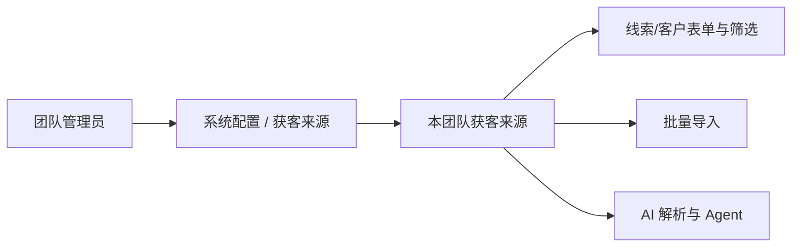
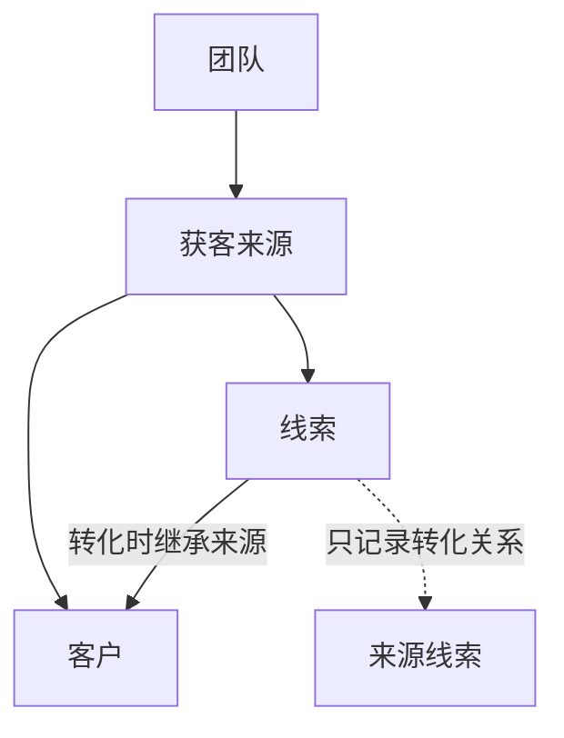
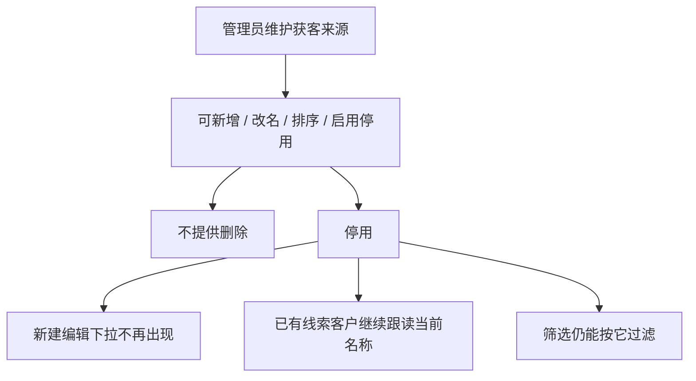
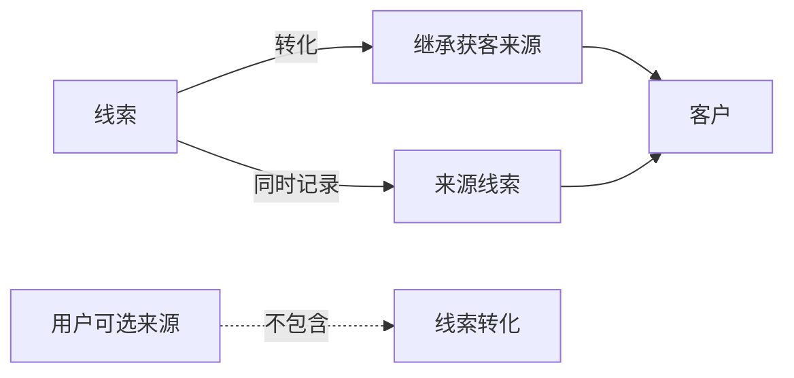

# 获客来源可配置化

将线索、客户共用的获客来源，从写死选项改为按团队可配置。现有 7 个类型作为创建团队的默认值，之后由团队管理员维护。对外交互使用与线索、客户一致的 `public_id`，展示名可改且跟读。

飞书原文：[获客来源可配置化](https://apifox666.feishu.cn/wiki/H3H9wCZhgis9lLkXAmocJwQGn0g)

| 项 | 内容 |
| --- | --- |
| 文档类型 | 产品需求文档 PRD v1.2 |
| 状态 | 方案已评审，待开发 |
| 日期 | 2026-08-18 |
| 模块 | 系统配置 / 线索 / 客户 |
| 优先级 | P1 |
| 读者 | 产品、研发、测试、实施 |

| 本文写 | 本文不写 |
| --- | --- |
| 问题、目标、规则、角色、验收 | 表结构、字段类型、索引、DDL |
| 业务对象如何命名、如何被使用 | 接口路径、请求体、权限码 |
| 历史不能丢、先对齐再切入口 | 双写、切读、回填脚本、发布步骤 |
| 影响哪些业务入口 | 具体代码文件清单 |

实现细节见 [获客来源可配置化 TRD](https://apifox666.feishu.cn/wiki/JsMuwFmCUiSaEckumYJcoxy8ntd)。本文拍板的产品决策，TRD 不得推翻。

## 1. 背景与问题

销售在建线索、建客户时必须选择来源，用来统计人是从哪类渠道进来的。当前 7 个选项写死在前后端，所有团队共用，无法按自己的获客方式增改或停用。线索和客户还各记一套不完全对齐的值，转化、导入、AI 解析都在吃这套不一致。

| 对比项 | 现状 | 目标 |
| --- | --- | --- |
| 选项来源 | 前后端写死 | 按团队配置，系统下发当前可用项 |
| 作用范围 | 线索、客户各写一套，且不完全对齐 | 线索与客户共用同一套获客来源 |
| 记录方式 | 直接存展示文案或另一套枚举值 | 绑定稳定来源身份，展示跟读当前名称 |
| 团队隔离 | 无，全站同一份选项 | 按团队隔离，创建团队自动带默认项 |
| 对外标识 | 不稳定，或继续用内部数字 id | 与线索、客户一样使用 `public_id` |

| 问题 | 表现 | 后果 |
| --- | --- | --- |
| 选项不可配 | 只能用 7 个写死类型 | 团队无法按真实获客方式经营 |
| 两套口径 | 线索和客户的来源值对不齐 | 筛选、转化、统计、AI 匹配易错 |
| 概念混淆 | 客户选项里多了「线索转化」 | 把记录怎么来的，当成从哪获客 |
| 新团队无默认项 | 创建团队不会带上现有 7 项 | 新团队要么空下拉，要么继续吃代码默认 |

## 2. 目标与非目标

| 类型 | 说明 |
| --- | --- |
| 目标 | 团队管理员可维护本团队获客来源；销售在线索/客户表单、筛选、导入、AI 录入里使用当前团队启用项。 |
| 目标 | 现有 7 项作为系统默认值，创建团队自动带上；存量团队一次性补齐。 |
| 目标 | 线索转化不是来源选项。转化只记录来源线索，客户来源继承线索当时的获客来源。 |
| 目标 | 身份稳定：对外用 `public_id`，内部身份不暴露；展示名可改，历史记录跟读。 |
| 非目标 | 不做系统字典 / 通用选项集平台。公司规模、跟进方式、退回原因本期不改。 |
| 非目标 | 不把行业、采购方式、客户/线索状态并进获客来源。 |
| 非目标 | 不做跨团队共享来源，不做多语言选项名。 |

## 3. 成功指标

| 指标 | 口径 | 达标 |
| --- | --- | --- |
| 默认项完整 | 每个已有团队、每个新建团队 | 都有且仅有 7 个系统默认项，之后可再增自定义项 |
| 历史可对齐 | 上线前盘点现网来源值 | 合法历史 100% 对齐到对应来源；脏值有清单和兜底 |
| 不再写死选项 | 表单、筛选、导入、AI | 选项全部来自当前团队配置 |
| 转化语义正确 | 线索转客户 | 不出现「线索转化」选项；客户来源 = 线索来源 |
| 隔离正确 | 切换团队后看选项和数据 | 不可见、不可引用其他团队来源 |

## 4. 用户与场景

| 角色 | 要做什么 | 为什么 |
| --- | --- | --- |
| 团队管理员 | 在系统配置维护获客来源 | 让选项贴合本团队真实获客方式 |
| 销售成员 / 总监 | 建线索、建客户、筛选、导入时选来源 | 只关心当前启用项，不关心配置 |
| AI / Agent | 从自然语言匹配到来源 | 必须匹配当前团队选项，不能发明选项 |
| 实施 | 核对历史脏值和上线结果 | 上线后统计不断层 |

管理员改选项后，销售和 AI 立刻使用新列表。

## 5. 产品方案

### 5.1 命名

| 层 | 名称 |
| --- | --- |
| 设置页卡片 / 配置对象 | 获客来源 |
| 线索字段文案 | 线索来源 |
| 客户字段文案 | 客户来源 |
| 对外身份 | `public_id`，与线索、客户同一套约定 |

不用「客户来源」做配置对象名，因为线索和客户共用。不做「系统字典」：近两迭代没有第二套同形选项，通用字典会把状态机、行业、采购方式一起诱进来。

### 5.2 对象关系

一个团队拥有一套获客来源。线索和客户都引用其中一项。线索转化时，客户继承线索当时的获客来源，同时只把「从哪条线索转化来」记成转化关系。

### 5.3 默认 7 项

创建团队时自动写入，标记为系统默认项。存量团队补齐时按名称幂等处理：已有同名项则复用，不重复造。

| 默认排序 | 名称 | 类型 |
| --- | --- | --- |
| 1 | 线上注册 | 系统默认 |
| 2 | 市场活动 | 系统默认 |
| 3 | 客户推荐 | 系统默认 |
| 4 | 电话营销 | 系统默认 |
| 5 | 网站咨询 | 系统默认 |
| 6 | 展会 | 系统默认 |
| 7 | 其他 | 系统默认 |

> 线索转化不是获客来源。它描述这条客户记录怎么来的，不是客户从哪获客。转化只记录来源线索，客户来源继承线索当时的获客来源。

### 5.4 生命周期

获客来源按团队独立生存。系统默认项随团队创建写入。之后无论系统项还是自定义项，都只允许改名、改排序、启用 / 停用，一律不提供删除。误建的自定义项改名后再停用。

| 动作 | 系统默认项 | 自定义项 |
| --- | --- | --- |
| 创建 | 仅创建团队 / 存量补齐时写入，用户不可再造同名系统项 | 管理员新增 |
| 改名 | 允许，历史跟读新名称 | 允许，历史跟读新名称 |
| 改排序 | 允许 | 允许 |
| 停用 | 允许。历史仍显示当前名，新建 / 编辑下拉不可选 | 允许。同上 |
| 启用 | 允许 | 允许 |
| 删除 | 禁止 | 禁止 |

### 5.5 交互约定

| 入口 | 行为 |
| --- | --- |
| 系统配置卡片 | 新增「获客来源」，说明文案：配置线索与客户共用的获客渠道。无管理权限不展示。 |
| 配置页列表 | 展示名称、类型（系统/自定义）、状态、排序、占用（线索数 + 客户数）。支持新增、编辑、停用/启用、拖拽或改排序。无删除按钮。 |
| 线索/客户新建编辑 | 下拉只出当前团队启用项。提交传 `public_id`，不再传中文枚举。 |
| 列表筛选 | 给出本团队全部来源（含停用），保证历史数据能筛出来。按来源身份过滤，不按名称字符串过滤。 |
| 详情/列表展示 | 跟读当前名称。没有来源时展示「未设置」。 |
| 线索转化 | 不出现来源选择。客户继承线索当时的获客来源，同时记录来源线索。 |
| 导入 | 按当前团队名称精确匹配。无法匹配则该行失败，错误信息列出可用名称。 |
| AI / Agent | 只允许匹配当前团队启用项。禁止发明选项，禁止写「线索转化」。 |

## 6. 功能需求

| 编号 | 优先级 | 需求 | 验收要点 |
| --- | --- | --- | --- |
| FR-01 | Must | 创建团队自动带上 7 个系统默认项 | 新团队立刻能选满 7 项，无需手工配置 |
| FR-02 | Must | 存量团队幂等补齐 7 项 | 不重复造；已有同名项则复用并标为系统默认 |
| FR-03 | Must | 管理员维护本团队来源 | 可新增、改名、排序、启停；不提供删除；跨团队不可见 |
| FR-04 | Must | 线索/客户表单与筛选改走配置 | 去掉写死选项，含「线索转化」 |
| FR-05 | Must | 写入绑定来源身份，读出 `public_id` + 当前名称 | 对外不出现内部数字 id；改名后历史跟读 |
| FR-06 | Must | 线索转化继承来源 | 不选手动来源；客户来源 = 线索来源；只记录来源线索 |
| FR-07 | Must | 一律不提供删除 | 系统项和自定义项都只能停用；误建项改名后停用 |
| FR-08 | Must | 导入按名称匹配当前团队选项 | 未知名称失败并提示合法值 |
| FR-09 | Must | AI / Agent 使用当前团队启用项 | 动态使用当前列表；禁止发明；禁止「线索转化」 |
| FR-10 | Must | 来源分析按来源身份聚合 | 改名不把同一来源拆成两条 |
| FR-11 | Should | 配置页展示占用数 | 能看到该来源被多少线索/客户使用 |
| FR-12 | Should | 停用项仍可在筛选中出现 | 历史数据可过滤，新建不可选 |
| FR-13 | Could | 配置页拖拽排序 | 无拖拽时允许改排序号 |
| FR-14 | Won't | 通用字典、多语言、跨团队共享 | 本期不做 |

## 7. 权限与角色

管理权限对齐采购方式：只有团队管理员能改配置。选项读取给当前团队已登录成员，避免销售建线索还要先开通配置权。

| 角色 | 可管理来源 | 可在业务里选择来源 |
| --- | --- | --- |
| 团队管理员 | 是。可看完整列表（含停用、占用），可新增、改名、排序、启停，不能删除 | 是 |
| 销售总监 / 成员 | 否，看不到配置卡片 | 是，仅当前启用项 |
| 跨团队用户 | 否 | 只看到当前团队选项 |

## 8. 业务契约

这一节只约定产品和前后端怎么交互，不规定表怎么建、接口怎么拆。

### 8.1 身份与跟读

| 方向 | 约定 |
| --- | --- |
| 对外身份 | 只用 `public_id`。禁止对外暴露内部数字 id。 |
| 展示 | 业务对象返回来源的 `public_id` 和当前名称。 |
| 改名 | 不改 `public_id`。所有列表、详情、筛选、统计跟读新名称。 |
| 停用 | 已被引用的记录继续跟读；新建、AI、导入不可再选。 |
| 筛选 | 按来源身份过滤。停用项仍出现在筛选项里，避免历史数据筛不出来。 |

### 8.2 写入与校验

| 场景 | 规则 |
| --- | --- |
| 新建线索 / 客户 | 必须选择当前团队启用中的来源，提交 `public_id`。 |
| 更新已有记录 | 原来源若已停用，可以保持不变；不能改到其他团队，也不能改到其他停用项。 |
| 线索转化 | 不接收用户选择的来源；客户来源直接继承线索来源。 |
| 名称 | 1–50 字，去首尾空格后团队内唯一（含停用项）。禁止叫「线索转化」。 |
| 系统默认项 | 不可删除。可改名、排序、启停。自定义项同样不可删除。 |
| 跨团队 | 引用不属于当前团队的 `public_id` 时，按不存在处理，不泄露它是否真实存在。 |
| 删除 | 任何来源都不提供删除。配置页无删除入口，接口不注册 DELETE。 |

## 9. 历史数据约束

现网线索和客户的来源记法不一致，也不能假设只有 7 个干净值。上线前必须先盘点，再对齐；不能先切入口再补历史。

| 约束 | 要求 |
| --- | --- |
| 先盘点再映射 | 上线前列出各团队现网来源值，分出合法值、空值、脏值、「线索转化」。 |
| 7 个默认项一对一对齐 | 「线上注册」「市场活动」「客户推荐」「电话营销」「网站咨询」「展会」「其他」分别落到对应系统默认项。 |
| 「线索转化」不是来源 | 不进入用户可选项。历史值归到「其他」，或落一条停用兜底项；转化关系只看来源线索。 |
| 脏值不丢 | 无法识别的值先挂到「其他」，同时出清单给实施复核，不得静默丢数据。 |
| 空值保持空 | 客户来源本来为空的，对齐后仍可为空。线索来源按现网必填口径，对齐后不应空缺。 |
| 新团队必有默认项 | 创建团队成功，就一定带上 7 个系统默认项；不能出现空选项团队。 |
| 存量团队可重复执行 | 补齐默认项必须幂等，不能跑出第二套 7 项。 |
| 旧值清理单独安排 | 业务入口切换前，历史必须先对齐。旧存储的下线不与入口切换同一窗口。 |

## 10. 影响范围

这不是只加一个设置页。所有写死来源选项的入口都要改用当前团队配置。

| 业务入口 | 产品要求 |
| --- | --- |
| 系统配置 | 新增「获客来源」卡片和配置页 |
| 线索 / 客户新建编辑 | 下拉改为当前团队启用项，去掉「线索转化」 |
| 列表、搜索、字段预览 | 展示跟读当前名称；筛选按来源身份 |
| 详情、审批 | 展示当前名称 |
| 线索转化 | 不再选手动来源，继承线索来源 |
| 导入 | 按当前团队名称匹配 |
| AI / Agent | 只匹配当前团队启用项，禁止发明选项 |
| 来源分析 | 按来源身份聚合，返回当前名称 |

| 明确不改 | 原因 |
| --- | --- |
| 行业、公司规模、跟进方式、退回原因 | 不是获客来源，本期不并进来 |
| 采购方式 / 客户状态 / 线索状态 | 有自己的状态机或模板，不合并 |
| 来源线索的语义 | 只表示从哪条线索转化，不表示获客渠道 |

## 11. 验收标准

| 编号 | 场景 | 期望 |
| --- | --- | --- |
| AC-01 | 新团队第一次打开线索表单 | 能看到 7 个默认来源，无需手工配置 |
| AC-02 | 存量团队升级后打开表单 | 同样有 7 项，历史线索/客户来源仍在且名称正确 |
| AC-03 | 管理员把「展会」改成「行业展会」 | 旧记录、筛选、统计全部显示新名称，`public_id` 不变 |
| AC-04 | 管理员停用「电话营销」 | 新建看不到；旧记录仍显示；筛选仍能按它过滤 |
| AC-05 | 对任意来源执行删除 | 配置页无删除；接口不提供 DELETE；误建项只能改名后停用 |
| AC-06 | 线索转化为客户 | 不出现「线索转化」；客户来源 = 线索来源；能追溯到来源线索 |
| AC-07 | 切换团队 | 选项和数据都不串；用 A 团队 `public_id` 写 B 团队按不存在处理 |
| AC-08 | AI 录入「朋友介绍的」 | 匹配到「客户推荐」；不会造新选项 |
| AC-09 | 导入「地推」但团队没有该项 | 该行失败，错误列出当前可用名称 |
| AC-10 | 前后端交互 | 请求和响应都只有 `public_id`，没有内部数字 id |
| AC-11 | 上线后抽检历史 | 合法旧值 100% 对齐；脏值有清单；线索来源无空缺 |

## 12. 上线约束

产品只约束顺序和可回退性，具体发布步骤见 TRD。

| 顺序 | 必须先满足 | 才允许下一步 |
| --- | --- | --- |
| 1 | 现网来源值已盘点，映射和脏值清单已知 | 开始对齐历史 |
| 2 | 合法历史已对齐，脏值有兜底和清单 | 切换表单、筛选、导入、AI |
| 3 | 业务入口已切到配置项，界面不再出现写死选项和「线索转化」 | 进入观察窗口 |
| 4 | 观察一个发布窗口，无大面积来源丢失、筛选错误、转化丢来源 | 单独安排旧存储清理，可延后 |

| 回退 | 要求 |
| --- | --- |
| 业务入口有问题 | 业务入口可回退。历史对齐结果保留，业务不中断。 |
| 对齐错误 | 按脏值清单重跑映射，不得靠删配置对象“重来”。 |
| 旧存储已清理 | 回退成本高。因此清理必须独立、可延后，不能和入口切换同一天做。 |

## 13. 风险

| 风险 | 影响 | 对策 |
| --- | --- | --- |
| 现网来源值比预想更脏 | 大量历史被挂到「其他」，统计失真 | 先盘点再映射；脏值必须出清单 |
| 「线索转化」继续当来源 | 统计口径继续错 | 选项里删除；历史归到「其他」或停用兜底项 |
| 新团队没有默认项 | 表单空下拉，无法建线索 | 创建团队成功就必须带上 7 项 |
| AI 仍按旧选项理解 | 写出已不存在的名称 | 与表单、导入同一批切到当前团队启用项 |
| 过早清理旧存储 | 对齐出错后难以对照 | 旧存储清理独立窗口，观察期不达标不做 |
| 跨团队套用 `public_id` | 数据串团队 | 一律按当前团队解析，失败按不存在处理 |

## 14. 决策记录

| 议题 | 结论 | 原因 |
| --- | --- | --- |
| 通用字典 vs 独立配置 | 独立做获客来源，不做系统字典 | 近 1–2 迭代没有第二套同形选项。字典会把状态机、行业、采购方式一起诱进来。 |
| 对象名 | 设置页叫「获客来源」 | 线索和客户共用，不能叫客户来源。字段文案仍分别叫线索来源、客户来源。 |
| 默认项 | 现有 7 项作为系统默认 | 保持经营口径连续，团队可再改。 |
| 线索转化 | 不是来源选项 | 它描述记录怎么来的，不是从哪获客。转化只记录来源线索，来源继承线索。 |
| 对外标识 | `public_id` | 与线索、客户一致；采购方式用数字 id 的历史包袱不复制。 |
| 改名策略 | 跟读，不快照 | 统计按来源身份聚合，名称只是展示。 |
| 删除策略 | 一律不删除，只启停 | 来源是统计维度。停用后旧记录继续跟读，新建下拉不再出现。 |
| 权限模型 | 对齐采购方式 | 管理归团队管理员，选项读取给团队成员。 |

## 15. 修订记录

| 版本 | 日期 | 说明 |
| --- | --- | --- |
| v1.0 | 2026-08-18 | 方案评审后首版。范围锁定为获客来源独立配置，不含系统字典。 |
| v1.1 | 2026-08-18 | 按成熟 PRD 范畴收口：删除表结构、接口、文件清单和发布脚本，只保留产品契约。实现细节下沉 TRD。 |
| v1.2 | 2026-08-18 | 获客来源一律不提供删除，只保留启用 / 停用；配置入口仍在系统配置卡片。 |
