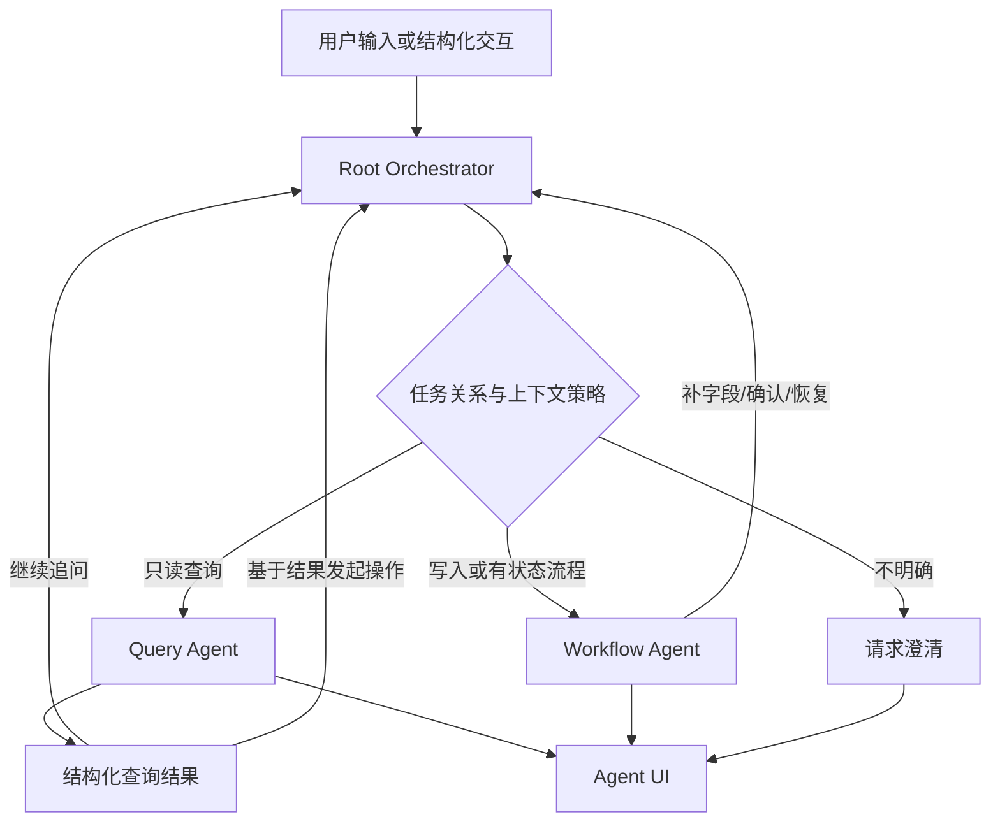
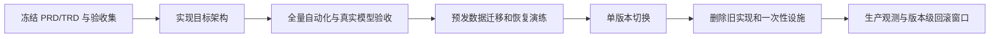

# CRM Agent 双执行路径与统一交互升级 PRD

| 项目 | 内容 |
|---|---|
| 文档类型 | PRD |
| 状态 | 架构修订待评审 |
| 版本 | v0.3 |
| 日期 | 2026-08-23 |
| 读者 | 产品、研发、测试、实施 |
| 对应 TRD | [CRM Agent 双执行路径与统一交互升级 TRD](https://apifox666.feishu.cn/wiki/Nx8jwJQTUiv0nnk3usrcStr7nQw) |

> **产品结论：**用户继续只面对一个“CRM Agent”。系统内部由确定性的 **Root Orchestrator** 判断本轮与当前任务的关系、决定上下文是否继承，并在 **Query Agent** 与 **Workflow Agent** 两条业务执行路径之间调度。Root Orchestrator 不是第三个面向用户的 Agent。
>
> **收敛原则：**本次升级只交付一套目标架构，不保留新旧路由双轨、旧查询回退、双输入/双输出协议、长期迁移开关或兼容适配层。生产异常通过完整版本回滚处理，不通过运行时退回旧实现处理。

## 1. 背景与问题

CRMWolf 现有 Agent 已能处理跟进记录、字段补充、用户确认、业务执行、中断恢复及少量任务查询。但当前查询能力按固定场景建设，新增一种查询往往需要新增识别、规划和固定输出；同时，当前客户、上一轮结果和未完成工作流之间缺少统一的上下文使用规则。

因此出现了三类用户体验问题：

1. **问法扩展困难。**“上海有哪些客户”“重点客户呢”“第一个最近跟进怎么样”等自然查询无法稳定复用通用能力。
2. **上下文容易串线。**页面选中的客户、上一轮客户或未完成任务可能被错误带入一个明确的新问题。例如用户问“上海有哪些客户”，系统却围绕当前选中的广州客户回答。
3. **展示能力受限。**固定 Markdown 同时承担自然语言、业务数据和交互语义，前端难以独立渲染客户列表、档案卡片、时间线和确认操作。

| 维度 | 当前问题 | 目标状态 |
|---|---|---|
| 产品入口 | 用户感知到多种不一致处理方式 | 始终只有一个 CRM Agent 入口 |
| 任务判断 | 只判断查询/操作，不先判断新任务或旧任务 | 先判断任务关系，再决定上下文和执行路径 |
| 查询扩展 | 每个问题增加专用分支 | 通过通用 CRM 查询能力覆盖同类问题 |
| 工作流 | 已具备确认、恢复、幂等能力，但与查询职责混杂 | 保留业务行为，收敛为专用 Workflow Agent |
| 上下文 | 当前客户、历史查询、结果集容易被默认继承 | 每类上下文均显式决定 USE/IGNORE/RESUME/SUSPEND |
| 输出 | 固定 Markdown | 自然语言说明 + 结构化 Agent UI |
| 渠道 | Web 展示与回答格式耦合 | Web、飞书及后续 IM 共享同一语义输出 |
| 客户档案 | 与结构化查询边界模糊 | 作为共享客户知识能力，不独立为顶层 Agent |

## 2. 产品目标与非目标

### 2.1 产品目标

1. 保持一个 CRM Agent 统一入口，用户不需要选择 Query Agent 或 Workflow Agent。
2. 建立清晰的任务关系模型，正确区分新任务、继续任务与切换任务。
3. 建立显式上下文策略，避免当前客户、上一轮查询、结果集和未完成工作流互相污染。
4. 支持客户、联系人、跟进记录、任务及后续 P0 CRM 对象的自然语言查询、筛选、排序、总结和连续追问。
5. 查询结果可以自然进入已有业务流程，并继续遵守补字段、确认、取消、恢复、权限和幂等规则。
6. 所有用户可见结果统一使用 Agent UI 结构化协议，前端不从自然语言或 Markdown 中反向解析业务语义。
7. 保持现有工作流的产品行为不回退，但允许为实现目标架构重构其内部技术组织。
8. 为后续客户档案升级和外部 IM 接入提供稳定的读取、刷新和渠道投影边界。
9. 升级完成后只保留一套路由、一套查询实现、一套工作流入口和一套 Agent UI 协议。

### 2.2 非目标

1. 本期不把 Customer、Opportunity、Contract 等领域拆成多个自治 Agent。
2. 本期不把 Customer Intelligence 独立为第三个顶层 Agent。
3. 本期不优化客户档案的事实抽取、画像质量、证据排序和摘要算法。
4. 本期不让 Query Agent 直接访问 SQL、ORM、CRUD 或任意内部接口。
5. 本期不使用向量数据库替代城市、状态、负责人、金额、时间等结构化查询。
6. 本期不正式上线飞书、企业微信、钉钉或 Slack 新入口；只保证协议可投影。
7. 本期不改变 CRM 已有权限、审批和写入确认规则。
8. 本期不保留旧实现作为新架构的运行时兜底。

## 3. 产品结构与命名

| 名称 | 产品定义 | 是否面向用户 |
|---|---|---:|
| CRM Agent | 统一产品入口与统一会话体验 | 是 |
| Root Orchestrator | 系统内部确定性编排层，负责任务关系、上下文策略、风险路由和执行调度 | 否 |
| Query Agent | 只读问答执行路径，负责查询、筛选、汇总、比较、解释和有依据的客户问答 | 否 |
| Workflow Agent | 有状态业务流程执行路径，负责创建、修改、推进、确认、取消、恢复和写后效果 | 否 |
| Customer Intelligence | 共享客户知识能力，提供档案、事实、摘要和历史语义证据 | 否 |
| Agent UI | 渠道无关的统一输出与交互协议 | 否 |

不采用以下命名：

- 不称 Root 为“Root Agent”，避免被理解为第三个自主 Agent。
- 不称 Workflow Agent 为“Action Agent”，因为其能力包含多步骤状态、等待确认、恢复和副作用，不只是单次动作。
- 不称 Customer Intelligence 为“Knowledge Agent”，因为本期它没有独立目标、自治规划或顶层路由职责。

## 4. 核心产品模型

### 4.1 任务关系

Root Orchestrator 每轮首先判断当前输入与已有会话状态的关系：

| 任务关系 | 定义 | 示例 |
|---|---|---|
| `NEW_TASK` | 用户提出与当前工作流和上一轮查询无关的新目标 | 当前选中广州客户，用户问“上海有哪些客户” |
| `CONTINUE_TASK` | 用户继续回答、修改或追问当前任务 | “重点客户呢”“第一个呢”“时间改到下周三” |
| `SWITCH_TASK` | 用户明确中断当前任务并开始另一个目标，原工作流按规则挂起 | 确认跟进任务时改问“先查一下上海客户” |

产品规则：

1. 结构化确认、取消、选择和表单提交直接视为当前工作流的确定性继续，不再由模型猜测。
2. 用户明确提出新客户、新城市、新对象或新业务目标时，优先视为新任务或切换任务，不得被旧上下文覆盖。
3. 用户使用“这个客户”“第一个”“这些客户”“继续刚才的”等指代表达时，只有存在唯一、有效、可访问的上下文才允许继续。
4. 无法确定 `NEW_TASK`、`CONTINUE_TASK` 或 `SWITCH_TASK` 时，必须澄清，不得自动迁移任务状态。

### 4.2 上下文策略

每轮上下文必须显式决定是否使用：

| 上下文 | 策略 | 说明 |
|---|---|---|
| 当前选中客户 | `USE` / `IGNORE` | “这个客户”使用；“上海有哪些客户”忽略 |
| 上一轮查询 | `USE` / `IGNORE` | “重点客户呢”继承；新的独立问题不继承 |
| 上一轮结果集 | `USE` / `IGNORE` | “第一个客户”使用；明确新对象时忽略 |
| 活跃工作流 | `RESUME` / `SUSPEND` / `NONE` | 回答待补字段时恢复；切换任务时挂起；无任务时为 NONE |

任何上下文都不能因为“存在”就默认注入执行路径。上下文继承是每轮决策结果，不是会话惯性。

### 4.3 执行路径

| 用户请求 | 处理方式 |
|---|---|
| 查询、筛选、排序、统计、总结、解释 | Query Agent |
| 创建、修改、推进、提交、确认、取消 | Workflow Agent |
| 查询后基于结果发起操作 | 先解析服务端实体引用，再进入 Workflow Agent |
| 同时包含查询和操作 | 查询只用于确定操作对象，写入仍进入 Workflow Agent 并受确认保护 |
| 活跃工作流中的结构化交互 | 确定性恢复 Workflow Agent |
| 活跃工作流中的无关新问题 | 挂起原工作流，按新任务重新路由 |
| 对象、任务关系或操作风险不明确 | 澄清，不猜测执行 |

## 5. Query Agent 产品体验

### 5.1 自然查询

用户不需要记忆固定命令。P0 支持按客户名称、城市、行业、状态、负责人、时间范围等条件查询，并支持组合筛选、排序和分页。

示例：

- “我在上海有哪些客户？”
- “上海的重点客户有哪些？”
- “这些客户最近一个月谁还没跟进？”
- “第一个客户最近发生了什么？”

### 5.2 连续追问

连续追问必须基于服务端保存的标准查询和结果集，不得依赖模型重新猜测：

- “重点客户呢”继承上一轮 `city=上海`，追加或替换重点客户条件。
- “第一个客户”引用上一轮结果集中的第一项。
- “介绍一下这个客户”只在当前客户引用唯一且仍有权限时使用该客户。
- 用户明确说出另一个客户或新的筛选范围时，旧查询和旧客户必须被忽略。

### 5.3 结果可信

1. 客户名称、城市、状态、负责人、活动和任务等事实必须来自当前用户可访问的 CRM 数据。
2. 历史偏好、会议内容和非结构化材料可以来自 Customer Intelligence，但必须有证据来源。
3. 权限不足与真实空结果必须使用不同的用户反馈。
4. 工具失败、模型失败或数据不完整不得被改写成成功答案。
5. Query Agent 永远不执行写入。

### 5.4 查询转工作流

客户列表和客户卡片中的实体由服务端签发引用。用户点击或自然语言引用某个结果发起写操作时：

1. 系统重新校验实体仍存在且当前用户仍有权限。
2. Workflow Agent 接收唯一、明确的实体引用。
3. 后续继续执行字段补充、确认、取消和幂等规则。
4. 前端不得提交可直接执行的业务对象 ID 代替服务端引用。

## 6. Workflow Agent 产品边界

本期保持以下产品行为不变：

- 跟进记录、跟进任务、商机推进、客户资料维护等既有流程；
- 缺字段补充、对象消歧、用户确认、修改、拒绝和取消；
- 中断恢复、幂等执行、失败提示和写后刷新；
- 当前 CRM 权限、审批和通知规则。

但职责必须收敛：

- 待办任务查询、已完成工作、工作总结、客户查询和客户情况问答全部迁入 Query Agent。
- Workflow Agent 不再承担通用只读问答。
- 为实现目标架构，可以重构 Workflow Agent 的内部模块和状态组织；“产品行为保持”不等于保留旧 Root Runtime 或旧调用结构。

## 7. Customer Intelligence 边界

Customer Intelligence 是 Query Agent 和 Workflow Agent 共享的客户知识能力，不是顶层 Agent。

| 场景 | 权威能力 |
|---|---|
| “上海有哪些客户” | CRM 结构化查询 |
| “这个客户负责人是谁” | CRM 当前事实 |
| “介绍一下这个客户” | CRM 当前事实 + 客户档案摘要 |
| “客户过去重点关注什么” | 跟进、会议、文档等历史证据检索后总结 |
| 创建或修改客户相关数据 | Workflow Agent 完成写入后触发现有档案刷新 |

本期只冻结两类产品接口：

1. Query Agent 可以安全读取客户档案和证据。
2. Workflow Agent 写入后可以触发客户档案刷新。

客户档案内容质量优化在本次架构稳定后独立立项。

## 8. Agent UI

Agent 对外只返回一套 Agent UI 协议。自然语言是协议中的文本块，客户列表、卡片、时间线、表单、选择和确认是结构化内容块。

| 内容类型 | 典型用途 |
|---|---|
| Text | 自然语言回答、说明、错误和澄清 |
| Entity List | 客户、任务等实体列表 |
| Entity Card | 单个客户或业务对象摘要 |
| Timeline | 跟进、任务和业务事件 |
| Metric / Summary | 数量、分布和汇总 |
| Choice / Form | 对象消歧和字段补充 |
| Confirmation | 写入前确认、修改、拒绝和取消 |
| Error | 权限、工具、模型、数据和系统错误 |

产品要求：

1. 前端只按结构化类型渲染，不解析 Markdown 获取客户 ID、按钮动作或状态。
2. 修改客户列表卡片样式不需要修改 Agent 查询逻辑。
3. Web、飞书及后续 IM 使用同一语义结果，通过渠道能力进行展示降级。
4. 渠道不支持某类卡片时，可以降级为简化列表或文本，但不得丢失关键实体和操作语义。
5. 不存在“有 Agent UI 就渲染 Agent UI，否则渲染旧 content”的双渲染路径。

## 9. 功能需求

| 编号 | 需求 | 优先级 |
|---|---|---:|
| FR-01 | 单一 CRM Agent 入口 | P0 |
| FR-02 | 每轮生成任务关系与上下文策略 | P0 |
| FR-03 | 当前客户不得无条件继承 | P0 |
| FR-04 | Query/Workflow 按只读与写入风险分流 | P0 |
| FR-05 | 客户按城市、行业、状态、负责人等组合查询 | P0 |
| FR-06 | 上一轮查询条件连续继承和覆盖 | P0 |
| FR-07 | 结果集序号、指代和点击引用 | P0 |
| FR-08 | 查询结果转现有工作流 | P0 |
| FR-09 | 活跃工作流继续、挂起、恢复和澄清 | P0 |
| FR-10 | 权限不足、空结果、工具失败明确区分 | P0 |
| FR-11 | 客户当前事实与客户知识内容组合回答 | P0 |
| FR-12 | Agent UI 单一输出协议 | P0 |
| FR-13 | Web 与 IM 共享统一应用入口和语义输出 | P1 |
| FR-14 | 查询、路由、上下文和工作流过程可审计 | P0 |

## 10. 权限与安全

1. 所有查询和写入继续受当前团队、用户、角色和数据权限约束。
2. Query Agent 只能使用只读能力目录，不获得写工具。
3. Workflow Agent 的写操作必须继续经过当前业务 API、权限校验和确认机制。
4. 查询结果中的实体引用必须绑定团队、用户、会话、来源消息、有效期和权限。
5. 基于历史结果发起操作时必须重新检查当前权限，不信任历史授权。
6. 模型不得决定最终权限、对象 ID、状态迁移、必填字段或数据库写入。

## 11. 成功指标

| 指标 | 上线门槛 |
|---|---:|
| 任务关系正确率 | 固定评测集不低于 95% |
| Query/Workflow 路由正确率 | 固定评测集不低于 95% |
| 上下文策略正确率 | 选中客户、上一查询、结果集、活跃工作流固定评测集不低于 98% |
| 查询条件理解正确率 | P0 查询评测集不低于 95% |
| 查询结果一致性 | 与当前用户可访问 CRM 查询结果 100% 一致 |
| 权限隔离 | 跨用户、跨团队和无权限泄漏为 0 |
| Workflow 回归 | 现有 P0 工作流通过率 100% |
| Agent UI | P0 内容不依赖前端解析自然语言或旧协议 |
| 查询转工作流 | 固定场景成功率不低于 95% |
| 旧路径残留 | 生产代码、配置和前端中为 0 |

## 12. 验收标准

| 编号 | 场景 | 预期 |
|---|---|---|
| AC-01 | 页面当前选中广州客户，用户问“上海有哪些客户” | 判断为新查询，忽略当前客户，返回有权限的上海客户列表 |
| AC-02 | 用户继续问“重点客户呢” | 继承上一轮上海范围，返回上海重点客户 |
| AC-03 | 用户问“第一个客户最近跟进得怎么样” | 引用上一结果集第一项，不重新猜测客户 |
| AC-04 | 用户问“这个客户负责人是谁”且页面有唯一选中客户 | 使用当前选中客户并返回 CRM 当前事实 |
| AC-05 | 用户明确说出另一客户名称 | 忽略当前选中客户，按本轮明确客户重新解析 |
| AC-06 | 用户在待确认工作流中提交确认按钮 | 确定性恢复原工作流，不进入 Query Agent |
| AC-07 | 用户在待确认工作流中问“上海有哪些客户” | 挂起原工作流，执行新查询，不把问题当作确认回答 |
| AC-08 | 用户随后说“继续刚才的任务” | 在唯一可恢复时恢复被挂起工作流，否则要求选择 |
| AC-09 | 用户从客户列表给第一项创建跟进任务 | 重新校验实体和权限后进入 Workflow Agent，完成补字段与确认 |
| AC-10 | 查询无匹配数据 | 显示已理解条件和真实空结果，可调整条件 |
| AC-11 | 用户无权访问目标数据 | 返回权限错误，不伪装成普通空结果 |
| AC-12 | “介绍一下这个客户” | 组合 CRM 事实与现有档案证据；无法确认的信息不编造 |
| AC-13 | Query 工具失败或模型超时 | 返回明确错误并留下审计，不生成虚假业务答案 |
| AC-14 | 用户直接创建跟进记录 | 产品行为与升级前一致 |
| AC-15 | 用户取消、修改或恢复工作流 | 产品行为与升级前一致 |
| AC-16 | 前端调整客户列表卡片样式 | 不修改 Agent 查询与业务逻辑 |
| AC-17 | 渠道不支持客户卡片 | 降级展示但不丢失关键实体信息 |
| AC-18 | 检查生产代码和配置 | 不存在旧 Root 路径、旧查询 fallback、双协议、兼容 adapter 或长期迁移开关 |

## 13. 一次性切换与无历史债约束

### 13.1 禁止项

- 新旧 Root Runtime 双路径；
- 新旧 Query Agent 双实现；
- 新失败后调用旧实现的 fallback；
- 新旧输入协议并存；
- 新旧输出或前端双渲染；
- 为旧构造参数、旧字段或旧事件保留 legacy alias；
- 长期 feature flag、双写、双读或 shadow production path；
- 在旧 Root Runtime 上持续增加任务关系和上下文字段作为长期方案；
- 迁移工具、兼容 hydration 或临时 adapter 在本次升级结束后继续存在。

### 13.2 允许项

以下措施不属于兼容架构，但必须是一次性的：

- 发布前离线数据盘点；
- 可重复执行、可审计的数据迁移命令；
- 预发环境回放和对比验证；
- 数据库增量 migration；
- 完整应用版本回滚。

一次性工具必须在迁移完成并验收后从长期运行代码和发布流程中删除。

## 14. 上线约束

1. 目标架构、验收集和删除清单未冻结前，不继续在旧 Root Runtime 上补丁式增加分支。
2. 发布前必须完成 Query、任务关系、上下文策略、Workflow、权限、Agent UI、SSE 和恢复回归。
3. 测试必须固定并记录模型配置、Prompt 版本、路由决策、工具调用、Agent UI 和数据库副作用。
4. 测试数据在业务验收确认前不得清理。
5. 任何权限泄漏、错误写入、上下文串线或 Workflow P0 回归都阻断发布。
6. 生产代码只包含目标路径；生产异常执行完整版本回滚。
7. 客户档案内容升级在本次架构稳定后独立进入评审。

## 15. 风险与控制

| 风险 | 影响 | 控制 |
|---|---|---|
| 任务关系误判 | 新问题被旧任务污染，或旧任务被错误中断 | 结构化交互确定性优先；显式对象优先；低置信度澄清 |
| 当前客户误继承 | 查询围绕错误客户执行 | 每轮显式 `USE/IGNORE`，新增固定回归场景 |
| 查询转工作流实体错误 | 对错误客户执行写入 | 服务端结果集引用、当前权限复验、写前确认 |
| Root 再次膨胀 | 新逻辑继续集中在单文件 | Root 只保留编排职责，业务状态和 UI 投影分别归属专用模块 |
| 查询事实幻觉 | 用户获得错误 CRM 信息 | 只允许基于权威工具结果回答，错误不改写为成功 |
| 一次性切换范围较大 | 回归集中暴露 | 预发全量回放、固定模型配置、完整版本回滚 |
| 客户档案耦合 | 后续档案升级再次改 Agent | 冻结读取和刷新接口，不依赖内部算法 |

## 16. 决策记录

| 议题 | 结论 | 原因 |
|---|---|---|
| 用户看到几个 Agent | 一个 CRM Agent | 避免用户理解和选择内部实现 |
| 内部业务路径 | Workflow Agent + Query Agent | 读写风险、状态和交互方式不同 |
| Root 定位 | Root Orchestrator，不是自主 Agent | 只做确定性编排，不承担业务自治 |
| Workflow 命名 | Workflow Agent | 能准确表达多步骤、确认、恢复和副作用 |
| Customer Intelligence | 共享领域能力，不是顶层 Agent | 当前没有独立自治目标和路由必要性 |
| 当前客户使用方式 | 每轮显式 USE/IGNORE | 避免会话惯性污染新任务 |
| 输出方式 | 单一 Agent UI | 支持自然回答、前端灵活渲染和多渠道投影 |
| Markdown 定位 | 仅为 Text Block 的富文本内容 | 不承担业务实体和动作协议 |
| 旧实现处理 | 单版本切换并删除 | 避免长期双轨和历史债 |
| 回滚方式 | 完整应用版本回滚 | 不在新版本中保留旧运行时路径 |

## 17. 修订记录

| 版本 | 日期 | 说明 |
|---|---|---|
| v0.3 | 2026-08-23 | 将 Root 统一定义为确定性 Root Orchestrator；新增 NEW/CONTINUE/SWITCH 任务关系、四类上下文策略、活跃工作流切换规则和上下文串线验收；明确可重构 Workflow 内部实现，并禁止继续给旧 Root 打补丁或保留兼容路径 |
| v0.2 | 2026-08-21 | 明确一次性架构收敛，不保留旧查询路径、双协议、长期开关或兼容适配层 |
| v0.1 | 2026-08-21 | 形成双业务路径、客户档案边界与 Agent UI 首版方案 |
