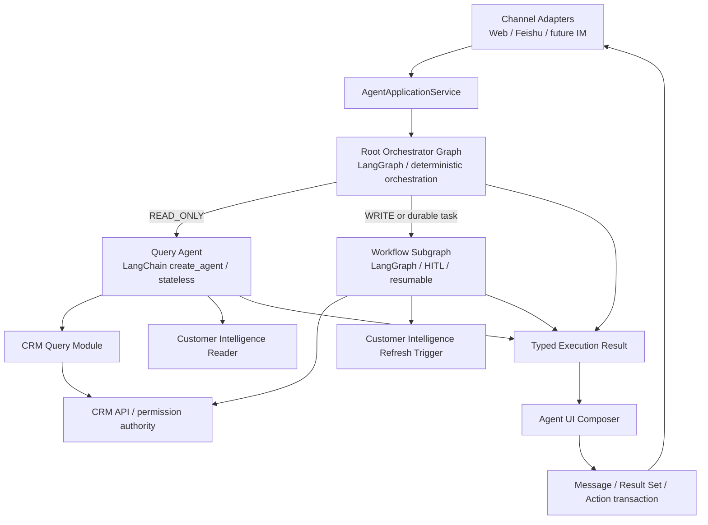
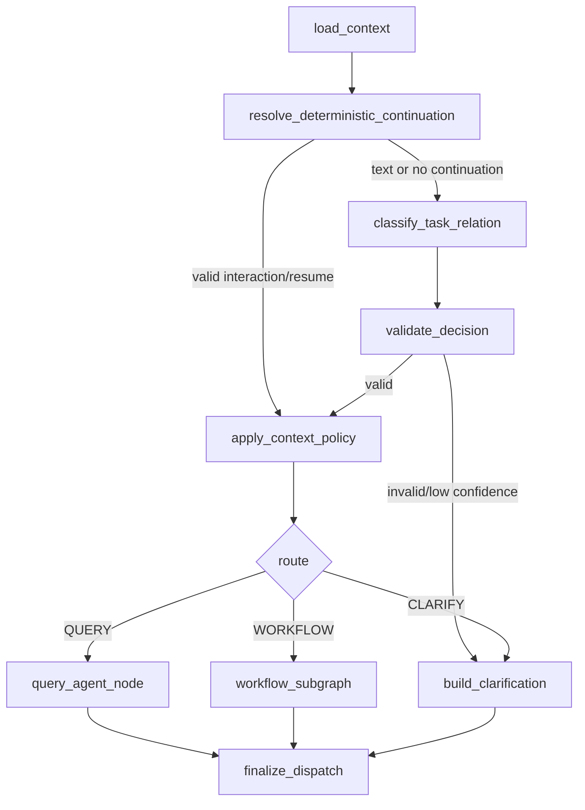

# CRM Agent 单版本编排与统一交互升级 TRD

| 项目 | 内容 |
|---|---|
| 文档类型 | TRD |
| 状态 | 目标架构与单版本 checkpoint cutover 代码已实现；本地数据门禁仍阻断，未进入生产发布 |
| 版本 | v2.4 |
| 日期 | 2026-08-23 |
| 对应 PRD | [CRM Agent 双执行路径与统一交互升级 PRD](https://apifox666.feishu.cn/wiki/TdkCwjcnAiUacWkCDuecQ0gUnUb) |
| 代码仓库 | `laofeijunfeng/CRMWolf` |
| 读者 | 后端、前端、测试、架构、实施 |

> **目标架构：**保留 LangGraph 与 LangChain，但重新划分职责。使用薄的 **Root Orchestrator Graph** 做确定性会话编排；使用无持久状态的 LangChain `create_agent` 实现 **Query Agent**；使用 LangGraph 原生 **Workflow Subgraph** 承载可恢复写流程。Root 不是第三个自主 Agent，也不继续承载具体业务流程和 Agent UI 拼装。
>
> **实施结论：**当前 Query Agent、Agent UI、Result Set、持久化和部分 Workflow 能力可以保留；当前 `root_runtime.py` 的模块形态不能作为目标架构继续扩展。本次重构必须一次性切换调用入口并删除旧 Root Runtime、旧 Root Router 和手工子图调用路径，不保留兼容转发、运行时 fallback、双路由或长期 feature flag。
>
> **发布边界：**完成本 TRD 的本地开发、数据库集成和 API 验收，不代表自动发布到生产。生产部署必须由用户另行明确发起；新版本发生问题时按完整应用版本回滚，不在新版本中保留旧实现兜底。

## 1. 技术目标与边界

### 1.1 技术目标

1. 建立一个小接口、高内聚的 Root Orchestrator 模块，统一处理任务关系、上下文策略、活跃工作流、风险路由和执行调度。
2. 将 `NEW_TASK / CONTINUE_TASK / SWITCH_TASK` 与四类上下文策略建模为稳定、可测试的结构化合同。
3. 将 Query Agent 收敛为无 checkpoint、无 store、只读工具白名单的单轮执行器。
4. 将 Pending、Confirmed、补字段、HITL、恢复、幂等和写后副作用全部收敛到 Workflow Subgraph 内部。
5. 使用 LangGraph 原生 subgraph 组合；Root 不再通过 Python 节点手工 `.ainvoke()` 或 `stream_events()` 另一个独立 Graph Runtime。
6. 将 Agent UI Composer 放在应用投影层，Root 和业务执行路径只返回结构化领域结果。
7. 保持 CRM API 是业务事实、权限、审批、通知和写入的权威接口。
8. 保留 Result Set、Action Registry、typed input、SSE 和消息持久化中已经符合目标架构的实现。
9. 通过单版本入口切换和同版本删除旧代码完成收敛，不形成新历史债。

### 1.2 非目标

- 不更换 LangGraph/LangChain 技术栈。
- 不引入第三个自主 Root Agent。
- 不将 Customer Intelligence 拆成顶层 Agent。
- 不允许 Query Agent 直接访问 SQL、ORM、CRUD、数据库连接或任意 URL。
- 不用向量检索替代结构化字段查询。
- 不在本期重做 Customer Intelligence 的抽取、摘要和证据排序算法。
- 不在本期拆分 Customer、Opportunity、Contract 等领域自治 Agent。
- 不在本期自动部署生产环境。

### 1.3 无历史债硬约束

| 禁止项 | 技术要求 |
|---|---|
| 旧 Root 双路径 | 新入口切换后删除 `root_runtime.py` 及其旧调用路径 |
| Root 兼容转发 | 不保留 `agent_root_runtime = new_orchestrator` 等别名或 forwarding module |
| 新旧 Router 并存 | 删除旧 `root_router.py`，只保留新 Root Decision 模块 |
| 手工子图调用 | Parent Graph 中不得以普通 Python 节点调用另一个持久 Graph Runtime |
| 旧查询 fallback | Query 失败返回明确错误，不转入旧 planner/presenter |
| 双输入协议 | 只保留 typed input union |
| 双输出协议 | 只保留版本化 Agent UI；Text 也是 Agent UI block |
| 双渲染 | 前端不得出现 UI 失败后解析旧 `content` 的业务分支 |
| 兼容字段 | 不保留受本次变更影响的旧字段名、构造参数或 payload alias |
| 长期开关 | 不增加新旧 Root、Query、Workflow 或 UI 的长期 feature flag |
| 延后清理 | 旧代码、旧测试和一次性迁移设施必须在同一升级事项关闭前删除 |

一次性离线迁移工具、预发回放、数据库 migration 和版本级回滚是发布措施，不是长期兼容架构；这些设施必须有明确删除条件。

## 2. 现有实现审计

审计基线为 2026-08-23 当前工作区。市场方案对比保存在 `CRM-Docs/research/crm-agent-architecture-market-2026-08.md`。

### 2.1 当前模块规模

| 模块 | 当前规模 | 审计结论 |
|---|---:|---|
| `root_runtime.py` | 6,453 行 | 职责严重集中，已经成为浅接口、巨型实现的编排单体 |
| `root_router.py` | 342 行 | 已增加 `selected_entity_usage`，但尚未形成完整任务关系和上下文策略 |
| `workflow_graph.py` | 992 行 | 已有独立 StateGraph，但仍由 Root Python 节点手工调用 |
| `query/agent.py` | 746 行 | `create_agent`、只读工具、结构化输出和无状态方向正确 |

`root_runtime.py` 当前同时承担：

- turn start/finish；
- checkpoint 与 interrupt 恢复；
- pending task；
- confirmed task；
- follow-up confirmation；
- Workflow Graph 调用；
- Query Agent 调用；
- Customer Intelligence 刷新；
- result set continuation；
- interaction reconciliation；
- 最终事件聚合和部分输出投影。

这不是“Root Orchestrator 很强”，而是多个领域的复杂度穿透 Root interface，导致修改任务判断时必须理解大量工作流、存储和投影细节。

### 2.2 当前 Graph 组合不是目标形态

当前 Root Graph 在 `_build_graph()` 中注册二十多个节点，其中 `workflow_graph` 节点最终调用：

```python
async for event in self.workflow_graph_service.stream_events(graph_input):
    ...
```

即 Root Graph 节点内部手工运行另一个 Graph Runtime。该方式造成：

1. Parent/Child state interface 不清晰；
2. checkpoint namespace、事件和错误转换需要手工维护；
3. Workflow 领域状态通过 Root 私有方法泄漏；
4. Root 测试必须知道子流程实现细节；
5. 新增一个工作流能力会继续扩大 Root。

目标实现必须把 Workflow 编译图直接作为 LangGraph subgraph node 组合到 Root Graph，或使用 LangGraph 官方支持的父子状态转换函数；不得继续保留双 Runtime 手工调用。

### 2.3 当前 Root Router 只修复了一个症状

`RootRouteDecision` 当前包含：

```python
selected_entity_usage: Literal["USE_SELECTED", "IGNORE_SELECTED"]
```

该字段能修复“上海有哪些客户”错误使用当前客户的问题，但完整问题还包括：

- 本轮是否是新任务；
- 是否继续上一轮查询；
- 是否使用上一结果集；
- 是否恢复、挂起或忽略活跃工作流；
- 同时存在页面选中客户和结果集客户时使用哪一个；
- 用户明确提出新对象时如何覆盖会话记忆。

继续向当前 Router 和 Root Runtime 逐个增加布尔字段，会把问题从“缺少一个判断”演变成“分散的条件组合”。因此 v2.0 不接受补丁式扩展，必须一次性建立任务关系与上下文策略模型。

### 2.4 Query Agent 已基本符合目标方向

当前 Query Agent 已使用：

- LangChain `create_agent`；
- 动态 StructuredTool；
- structured output / ToolStrategy；
- 只读工具预算、行数预算、超时和纠正预算；
- `checkpointer=None`；
- `store=None`；
- 权威工具结果和 evidence 校验。

这些设计应保留。`create_agent` 内部使用 LangGraph runtime 不构成历史债；它为单轮 tool-calling 提供标准 agent loop，而 Root/Workflow 使用显式 StateGraph 处理确定性和持久状态，两者职责不同。

需要补充的是：

- 统一模型配置快照；
- Prompt 版本；
- 工具输入/输出审计；
- 脱敏；
- latency/token/error 统计；
- 上下文由 Root 注入，Query 不自行读取会话状态。

### 2.5 已实现且可复用的目标资产

| 能力 | 处理决定 |
|---|---|
| QuerySpec / Catalog / Executor | 保留并按新 Root input 收口 |
| Query Agent | 保留，删除对旧 Root state 的隐式依赖 |
| Agent UI Pydantic/Zod 合同 | 保留 |
| Agent UI Renderer | 保留单 renderer |
| Result Set / Action Registry | 保留，继续服务查询连续性和写操作交接 |
| typed input / client request id | 保留 |
| SSE final-authoritative reducer | 保留 |
| Agent message persistence | 保留 |
| Customer Intelligence Reader/Refresh seam | 保留 |
| Workflow 领域执行逻辑 | 迁移到新 Workflow package，不保留旧调用外壳 |
| checkpoint migration 能力 | 仅作为一次性迁移设施，验收后删除 |

### 2.6 当前实施状态（2026-08-23）

目标代码已经完成单版本架构收口，但数据迁移、真实模型和真实 HTTP API 验收尚未完成，因此当前状态是“目标架构代码已实现，发布前验证未完成”，不得描述为“功能已全部验收”或“可以发布生产”。

| 目标能力 | 当前状态 |
|---|---|
| RootTurnInput / RootDecision / ContextPolicy / RootDispatchResult | 已实现并通过合同与 Root seam 测试 |
| 完整任务关系与上下文策略 | 已实现；明确独立查询可覆盖错误模型分类，多个可恢复 Workflow 的文本恢复会确定性澄清 |
| 薄 Root Orchestrator | 已实现；唯一执行 interface 为 `RootOrchestrator.dispatch(...)` |
| Query Agent | 已按无状态、只读 QueryExecutionInput 接入 Root |
| 原生 Workflow Subgraph | 已实现 Parent/Subgraph 组合、interrupt、Command resume 和结构化 interaction 精确恢复 |
| Agent Application / Agent UI | 已移出 Root；message、Result Set、Action 由应用投影层统一提交 |
| Web / IM | 已统一消费 Agent Application 与 Agent UI 协议 |
| 旧 Root / PendingTask / AgentTask Runtime | 代码、schema、ORM、调用引用已删除；未保留 alias、fallback 或双路径 |
| Alembic schema 收口 | migration `101`、`102` 已实现，唯一 head 为 `102_drop_agent_task_compatibility`；本地 dev DB 仍停在 `100` |
| 一次性 checkpoint/message 迁移 | message migration、inventory v2 与 checkpoint cutover v2 已实现；旧多阶段 checkpoint migration service/CLI/test 已删除；本地门禁有 blocker，禁止执行 destructive cutover |
| 自动化验证 | checkpoint cutover、inventory、message migration 共 89 条定向测试通过；Agent 专项共 608 条，588 passed、20 skipped（未配置 real-model）；前端回归、真实模型与真实 HTTP API 验收仍未完成 |
| MySQL / Redis / real-model / 50–100 条真实 HTTP API 验收 | 未完成 |
| 生产发布 | 未授权、未执行 |

在 inventory、数据迁移、真实 Workflow resume、固定模型 API 验收和完整 Standards/Spec review 全部通过前，不满足第 17 节 Definition of Done。

## 3. 目标架构



### 3.1 顶层模块职责

| 模块 | 负责 | 不负责 |
|---|---|---|
| Channel Adapter | 鉴权、协议解析、SSE/IM 编码 | CRM 语义、任务判断、业务状态 |
| AgentApplicationService | turn/message 事务、调用 Root、Agent UI 投影和输出 | 业务路由规则、Workflow 状态机 |
| Root Orchestrator | 任务关系、上下文策略、活跃工作流、风险路由、执行调度 | 具体 CRM 业务、UI block 拼装、自由工具规划 |
| Query Agent | 受控只读 tool calling、结果总结 | checkpoint、会话记忆、写工具、权限裁决 |
| CRM Query Module | QuerySpec 校验、字段映射、API 调用、结果标准化 | 自然语言回答、写入 |
| Workflow Subgraph | 写流程、HITL、恢复、幂等、副作用 | 通用查询问答 |
| Customer Intelligence | 客户知识读取与刷新作业 | 顶层路由、会话状态 |
| Agent UI Composer | typed result → Agent UI | 路由、查询、写入 |

### 3.2 Root 必须是深模块

Root 的外部 interface 只有一个主调用：

```python
class RootOrchestrator(Protocol):
    async def dispatch(
        self,
        turn: RootTurnInput,
        *,
        runtime: RootRuntimeContext,
    ) -> RootDispatchResult: ...
```

调用方不需要知道：

- 当前是否存在 interrupt；
- 如何识别新任务和旧任务；
- 当前客户、上一查询和结果集是否注入；
- Query/Workflow 如何选择；
- Workflow 使用哪些内部节点；
- 如何从子图恢复。

删除 Root 模块后，这些复杂度应重新散落到 Application、Query 和 Workflow 调用方；满足该删除测试，Root interface 才有足够深度。

### 3.3 Root 不是自主 Supervisor Agent

Root 不使用 `create_agent` 自由选择“调用哪个 Agent”，也不把 Query Agent 和 Workflow Agent 注册为模型可任意调用的两个工具。

原因：

1. CRMWolf 的 READ/WRITE 风险边界明确；
2. 活跃工作流恢复必须确定性优先；
3. 写入路径需要 fail closed；
4. Root 需要输出稳定、可审计的任务关系和上下文策略；
5. 自主 Supervisor 会增加循环、错误 handoff 和隐式上下文继承。

Root 可以使用一次 structured model classification 处理自然语言语义，但模型输出必须经过确定性规则校验，且不能直接执行工具或写入。

## 4. 核心合同

### 4.1 RootTurnInput

```python
class TextTurnInput(BaseModel):
    type: Literal["text"]
    text: str

class InteractionTurnInput(BaseModel):
    type: Literal["interaction"]
    action_id: str
    values: dict[str, JsonValue] = Field(default_factory=dict)

RootUserInput = Annotated[
    TextTurnInput | InteractionTurnInput,
    Field(discriminator="type"),
]

class RootTurnInput(BaseModel):
    team_id: int
    user_id: int
    session_id: int
    client_request_id: str
    input: RootUserInput
    selected_entity_ref: EntityRef | None = None
```

`selected_entity_ref` 只能由受信任的页面/渠道上下文解析器生成，不能接受客户端提交的裸业务 ID。

### 4.2 任务关系与上下文策略

```python
TaskRelation = Literal["NEW_TASK", "CONTINUE_TASK", "SWITCH_TASK"]
Route = Literal["QUERY", "WORKFLOW", "CLARIFY"]
Risk = Literal["READ_ONLY", "WRITE"]

class RootContextSnapshot(BaseModel):
    previous_query: CRMQuerySpec | None = None
    result_set: ResultSetContext | None = None
    active_workflow: WorkflowRef | None = None
    resumable_workflows: list[WorkflowRef] = Field(default_factory=list, max_length=20)

class ContextPolicy(BaseModel):
    selected_entity: Literal["USE", "IGNORE"]
    previous_query: Literal["USE", "IGNORE"]
    result_set: Literal["USE", "IGNORE"]
    active_workflow: Literal["RESUME", "SUSPEND", "NONE"]

class RootDecision(BaseModel):
    task_relation: TaskRelation
    route: Route
    risk: Risk
    context_policy: ContextPolicy
    confidence: float = Field(ge=0, le=1)
    reason_code: str
    evidence: list[str] = Field(default_factory=list)
```

约束：

1. `route=QUERY` 必须对应 `risk=READ_ONLY`。
2. `route=WORKFLOW` 必须对应 `risk=WRITE`，或对应一个已经存在的 durable workflow continuation。
3. 结构化 interaction 命中有效 active workflow 时，`task_relation=CONTINUE_TASK`、`active_workflow=RESUME`，确定性 bypass 模型。
4. 没有选中实体时，`selected_entity=IGNORE`。
5. 没有上一查询时，`previous_query=IGNORE`。
6. 没有有效结果集时，`result_set=IGNORE`。
7. 没有 active workflow 时，`active_workflow=NONE`。
8. 明确新城市、新客户名称、新对象或新业务目标不得被旧 selected entity 覆盖。
9. 低置信或相互矛盾的策略必须改为 `route=CLARIFY`。
10. 文本请求只有在 `resumable_workflows` 恰好存在一个候选时才允许 `WORKFLOW + RESUME`；多个候选必须返回 `ACTIVE_WORKFLOW_RESUME_AMBIGUOUS`。结构化 interaction 不依赖候选数量，而按 action 绑定的 continuation 精确恢复。
11. `resumable_workflows` 进入 Root State 供确定性校验，但不进入 Root 决策模型输入；模型只能建议任务关系，不能选择具体 continuation。

### 4.3 RootDispatchResult

```python
class QueryDispatchResult(BaseModel):
    type: Literal["query"]
    decision: RootDecision
    query_result: CRMQueryResult

class WorkflowDispatchResult(BaseModel):
    type: Literal["workflow"]
    decision: RootDecision
    workflow_result: WorkflowResult

class ClarificationDispatchResult(BaseModel):
    type: Literal["clarification"]
    decision: RootDecision
    clarification: ClarificationRequest

class FailureDispatchResult(BaseModel):
    type: Literal["failure"]
    decision: RootDecision | None
    error: AgentExecutionError

RootDispatchResult = Annotated[
    QueryDispatchResult
    | WorkflowDispatchResult
    | ClarificationDispatchResult
    | FailureDispatchResult,
    Field(discriminator="type"),
]
```

Root 不返回 Agent UI JSON，不直接保存 assistant message，也不拼装渠道文案。

### 4.4 QueryExecutionInput

```python
class QueryExecutionInput(BaseModel):
    text: str
    principal: AgentPrincipal
    selected_entity: EntityRef | None = None
    previous_query: CRMQuerySpec | None = None
    result_set: ResultSetContext | None = None
    model_config_snapshot: ModelConfigSnapshot
    trace_context: AgentTraceContext
```

Root 只根据 `ContextPolicy` 注入允许使用的字段；被标记为 `IGNORE` 的上下文不得出现在 Query input 中。

### 4.5 WorkflowTurnInput 与 WorkflowRuntimeContext

新 Workflow 的唯一启动输入是 canonical text turn：

```python
class WorkflowTurnInput(BaseModel):
    text: str
    principal: AgentPrincipal
    selected_entity: EntityRef | None = None
    supplements: list[WorkflowSupplement] = []
```

运行期依赖通过 LangGraph context 传入，不写入 checkpoint：

```python
@dataclass(frozen=True)
class WorkflowRuntimeContext:
    db: object | None = None
    authorization: str | None = None
    metadata: dict[str, object] = field(default_factory=dict)
```

边界规则：

- 新 Workflow 只接受 `WorkflowTurnInput`，不接收 `RootUserInput`、`active_workflow_ref` 或 `resolved_action`；
- 结构化确认、取消、选择和表单提交由 Root 校验后，通过 LangGraph `Command(resume=...)` 恢复现有 subgraph checkpoint；
- `WorkflowTurnInput` 和 `WorkflowRuntimeContext` 是 Planner、Executor 与 Workflow Graph 的唯一公共输入合同；
- Root 的 runtime context 直接继承 `WorkflowRuntimeContext`，不得增加 runtime adapter；
- 不保留 `WorkflowExecutionInput` alias、转换层或新旧双合同。

## 5. Root Orchestrator Graph

### 5.1 节点设计



| 节点 | 职责 |
|---|---|
| `load_context` | 读取 active workflow、selected entity、previous query、result set metadata |
| `resolve_deterministic_continuation` | 校验 action_id、interrupt、workflow ownership 和结构化 resume |
| `classify_task_relation` | 对纯文本生成 RootDecision 草案 |
| `validate_decision` | 应用确定性不变量、权限前置检查和 fail-closed 规则 |
| `apply_context_policy` | 只保留被允许的上下文，生成 Query/Workflow input |
| `query_agent_node` | 调用无状态 Query Agent |
| `workflow_subgraph` | 原生调用 Workflow compiled subgraph |
| `build_clarification` | 生成结构化澄清请求 |
| `finalize_dispatch` | 输出 typed RootDispatchResult 和 trace，不投影 UI |

### 5.2 决策优先级

按以下顺序处理，后项不能覆盖前项：

1. **结构化交互。**有效 action/interaction 直接恢复绑定的工作流。
2. **活跃 interrupt 的明确回答。**唯一匹配且满足 schema 时继续工作流。
3. **显式新对象或新目标。**覆盖 session memory，形成 NEW_TASK 或 SWITCH_TASK。
4. **有效结果集指代。**“第一个”“这些客户”绑定结果集后再路由。
5. **上一查询连续性。**“重点客户呢”等继承 canonical QuerySpec。
6. **页面选中实体。**只在指代表达或明确依赖页面上下文时使用。
7. **无法判定。**返回澄清。

### 5.3 “上海有哪些客户”的确定性要求

输入条件：

```json
{
  "text": "上海有哪些客户",
  "selected_entity_ref": {
    "resource": "customer",
    "display_name": "广州睿狐科技有限公司"
  }
}
```

合法 RootDecision 必须满足：

```json
{
  "task_relation": "NEW_TASK",
  "route": "QUERY",
  "risk": "READ_ONLY",
  "context_policy": {
    "selected_entity": "IGNORE",
    "previous_query": "IGNORE",
    "result_set": "IGNORE",
    "active_workflow": "NONE"
  }
}
```

QueryExecutionInput 中不得出现广州客户 entity ref；工具输入必须包含 `city=上海`。该要求同时进入 unit、integration、real-model 和 API acceptance。

### 5.4 Active Workflow 处理

| 输入 | 任务关系 | Active Workflow 策略 | 结果 |
|---|---|---|---|
| 点击确认/取消/选择/提交表单 | CONTINUE_TASK | RESUME | 确定性恢复 |
| 回答当前缺失字段 | CONTINUE_TASK | RESUME | 恢复 Workflow |
| “上海有哪些客户” | SWITCH_TASK | SUSPEND | 挂起 Workflow，执行 Query |
| “继续刚才的任务” | CONTINUE_TASK | RESUME | 唯一时恢复，否则澄清 |
| 语义不明确的“好的”“继续” | 不确定 | 不自动恢复 | 澄清 |

挂起不是复制工作流状态。唯一 truth 仍在 Workflow subgraph checkpoint；可恢复入口由 Agent UI Action Registry 保存精确 continuation，消息、结果集和动作状态仅作为检索、展示、幂等与审计投影，不再保留 AgentTask/PendingTask 运行时表。

## 6. LangGraph 状态与 Subgraph 组合

### 6.1 Root State

Root State 只包含编排需要的数据：

```python
class RootOrchestratorState(TypedDict, total=False):
    turn: RootTurnInput
    context_snapshot: RootContextSnapshot
    decision: RootDecision
    query_input: QueryExecutionInput
    workflow_input: WorkflowTurnInput
    query_result: CRMQueryResult
    workflow_result: WorkflowResult
    clarification: ClarificationRequest
    failure: AgentExecutionError
    dispatch_result: RootDispatchResult
```

禁止把以下内容继续放入 Root State：

- 每个业务流程的字段草稿；
- Pending/Confirmed 的完整领域实现状态；
- Customer Intelligence Review 的领域细节；
- Agent UI blocks；
- 前端渲染状态；
- 旧事件兼容字段。

### 6.2 Workflow Subgraph

Workflow Graph 直接作为 Root Graph 的 subgraph node：

```python
workflow_subgraph = build_workflow_subgraph(
    dependencies=workflow_dependencies,
)

root_graph.add_node("workflow_subgraph", workflow_subgraph)
```

父子状态 schema 不同，Root 的 `workflow_subgraph` node 只负责把已经校验的 `WorkflowTurnInput` 写入子图输入，并把 typed `WorkflowResult` 投影回 Root state。它不得创建第二套 Workflow runtime、不得复制 durable state，也不得转换旧 payload。

新文本启动和结构化恢复是两条明确入口：

```python
# 新 Workflow
await workflow_subgraph.ainvoke(
    {"workflow_input": workflow_turn.model_dump(mode="json")},
    config,
    context=runtime,
)

# 恢复已有 Workflow
await workflow_subgraph.ainvoke(
    Command(resume=canonical_resume_payload),
    continuation_config,
    context=runtime,
)
```

checkpoint 内部允许保存 JSON-safe dict；进入 Planner、Executor 公共 seam 前必须立即用 `WorkflowTurnInput.model_validate(...)` 恢复 typed contract，校验失败必须 fail closed。

### 6.3 Checkpoint 所有权

| 状态 | 权威存储 |
|---|---|
| Root turn/dispatch 状态 | Root Graph checkpoint |
| Workflow durable state | Root thread 下的 Workflow subgraph namespace |
| Pending/Confirmed/HITL | Workflow subgraph checkpoint/interrupt |
| Query 单轮 agent loop | 不持久化 |
| canonical previous query | MySQL Query Context / Result Set |
| Query Result Set / Action | MySQL |
| Agent UI / messages / turns | MySQL |
| Customer Intelligence job | 独立 job checkpoint，以 event key 标识 |
| Customer Intelligence fact gate | 独立 job checkpoint + MySQL 客户事实库；不创建 Review Case 或 Workflow interaction |

同一用户会话不得再出现独立 Root/new-flow/pending/confirmed 多条长期 thread truth。

### 6.4 Interrupt 与 Command

- Workflow 需要用户输入时使用 LangGraph `interrupt()`。
- 结构化 action 解析后使用 `Command(resume=...)` 恢复。
- Root 只负责定位正确 Workflow namespace 和传递 canonical resume payload。
- Application 不得绕过 Root 直接恢复 interrupt。
- Query Agent 不使用 interrupt。
- Customer Intelligence 客户事实沉淀不使用 interrupt；不满足自动沉淀门禁的候选静默忽略。

### 6.5 历史跟进任务逐项对账

跟进记录提交后的历史任务对账使用唯一 Batch 领域契约：

```python
FollowUpTaskReconciliationDecision(
    candidate_public_ids=(...),
    task_decisions=(
        FollowUpTaskReconciliationTaskDecision(...),
    ),
)
```

无开放任务必须返回显式空结果：

```python
FollowUpTaskReconciliationDecision(
    candidate_public_ids=(),
    task_decisions=(),
    empty_reason="NO_OPEN_CANDIDATES",
)
```

强不变量：

1. `candidate_public_ids` 唯一；
2. `task_decisions.task_public_id` 唯一；
3. `task_decisions` 与候选任务一一对应且顺序一致；
4. 有候选任务时不得设置 `empty_reason`；
5. 不允许保留 scalar/batch 双表示或旧 scalar 构造入口。

执行语义：

- 没有开放任务：对账结束，不产生结果卡或确认卡；
- 每个候选任务独立判断 `COMPLETE` / `POSTPONE` / `CANCEL` / `KEEP_OPEN`；
- 高置信且无需用户决策的动作自动执行，并投影 `automatic_task_transitions` 结果卡；
- 低置信或需要用户决策的任务逐项创建 confirmation case；
- 多任务时自动结果与确认 case 可以同时存在；
- 每个自动动作、每个 confirmation case 分别使用数据库 Savepoint，单任务失败不得阻断其他任务。

历史任务确认必须进入正式 Root Workflow continuation：

- 交互类型为 Agent UI `choice`；
- `selection_mode="single"`、`min_selections=1`、`max_selections=1`；
- `submit_on_select=true`，点击“标记完成 / 保持未完成 / 不再跟进”后立即提交，不再出现第二次确认；
- action 为 `ONE_SHOT`，服务端状态提交后权威切换为 `SUBMITTED/READ_ONLY`；
- Application 不得绕过 Root 或直接调用确认副作用。

### 6.6 客户事实自动沉淀策略

客户事实是后台增强链路，不是 HITL Workflow。正式决策只有：

- **自动沉淀**：置信度达到自动阈值（当前实现基线 `0.88`）、存在 evidence quote、内容非空、与既有有效事实无冲突；
- **静默忽略**：低置信、缺证据、内容为空、候选标记 ignore 或与既有事实冲突。

约束：

1. 不创建 Customer Intelligence Review Case；
2. 不创建 Agent UI interaction；
3. 不显示“需要确认”“候选事实”“未达到沉淀标准”或忽略数量；
4. 只有真实写入事实时才显示沉淀结果；
5. 客户事实提炼失败或候选被忽略，不得阻断跟进记录创建和历史任务对账；
6. 冲突候选不得自动覆盖既有事实；
7. migration `104_drop_customer_intelligence_fact_review.py` 删除旧事实审核表和审核运行时，不保留兼容路径。

## 7. Query Agent

### 7.1 框架

继续使用 LangChain `create_agent`：

```python
agent = create_agent(
    model=model,
    tools=read_tools,
    response_format=ToolStrategy(QueryAnswer),
    middleware=query_middleware,
    checkpointer=None,
    store=None,
)
```

选择原因：

- 适合单轮 tool-calling；
- 支持 structured output；
- 支持 middleware 和动态工具；
- 不需要手写 agent loop；
- 无 durable workflow 需求。

问答是否僵硬取决于 tool/catalog、上下文和输出投影，不取决于是否使用 LangChain。自然语言可由模型生成，业务事实和 UI 数据必须结构化。

### 7.2 只读工具目录

Query Agent 只获得 `CRMReadToolRegistry`：

```python
class CRMReadToolRegistry(Protocol):
    def tools_for(self, principal: AgentPrincipal) -> Sequence[BaseTool]: ...
```

工具必须满足：

1. 只调用认证后的 CRM API 或 Customer Intelligence Reader；
2. 不接受任意 URL；
3. 不接受任意 SQL；
4. 不访问 ORM/CRUD；
5. 输入输出均为 Pydantic schema；
6. 返回权限、空结果、分页和错误的标准语义；
7. 工具名称按业务能力命名，不按具体问句命名。

### 7.3 CRM Query 模块

外部 interface：

```python
class CRMQueryExecutor(Protocol):
    async def execute(
        self,
        spec: CRMQuerySpec,
        *,
        principal: AgentPrincipal,
    ) -> CRMQueryResult: ...
```

内部隐藏：

- 字段映射；
- filter/sort/operator 白名单；
- resource 与 endpoint 映射；
- team/user scope；
- 分页；
- API 错误归一；
- 结果标准化；
- evidence 和 entity ref 生成。

### 7.4 Query Context

Query Agent 不读 session、checkpoint 或消息历史。Root 只注入本轮允许的：

- selected entity；
- previous canonical QuerySpec；
- result set references；
- 用户和团队权限；
- model config snapshot；
- trace context。

连续追问规则：

- 同一 resource 的未覆盖 filter 可以继承；
- 本轮明确提供的同字段条件覆盖旧条件；
- 明确新 resource 默认不继承旧 QuerySpec；
- 序号引用先绑定 Result Set，再执行只读查询；
- 过期、跨会话、跨用户或撤权结果集不得使用。

### 7.5 Query 输出

Query Agent 返回 `CRMQueryResult + QueryAnswer`，不能直接返回最终 Agent UI：

```python
class QueryExecutionResult(BaseModel):
    executed_query: CRMQuerySpec
    result: CRMQueryResult
    answer: QueryAnswer
    evidence: list[QueryEvidence]
    trace: QueryTraceSummary
```

Application 负责在同一事务中：

1. 保存 assistant message；
2. 保存 immutable Result Set；
3. 签发 Action；
4. 使用 Agent UI Composer 生成 UI JSON；
5. 提交可见结果。

## 8. Workflow Subgraph

### 8.1 职责

Workflow Subgraph 独占：

- 创建、修改、推进和删除业务对象；
- 字段补充；
- 对象消歧；
- Pending Task；
- Confirmed Task；
- HITL；
- 取消和恢复；
- 幂等；
- 写后刷新和副作用；
- 写失败与补偿语义。

### 8.2 内部模块建议

```text
app/services/agent/workflow/
├── contracts.py
├── graph.py
├── continuation.py
├── pending.py
├── confirmation.py
├── execution.py
├── effects.py
├── customer_resolution.py
└── observability.py
```

模块内部可以继续组合领域 graph 或纯函数，但对 Root 只暴露一个 Workflow subgraph interface。

### 8.3 迁移原则

当前以下逻辑迁入 Workflow package：

- `pending_graph.py`；
- `confirmed_task_graph.py`；
- `pending_interrupt_coordinator.py`；
- `pending_interrupt_projection.py` 中属于 Workflow 的领域部分；
- `action_planning_graph.py` / `action_review_graph.py` 中写流程部分；
- `root_runtime.py` 中 pending、confirmed、follow-up confirmation、recovery、write effects 逻辑；
- `workflow_graph.py` 现有领域节点。

迁移完成后：

- 不保留旧文件转发导入；
- 不保留旧类名 alias；
- 不让 Root 继续拥有 Workflow 私有方法；
- 对外测试全部通过 `WorkflowSubgraph` interface。

### 8.4 产品行为保持

重构必须保持：

- 现有字段校验；
- 确认/拒绝/修改；
- interrupt/resume；
- 幂等；
- 权限；
- 写后 Customer Intelligence refresh；
- 已知业务错误语义。

“保持行为”通过合同测试和回放证明，不通过保留旧实现证明。

## 9. Customer Intelligence

### 9.1 读取 interface

```python
class CustomerContextReader(Protocol):
    async def read(
        self,
        customer_ref: EntityRef,
        *,
        principal: AgentPrincipal,
        question: str,
    ) -> CustomerContextResult: ...
```

Reader 必须：

- 重新校验客户访问权限；
- 区分结构化 CRM 事实与语义证据；
- 返回 evidence；
- 不持有会话状态；
- 不直接生成最终 Agent UI。

### 9.2 刷新 interface

Workflow 写入完成后调用稳定的 refresh trigger。Root 不决定具体刷新算法，也不等待长时间异步作业完成。

### 9.3 向量数据库规则

| 问题 | 执行方式 |
|---|---|
| 城市、状态、负责人、金额、日期、数量 | CRM API 结构化查询 |
| 客户简介和当前事实 | CRM API + Customer Intelligence snapshot |
| 历史关注点、会议观点、非结构化资料 | 向量检索 + evidence |
| 权限、实体存在性和写入 | CRM API，不使用向量库裁决 |

向量库只提供语义证据，不是结构化事实或权限真相。

## 10. Agent Application 与 Agent UI

### 10.1 AgentApplicationService

目标调用链：

```python
async def handle_turn(command: AgentTurnCommand) -> AsyncIterator[AgentEvent]:
    turn = await turn_repository.begin(command)
    dispatch = await root_orchestrator.dispatch(turn.input, runtime=runtime)
    projection = agent_ui_composer.compose(dispatch)
    committed = await turn_repository.commit_projection(turn, projection)
    yield from sse_projector.project(committed)
```

Application 只负责：

- session/turn/message 事务；
- 调用 Root；
- typed result → Agent UI；
- Result Set / Action 与 message 的原子提交；
- SSE/IM 事件输出；
- trace 持久化。

Application 不得：

- 判断 Query/Workflow；
- 解析确认意图；
- 直接恢复 checkpoint；
- 重新实现 pending/confirmed；
- 从文案解析业务实体。

### 10.2 Agent UI 单协议

```python
class AgentUIEnvelope(BaseModel):
    schema: Literal["crm.agent.ui.v1"]
    blocks: list[AgentUIBlock]
    actions: list[AgentUIAction] = Field(default_factory=list)
    interaction: AgentInteraction | None = None
    meta: AgentUIMeta
```

RootDispatchResult 到 UI 的映射集中在 `AgentUIComposer`：

| Typed Result | UI Blocks |
|---|---|
| Query list | Text + EntityList + pagination/action |
| Query detail | Text + EntityCard/Timeline |
| Workflow interrupt | Text + Choice/Form/Confirmation |
| Workflow success | Text + EntityCard/Status |
| Clarification | Text + Choice/Input hint |
| Failure | Error + recovery hint |

前端只使用生成的 Pydantic/Zod golden schema 渲染。

### 10.3 Channel Projection

Web SSE、飞书及后续 IM 都进入同一 Application Service。Channel Adapter 只负责：

- 鉴权与用户绑定；
- 协议归一；
- 群聊 @ 和 thread scope；
- Agent UI 到渠道卡片/文本的投影；
- 结构化交互回传。

渠道不复制 Root/Workflow 状态机。

## 11. 权限、安全和事实边界

1. Query 与 Workflow 都通过 `AgentPrincipal` 获得 team/user/permission scope。
2. Query 工具只调用 CRM API 只读 endpoint。
3. Workflow 写入只调用 CRM API 写 endpoint。
4. Result Set 和 Action 绑定 team、user、session、source message、TTL 和 lineage。
5. Query → Workflow 时重新读取实体并复验当前权限。
6. 模型输出中的 object ID、权限结论和执行成功状态不可信。
7. API 403、404、empty、validation、timeout 和 server error 必须标准化区分。
8. 任何不确定写入必须 fail closed 或进入 HITL。

## 12. 错误模型

```python
class AgentExecutionError(BaseModel):
    code: Literal[
        "ROUTE_UNCERTAIN",
        "CONTEXT_AMBIGUOUS",
        "WORKFLOW_NOT_FOUND",
        "WORKFLOW_RESUME_INVALID",
        "QUERY_INVALID",
        "QUERY_PERMISSION_DENIED",
        "QUERY_EMPTY",
        "QUERY_TOOL_FAILED",
        "QUERY_MODEL_FAILED",
        "RESULT_SET_EXPIRED",
        "ACTION_INVALID",
        "ACTION_ALREADY_CONSUMED",
        "WORKFLOW_FAILED",
        "CHECKPOINT_UNAVAILABLE",
        "INTERNAL_ERROR",
    ]
    message: str
    retryable: bool
    details: dict[str, JsonValue] = Field(default_factory=dict)
```

约束：

- `QUERY_EMPTY` 不是错误页面，但必须与权限错误区分；
- checkpoint 不可用时返回明确失败，不启动 no-checkpointer Workflow；
- Query 模型失败不调用旧 Query；
- Agent UI 生成失败不回退旧 Markdown 协议；
- INTERNAL_ERROR 必须带 trace id，用户侧不暴露敏感实现细节。

## 13. 可观测性与验收证据

### 13.1 每轮必须记录

- `session_id`、`turn_id`、`client_request_id`；
- model configuration snapshot id；
- 模型名称和参数；
- Prompt/version；
- RootDecision；
- deterministic bypass reason；
- task relation；
- ContextPolicy；
- selected/previous/result/workflow context 实际注入情况；
- Query tool 名称、输入、标准结果、耗时和错误；
- Workflow node、interrupt/resume、幂等和副作用；
- Agent UI schema/version；
- Result Set / Action ids；
- 数据库副作用摘要；
- trace id 和总耗时。

### 13.2 模型配置冻结

一次验收运行必须绑定不可变 `ModelConfigSnapshot`。验收过程中修改模型、base URL、模型参数或 Prompt 后：

- 原运行结果仍保留；
- 新配置必须生成新 snapshot；
- 受影响的真实模型用例必须全部重跑；
- 不得将不同模型配置的结果合并为同一份“全部通过”报告。

### 13.3 测试数据生命周期

API 验收创建的 50–100 条业务数据和测试会话：

1. 使用明确前缀和 batch id；
2. 记录创建清单；
3. 验收报告关联 batch id；
4. 用户确认结果前不得清理；
5. 用户确认后使用可审计 cleanup 删除；
6. cleanup 结果作为验收附件，而不是替代业务验收。

## 14. 目标代码结构

```text
CRM-Server/app/services/agent/
├── application.py
├── orchestrator/
│   ├── contracts.py
│   ├── context_resolver.py
│   ├── decision.py
│   ├── graph.py
│   ├── service.py
│   └── observability.py
├── query/
│   ├── agent.py
│   ├── contracts.py
│   ├── catalog.py
│   ├── executor.py
│   ├── middleware.py
│   └── tools.py
├── workflow/
│   ├── contracts.py
│   ├── graph.py
│   ├── continuation.py
│   ├── pending.py
│   ├── confirmation.py
│   ├── execution.py
│   ├── effects.py
│   └── observability.py
├── ui/
│   ├── contracts.py
│   ├── composer.py
│   └── projector.py
└── customer_intelligence/
    ├── reader.py
    └── refresh.py
```

实际文件可在实施时根据现有 package 合并，但必须保持四个稳定 interface：

- `RootOrchestrator.dispatch()`；
- `QueryAgent.run()`；
- `WorkflowSubgraph`；
- `AgentUIComposer.compose()`。

不得为了匹配目录示意增加只有转发功能的浅模块。

## 15. 一次性实施方案

### 15.1 原则

- 替换，不叠加；
- 先冻结 interface 和行为测试，再迁移实现；
- 新旧入口不在生产运行时并存；
- 每个迁移切片有明确删除对象；
- 不以“先兼容，后续再删”作为实施策略。

### 15.2 实施阶段

#### 阶段 A：冻结合同与红测试

1. 新增 RootTurnInput、RootDecision、ContextPolicy、RootDispatchResult schema。
2. 建立 public seam 测试，不测试旧 Root 私有方法。
3. 先加入以下失败用例：
   - 选中广州客户时查询上海客户；
   - 活跃 Workflow 中切换到上海客户查询；
   - “重点客户呢”继承上海条件；
   - “第一个客户”绑定结果集；
   - 结构化确认确定性恢复；
   - 低置信“继续”要求澄清。

#### 阶段 B：建立新 Root Orchestrator

1. 新建 `orchestrator/` package。
2. 实现 context resolver、deterministic continuation、decision validator。
3. 构建薄 Root Graph。
4. 接入现有 Query Agent，但不接入旧 Root UI 和 Workflow 私有逻辑。

#### 阶段 C：迁移 Workflow Subgraph

1. 把 Pending/Confirmed/HITL/Recovery/Effects 迁入 `workflow/`。
2. 以原生 subgraph 接入 Root。
3. 将 Root 中 Workflow 私有节点逐项删除。
4. 通过既有工作流合同测试和 checkpoint resume 测试。

#### 阶段 D：收敛应用投影

1. Application 只接收 RootDispatchResult。
2. Agent UI Composer 统一生成 UI。
3. Result Set、Action、message 在一个事务中提交。
4. Web 与 IM 只消费统一 Agent UI。

#### 阶段 E：完整验证

1. Unit/contract tests；
2. MySQL 3306 + Redis 6379 integration；
3. 固定模型配置的 real-model tests；
4. 使用 50–100 条可见/不可见业务数据做真实 HTTP API 验收；
5. Workflow checkpoint 中断恢复；
6. SSE 断线/重放；
7. 权限、并发、幂等和数据库副作用核对；
8. 用户验收前保留测试数据。

#### 阶段 F：单版本切换与删除

1. `AgentApplicationService` 一次性改为调用 `RootOrchestrator.dispatch()`。
2. 更新所有 Web/IM/内部调用方。
3. 删除旧 Root Runtime、旧 Router 和手工 Workflow runtime 调用。
4. 删除旧测试、旧 schema、旧事件和迁移临时设施。
5. 全仓搜索确认无旧符号和兼容路径。
6. 重新运行全量测试和 API 验收。

### 15.3 明确删除清单

目标切换完成后删除或替换：

- `CRM-Server/app/services/agent/root_runtime.py`；
- `CRM-Server/app/services/agent/root_router.py`；
- `CRM-Server/app/services/agent/workflow_graph.py` 的旧位置和旧外部 interface；
- Root 中 `_run_pending_task_subgraph`、`_run_workflow_graph`、`_run_confirmed_task_execution` 等业务私有节点；
- Root 中 Agent UI/interaction projection 逻辑；
- `agent_root_runtime` 全局实例和所有引用；
- 旧 Query planner/presenter 的任何残留；
- no-checkpointer Workflow 路径；
- 受影响的 legacy payload/type aliases；
- 仅验证旧实现内部细节的测试；
- 完成使命的一次性 checkpoint/message migration 命令。

如果某文件中同时包含仍需保留的实现，先把目标实现迁入新 module，再删除原文件；不得保留转发文件。

### 15.4 数据迁移

Schema 变更只通过 Alembic migration。Checkpoint cutover 只暴露一个公开 interface：一次性 inventory 生成无业务内容的门禁报告，一次性 cutover 在同一数据库事务中校验、删除旧所有权并写入 journal。它不是长期 runtime adapter。

#### 15.4.1 单版本 checkpoint 身份矩阵

| 数据身份 | 所有权判断 | Cutover 行为 | 发布条件 |
|---|---|---|---|
| 新 Root：`crm_agent:{team_id}:{user_id}:{session_id}` + 根 namespace | 目标 Root Orchestrator | 保留；严格校验 metadata 和 `RootOrchestratorState` 8 个字段 | 不允许额外 state 字段或 5 段 thread |
| 新 Workflow：新 Root thread + `workflow_subgraph:*` | 目标 Workflow Subgraph | 保留；校验 `WorkflowSubgraphState`、interrupt 和 Action Registry continuation 一致 | 每个可恢复 interrupt 必须有唯一、未过期的服务端 action continuation |
| 旧 Root：`crm_agent:{team_id}:{user_id}:{session_id}:{session_key}` | 重构前 Root | 不迁移会话惯性；在确认没有未完成旧 Workflow 后删除 checkpoint/blob/write | 不能生成或保留 5 段目标 thread |
| 旧 Query child：`query_agent:*` | 无状态 Query 的废弃 checkpoint | 删除；查询连续性只以 MySQL message、canonical query 和 Result Set 为准 | 不迁移到 Root 或 Workflow state |
| 旧内嵌 Workflow：`workflow_graph:*` 及其 child | 重构前写流程 | 仅终态/静默数据可删除；存在可恢复业务状态时阻断 | 不做 payload 猜测、重新规划或 compatibility hydration |
| 旧 Pending/Confirmed：`pending_task_subgraph:*`、`confirmed_task_execution:*`、独立 pending/confirmed thread | 已删除的旧 Workflow 所有权 | 仅终态/静默数据可删除；存在 `WAITING_USER`、`SUSPENDED`、interrupt、未提交 write 或不唯一所有权时阻断 | 发布前由业务侧完成/取消旧任务，或提供另行评审的确定性转换规范 |
| 旧 `crm_agent_new_flow:*` 与 helper thread | 已删除的旧 planner/helper runtime | 证明静默后删除全部 checkpoint/blob/write | helper 中不得存在未消费 branch、interrupt 或 error write |
| Customer Intelligence：`crm_agent_customer_intelligence:*` | 独立 job runtime | 保留；校验 active run、checkpoint 和事实写入幂等所有权 | 不改写为 Root/Workflow 数据，不保留事实 Review runtime |
| Adjacent workflow（customer activity 等） | 非 Agent cutover 所有权 | 字节级保留并纳入 checksum | cutover 不得修改其 checkpoint/blob/write |
| 未知 thread/runtime/namespace/state/serde | 无法证明所有权 | 整体事务失败 | inventory 必须为零 |

#### 15.4.2 活跃旧 Workflow 的处理决定

新 Workflow 的计划、授权、interrupt 和 continuation 合同与旧 `AgentTask`/Pending/Confirmed 状态不同。本次不通过重新执行旧文本、复制部分字段或保留旧 runtime 来“迁移”活跃流程，因为这些方式会改变写入语义或形成兼容债。

因此：

1. inventory 通过 session ID（旧 5 段 thread 的倒数第二段）关联 session，不再把 channel/session key 误当 session ID；
2. 任一旧任务处于 `PENDING`、`WAITING_USER`、`RUNNING` 或 `SUSPENDED`，或旧 checkpoint 含 interrupt/未消费 branch/未提交 write，均输出稳定 blocker code；
3. blocker 存在时 checkpoint cutover 不执行任何写入；
4. 只有业务侧已完成或取消旧流程，且再次 inventory 证明旧 runtime 静默后，才删除旧 checkpoint；
5. 如果未来必须保留某类活跃旧流程，先为该业务类型制定从旧状态到 `WorkflowTurnInput`、`WorkflowSubgraphState`、`WorkflowContinuation` 和 Action Registry 的完整确定性映射并独立评审；在此之前不得增加临时转换分支。

#### 15.4.3 可重复性与证据

1. inventory CLI 必须支持 `--as-of`，报告时间由调用者固定，不读取不可复现的本机未来时钟；当前发布基线固定为 `2026-08-23T23:59:59+08:00`。
2. inventory v2 与 cutover 复用同一个 `AgentCheckpointMatrixReader`，禁止盘点和写入各自维护分类逻辑。
3. cutover 在单事务内完成 fail-closed 校验、旧数据删除和 journal 写入；任一 blocker 或行级证据失败则整体回滚。
4. CLI 对输出路径持有 `flock`；先 durable 写入 `IN_PROGRESS`，commit 前 fsync staged `COMPLETED`，commit 后从 journal 与 retained rows 重建证据并原子发布，避免 commit acknowledgment 丢失后重复删除。恢复时 CLI 还会拒绝与本次 `--as-of` 不一致的 staged/completed report；若 staged report 存在但原事务已回滚，重跑会在新事务中重新执行 cutover，并严格比较删除计数、retained SHA 与 evidence SHA 后才发布；任一不一致都回滚且不发布。
5. 报告和 journal 只保存计数、分类、稳定 blocker code 和 SHA-256，不保存客户名称、用户文本、模型输出、实体 ID、thread ID 或原始 payload。
6. 反序列化采用分层合同：legacy/unknown checkpoint 仅通过 inert inspector 读取结构与 constructor identity，禁止导入或执行应用构造器；target Root/Workflow 与 Customer Intelligence 先由同一 inspector 证明不存在应用自定义 constructor，再由 strict serializer 恢复允许的 LangGraph framework type。checkpoint、metadata、blob 和 write 均遵循该合同。
7. Customer Intelligence 的 checkpoint/blob/write 还必须证明根 namespace、完整父链、唯一 root/leaf、无 orphan、blob 引用闭合；active run 必须证明 control channel 可恢复；客户事实不存在 review barrier。
8. 重跑已完成 cutover 时必须验证 journal 与当前数据库证据一致；不允许静默重复删除或接受漂移。
9. 历史消息转换为唯一 Agent UI schema；无法确定性转换的记录保留为不可交互的历史文本 block，不保留旧运行时解析器。
10. 旧 `checkpoint_migration.py`、`migrate_agent_checkpoints.py` 及其旧合同测试已经删除，不保留 forwarding module、alias 或 compatibility wrapper。
11. cutover、message migration、inventory 和 journal 在预发/生产验收完成后从仓库和 schema 中删除。

#### 15.4.4 2026-08-23 本地 inventory 结论

固定 `--as-of=2026-08-23T23:59:59+08:00` 的只读 inventory v2 已在本地 MySQL `localhost:3307/crm_db` 重新执行。最新报告包含 30,949 条 checkpoint、5,499 个 latest identity；新 4 段 Root 与目标 Workflow 均为 0。此次运行没有 permissive constructor 反序列化告警，主要分类如下：

| 分类 | checkpoint rows | latest |
|---|---:|---:|
| legacy Root | 5,381 | 626 |
| legacy Query | 509 | 78 |
| legacy Workflow | 6,865 | 1,441 |
| legacy Pending/Confirmed | 1,024 | 215 |
| legacy Helper | 11,384 | 2,278 |
| Customer Intelligence | 4,055 | 607 |
| Adjacent Workflow | 1,731 | 254 |

`crm_agent_tasks` 中存在 41 个活跃旧任务：`WAITING_USER=22`、`SUSPENDED=19`。当前稳定 blocker 为：

```text
customer_intelligence:physical_ownership_invalid
legacy_checkpoint:active
legacy_root:owner_mismatch
legacy_task:active
```

因此本地 destructive cutover 必须保持关闭。处理方式只能是业务侧完成/取消旧任务、对 owner/CI 物理证据做确定性修复并重新 inventory；不得扩充 allowlist、跳过异常行、猜测性 hydration 或恢复旧 Runtime。

### 15.5 回滚

- 数据库 migration 保持发布窗口内向后可回滚或可从备份恢复；
- 应用按完整版本回滚；
- 不在新版本中保留旧 Root 或旧 Query 运行时路径；
- 生产部署和回滚必须在用户明确授权后执行。

## 16. 测试矩阵

### 16.1 Root Orchestrator

| 类别 | 必测场景 |
|---|---|
| Task Relation | NEW、CONTINUE、SWITCH、低置信澄清 |
| Selected Entity | USE、IGNORE、明确对象覆盖、无选中对象 |
| Previous Query | 同 resource 继承、条件覆盖、新 resource 忽略 |
| Result Set | 序号、复数指代、过期、跨用户、撤权 |
| Active Workflow | interaction resume、文本补字段、switch suspend、resume ambiguity |
| Route | READ、WRITE、混合请求、写风险 fail closed |
| Error | model timeout、schema invalid、checkpoint unavailable |

### 16.2 Query Agent

- 城市、行业、状态、负责人、时间组合查询；
- 分页、排序、空结果；
- 权限不足；
- 结果与 CRM API 一致；
- tool budget、row budget、timeout；
- terminal tool error 不被模型覆盖；
- evidence 中不存在模型虚构实体；
- `checkpointer=None`、`store=None`；
- 无写工具、无任意 URL、无 SQL。

### 16.3 Workflow Subgraph

- 创建/修改/推进；
- 字段补充；
- 对象消歧；
- 确认、修改、拒绝、取消；
- interrupt/resume；
- suspended/resume；
- 幂等重放；
- 并发消费；
- 权限撤销；
- CRM API 失败；
- 写后 refresh；
- checkpoint restart 恢复。

### 16.4 Agent UI/Application

- Query list/card/timeline；
- Workflow form/choice/confirmation；
- Error/clarification；
- Pydantic/Zod golden schema；
- message/result set/action 原子性；
- duplicate client request；
- SSE sequence/gap/reconnect/final；
- Web 和 IM 语义一致；
- 前端不存在旧 content 业务解析。

### 16.5 API 验收

真实 HTTP API，不允许 Mock 替代：

```text
POST /api/v1/agent/chat/stream
GET  /api/v1/agent/sessions/{session_id}/messages
```

验收数据至少包含：

- 50–100 条当前团队业务数据；
- 上海与非上海客户；
- 不同状态、行业、负责人和跟进时间；
- 跨团队不可见客户；
- 可操作与不可操作客户；
- 活跃、挂起、确认中 Workflow；
- Customer Intelligence 有/无档案样本。

每个 API case 保存：

- 请求和 session/message id；
- model config snapshot；
- RootDecision；
- ContextPolicy；
- tool input/output；
- SSE events；
- final Agent UI；
- CRM API 对照结果；
- 数据库副作用；
- PASS/FAIL 和失败原因。

发现任一失败时，报告必须显示失败，不能概括为“全量通过”。

## 17. Definition of Done

只有同时满足以下条件，才能称为“架构升级开发完成”：

1. Root 对外只有 `dispatch()` 主 interface。
2. Root Graph 节点只承担编排，不包含具体 CRM 写流程和 UI 拼装。
3. RootDecision 包含 task relation 和完整 ContextPolicy。
4. “上海有哪些客户”在选中其他客户时稳定忽略 selected entity。
5. Workflow 作为原生 LangGraph subgraph 组合，不手工运行独立 Graph Runtime。
6. Pending、Confirmed、HITL、Recovery 和 Effects 全部归 Workflow。
7. Query Agent 无 checkpoint/store，仅使用只读工具目录。
8. Query/Workflow 使用 CRM API 权限和事实边界。
9. Agent UI Composer 位于应用投影层。
10. Result Set、Action、message 事务和权限复验通过。
11. Web/IM 只使用统一 Application 和 Agent UI。
12. 旧 `root_runtime.py`、`root_router.py`、旧 Workflow 外壳及其引用已删除。
13. 不存在 compatibility adapter、fallback、双协议、双渲染或长期 feature flag。
14. Unit、integration、real-model、Workflow resume、Agent UI 和 API 验收全部通过。
15. API 验收固定模型配置并保留完整证据。
16. 测试数据在用户确认前仍可查看。
17. 历史任务对账覆盖无任务、单任务高/低置信、多任务混合四类场景，自动结果与确认卡可同时展示且逐任务隔离失败。
18. 客户事实仅执行“自动沉淀 / 静默忽略”，不存在事实 Review Case、interrupt 或用户确认提示。
19. 全仓代码 review 的 Standards 与 PRD/TRD Spec 均通过。
20. 本地规范文档、schema、migration、代码和飞书 PRD/TRD 一致。

“本地开发完成”不等于“已发布生产”。生产部署需要单独授权和执行记录。

## 18. 架构决策摘要

| 决策 | 结论 | 原因 |
|---|---|---|
| 顶层用户入口 | 一个 CRM Agent | 用户不需要理解内部拆分 |
| Root 定位 | Root Orchestrator | 确定性编排，不是自主业务 Agent |
| Root 框架 | LangGraph StateGraph | 适合状态、条件边和 subgraph 调度 |
| Query 框架 | LangChain `create_agent` | 适合受控 tool calling 和 structured output |
| Workflow 框架 | LangGraph 原生 Subgraph | 适合 checkpoint、interrupt、HITL 和恢复 |
| Root 是否自由调用子 Agent | 否 | READ/WRITE 风险明确，应确定性路由 |
| Query 是否持久化 agent state | 否 | 避免第二套会话真相 |
| Query 连续性 | canonical query + result set | 可审计、可验证、不依赖模型猜测 |
| Customer Intelligence | 共享领域模块 + 独立 job runtime | 不是顶层 Agent |
| Agent UI 位置 | Application projection | 与业务状态机解耦 |
| 是否直接 SQL | 否 | CRM API 继续负责权限和业务语义 |
| 向量库 | 只用于非结构化语义证据 | 不替代结构化查询与权限 |
| 是否保留兼容实现 | 否 | 单版本切换、同版本删除、版本级回滚 |

## 19. 修订记录

| 版本 | 日期 | 说明 |
|---|---|---|
| v2.5 | 2026-08-25 | 收口历史跟进任务逐项 Batch 对账、逐任务 Savepoint、自动结果与低置信确认并存；历史任务确认升级为 `submit_on_select` 一键单选；客户事实改为高置信自动沉淀、其余静默忽略，删除事实 Review runtime 与用户提示。 |
| v2.4 | 2026-08-23 | checkpoint serde 收口为 inert inspection + framework-safe strict decode 两阶段合同，覆盖 target/CI checkpoint、metadata、blob、write 与 review interrupt；staged report 可在原事务回滚后安全重跑并比对删除证据；89 条迁移定向测试、588 条 Agent 测试通过；更新本地 30,949 rows、5,499 latest 与稳定 blocker |
| v2.3 | 2026-08-23 | 完成 inventory v2、单事务 checkpoint cutover v2、durable staged report 与 Customer Intelligence 物理所有权/review barrier 门禁；删除旧多阶段 checkpoint migration 架构；记录本地 30,921 rows、5,495 latest、41 active legacy tasks 和四项稳定 blocker |
| v2.2 | 2026-08-23 | 重新定义面向薄 Root/原生 Workflow 的单版本 checkpoint 身份矩阵；明确旧 5 段 Root、Query child、旧 Workflow/Pending/Confirmed 的清理与阻断规则；禁止将活跃旧流程通过猜测性 hydration 转入新架构；inventory 增加固定 `--as-of` 要求；同步 Root 22、Agent 863 的验证数字 |
| v2.1 | 2026-08-23 | 同步目标架构代码实施状态；补充 `resumable_workflows` 的确定性恢复规则与模型隔离；确认旧 Root/PendingTask/AgentTask 代码路径已删除；明确本地数据库仍停在 migration 100，inventory 存在未知 checkpoint shape/custom serde，因此数据迁移、真实模型和真实 API 验收仍未完成 |
| v2.0 | 2026-08-23 | 根据真实问题与代码复审重构架构基线：Root 从“保留现有 Root Runtime”改为薄 Root Orchestrator；新增 NEW/CONTINUE/SWITCH 与完整 ContextPolicy；要求原生 Workflow Subgraph、应用层 Agent UI 投影、单版本切换并删除 6,453 行旧 Root Runtime；重新声明当前实现尚未完成 Root 重构和完整固定模型 API 验收 |
| v1.15 | 2026-08-23 | 旧基线最后一次 WP10 checkpoint cleanup 记录；其“保留现有 Root Runtime”结论由 v2.0 废止 |
| v0.1–v1.14 | 2026-08-21 至 2026-08-23 | Query、Agent UI、持久化、权限、checkpoint 迁移等前序设计与实现记录；仍符合 v2.0 的资产继续保留，不符合的 Root 结构由 v2.0 替代 |
