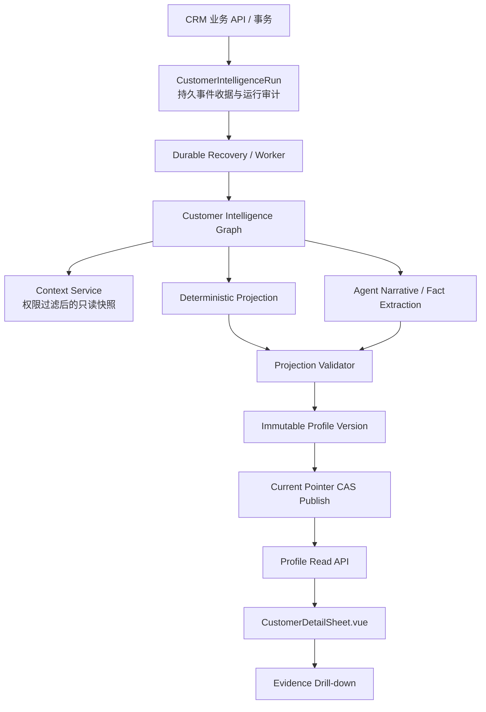

# 客户档案精细化升级 TRD

> 文档定位：客户档案精细化升级的技术实现方案。本文承接客户档案优化 PRD，只描述现状、技术架构、数据模型、接口、事件、迁移、测试和发布，不重新定义产品规则。
> 文档状态：实现中 / 部分验收
> 版本：v1.3
> 日期：2026-08-28
> 对应 PRD：`CRM-Docs/design-agent/runtime/customer-intelligence-profile.md`
> 代码仓库：`laofeijunfeng/CRMWolf`
> 读者：后端、前端、Agent、测试、架构、实施
> Alembic 起点：`109_agent_ui_action_root_context_role`

## 1. 范围与技术结论

### 1.1 本期目标

将客户档案从 `Customer` 上的旧式 Markdown/JSON 字段，升级为一份可版本化、可回看证据、可呈现业务变化的结构化只读投影：

```text
业务对象事务提交
  → 持久化客户智能事件/运行意图
  → 异步加载有权限的业务上下文
  → 确定性投影业务状态
  → Agent 归纳事实和叙事
  → 结构化校验与证据校验
  → 生成不可变档案版本
  → CAS 原子发布当前指针
  → 前端读取已发布投影
```

本期必须同时落地三项技术契约：

| 契约 | 技术落点 |
| --- | --- |
| 档案投影契约 | 独立快照表、当前指针、结构化 schema、版本水位、证据引用 |
| 业务事件闭环 | 统一事件入口、至少一次投递、幂等、重试、补偿、回放、负向重算 |
| 前端阅读契约 | 单一聚合读取 API、固定首屏顺序、段落级状态、证据下钻、异常/新鲜度表达 |

### 1.2 本期不做

- 不生成“系统建议下一步”、联系对象、联系时机、话术或关系经营建议。
- 不让 Agent 直接修改客户、商机、合同、回款、旅程、任务或承诺的强业务状态。
- 不用档案投影替代业务旅程、商机、合同、回款或任务模块。
- 不以 Markdown 解析作为新版前端主路径。
- 不在客户详情页同步等待 LLM 生成。
- 不把 `Customer.customer_brief_*` 继续作为新版主存储。
- 不新增顶层自主 Customer Intelligence Agent；客户智能作为现有 Agent 架构中的子能力。
- 不在本 TRD 内自动部署生产环境。

### 1.3 交付范围

| 优先级 | 范围 | 交付结果 |
| --- | --- | --- |
| P0 | 档案快照、当前指针、结构化 schema | 可发布、可回退、可按水位判断新鲜度 |
| P0 | 活动、旅程、商机、合同、回款事件闭环 | 业务变化可异步刷新档案 |
| P0 | 任务和销售承诺状态回流 | 完成/取消/延期/重开同步已记录事项，不能伪造客户活动 |
| P0 | 档案聚合 API 和详情页 | 页面按阅读契约展示新版档案 |
| P0 | 按投影版本懒重建 + 后台分批重建 | 新版硬切换后逐步补齐客户投影，不阻断现有业务 |
| P1 | 需求事实演化、冲突、人工纠错 | 多条跟进形成稳定需求背景和变化链 |
| P0 | 多旅程并列、未归属内容保留 | 档案不丢失任何开放业务旅程，未能归属的内容仍可见 |
| P1 | 旅程归属修正、复杂历史归属治理 | 提升旅程串联准确率，不改变原始业务数据 |
| P2 | 评估样本平台、档案质量看板 | 长期质量运营和模型评估 |

## 2. 现状实现审计

### 2.1 现有存储

当前客户档案主要仍落在 `crm_customers`：

| 现有字段 | 当前用途 | 目标处理 |
| --- | --- | --- |
| `company_background`、`main_business`、`project_background`、`similar_customers` | 历史客户档案文本 | 已通过不可逆数据库迁移删除，不再读取或写入 |
| `profile_status`、`profile_generated_time`、`profile_error_message` | 历史客户档案运行状态 | 已删除；运行状态只由 `CustomerProfileCurrent` 返回 |
| `customer_brief_json`、`customer_brief_markdown`、`customer_brief_citations` | 历史客户概况 | 已删除；新版档案只使用 Projection 版本 |
| `customer_brief_status`、`customer_brief_generated_time`、`customer_brief_error_message` | 历史概况生成状态 | 已删除；失败信息记录在新版运行审计和当前指针中 |

新版不继续在 `Customer` 增加更多文本字段，新增独立的版本表和当前指针表。

### 2.2 可复用能力

| 现有模块 | 当前能力 | 本期动作 |
| --- | --- | --- |
| `CustomerIntelligenceEventService` | 客户活动、联系人、业务对象事件构造 | 统一扩展事件类型、source version 和旅程归属 |
| `CustomerIntelligenceRun` / `RunService` | 持久运行记录、幂等键、租约、重试 | 作为客户智能刷新唯一运行收据和执行审计；不保存档案正文、不替代业务领域投影记录 |
| `CustomerIntelligenceRefreshService` | 手动、事件、批量刷新和恢复入口 | 接入新 projection service；进程内 kick 只能作为加速，不是可靠性依据 |
| `CustomerIntelligenceContextService` | 客户、联系人、活动、商机、合同、回款、事实读取 | 增加旅程、任务、承诺、事实修订、水位和权限过滤 |
| `CustomerDealJourney` / `CustomerDealJourneyEvent` | 交易旅程和旅程事件 | 成为档案的交易主线；不复制完整流水 |
| `FollowUpTask` / `FollowUpTaskEvent` | 任务生命周期和事件 | 增加 nullable `deal_journey_id`，统一回流客户智能事件 |
| `SalesCommitment` | 销售承诺及来源、到期时间、证据 | 增加 nullable `deal_journey_id`，与任务汇总履行状态 |
| `CustomerFact` / `CustomerFactSource` / `CustomerFactRevision` | 事实、来源、修订审计 | 增加 scope/旅程归属和人工优先语义 |
| `customer_intelligence_graph.py` | 当前事实提炼、旧档案刷新路线 | 收敛为新版档案图，分离确定性投影和 Agent 叙事 |
| `CustomerDetailSheet.vue` | 历史上读取 Markdown 档案 | 只读取聚合档案 API，不再解析或展示 Markdown |
| `CustomerActivityPostCommitJob` | 活动提交后的持久补偿入口 | 负责提交后可靠登记客户智能运行；最终归并到 `CustomerIntelligenceRun`，不承担旧协议适配 |
| `FollowUpTaskProjectionRun` | 任务领域自身的投影/确认运行 | 只负责任务领域状态；完成后发出客户智能事件，不与档案运行混用 |
| `AgentAsyncOperation` | Agent UI 操作的通用异步绑定和可见状态 | 作为请求/操作展示适配层；不作为档案事件收据或档案版本真相 |

### 2.3 当前缺口

1. 旧档案内容没有稳定的版本、当前指针和数据水位。
2. 运行审计不等同于档案快照，当前运行完成后没有统一的原子发布契约。
3. 业务旅程、任务、承诺虽然已有模型，但没有全部进入 Customer Intelligence 上下文。
4. 任务完成不能直接解释成客户认可、需求解决或商机推进；需要单独沉淀为销售履行过程。
5. 事件链路部分依赖 `_background_tasks` 和 `asyncio.create_task`，需要持久运行记录和恢复任务兜底。
6. 删除、修改、权限变化等负向变化缺少统一重算流程。
7. 前端如果同时读取旧档案和实时业务字段，容易形成没有新鲜度标识的混合结论。

### 2.4 技术决策边界

本期采用“一个事件收据、一个档案运行、一个发布结果”的最小闭环，避免现有异步机制继续彼此重叠：

| 对象 | 真正职责 | 是否保存档案最终内容 | 触发关系 |
| --- | --- | --- | --- |
| 业务事务 | 客户、活动、旅程、任务等业务状态真相 | 否 | 提交成功后登记变化意图 |
| `CustomerIntelligenceRun` | 客户智能事件收据、排队、租约、重试、执行审计 | 否 | 每个可处理事件/合并批次唯一一条 |
| `CustomerActivityPostCommitJob` | 活动提交后的可靠补偿入口 | 否 | 只负责把提交后的活动变化补登记为 run |
| `FollowUpTaskProjectionRun` | 任务领域投影和确认 | 否 | 任务状态变更后再发客户智能事件 |
| `AgentAsyncOperation` | 页面或 Agent 调用的异步操作展示绑定 | 否 | 可关联 run，但不驱动档案发布 |
| `ProfileProjectionVersion` | 不可变档案内容和证据快照 | 是 | 由成功的 profile run 创建 |
| `ProfileCurrent` | 当前可见版本、已知水位和新鲜度状态 | 是指针，不存正文 | 由发布事务原子更新 |

约束：一次业务变化必须通过明确的业务事件入口登记为一个 `CustomerIntelligenceRun`；post-commit job、AgentAsyncOperation 和 Graph checkpoint 都不得独立发布档案。

## 3. 目标架构

### 3.1 模块关系



### 3.2 模块职责

| 模块 | 负责 | 不负责 |
| --- | --- | --- |
| 业务 API / CRUD | 权限、参数校验、业务状态、事务提交 | 调用 LLM、拼装档案正文 |
| Customer Intelligence Event Service | 将已提交或待提交的业务变化标准化 | 决定最终档案文案 |
| CustomerIntelligenceRun | durable 事件收据、幂等、租约、重试、运行审计 | 保存当前档案内容 |
| Context Service | 读取有权限的业务事实、旅程、任务、证据和水位 | 写业务对象 |
| Deterministic Projection | 状态、排序、归属、事项状态、证据绑定、版本发布 | 自由生成自然语言 |
| Customer Intelligence Graph | 编排上下文、事实候选、叙事和校验 | 直接改 CRM 强状态 |
| Profile Projection Service | 组装 schema、生成快照、CAS 发布、历史回读 | 代替业务模块成为状态真相 |
| Agent / LLM | 事实候选、需求合并、过程与变化叙事 | 生成销售行动建议或对象 ID |
| Profile API | 读取当前投影、历史、证据和刷新状态 | 页面内自行拼接多个来源结论 |
| 前端 | 按阅读契约展示内容和下钻 | 解析 Markdown 猜段落或推断状态 |

### 3.3 与 Root / Query / Workflow 架构的关系

客户智能档案是现有 Agent Runtime 的子能力，调用边界固定如下：

- 不新增顶层自主 Agent，也不把档案刷新注册成 Root 可自由调用的销售动作。
- Query Agent 只读取已发布档案或受控 CRM 查询结果，不直接操作 ORM/SQL。
- 后台事件、页面手动刷新、迁移重建都先进入 `CustomerIntelligenceRefreshService`，由其创建/合并 run，再交给 durable workflow 执行。
- `CustomerProfileWorkflow` 是 workflow 层入口，内部调用编译后的 `CustomerProfileGraph`；Graph 是 workflow 的专用子图，不绕过 workflow 直接从业务 API 调 LLM。
- 如果销售通过 Agent 请求刷新，Root 只调用 typed tool `request_customer_profile_refresh`；该 tool 仍走同一 refresh service，不在 Root turn 内等待发布。
- 人工纠错走 CRM API / 事实修订 API，不允许 Agent 直接写入事实或强状态。

#### 3.3.1 调用契约

| 场景 | 入口 | 是否经过 Root | 是否等待 Graph | 返回给调用方 |
| --- | --- | --- | --- | --- |
| 客户活动/任务等业务提交 | 领域事务 + event service | 否 | 否 | 业务事务结果 |
| 页面打开客户档案 | Profile Read API | 否 | 否 | 当前指针和已发布快照 |
| 页面点击刷新 | Profile Refresh API → refresh service | 否 | 否 | `request_id`、内部 `run_id`、状态 |
| Agent 中请求刷新 | Root → typed refresh tool → refresh service | 是，仅负责意图确认和登记 | 否 | tool receipt，后续由页面/API 查询 |
| 恢复/批量重建 | worker → `CustomerProfileWorkflow` | 否 | 否（worker 异步等待） | run 审计和发布结果 |

标识关系：`request_id` 是一次外部请求的可追踪字符串；`CustomerIntelligenceRun.id` 是内部整数主键；`thread_id` 是 Graph checkpoint 命名空间，格式固定为 `customer-profile:{team_id}:{customer_id}:run:{run_id}`，不得把用户可控文本拼入。三者不互相替代。

## 4. 数据模型

### 4.1 新表一：`crm_customer_profile_projection_versions`

每次可发布档案都插入一条不可变版本记录。已发布版本的内容字段不更新；修订只能生成新版本。

| 字段 | 类型 | 约束 | 说明 |
| --- | --- | --- | --- |
| `id` | `BIGINT` | PK，自增 | 内部主键 |
| `public_id` | `VARCHAR(64)` | 非空、全局唯一 | 对外版本 ID，例如 `cpv_xxx` |
| `team_id` | `BIGINT` | 非空、索引 | 团队隔离 |
| `customer_id` | `BIGINT` | 非空、FK、索引 | 客户内部 ID |
| `schema_version` | `VARCHAR(20)` | 非空 | 档案 JSON schema 版本，例如 `v2` |
| `profile_version` | `BIGINT` | 非空 | 客户内单调递增版本号 |
| `publication_status` | `VARCHAR(20)` | 非空 | `DRAFT/PUBLISHED/SUPERSEDED/FAILED/REJECTED` |
| `current_situation_json` | `JSON` | 非空 | 当前情况段落 |
| `current_journeys_json` | `JSON` | 非空 | 当前业务旅程数组 |
| `important_changes_json` | `JSON` | 非空 | 重要变化 |
| `long_term_context_json` | `JSON` | 非空 | 客户长期情况 |
| `follow_up_process_json` | `JSON` | 非空 | 跟进过程 |
| `recorded_follow_ups_json` | `JSON` | 非空 | 已记录后续事项 |
| `evidence_refs_json` | `JSON` | 非空 | 证据引用索引 |
| `source_watermark_json` | `JSON` | 非空 | 各来源最大版本/时间水位 |
| `source_watermark_hash` | `CHAR(64)` | 非空 | `source_watermark_json` 规范化后的 SHA-256，用于幂等唯一约束 |
| `fact_watermark` | `BIGINT` | 非空、默认 0 | 纳入的事实水位 |
| `journey_watermark` | `BIGINT` | 非空、默认 0 | 纳入的旅程事件水位 |
| `task_watermark` | `BIGINT` | 非空、默认 0 | 纳入的任务事件水位 |
| `commitment_watermark` | `BIGINT` | 非空、默认 0 | 纳入的承诺水位 |
| `source_event_key` | `VARCHAR(120)` | 可空、索引 | 主要触发事件 |
| `run_id` | `BIGINT` | 可空、FK、索引 | 生成该版本的运行 |
| `graph_version` | `VARCHAR(40)` | 非空 | Graph/Prompt/规则版本 |
| `content_hash` | `CHAR(64)` | 非空 | 规范化内容 SHA-256 |
| `generated_at` | `DATETIME` | 非空 | 生成完成时间 |
| `published_at` | `DATETIME` | 可空、索引 | 对前端可见时间 |
| `created_time` | `DATETIME` | 非空 | 创建时间 |

建议索引和约束：

```text
UNIQUE(public_id)
UNIQUE(team_id, customer_id, profile_version)
UNIQUE(team_id, customer_id, content_hash, source_watermark_hash)
INDEX(team_id, customer_id, publication_status, profile_version)
INDEX(team_id, customer_id, created_time)
INDEX(run_id)
INDEX(source_event_key)
FK(team_id, customer_id) → customer 所属团队的业务校验
FK(run_id) → crm_customer_intelligence_runs.id, ON DELETE SET NULL
```

说明：数据库不依赖跨表复合 FK 强制客户团队一致性时，由 service 层在创建版本和发布前校验 `team_id`、`customer_id`、`run_id` 一致；所有对外查询必须带团队条件。

### 4.2 新表二：`crm_customer_profile_current`

每个 `team_id + customer_id` 只有一条当前指针。当前状态和新鲜度属于指针，不属于快照。

| 字段 | 类型 | 约束 | 说明 |
| --- | --- | --- | --- |
| `id` | `BIGINT` | PK，自增 | 内部主键 |
| `team_id` | `BIGINT` | 非空、索引 | 团队隔离 |
| `customer_id` | `BIGINT` | 非空、FK | 客户内部 ID |
| `current_profile_version_id` | `BIGINT` | 可空、FK | 当前可见快照；未生成时为空 |
| `profile_status` | `VARCHAR(20)` | 非空 | `NOT_READY/READY/UPDATING/STALE/PARTIAL/FAILED` |
| `last_successful_version` | `BIGINT` | 可空 | 最近成功的 profile_version |
| `last_successful_published_at` | `DATETIME` | 可空 | 最近成功发布时间 |
| `latest_source_watermark_json` | `JSON` | 非空 | 当前已知业务来源水位 |
| `latest_fact_watermark` | `BIGINT` | 非空、默认 0 | 当前已知事实水位 |
| `latest_journey_watermark` | `BIGINT` | 非空、默认 0 | 当前已知旅程水位 |
| `latest_task_watermark` | `BIGINT` | 非空、默认 0 | 当前已知任务水位 |
| `latest_commitment_watermark` | `BIGINT` | 非空、默认 0 | 当前已知承诺水位 |
| `stale_reason` | `VARCHAR(255)` | 可空 | 未纳入原因的用户可读摘要 |
| `active_run_id` | `BIGINT` | 可空、FK | 当前活跃运行 |
| `updated_time` | `DATETIME` | 非空 | 更新时间 |

建议约束：

```text
UNIQUE(team_id, customer_id)
INDEX(team_id, profile_status, updated_time)
INDEX(active_run_id)
FK(current_profile_version_id) → projection_versions.id, ON DELETE RESTRICT
FK(active_run_id) → customer_intelligence_runs.id, ON DELETE SET NULL
```

### 4.3 任务、承诺和事实模型调整

#### 4.3.1 `FollowUpTask` / `SalesCommitment`

两张表新增：

```text
deal_journey_id BIGINT NULL
```

并分别增加：

```text
INDEX(team_id, customer_id, deal_journey_id, status, due_at)
FK(deal_journey_id) → crm_customer_deal_journeys.id, ON DELETE SET NULL
```

写入约束：

- 旅程归属只能由显式 ID、来源活动 ID、来源对象唯一归属解析得到；不使用文本相似度或 LLM 自由猜测。
- 无法确认时保留 `NULL`，页面标记为“尚未归属具体业务旅程”。
- 旅程归属变化必须产生 `deal_journey_association_changed` 事件，并触发受影响段落重算。
- 任务/承诺的状态仍由各自业务表和 transition service 负责，档案只能引用。

#### 4.3.2 `CustomerFact` 及来源

P0 继续使用既有客户级事实唯一键，避免迁移期间改变事实写入语义。P1 若需要将事实稳定归属到业务旅程，再增加事实作用域字段：

```text
scope_type VARCHAR(20) NOT NULL DEFAULT 'customer'
scope_id BIGINT NULL
deal_journey_id BIGINT NULL
```

- `scope_type=customer` 时 `scope_id` 为客户内部 ID。
- `scope_type=journey` 时 `scope_id` 为旅程内部 ID，且 `deal_journey_id` 必须一致。
- 既有 `CustomerFactSource`/`Revision` 的来源和引用继续作为证据审计；来源对象删除或不可见时，事实不得继续以有效证据展示。
- 启用 scope 后，唯一键必须从 `(team_id, customer_id, fact_type, subject)` 调整为 `(team_id, customer_id, scope_type, scope_id, fact_type, subject)`；迁移前必须先盘点同一 subject 在客户级与旅程级的重复和冲突，不能直接改唯一键后让历史数据静默覆盖。
- `scope_id` 对外不得直接使用内部 ID；档案只保存经过权限校验的 public reference。

### 4.4 档案 JSON schema

所有段落使用统一结构，服务端用 Pydantic model 校验后再落 JSON：

```json
{
  "section_id": "current_situation",
  "scope_type": "customer|journey|opportunity",
  "scope_id": "cus_xxx|jour_xxx|opp_xxx",
  "status": "AVAILABLE|INSUFFICIENT_EVIDENCE|CONFLICTED|STALE",
  "as_of": "2026-08-28T10:30:00+08:00",
  "content": "销售可以直接阅读的结论",
  "items": [],
  "evidence_refs": ["ev_xxx"],
  "source_count": 2,
  "last_changed_at": "2026-08-27T15:00:00+08:00"
}
```

结构化要求：

- `section_id` 稳定，前端不得按标题猜测内容。
- `scope_type/scope_id` 必须明确；客户级内容不能悄悄混入旅程级内容。
- 强状态字段由确定性服务写入；LLM 只能写 `content`、候选 `items` 和叙事类字段。
- 所有影响客户理解的结论至少有一条可访问证据；无证据只能为 `INSUFFICIENT_EVIDENCE` 或“暂未确认”。
- 事项状态、旅程阶段、合同/回款状态不得从自然语言中解析。

### 4.5 版本发布和并发控制

发布必须使用同一数据库事务：

```text
1. 读取并锁定 current 行（SELECT ... FOR UPDATE）
2. 校验 draft 的 team/customer、schema、证据和水位
3. 比较 draft 水位与 current 已发布版本水位
4. 水位过旧：标记 REJECTED，重新排队，不切换指针
5. 水位有效：插入/确认 PUBLISHED 快照
6. 将旧当前版本标记 SUPERSEDED
7. 更新 current.current_profile_version_id 和状态
8. 提交事务
```

并发规则：

- 同一客户最多一个可发布运行；其他运行可记录为 pending/合并请求。
- `UPDATING` 表示有运行在处理，`STALE` 表示 latest watermark 高于当前已发布版本，`FAILED` 表示最近一次运行失败；状态转换由 refresh/publish service 统一维护，不由 LLM 决定。
- `profile_version` 在 current 行锁内分配，保证单调递增。
- `content_hash + source_watermark` 相同的结果视为幂等，不重复发布。
- 新事件产生后，旧运行不能用较低水位覆盖新版本；必要时发布后立即追加增量运行。
- 运行失败只更新 `current.profile_status=FAILED`，保留上一成功版本，不影响业务对象状态。
- `FAILED` 仅描述本次档案运行失败；若已有上一成功版本，读取 API 必须继续返回该版本，并通过 freshness/status 表达失败。

## 5. 事件闭环与刷新链路

### 5.1 事件统一契约

```json
{
  "event_key": "customer_activity:act_xxx:revision:3",
  "trigger_type": "customer_activity_updated",
  "tenant_id": 1,
  "team_id": 1,
  "customer_id": 1,
  "deal_journey_id": 12,
  "occurred_at": "2026-08-28T10:30:00+08:00",
  "source": {
    "source_type": "customer_activity",
    "source_object_id": "act_xxx",
    "source_version": 3,
    "business_object_type": "deal_journey",
    "business_object_id": "jour_xxx"
  },
  "payload": {},
  "actor_id": "user_xxx"
}
```

必填约束：

- `event_key`：来源对象 + 版本的稳定幂等键。
- `team_id/customer_id`：所有处理和查询的隔离边界。
- `source_version`：修改、删除和撤回必须能定位旧版本。
- `deal_journey_id`：能确定时携带，不能确定时为 `null`。
- `payload`：只描述业务变化，不携带未经校验的最终档案正文。

### 5.2 持久化和投递

P0 复用 `CustomerIntelligenceRun` 作为客户智能事件收据和执行审计；它不是通用 outbox，也不是档案快照。当前系统尚未统一通用 outbox 时，采用以下等价方案：

1. **可在原事务登记的入口**：业务事务内调用 `CustomerIntelligenceRunService.ensure_pending`，写入 `event_json`、`event_key`、客户/团队、scope 和 request_id；业务提交与事件意图同事务提交。
2. **post-commit 入口**：`CustomerActivityPostCommitJob` 在业务事务提交后可靠地把活动变化补登记为 run；它不直接调用 LLM、不直接发布档案。
3. **任务领域入口**：`FollowUpTaskProjectionRun` 先完成任务自身的领域投影/确认，再由任务状态变更事件登记 profile run。两套 run 不共享生命周期。
4. **UI/Agent 异步展示**：`AgentAsyncOperation` 只保存外部操作和 run 的绑定，页面状态最终以 `CustomerIntelligenceRun` 和 `ProfileCurrent` 为准。
5. **投递与恢复**：事务提交后由 worker/recovery 扫描 `PENDING`、到期 `RUNNING` 和 `RETRY_PENDING` 的 run；进程内 kick 只做低延迟加速，不是可靠性依据。

约束：

- `_background_tasks`/`asyncio.create_task` 不得作为唯一投递保障。
- `UNIQUE(team_id, event_key)` 防止同一来源版本重复登记；若多个事件在 debounce 窗口内合并，必须记录被合并的 event keys，不能丢失审计关系。
- 业务事务成功不能因档案失败而回滚；事件登记失败时必须进入可恢复补偿/对账队列。
- 同一客户同时只能有一个持有发布资格的 profile run；其他 run 可以 pending，执行前按最新水位合并。
- 后续引入通用 outbox 时，只迁移“事件登记/投递”职责；`CustomerIntelligenceRun` 继续保留一次运行一条审计记录，不能再形成双重发布链路。

#### 5.2.1 运行收敛规则

```text
业务变化
  → 事件收据（CustomerIntelligenceRun）
  → worker claim + lease
  → CustomerProfileWorkflow
  → CustomerProfileGraph
  → ProfileProjectionVersion
  → ProfileCurrent
```

任何入口都只能在一处执行 `claim_for_execution`，只能由发布事务写入 `ProfileProjectionVersion` 和 `ProfileCurrent`。

### 5.3 事件类型和刷新范围

| 事件 | 主要范围 | 默认策略 |
| --- | --- | --- |
| `customer_activity_created/updated` | 当前情况、需求背景、跟进过程、变化、事项 | 增量刷新 |
| `customer_activity_deleted` | 上述受影响段落和证据 | 负向重算 |
| `follow_up_task_created/updated` | 已记录后续事项 | 轻量刷新 |
| `follow_up_task_completed` | 事项、跟进过程履行节点 | 轻量刷新，不创建活动 |
| `follow_up_task_cancelled/postponed/reopened` | 事项状态和变化 | 轻量刷新 |
| `sales_commitment_*` | 承诺事项、相关过程 | 轻量/局部刷新 |
| `deal_journey_event_recorded` | 当前旅程、当前情况、重要变化 | 局部刷新 |
| `deal_journey_association_changed` | 旅程、需求、过程、事项 | 局部重建 |
| 商机/合同/回款变化 | 旅程里程碑、商业状态 | 局部刷新 |
| 客户主数据/联系人变化 | 长期情况、证据可见性 | 局部刷新 |
| `customer_fact_*` | 对应事实、变化、长期情况 | 局部负向重算 |
| `manual_refresh_requested` | 全部段落 | 全量刷新 |
| `customer_intelligence_batch_rebuild_requested` | 全部段落 | 后台全量重建 |
| schema/归属规则变更 | 全部段落 | 全量重建 |

### 5.4 业务事件处理状态

沿用 `CustomerIntelligenceRunStatus`：

```text
PENDING → RUNNING → SUCCESS
PENDING → RUNNING → RETRY_PENDING → RUNNING
PENDING/RUNNING → FAILED
PENDING → CANCELLED
```

需要补充结果字段或 `result_json` 固定结构：

```json
{
  "profile_version_id": "cpv_xxx",
  "published": true,
  "publication_status": "PUBLISHED|REJECTED|FAILED",
  "input_watermark": {},
  "target_sections": ["current_situation", "follow_up_process"],
  "changed_sections": ["current_situation"],
  "evidence_count": 8,
  "fact_changes": 2,
  "stale_after_run": false,
  "error_code": null
}
```

### 5.5 任务完成回流

任务状态由 `FollowUpTaskTransitionExecutionService` 在原事务中完成，随后登记客户智能事件：

```text
任务状态事务提交
  → follow_up_task_completed 事件收据
  → 确定性更新 recorded_follow_ups 状态
  → 追加 follow_up_process.process_nodes.sales_fulfillment
  → 发布新档案版本
```

约束：

- `sales_fulfillment` 的来源是 `follow_up_task_event`，不是客户活动。
- 任务完成不能创建新的客户活动、客户事实、客户反馈或商机推进状态。
- 如果之后有客户反馈，必须由新的客户活动/跟进记录进入事件链路。
- 任务完成只代表销售事项已履行；页面不得写成“客户已认可”“需求已解决”。
- 延期、取消、重开、被替代都保留事项历史，不物理删除档案中的历史记录。

### 5.6 旅程归属解析与刷新边界

新增 `JourneyAttributionResolver`，只使用确定性关系解析内容归属：

```text
显式 deal_journey_id
  > 来源活动/来源业务对象的唯一旅程
  > 由 customer + 当前开放旅程唯一确定
  > 未归属（customer scope）
```

- 解析结果必须包含 `attribution_method`、`attribution_status` 和参与判断的对象引用。
- 多个开放旅程无法唯一确定时，内容保留为客户级并在档案中标记“尚未归属具体业务旅程”，不得用文本相似度或 LLM 猜测。
- 旅程事件、商机、合同、回款的确定性状态直接从业务表读取；档案只生成摘要和引用。
- `deal_journey_association_changed` 触发受影响客户级/旅程级段落重算，并记录旧归属、新归属和解析原因。

### 5.7 商机当前旅程的显式调整

商机的当前业务旅程归属必须支持人工显式维护，不能只依赖创建商机时的自动推断。新增接口：

```http
PATCH /v1/opportunities/{opportunity_id}/deal-journey
```

请求体中的 `deal_journey_id` 为目标旅程内部 ID；传 `null` 表示解除当前关联。接口层必须复用商机编辑权限、审批状态校验和团队隔离。目标旅程必须同时属于当前团队和当前客户，已归档旅程不得重新关联。

请求体可携带 `expected_version`，取值为客户端最近一次读取到的商机版本。服务层在同一事务内先锁定商机行（MySQL 使用 `SELECT ... FOR UPDATE`），再校验版本：

- 版本一致：继续执行关联调整；成功后商机 `version` 加 1；
- 版本不一致：不修改商机、旅程主商机或事件，返回 HTTP 409 `OPPORTUNITY_VERSION_CONFLICT`，响应中包含期望版本和当前版本；
- `expected_version` 必须由调用方提供；缺失时请求直接拒绝，不为旧客户端保留隐式行锁路径。

商机基础编辑、阶段推进、赢单、输单和采购方式调整也必须推进同一 `Opportunity.version`，否则版本不能覆盖完整的商机并发语义。

关联变化的事务边界如下：

1. 更新商机当前 `deal_journey_id`；
2. 维护旧旅程/新旅程的 `primary_opportunity_id`（只在其为空或原主商机就是当前商机时调整）；
3. 在同一事务内分别向旧旅程和新旅程登记 `association_changed` 事件；
4. 事务提交后通过统一刷新服务触发客户级和受影响旅程级重算。

迁移事件至少携带：

```json
{
  "opportunity_id": 123,
  "previous_deal_journey_id": 10,
  "new_deal_journey_id": 20,
  "journey_side": "previous|new",
  "association_reason": "EXPLICIT_ASSOCIATION|EXPLICIT_DETACH|...",
  "transition_id": "journey-association:123:10:20:7"
}
```

同一迁移的重试必须幂等；A → B → A 应保留为不同的归属变化历史。每次显式调整生成稳定 `transition_id`，由商机、旧旅程、新旅程和期望版本组成，并写入旧/新旅程事件 metadata；事件去重以来源键和 transition metadata 的规范化结果为准。并发请求必须通过商机行锁或 `expected_version` 拒绝过期写入，不能出现“商机已指向 B、事件却重复或指向 C”的部分成功状态。

解除关联只清理当前商机归属，不删除旅程和历史证据。商机迁移或解绑不得回写既有合同、回款、跟进、任务、销售承诺的历史 `deal_journey_id`；这些对象仍按发生时的原始旅程归属展示。

## 6. Customer Intelligence Graph 与 Service 改造

### 6.1 目标 Graph 节点

`CustomerProfileWorkflow` 负责 run claim、租约、重试和最终完成；`CustomerProfileGraph` 只负责一次有边界的 profile projection 计算。节点顺序如下：

```text
START
  ↓
normalize_event
  ↓
load_customer_context
  ↓
load_deal_journeys
  ↓
load_follow_up_tasks_and_commitments
  ↓
retrieve_evidence_and_memory
  ↓
plan_refresh_scope
  ↓
extract_fact_candidates (LLM structured output)
  ↓
assess_fact_candidates (deterministic gate)
  ├─ persist_facts（仅通过事实服务，按策略启用）
  └─ continue_without_fact_write
  ↓
project_deterministic_states
  ↓
compose_profile_sections (LLM structured output)
  ↓
validate_profile_projection
  ├─ retry_narrative（仅对可恢复 schema/模型错误）
  └─ reject_or_fail
  ↓
return_publishable_draft
  ↓
END
```

`publish_profile_version` 不作为可重复执行的 LLM 节点，而作为专用 Graph 的非 LLM 发布节点执行；节点内部通过 `ProfileProjectionService.publish` 使用独立数据库事务完成校验、幂等、watermark/CAS 和 current 指针更新。Graph 重试不会重复产生版本，事务失败也不会留下半成品。`write_memory_and_trace` 只能在发布结果落库后写运行审计/可选记忆，失败不得撤销已发布版本。

### 6.2 Typed Graph State

禁止将核心状态长期作为无约束 `dict` 传递。至少定义以下 Pydantic schema：

```python
class CustomerProfileRefreshInput(BaseModel):
    event: CustomerIntelligenceEventSchema
    requested_scope: ProfileRefreshScope
    request_id: str

class CustomerProfileWatermark(BaseModel):
    source: dict[str, int | str | None]
    fact: int
    journey: int
    task: int
    commitment: int

class CustomerProfileDraft(BaseModel):
    schema_version: str
    sections: CustomerProfileSections
    evidence_refs: list[ProfileEvidenceRef]
    input_watermark: CustomerProfileWatermark

class CustomerProfileValidation(BaseModel):
    valid: bool
    errors: list[ProfileValidationError]
    warnings: list[ProfileValidationWarning]
    missing_evidence_section_ids: list[str]

class CustomerProfileGraphState(TypedDict, total=False):
    input: CustomerProfileRefreshInput
    runtime_context: CustomerProfileRuntimeContext
    customer_context: CustomerContextSnapshot
    journey_context: DealJourneyContext
    task_context: FollowUpTaskContext
    commitment_context: SalesCommitmentContext
    evidence_context: EvidenceContext
    fact_candidates: list[CustomerFactCandidate]
    deterministic_projection: DeterministicProfileProjection
    draft: CustomerProfileDraft
    validation: CustomerProfileValidation
    published_version: ProfileVersionRef
    errors: list[CustomerProfileError]
```

类名可按项目现有 schema 命名规范调整，但边界不得退回裸字典。

### 6.3 Graph 运行时契约

#### 6.3.1 节点输入、输出与幂等性

| 节点 | 输入 | 输出 | 幂等/重试规则 |
| --- | --- | --- | --- |
| `normalize_event` | run event | 规范化事件、目标 scope | 纯函数，可安全重试 |
| `load_*_context` | customer/team、watermark | 权限过滤后的 context snapshot | 只读，可重试；必须记录读取水位 |
| `retrieve_evidence_and_memory` | context 查询条件 | 有权限 evidence refs | 只读，可重试；不得把召回结果直接当事实 |
| `extract_fact_candidates` | 受控文本片段、evidence keys | 候选事实 schema | 模型超时/限流可重试；不得产生业务副作用 |
| `assess_fact_candidates` | 候选事实、证据 | gate 结果 | 纯函数，可重试 |
| `persist_facts` | 通过 gate 的事实 | fact revision refs | 必须使用幂等 key；不能因 Graph 重试重复写事实 |
| `project_deterministic_states` | context、facts、tasks、journeys | 强状态投影 | 纯函数，可重试 |
| `compose_profile_sections` | 确定性投影、候选事实、证据 | narrative draft schema | 仅允许 schema/暂态模型错误重试 |
| `validate_profile_projection` | draft、context | validation result | 纯函数；非法证据/状态直接拒绝 |
| `ProfileProjectionService.publish` | 已验证 draft、run | version/current 引用 | 事务幂等；不能用 Graph 重试绕过水位/CAS |

#### 6.3.2 LangGraph 调用和恢复

- Graph 使用项目现有 `agent_checkpoint_saver` 编译；`thread_id` 使用 3.3.1 约定。由于 LangGraph 根图将 `checkpoint_ns` 解释为子图寻址参数，根图不写入自定义 `checkpoint_ns`，改用独立的 `thread_id` 和 metadata 中的 `checkpoint_namespace=crm_agent_customer_profile_projection` 实现工作流隔离；如未来挂载为父图子图，再由父图负责传递子图 namespace。
- P0 checkpoint 保存节点边界和最小 typed state，不保存完整 prompt、敏感原文或不可序列化 ORM；证据正文只保存受控引用。
- workflow 每次 claim 后以 `run_id` 作为执行隔离；恢复时优先从最近 checkpoint 继续，checkpoint 不存在或 schema 不兼容时从 `load_customer_context` 重新执行。
- P0 不使用人工 `interrupt/Command resume` 完成档案发布；人工纠错是新的业务事件和新的 run。
- Graph version、profile schema version、checkpoint schema version 必须写入 runtime context；版本不兼容时拒绝续跑并从头重建。
- 发布成功后保留最小 checkpoint 和 run trace，按保留策略清理中间敏感内容。

### 6.4 Context Service 改造

`CustomerIntelligenceContextService.build_context` 至少加入：

- 客户主数据和当前用户可见范围；
- 联系人及联系人状态；
- 客户活动、原文、结构化内容、发生时间和旅程归属；
- `CustomerDealJourney` 和 `CustomerDealJourneyEvent`；
- Opportunity、Contract、PaymentPlan、PaymentRecord 及状态变化；
- `FollowUpTask`、`FollowUpTaskEvent`、`SalesCommitment`；
- `CustomerFact`、`CustomerFactSource`、`CustomerFactRevision`；
- current projection 和上一成功版本；
- 各来源水位、删除/撤回标记和证据权限过滤结果。

读取策略：

- 先按 `team_id + customer_id` 查询，再按已确定的旅程过滤。
- 当前开放旅程全部返回，不静默只保留一个。
- 活动/任务/承诺的旅程归属优先级：显式 `deal_journey_id` → 来源对象归属 → 来源活动归属 → 唯一可确定归属 → 未归属。
- MySQL 是业务状态真相；Qdrant 只提供语义证据召回；Store 只提供长期记忆和索引。
- 所有证据在进入 Graph 前完成权限过滤，Agent 不负责权限裁决。

### 6.5 Deterministic Projection Service

新增建议模块：

```text
CRM-Server/app/services/customer_profile_projection_service.py
CRM-Server/app/services/customer_profile_projection_validator.py
CRM-Server/app/services/customer_profile_watermark_service.py
CRM-Server/app/crud/customer_profile_projection.py
CRM-Server/app/models/customer_profile_projection.py
CRM-Server/app/schemas/customer_profile.py
```

Service 职责：

1. 根据上下文确定旅程列表、强状态、事项状态、时间排序和证据引用。
2. 将 Agent 叙事草稿放入固定段落，不允许改变状态字段。
3. 计算规范化 JSON 和 `content_hash`。
4. 校验 schema、team/customer、scope、证据和水位。
5. 创建不可变快照并通过 current CAS 发布。
6. 生成段落差异和运行结果摘要。
7. 在发布失败时保持上一成功版本。

### 6.6 Agent 输出约束

`customer_intelligence_graph.py` 不再拥有客户档案生成路由。客户档案只允许进入 `CustomerProfileProjectionWorkflow → CustomerProfileProjectionGraphService`；`CustomerIntelligenceGraph` 不参与档案生成、发布或回退。


LLM 可以：

- 从跟进原文提炼需求、使用场景、预算、风险、客户反馈等事实候选；
- 将多条记录合并为需求背景；
- 归纳客户表达 → 销售跟进 → 客户反馈 → 共识/变化的过程；
- 生成重要变化的自然语言摘要。

LLM 不可以：

- 直接写 ORM、SQL 或业务 API；
- 自由选择客户/旅程/商机 ID；
- 修改强状态；
- 将任务完成解释为客户结果；
- 无证据补写事实；
- 生成销售行动建议写入档案。

#### 6.6.1 LangChain structured output 契约

至少定义两个独立的模型输出：

```text
LLM → CustomerFactCandidateSchema
LLM → CustomerProfileNarrativeDraftSchema
```

约束：

- 模型只能返回上下文预先分配的 `evidence_key`，不得自由生成 customer、journey、opportunity、task 或 public ID。
- 服务端根据 `evidence_key` 回查权限过滤后的 evidence registry；不存在、过期、跨团队或无权限的 key 一律拒绝进入正式档案。
- 强状态字段（旅程阶段、任务状态、合同/回款状态、完成时间）不进入 LLM 可写 schema，由确定性投影覆盖。
- schema 校验失败：先按有限次数重试；仍失败则 run 标记 `FAILED/REJECTED`，保留上一成功版本。不得降级为解析自由文本。
- 上下文超长时由 Context Service 按时间窗、分页、来源分层和上一版本摘要裁剪；不能把数据库全量记录无界塞入 prompt。

## 7. API、Schema 与权限

### 7.1 API 约定

客户和档案版本对外使用 `public_id`，不在响应中暴露内部自增 ID。所有边界使用 Pydantic schema，不使用裸 `dict` 作为 request/response 类型。

建议新增路由模块：

```text
CRM-Server/app/api/customer_profiles.py
```

并在 `app/main.py` 注册。

### 7.2 读取 API

#### `GET /v1/customers/{customer_public_id}/profile`

用途：客户详情页唯一主读取接口。

响应结构：

```json
{
  "customer_id": "cus_xxx",
  "profile_status": "READY|UPDATING|STALE|PARTIAL|FAILED|NOT_READY",
  "current_profile_version": "cpv_xxx",
  "schema_version": "v2",
  "freshness": {
    "profile_as_of": "2026-08-28T10:30:00+08:00",
    "latest_business_event_at": "2026-08-28T11:00:00+08:00",
    "is_stale": true,
    "stale_reason": "存在尚未纳入档案的跟进记录"
  },
  "sections": {
    "current_situation": {},
    "current_journeys": {},
    "important_changes": {},
    "long_term_context": {},
    "follow_up_process": {},
    "recorded_follow_ups": {}
  },
  "links": {
    "changes": "/v1/customers/cus_xxx/profile/changes",
    "evidence": "/v1/customers/cus_xxx/profile/evidence",
    "journeys": "/v1/customers/cus_xxx/profile/journeys",
    "follow_ups": "/v1/customers/cus_xxx/profile/follow-ups"
  }
}
```

规则：

- 有当前版本时始终返回上一成功版本；更新中的状态通过 `profile_status` 和 `freshness` 表达。
- 无版本时返回 `NOT_READY` 和结构化空态，不返回 500。
- `FAILED` 表示本次投影运行失败，不表示客户业务失败。
- 不将实时强状态和旧叙事无标识地拼成单一结论；如需展示实时强状态，必须标明“实时业务状态”。

#### `GET /v1/customers/{customer_public_id}/profile/changes`

参数：`cursor`、`limit`、`from`、`to`、`section_id`。

返回档案版本之间的段落差异、变化时间、触发事件和可访问证据摘要。完整审计细节不堆在主档案正文。

#### `GET /v1/customers/{customer_public_id}/profile/evidence`

参数：`evidence_ref` 或 `cursor`、`limit`。

返回来源标题、来源类型、发生时间、原文片段、业务对象跳转信息。若来源已删除或不可见，返回 `unavailable_reason`，不展示越权原文。

#### `GET /v1/customers/{customer_public_id}/profile/journeys`

返回该客户开放和历史旅程摘要、状态、当前阶段、关键里程碑、档案引用。完整旅程流水仍由业务旅程 API 提供。

#### `GET /v1/customers/{customer_public_id}/profile/follow-ups`

返回已记录后续事项、来源对象、旅程作用域、负责人、计划时间、当前状态、完成/取消/替代关系和证据。

#### `GET /v1/customers/{customer_public_id}/profile/versions`

管理员/具备审计权限的成员可分页查询版本摘要：版本号、状态、发布时间、水位、触发事件、运行结果。普通成员只可访问自身有权限的客户和版本内容。

### 7.3 更新与运维 API

#### 商机业务旅程关联调整

```http
PATCH /v1/opportunities/{opportunity_id}/deal-journey
```

请求体：

```json
{
  "deal_journey_id": 20,
  "expected_version": 7
}
```

`deal_journey_id=null` 表示解绑。成功响应沿用商机响应契约，并返回已递增的 `version` 和当前 `deal_journey_id`。冲突响应：

```json
{
  "detail": {
    "code": "OPPORTUNITY_VERSION_CONFLICT",
    "message": "商机已被其他操作更新，请刷新后重试",
    "details": {
      "opportunity_id": 123,
      "expected_version": 7,
      "current_version": 8
    }
  }
}
```

该接口只改变商机当前旅程路由，不重写历史业务对象归属；成功提交后由 `association_changed` 事件驱动客户档案客户级和受影响旅程级刷新。

#### `POST /v1/customers/{customer_public_id}/profile/refresh`

请求体：

```json
{
  "scope": "partial|full",
  "reason": "manual_refresh|migration|correction",
  "expected_current_version": 12
}
```

响应：

```json
{
  "request_id": "cir_xxx",
  "run_id": 12345,
  "profile_status": "UPDATING",
  "current_profile_version": "cpv_xxx",
  "scheduled_at": "2026-08-28T10:31:00+08:00"
}
```

请求只登记事件和运行，不同步等待 LLM。scope 只允许 `partial|full`，服务层、运行记录和 Projection Workflow 使用同一组枚举，不做别名转换。

#### `POST /v1/customers/{customer_public_id}/profile/corrections`

P1 事实级纠错接口。请求必须指向事实或证据，不提供“编辑整段 AI 文案”的接口：

```json
{
  "fact_id": "fact_xxx",
  "correction_type": "INACCURATE|INVALIDATED|WRONG_SCOPE|CONFLICT",
  "reason": "用户输入的纠错原因",
  "replacement_content": null,
  "evidence_refs": ["ev_xxx"]
}
```

纠错写入 `CustomerFactRevision` 或独立纠错表，并产生 `customer_profile_correction_recorded` 事件。

#### 复用现有运行诊断 API

当前代码使用 `GET /v1/customers/intelligence/runs/{run_id}`，其中 `{run_id}` 为内部运行记录整数 ID；本期不新增第二套运行详情路由。现有列表接口 `GET /v1/customers/intelligence/runs` 继续复用。响应只返回 `profile_version`、`publication_status`、`target_sections`、`changed_sections`、`stale_after_run` 等新版字段；`target_sections` 是本轮计算范围，`changed_sections` 是与上一已发布版本相比真实发生变化的段落。

#### 后台重建接口

建议保留现有管理员/运维批量入口，新增参数：

```json
{
  "schema_version": "v2",
  "from_customer_public_id": null,
  "chunk_size": 50,
  "max_concurrency": 4,
  "dry_run": false
}
```

返回批次 ID、已扫描、已入队、成功、失败、跳过、当前水位和最近错误摘要。

### 7.4 权限码

建议新增：

| 权限码 | 用途 |
| --- | --- |
| `customer_profile:view` | 读取当前档案、段落、旅程摘要、事项和证据 |
| `customer_profile:refresh` | 手动刷新单个客户档案 |
| `customer_profile:history` | 查看版本、变化和运行摘要 |
| `customer_profile:correct` | 提交事实级纠错 |
| `customer_profile:rebuild` | 批量重建和运维操作 |

权限规则：

- 读取客户档案必须同时通过现有客户可见性、团队隔离和来源对象权限。
- `history` 不自动扩大客户访问范围。
- 后台重建使用系统身份，但发布前重新校验客户和证据归属。
- 证据不可见时可返回“原始记录不可用”，不可返回原文或通过模型补写。

权限继承与现有体系映射：

| 档案操作 | 既有客户权限前置 | 额外档案权限 | 说明 |
| --- | --- | --- | --- |
| 查看当前档案 | `customer:view:own` 或 `customer:view:all` + 来源对象可见 | `customer_profile:view` | 不扩大客户和证据访问范围 |
| 手动刷新 | 同上 | `customer_profile:refresh` | 只登记 run，不改变业务状态 |
| 查看历史/证据 | 同上 | `customer_profile:history` | history 不能单独绕过客户权限 |
| 提交纠错 | 客户可见 | `customer_profile:correct` + 对应事实编辑/纠错资格 | 生成事实修订事件 |
| 批量重建 | 系统/管理员身份 | `customer_profile:rebuild` | 发布前仍按客户和证据权限校验 |

新增权限必须同步进入 `ALL_PERMISSIONS`、`ensure_permissions_exist` 和角色默认映射；未授予 `customer_profile:view` 或 `customer_profile:refresh` 时直接拒绝请求。

### 7.5 API 精确契约、错误码与分页

所有 profile endpoint 使用统一 envelope：

```json
{
  "request_id": "req_xxx",
  "data": {},
  "error": null
}
```

错误码至少固定为：

| 错误码 | HTTP | 说明 |
| --- | ---: | --- |
| `CUSTOMER_NOT_FOUND` | 404 | 客户不存在或当前用户不可见 |
| `PROFILE_NOT_READY` | 200 | 无当前版本，返回结构化空态，不视为服务异常 |
| `PROFILE_REFRESH_IN_PROGRESS` | 409 | 同一客户已有运行；返回现有 run 信息，调用方可复用 |
| `PROFILE_VERSION_NOT_FOUND` | 404 | 版本存在性和权限校验后的不可见结果 |
| `PROFILE_EVIDENCE_UNAVAILABLE` | 200 | 证据已删除、撤回或当前用户无权访问 |
| `PROFILE_SCHEMA_INVALID` | 500 | 内部 draft 未通过 schema；不得返回 draft 原文 |
| `PROFILE_PUBLISH_REJECTED_STALE` | 409 | 输入水位落后，不允许覆盖 current |

`/changes`、`/evidence`、`/versions`、`/follow-ups` 使用 cursor 分页，响应固定返回 `items`、`next_cursor`、`has_more`；默认 limit 20，最大 limit 100。读取 API 不允许把全量历史拼进首屏。

## 8. 前端实现

### 8.1 文件影响面

| 文件/模块 | 改造 |
| --- | --- |
| `CRM-Client/src/views/CustomerDetailSheet.vue` | 只读取新版 profile API，按阅读契约渲染结构化档案 |
| `CRM-Client/src/api/customer.ts` 或对应客户 API 模块 | 新增 profile、changes、evidence、journeys、follow-ups 类型化请求 |
| `CRM-Client/src/types/customer-profile.ts` | 增加完整 response schema 和枚举 |
| `CRM-Client/src/components/customer-profile/*` | 段落、旅程卡、变化、事项、证据抽屉 |
| 客户权限 composable | 增加 profile 权限码判断 |
| 旧 Markdown renderer | 删除；新版页面不再解析 Markdown |

### 8.2 首屏阅读顺序

固定为：

```text
当前情况
→ 当前业务旅程
→ 重要变化
→ 客户长期情况
→ 跟进过程
→ 已记录后续事项
→ 证据
```

排版和文案要求：

- 先结论、后依据；每段先显示一到三句可读结论。
- 一个段落只回答一个问题，避免把所有来源平铺成报告。
- 需求背景作为“当前情况”的内容组成，不单独制造重复栏目。
- 旅程卡显示名称、阶段、状态、关键节点和证据入口，不复制完整流水。
- 事项按状态分组：待完成、已完成、已取消/已替代；不出现“系统建议”。
- 过程使用“客户表达—销售跟进—客户反馈—销售履行—业务变化”的叙事节点。
- 技术节点名、Graph 版本、模型置信度、内部错误堆栈不展示在主档案。

### 8.3 状态、空态和失败态

| API 状态 | 前端表现 |
| --- | --- |
| `NOT_READY` | 显示“暂未形成客户档案”，提供手动刷新入口（有权限时） |
| `UPDATING` | 展示上一成功版本，顶部轻提示“正在根据最新业务记录更新” |
| `STALE` | 展示当前版本和“有新的业务记录尚未纳入”提示 |
| `PARTIAL` | 标识具体未完成段落，不隐藏已可用内容 |
| `FAILED` | 展示上一成功版本和“本次更新未完成”，不把客户业务标记为失败 |
| 无证据/冲突 | 段落显示“暂未确认/记录存在不同表述”，支持查看可用证据 |

### 8.4 证据下钻

验收目标：

- 销售从一个观点到来源原文最多 2 次点击。
- 引用标记至少显示来源类型和时间。
- 抽屉内显示标题、发生时间、原文片段、对象跳转。
- 原始对象不可见时，不展示敏感片段，显示不可用原因。

## 8.5 本轮业务旅程关联升级的验收门禁

以下门禁是客户档案能够稳定串联业务旅程的必要条件：

| 类别 | 门禁 |
| --- | --- |
| 关联正确性 | 正常关联、A → B、B → A、解绑、重复关联、重复解绑均有明确结果；跨客户、跨团队、不存在和 ARCHIVED 旅程均拒绝 |
| 并发 | 行锁或 `expected_version` 生效；过期版本返回 409 且不产生任何业务或档案事件 |
| 事件 | 旧旅程和新旅程事件在同一事务内落库；metadata 含 `transition_id`、旧/新归属和原因 |
| 幂等 | 同一 transition 重试不重复改变版本、不重复写事件；不同 transition 即使回到原旅程仍保留历史 |
| 历史保护 | 迁移不修改已有合同、回款、跟进、任务、承诺的历史旅程归属 |
| 档案刷新 | 业务事务提交后产生统一刷新意图；受影响客户级、旧旅程级、新旅程级投影均可被重算 |
| API 契约 | 列表、详情、创建、阶段推进、赢单、输单响应均返回 `deal_journey_id` 和 `version` |

## 9. 迁移与回滚

### 9.1 迁移策略

采用：

```text
按投影版本懒重建 + 后台分批重建
```

这里的“懒”只表示客户档案投影的生成时机，不表示保留旧档案字段或旧链路。新版代码和不可逆清理 migration 完成硬切换后，缺少当前投影或投影 schema 过期的客户，才通过业务事件、明确刷新或后台批次进入新版 Projection Workflow。

### 9.2 数据库 migration 顺序

当前客户档案硬切换链路使用以下 migration（具体 head 以仓库 Alembic 为准）：

```text
110_customer_profile_projection_tables
111_customer_activity_deletion_tombstones
112_retire_legacy_api_permissions
113_contact_intelligence_revision
114_sales_commitment_intelligence_revision
115_customer_member_intelligence_revision
116_profile_quality_report
117_remove_legacy_customer_profile_fields
```

实际 migration 数量可合并，但必须满足以下顺序：

1. 创建 projection versions/current 表，允许空 current。
2. 增加任务、承诺旅程归属 nullable 字段和索引。
3. 若本期启用事实旅程作用域，再执行事实 scope 字段及索引 migration；否则只保留客户级事实，不做半迁移。
4. 部署新版 ORM、schema、Profile API、结构化档案页面和唯一 Projection Workflow。
5. 在同一硬切换发布窗口执行不可逆清理 migration，删除旧字段、旧服务入口、旧 API 和旧向量证据；清理完成后旧链路不得再次启动。
6. 新版详情页只读取 Projection API；旧 Markdown/JSON 读取路径不存在。
7. 启动新版 Projection Workflow 的后台分批重建，完成水位、质量和权限验收。

### 9.3 懒迁移触发

触发条件：

- 客户下一次发生 Customer Intelligence 业务事件；
- 用户有权限并明确点击“刷新档案”；
- 后台批次扫描到无当前投影，或当前投影的 `schema_version` 低于运行时要求。

处理：

1. 若无 current，创建 `NOT_READY` 指针。
2. 若有旧版本，保留上一成功版本并标记 `STALE/UPDATING`。
3. 以 `schema_version=v2` 和客户当前水位创建幂等运行。
4. 后台重建完成后走正常校验和 CAS 发布。
5. 事件在重建期间到达时，更新 latest watermark，并排队增量运行。

页面打开不阻塞等待模型；如页面访问触发补充任务，也必须快速返回当前版本。

### 9.4 后台分批重建

批次策略：

```text
扫描客户 → 按 team/customer 分页 → 入队 → worker 限流执行 → 成功发布/失败重试 → 记录进度
```

默认配置建议：

| 参数 | 默认值 | 说明 |
| --- | ---: | --- |
| `chunk_size` | 50 | 每次扫描客户数，不代表单事务处理全部客户 |
| `max_concurrency` | 4 | 按环境可配置，避免压垮模型和数据库 |
| `max_attempts` | 3 | 失败指数退避 |
| `lease_seconds` | 300 | 运行租约，过期可回收 |
| `debounce_seconds` | 10 | 同客户短时间事件合并窗口 |

批次必须支持断点续跑、按团队暂停、失败重试、指定客户重放和 dry-run 统计。批次运行不能覆盖重建开始后产生的更高水位事件。

### 9.5 旧档案链路删除

本期不采用双写、只读兼容、旧新 adapter 或旧页面保留。新版 Projection Workflow 切换后，旧档案字段、旧生成服务、旧 API、旧 Markdown renderer 和旧向量证据类型一次性从运行时删除。

- 数据库迁移删除 `Customer` 上的历史档案列，并清理旧向量文档。
- 应用代码不得读取、写入或回退到旧档案字段。
- 历史客户通过新版 Projection Workflow 从客户基础资料、业务事实、业务旅程、任务和承诺重建。
- 无法还原的历史 Run 直接标记为 `FAILED`，不得静默转换为新版请求。
- 删除后如需恢复，使用 Projection 历史版本和原始业务数据，不恢复旧字段或旧服务。

### 9.6 回滚

- 应用版本回滚以完整应用版本为单位，不在新版本长期保留双路由 fallback。
- 数据库 migration 采用不可逆删除：旧档案字段和旧向量类型迁移后不再保留。
- 新版发布异常时，current 指针保持上一成功版本；禁止回滚到旧 Markdown 覆盖新版 current。
- 应用回滚只回滚到仍遵守新版契约的应用版本；不得回滚到读取旧档案字段的版本。
- 旧重建结果通过水位校验，不能覆盖期间产生的新事件。

## 10. 性能、可靠性、权限和可观测性

### 10.1 性能目标

- 客户详情主读取不调用 LLM；目标 P95 小于 500ms（不含网络抖动）。
- 手动刷新接口在 1 秒内返回 request/run receipt，不等待生成完成。
- 单客户档案刷新默认在 5 分钟内完成；超过租约可被恢复 worker 接管。
- 详情页首屏只取当前版本，变化/证据采用按需分页读取。
- 大客户历史活动、旅程事件和证据读取必须分页或按时间窗，不允许无界加载。

### 10.2 可靠性

- 业务事务不依赖档案刷新成功；档案失败不能回滚客户活动、任务、商机等主业务写入。
- 事件至少一次，消费者幂等。
- 运行使用租约，支持崩溃恢复、指数退避和最大重试次数。
- 发布使用 current 行锁/CAS，保证同一客户只有一个当前版本。
- 失败保留上一成功版本；没有成功版本时返回明确空态。
- 记录最新水位和已处理水位，保证不静默丢失事件。

### 10.3 权限

- Context Service 先做客户、团队和来源对象权限过滤，之后才交给 Agent。
- 证据引用不因为档案版本已发布而扩大访问范围。
- 客户转移团队、负责人变更、公海回收、联系人删除或权限变化都触发负向重算。
- 任何 API 均不得通过 profile version ID 绕过客户权限和团队隔离。

### 10.4 运行审计

每次运行至少记录：

- `run_id/request_id/event_key`、team/customer/actor；
- trigger type、scope、graph version；
- 输入和输出水位；
- 读取的旅程、活动、任务、承诺、事实和证据数量；
- 更新段落、事实门禁结果、证据数量；
- 生成版本、发布结果、拒绝/失败原因；
- 节点耗时、重试次数、租约信息；
- 用户可见的简短状态，不暴露内部提示词和堆栈。

建议指标：

```text
profile_publish_success_rate
profile_refresh_latency
profile_stale_rate
profile_event_lag
profile_duplicate_consume_rate
profile_publish_cas_reject_count
profile_evidence_coverage_rate
task_completion_projection_success_rate
journey_attribution_review_rate
```

### 10.5 Agent 框架专项可观测性

除业务运行审计外，必须记录但不向销售主界面展示：

- `graph_name`、`graph_version`、`checkpoint_namespace`、`thread_id`、checkpoint 恢复次数；
- 节点开始/结束时间、输入/输出 schema 版本、重试原因和耗时；
- LLM provider/model、结构化输出解析结果、token/耗时（按现有敏感信息策略脱敏）；
- evidence registry 命中数、非法 evidence key 数、事实 gate 拒绝数；
- publish CAS 成功/拒绝、watermark lag 和 checkpoint 与 run 的关联。

运行诊断 API 只返回用户可见摘要和运维所需审计字段，不返回完整 prompt、客户原文全集、模型内部思考或密钥。

## 11. 测试矩阵

### 11.1 后端单元测试

| 类别 | 必测场景 |
| --- | --- |
| Schema | 缺少 section、scope、evidence、watermark 时拒绝 |
| Watermark | 旧运行不得覆盖新水位；相同水位和 hash 幂等 |
| CAS 发布 | 并发运行只有一个 current；旧版本变为 SUPERSEDED |
| 状态 | `FAILED/STALE/UPDATING` 不改变客户业务状态 |
| 旅程归属 | 显式归属、来源归属、唯一归属、未归属、归属变化 |
| 事项 | MENTIONED/OPEN/COMPLETED/CANCELLED/EXPIRED/SUPERSEDED 状态映射 |
| 任务完成 | 写履行节点，不创建活动、不创建客户事实、不推进商机 |
| 事实 | 多条跟进合并、冲突、失效、人工纠错优先级 |
| 证据 | 删除、不可见、缺引用、跨团队引用均拒绝或降级 |
| 事件 | 重复、乱序、修改、删除、撤回、重试、租约回收 |

### 11.2 LangGraph / LangChain 专项测试

| 类别 | 必测场景 |
| --- | --- |
| Graph 路由 | event/manual/migration 进入同一 profile workflow；旧 route 不再生成新版档案 |
| checkpoint | 节点后进程崩溃可恢复；checkpoint schema 不兼容时从 context 重新开始 |
| retry | 可重试模型超时只重试当前节点；副作用节点重复执行不重复写事实/版本 |
| structured output | 非法 JSON、缺字段、非法 evidence key、试图写强状态均被拒绝 |
| scope/tenant | thread_id、checkpoint 和 context 不可跨 team/customer 复用 |
| cancellation | 取消只停止未发布 run；已发布版本不可被撤销，需新事件重算 |
| framework upgrade | Graph/prompt/schema 版本升级后旧 checkpoint 的兼容或重建路径可验证 |

### 11.3 集成测试

1. 创建跟进 → 事务提交 → 持久运行 → Graph → 新版档案可读取。
2. 修改/删除跟进 → 旧事实和证据失效 → 负向重算后不再展示已删除结论。
3. 新增业务旅程事件 → 当前旅程和重要变化更新，完整流水仍在旅程模块。
4. 完成任务 → 档案事项变为已完成，跟进过程出现销售履行节点，但客户活动数量不变。
5. 延期/取消/重开任务 → 事项历史保留且状态准确。
6. 多旅程并行 → 旅程数组并列返回，不静默覆盖。
7. 档案生成期间插入新事件 → 旧运行拒绝发布或立即触发增量运行。
8. Agent 生成失败 → 页面继续展示上一成功版本并返回失败状态。
9. 证据来源被删除/权限收回 → 不展示越权原文，档案降级或重算。
10. 缺少当前投影的客户懒重建与后台批次并发 → 新事件不丢失、不被旧重建覆盖。

### 11.4 API / 前端验收

- profile API 只返回当前用户有权限的内容。
- `NOT_READY/UPDATING/STALE/PARTIAL/FAILED` 均有稳定 response schema。
- 详情页按六段顺序阅读，不展示技术节点和销售建议。
- 从观点到证据原文最多 2 次点击。
- 任务状态变化与原任务模块一致。
- 多旅程有并列卡片和各自证据入口。
- 客户档案页面只使用结构化 Projection，不解析 Markdown。

### 11.5 真实样本验收

至少使用以下样本回放：

- 广州市粤港澳大湾区气象智能装备研究中心：一条跟进同时包含线上服务器使用需求和多个后续事项。
- 同一需求在多条跟进中逐步补充、修改或出现冲突。
- 同一客户多个开放业务旅程并行。
- 任务完成但没有客户反馈。
- 任务完成后产生新的客户反馈。
- 旅程关闭后仍有客户级长期事实。
- 删除/撤回活动和证据权限变化。

验收重点不是文案“像不像 AI”，而是：需求背景是否由多条有证据记录形成、旅程是否串起交易主线、事项状态是否准确、变化是否可回看、无证据内容是否被降级。

## 12. 发布计划、回滚与删除条件

### 12.1 分阶段发布

| 阶段 | 内容 | 门禁 |
| --- | --- | --- |
| T0 | projection 表、模型、schema、Profile API、不可逆清理 migration | Alembic head、schema、权限和旧链路不存在门禁通过 |
| T1 | 事件闭环和后台 worker，接入结构化档案页面 | 重复/乱序/失败恢复测试通过 |
| T2 | CustomerDetailSheet 切新版 Profile API | 前端状态、证据、旅程和事项验收通过 |
| T3 | 全量后台分批重建 + 按投影版本懒重建 | 水位、并发、限流、失败重试通过 |
| T4 | 真实客户回放和运行观测 | 质量、可读性、性能和审计验收通过 |

### 12.2 Definition of Done

本需求只有同时满足以下条件才算完成：

1. 两张 projection 表及任务/承诺旅程归属 migration 已完成，Alembic 只有预期 head；事实 scope migration 若未进入 P0，必须明确延期，不得半迁移。
2. 结构化 Pydantic schema、版本快照、当前指针和 CAS 发布实现完成。
3. 业务事件可持久化、幂等、重试、补偿和恢复，不能只依赖内存 task。
4. 活动、旅程、商机、合同、回款、任务、承诺、事实变化已接入对应刷新范围。
5. 任务完成回流只产生销售履行节点，不创建客户活动或客户结果。
6. 新版 Agent Graph 能输出 typed draft，确定性服务能完成状态、证据和发布。
7. Profile API、变化/证据下钻 API 和权限码完成，禁止裸 dict 边界。
8. `CustomerDetailSheet.vue` 按阅读契约展示六段内容、状态、旅程、事项和证据。
9. 按投影版本懒重建、后台分批重建、失败重试、事件水位和回滚已通过集成测试。
10. 真实客户样本回放满足需求演化、旅程串联、事项闭环和可读性验收。
11. 旧字段、旧服务、旧 API 和旧向量证据已通过不可逆 migration 删除，代码扫描确认无运行时引用。
12. 完成代码 review、API 验收、前端回归和数据库连接级验证后，才可进入生产发布评审。

### 12.3 回滚和删除条件

- 应用问题：按完整应用版本回滚，不增加长期 feature flag 或旧新双路由。
- 数据问题：保留 projection 历史版本，current 指针可切回上一成功版本；业务原始数据不被档案操作修改。
- Projection 新表和历史版本不得因单次发布故障删除；故障通过 current 指针、运行租约和历史版本恢复。
- 旧档案删除后只能通过 Projection 历史版本和原始业务数据恢复，不得恢复旧字段或旧生成链路。

## 13. 文件级影响面

### 13.1 后端新增/调整

```text
CRM-Server/app/models/customer_profile_projection.py
CRM-Server/app/schemas/customer_profile.py
CRM-Server/app/crud/customer_profile_projection.py
CRM-Server/app/services/customer_profile_projection_service.py
CRM-Server/app/services/customer_profile_projection_validator.py
CRM-Server/app/services/customer_profile_watermark_service.py
CRM-Server/app/api/customer_profiles.py
CRM-Server/app/services/customer_intelligence_context_service.py
CRM-Server/app/services/customer_intelligence_event_service.py
CRM-Server/app/services/customer_intelligence_refresh_service.py
CRM-Server/app/api/opportunities.py
CRM-Server/app/schemas/opportunity.py
CRM-Server/app/services/deal_journey_service.py
CRM-Server/app/services/agent/customer_intelligence_graph.py
CRM-Server/app/services/follow_up_task_transition_execution_service.py
CRM-Server/app/models/sales_commitment.py
CRM-Server/tests/unit/test_deal_journey_association_service.py
CRM-Server/app/models/customer_fact.py
CRM-Server/app/main.py
```

### 13.2 前端新增/调整

```text
CRM-Client/src/views/CustomerDetailSheet.vue
CRM-Client/src/api/customer.ts（或现有客户 API 模块）
CRM-Client/src/types/customer-profile.ts
CRM-Client/src/components/customer-profile/*
CRM-Client/src/composables/useCustomerAccess.ts（按现有权限实现位置调整）
```

### 13.3 Migration

```text
CRM-Server/migrations/versions/110_customer_profile_projection_tables.py
CRM-Server/migrations/versions/111_customer_profile_projection_indexes_and_constraints.py
CRM-Server/migrations/versions/112_follow_up_task_commitment_journey_scope.py
CRM-Server/migrations/versions/113_customer_fact_scope_and_profile_watermarks.py（P1，可延后至事实旅程作用域正式启用）
```

文件名仅为建议，实际以开发时 migration 生成顺序为准，不得修改已有 `109_agent_ui_action_root_context_role`。

## 14. 风险与开放项

| 风险/开放项 | 处理结论 |
| --- | --- |
| 异步机制并存 | P0 由 `CustomerIntelligenceRun` 统一客户智能事件收据；post-commit job 只负责提交后补登记，任务 projection 只管任务领域，AgentAsyncOperation 只管展示绑定 |
| 任务和承诺当前没有稳定旅程归属 | 新增 nullable `deal_journey_id`，未确定时保留客户级 |
| 多旅程主次关系 | P0 返回全部开放旅程并列展示；人工主旅程字段/偏好和复杂归属修正作为 P1 |
| 历史数据质量参差 | 后台重建不修改原始业务数据；证据不足时显示暂未确认 |
| LLM 输出不稳定 | Pydantic schema、字段门禁、证据覆盖和失败回退 |
| 事实唯一键与 scope 改造冲突 | P0 保持客户级唯一键；P1 启用 journey scope 前先完成历史重复/冲突盘点和回填方案 |
| 大客户历史上下文过大 | 时间窗、分页、分层摘要和 watermarks；不能无界塞入 prompt |
| 本地数据库不可用 | 代码静态校验可先完成；集成验收必须在 MySQL/Redis/模型环境门禁通过后执行 |
| 发布前仍存在旧接口依赖 | 在硬切换发布前完成静态扫描、API 路由扫描和前端构建；清理 migration 后旧接口和旧字段引用直接失败并进入代码/接口验收 |

## 15. 修订记录

| 版本 | 日期 | 修订内容 |
| --- | --- | --- |
| v1.2 | 2026-08-29 | 进入实现中；补充商机业务旅程显式关联、A → B 迁移、解绑、归属变化事件、旧/新旅程重算边界、历史证据不回写规则及对应 API/测试影响面 |
| v1.1 | 2026-08-28 | 补充异步基础设施职责归属、Root/Workflow/Graph 调用契约、LangGraph checkpoint/retry/resume、LangChain structured output、数据唯一键、权限映射、API 错误契约和框架专项测试；将多旅程并列调整为 P0 |
| v1.0 | 2026-08-28 | 根据客户档案优化 PRD、档案投影契约、业务事件闭环和 Agent 新架构形成首版 TRD |
