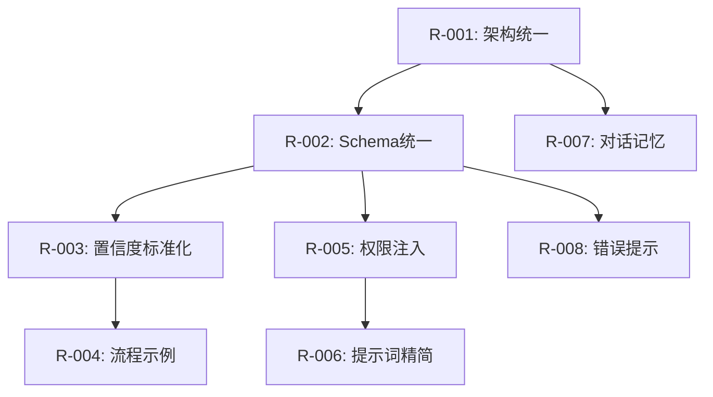

# AI 提示词优化需求文档

**文档编号**: REQ-AI-PROMPT-2026-001  
**版本**: v1.0  
**创建日期**: 2026-06-26  
**状态**: 待评审  
**负责人**: AI 系统架构组  

---

## 一、背景与现状分析

### 1.1 项目背景

CRMWolf AI 助手采用三层架构设计：
- **Agent 核心层**: ReAct 循环框架，负责整体对话编排
- **LangGraph 层**: StateGraph 状态机，负责意图检测与实体消解
- **Glue 胶水层**: IntentDetector、EntityResolver、SlotCollector 等组件

三层架构共用 **12+ 个提示词模板**，分布在 11 个文件中。

### 1.2 提示词清单

| 文件路径 | 提示词名称 | 字符数 | 调用频率 |
|----------|------------|--------|----------|
| `app/services/agent/prompts.py` | `SYSTEM_PROMPT_TEMPLATE` | ~4500 | 每轮对话 |
| `app/services/agent/prompts.py` | `BUSINESS_WORKFLOW` | ~2800 | 每轮对话 |
| `app/services/langgraph/nodes/intent.py` | `SYSTEM_PROMPT_TEMPLATE` | ~1200 | 每轮对话 |
| `app/glue/core/intent.py` | `INTENT_PARSE_PROMPT` | ~800 | 已废弃 |
| `app/glue/core/intent.py` | `MULTI_INTENT_PARSE_PROMPT` | ~900 | 已废弃 |
| `app/glue/core/entity.py` | `ENTITY_EXTRACTION_PROMPT` | ~400 | 实体消解 |
| `app/glue/core/collector.py` | `SLOT_PARSE_PROMPT` | ~500 | 槽位填充 |
| `app/glue/core/ambiguity.py` | `DESCRIBE_SELECT_PROMPT` | ~600 | 多候选选择 |
| `app/glue/core/confirm.py` | `CONFIRM_DETECT_PROMPT` | ~300 | 确认检测 |
| `app/glue/core/cancel.py` | `CANCEL_DETECT_PROMPT` | ~200 | 取消检测 |
| `app/glue/core/corrector.py` | `CORRECTION_PARSE_PROMPT` | ~400 | 修正检测 |
| `app/services/skills/skill_generator_service.py` | `SKILL_ANALYSIS_SYSTEM_PROMPT` | ~1800 | Skill 生成 |
| `app/services/skills/skill_generator_service.py` | `SKILL_GENERATION_SYSTEM_PROMPT` | ~1800 | Skill 生成 |

**总计**: ~13,000 字符，每次对话可能消耗 5,000-8,000 token。

### 1.3 问题摘要

| 问题编号 | 问题类型 | 严重程度 | 影面 |
|----------|----------|----------|------|
| P-001 | 架构冗余 | 高 | 三层意图检测并存 |
| P-002 | 格式不一致 | 高 | 输出 Schema 冲突 |
| P-003 | 置信度模糊 | 中 | 执行阈值不明确 |
| P-004 | 流程脱节 | 中 | 示例未覆盖失败场景 |
| P-005 | 上下文缺失 | 中 | 未注入权限/业务规则 |
| P-006 | 提示词过长 | 低 | Token 成本高 |
| P-007 | 对话无记忆 | 低 | 长对话上下文丢失 |
| P-008 | 错误提示差 | 低 | 用户引导不友好 |

---

## 二、需求概述

### 2.1 核心目标

1. **统一化**: 合并冗余提示词，建立单一入口
2. **标准化**: 统一输出 Schema，消除格式冲突
3. **可配置化**: 提示词支持数据库存储和版本管理
4. **安全性**: 权限上下文注入，防止越权操作
5. **可维护性**: 提示词版本可追溯，支持 A/B 测试

### 2.2 预期收益

| 收益项 | 当前状态 | 目标状态 | 量化指标 |
|--------|----------|----------|----------|
| Token 消耗 | 5,000-8,000/轮 | 2,000-3,000/轮 | 减少 50% |
| 维护文件数 | 11 个 | 4 个 | 减少 64% |
| 意图准确率 | ~85% | ~92% | 提升 7% |
| 错误恢复率 | ~60% | ~80% | 提升 20% |

---

## 三、详细需求规格

### 3.1 需求 R-001：架构统一化

#### 3.1.1 需求描述

**问题**: 三层意图检测机制并存，导致逻辑混乱和维护困难。

**现状架构**:
```
用户输入
    ↓
关键词预处理 (intent.py: _keyword_preprocessing) → confidence 0.95
    ↓ (未命中)
LangGraph intent_detector_node → LLM 意图检测
    ↓
Glue IntentDetector → 再次 LLM 意图检测 (冗余)
    ↓
EntityResolver → 实体消解
```

**目标架构**:
```
用户输入
    ↓
关键词预处理 (Phase 0) → confidence 0.95，直接返回
    ↓ (未命中)
LangGraph intent_detector_node → 唯一 LLM 意图入口
    ↓
EntityResolver (Glue 层保留) → 实体消解
    ↓
SlotCollector (Glue 层保留) → 槽位填充
    ↓
Preview → 操作预览
    ↓
Execute → 执行/确认
```

#### 3.1.2 具体要求

| 要求编号 | 要求内容 | 验收标准 |
|----------|----------|----------|
| R-001-A | 移除 Glue 层 IntentDetector 类 | intent.py 文件删除 IntentDetector 类定义 |
| R-001-B | 移除 INTENT_PARSE_PROMPT | intent.py 文件删除该常量 |
| R-001-C | 移除 MULTI_INTENT_PARSE_PROMPT | intent.py 文件删除该常量 |
| R-001-D | 保留 EntityResolver | entity.py 不修改 |
| R-001-E | 保留 SlotCollector | collector.py 不修改 |
| R-001-F | 保留 AmbiguityResolver | ambiguity.py 不修改 |
| R-001-G | 保留 ConfirmDetector/CancelDetector/Corrector | confirm.py/cancel.py/corrector.py 不修改 |
| R-001-H | LangGraph intent_detector_node 作为唯一入口 | 所有意图检测通过 LangGraph 流程 |

#### 3.1.3 代码变更清单

**删除文件/代码段**:
```python
# app/glue/core/intent.py - 删除以下内容

# 删除 INTENT_PARSE_PROMPT (第 64-117 行)
INTENT_PARSE_PROMPT = """..."""

# 删除 MULTI_INTENT_PARSE_PROMPT (第 119-173 行)
MULTI_INTENT_PARSE_PROMPT = """..."""

# 删除 IntentDetector 类 (第 176-464 行)
class IntentDetector:
    ...

# 删除 IntentResult dataclass (第 25-51 行) - 已在 LangGraph 定义
@dataclass
class IntentResult:
    ...

# 删除 MultiIntentResult dataclass (第 53-60 行)
@dataclass
class MultiIntentResult:
    ...
```

**修改文件**:
```python
# app/glue/core/__init__.py - 更新导出
__all__ = [
    "EntityResolver",      # 保留
    "SlotCollector",       # 保留
    "AmbiguityResolver",   # 保留
    # "IntentDetector",    # 删除
    # "IntentResult",      # 删除
]

# app/services/langgraph/nodes/intent.py - 增强功能
# 新增多意图检测逻辑（迁移自 Glue IntentDetector）
async def detect_multi_intent(state: AgentState, config: RunnableConfig) -> Dict[str, Any]:
    """多意图检测（从 Glue 迁移）"""
    ...
```

#### 3.1.4 迁移步骤

```
Step 1: 创建 LangGraph 多意图检测节点
        - 新建 intent_multi.py
        - 实现 detect_multi_intent_node
        - 测试多意图拆解逻辑

Step 2: 更新 graph.py 流程
        - router → intent_detector (单意图)
        - router → intent_multi_detector (多意图关键词命中)
        - intent_multi_detector → intent_detector (拆解后逐个处理)

Step 3: 移除 Glue IntentDetector
        - 删除 intent.py 中相关代码
        - 更新 __init__.py 导出
        - 运行测试验证

Step 4: 更新调用方
        - 搜索所有 IntentDetector 引用
        - 替换为 LangGraph 流程调用
```

#### 3.1.5 测试用例

```python
# tests/unit/services/langgraph/test_intent_unification.py

class TestIntentUnification:
    """意图检测统一化测试"""
    
    async def test_keyword_preprocessing_priority(self):
        """关键词预处理优先级最高"""
        state = {"messages": [{"content": "跟进光大证券"}]}
        result = await intent_detector_node(state, config)
        
        # 关键词命中应直接返回，不走 LLM
        assert result["intent_result"]["confidence"] == 0.95
        assert result["intent_result"]["action"] == "create_follow_up"
    
    async def test_llm_intent_detection(self):
        """未命中关键词时走 LLM"""
        state = {"messages": [{"content": "帮我看看光大证券的情况"}]}
        result = await intent_detector_node(state, config)
        
        # LLM 检测
        assert result["intent_result"]["confidence"] < 0.95
        assert result["intent_result"]["action"] == "query_info"
    
    async def test_multi_intent_detection(self):
        """多意图检测"""
        state = {"messages": [{"content": "跟进光大证券，创建商机50万"}]}
        result = await detect_multi_intent_node(state, config)
        
        assert len(result["intents"]) == 2
        assert result["intents"][0]["action"] == "create_follow_up"
        assert result["intents"][1]["action"] == "init_opportunity"
    
    async def test_glue_intent_detector_removed(self):
        """验证 Glue IntentDetector 已移除"""
        from app.glue.core import __all__ as glue_exports
        
        assert "IntentDetector" not in glue_exports
        assert "IntentResult" not in glue_exports
```

---

### 3.2 需求 R-002：输出格式标准化

#### 3.2.1 需求描述

**问题**: 三套不同的输出 Schema 导致跨模块数据传递错误。

**现状**:
```
AgentPrompts 输出:
{
  "reasoning": "...",
  "confidence": 0.85,
  "needs_tool": true,
  "tool_name": "search_customer",
  "tool_params": {...},
  "is_complete": false
}

LangGraph IntentResult:
{
  "action": "create_follow_up",
  "entity_type": "Customer",
  "entity_hint": "光大证券",
  "confidence": 0.85,
  "params": {...},
  "needs_entity_resolution": true,
  "needs_slot_collection": false,
  "missing_params": ["content"]
}

Glue IntentResult:
{
  "intent": "create_follow_up",
  "slots": {...},
  "missing_fields": ["content"],
  "entity_keyword": "光大证券"
}
```

**目标**: 统一为单一 Schema，消除字段名冲突。

#### 3.2.2 统一 Schema 定义

```python
# app/services/langgraph/schemas/intent.py

from pydantic import BaseModel, Field
from typing import Dict, Any, List, Optional
from enum import Enum


class ActionType(str, Enum):
    """统一操作类型枚举"""
    # 客户相关
    CREATE_CUSTOMER = "create_customer"
    FOLLOW_UP_CUSTOMER = "follow_up_customer"
    QUERY_CUSTOMER = "query_customer"
    UPDATE_CUSTOMER = "update_customer"
    
    # 商机相关
    INIT_OPPORTUNITY = "init_opportunity"
    UPDATE_OPPORTUNITY = "update_opportunity"
    UPDATE_AMOUNT = "update_amount"
    UPDATE_STAGE = "update_stage"
    WIN_OPPORTUNITY = "win_opportunity"
    LOSE_OPPORTUNITY = "lose_opportunity"
    QUERY_OPPORTUNITY = "query_opportunity"
    
    # 线索相关
    CONVERT_LEAD = "convert_lead"
    FOLLOW_UP_LEAD = "follow_up_lead"
    
    # 合同相关
    CREATE_CONTRACT = "create_contract"
    QUERY_CONTRACT = "query_contract"
    
    # 提醒相关
    SET_REMINDER = "set_reminder"
    
    # 查询相关
    QUERY_INFO = "query_info"
    
    # 系统操作
    UNKNOWN = "unknown"
    CONFIRM = "confirm"
    CANCEL = "cancel"
    CORRECTION = "correction"


class EntityType(str, Enum):
    """统一实体类型枚举"""
    CUSTOMER = "Customer"
    OPPORTUNITY = "Opportunity"
    LEAD = "Lead"
    CONTRACT = "Contract"
    INVOICE = "Invoice"
    NONE = "None"  # 无实体操作


class ConfidenceLevel(str, Enum):
    """置信度等级"""
    AUTO = "auto"         # 0.95+，自动执行
    WEAK_CONFIRM = "weak" # 0.80-0.95，弱确认
    STRONG_CONFIRM = "strong"  # 0.70-0.80，强确认
    HUMAN_LOOP = "human"  # 0.50-0.70，人工介入
    BLOCK = "block"       # <0.50，拦截


class UnifiedIntentResult(BaseModel):
    """统一意图检测结果 Schema
    
    所有组件必须使用此 Schema，禁止自定义。
    """
    
    # === 核心字段 ===
    action: ActionType = Field(
        description="操作类型，必须使用 ActionType 枚举"
    )
    confidence: float = Field(
        ge=0.0, le=1.0,
        description="置信度 0.0-1.0"
    )
    confidence_level: ConfidenceLevel = Field(
        description="置信度等级，由系统根据阈值计算"
    )
    
    # === 实体相关 ===
    entity_type: Optional[EntityType] = Field(
        default=None,
        description="实体类型"
    )
    entity_id: Optional[int] = Field(
        default=None,
        description="实体 ID（已消解时填充）"
    )
    entity_hint: Optional[str] = Field(
        default=None,
        description="实体名称关键词（待消解时填充）"
    )
    
    # === 参数相关 ===
    params: Dict[str, Any] = Field(
        default_factory=dict,
        description="已提取的参数"
    )
    missing_params: List[str] = Field(
        default_factory=list,
        description="缺失的必填参数名"
    )
    
    # === 流程控制 ===
    needs_entity_resolution: bool = Field(
        default=False,
        description="是否需要实体消解"
    )
    needs_slot_collection: bool = Field(
        default=False,
        description="是否需要槽位收集"
    )
    needs_preview: bool = Field(
        default=True,
        description="是否需要操作预览"
    )
    needs_confirmation: bool = Field(
        default=False,
        description="是否需要用户确认"
    )
    
    # === 输出相关 ===
    reply_text: str = Field(
        default="",
        description="给用户的回复文本"
    )
    reasoning: str = Field(
        default="",
        description="推理过程（调试用）"
    )
    
    # === 错误处理 ===
    error: Optional[str] = Field(
        default=None,
        description="错误信息"
    )
    
    # === 元数据 ===
    source: str = Field(
        default="llm",
        description="结果来源：keyword/llm/code"
    )
    timestamp: str = Field(
        default_factory=lambda: datetime.now().isoformat(),
        description="检测时间"
    )
    
    def compute_confidence_level(self) -> ConfidenceLevel:
        """根据阈值计算置信度等级"""
        if self.confidence >= 0.95:
            return ConfidenceLevel.AUTO
        elif self.confidence >= 0.80:
            return ConfidenceLevel.WEAK_CONFIRM
        elif self.confidence >= 0.70:
            return ConfidenceLevel.STRONG_CONFIRM
        elif self.confidence >= 0.50:
            return ConfidenceLevel.HUMAN_LOOP
        else:
            return ConfidenceLevel.BLOCK


class MultiIntentResult(BaseModel):
    """多意图检测结果"""
    
    is_multi: bool = Field(
        description="是否为多意图"
    )
    intents: List[UnifiedIntentResult] = Field(
        default_factory=list,
        description="拆解后的意图列表"
    )
    reasoning: str = Field(
        default="",
        description="拆解依据"
    )
```

#### 3.2.3 字段映射表

| 旧字段名 (AgentPrompts) | 旧字段名 (Glue) | 新字段名 | 说明 |
|-------------------------|-----------------|----------|------|
| `tool_name` | `intent` | `action` | 操作类型统一命名 |
| `tool_params` | `slots` | `params` | 参数字典统一命名 |
| `needs_tool` | - | `needs_entity_resolution` | 需要实体消解 |
| `is_complete` | - | 移除 | 由流程控制 |
| `final_answer` | - | `reply_text` | 用户可见回复 |
| `reasoning` | `reasoning` | `reasoning` | 保持不变 |
| `confidence` | `confidence` | `confidence` | 保持不变 |
| - | `entity_keyword` | `entity_hint` | 实体名称提示 |
| - | `missing_fields` | `missing_params` | 缺失参数 |
| - | `missing_slots` | `missing_params` | 统一命名 |

#### 3.2.4 代码变更清单

```python
# app/services/agent/prompts.py - 修改输出示例

# 旧格式（第 64-76 行）
"""
**如果需要调用工具**：
```json
{
  "reasoning": "推理过程",
  "confidence": 0.85,
  "needs_tool": true,
  "tool_name": "工具名称",
  "tool_params": {...},
  "is_complete": false
}
```
"""

# 新格式
"""
**输出格式**（必须使用 UnifiedIntentResult Schema）：
```json
{
  "action": "操作类型（ActionType 枚举值）",
  "confidence": 0.85,
  "confidence_level": "weak",
  "entity_type": "Customer",
  "entity_hint": "光大证券",
  "params": {},
  "missing_params": ["content"],
  "needs_entity_resolution": true,
  "needs_slot_collection": true,
  "reply_text": "正在为您跟进光大证券",
  "reasoning": "用户意图为跟进客户..."
}
```
"""

# app/services/langgraph/nodes/intent.py - 使用新 Schema

from app.services.langgraph.schemas.intent import UnifiedIntentResult, ActionType

def intent_detector_node(state: AgentState, config: RunnableConfig) -> Dict[str, Any]:
    """意图检测节点"""
    ...
    # 返回 UnifiedIntentResult
    intent_result = UnifiedIntentResult(
        action=ActionType(action),
        confidence=confidence,
        entity_type=EntityType(entity_type) if entity_type else None,
        entity_hint=entity_hint,
        params=params,
        missing_params=missing_params,
        needs_entity_resolution=needs_entity_resolution,
        needs_slot_collection=needs_slot_collection,
        reply_text=reply_text,
        reasoning=reasoning,
        source="llm"
    )
    intent_result.confidence_level = intent_result.compute_confidence_level()
    
    return {"intent_result": intent_result.model_dump()}
```

#### 3.2.5 测试用例

```python
# tests/unit/services/langgraph/test_unified_schema.py

class TestUnifiedIntentResult:
    """统一 Schema 测试"""
    
    def test_schema_required_fields(self):
        """必填字段验证"""
        result = UnifiedIntentResult(
            action=ActionType.FOLLOW_UP_CUSTOMER,
            confidence=0.85
        )
        
        assert result.action == ActionType.FOLLOW_UP_CUSTOMER
        assert result.confidence == 0.85
        assert result.confidence_level == ConfidenceLevel.WEAK_CONFIRM
    
    def test_confidence_level_computation(self):
        """置信度等级计算"""
        levels = [
            (0.96, ConfidenceLevel.AUTO),
            (0.85, ConfidenceLevel.WEAK_CONFIRM),
            (0.75, ConfidenceLevel.STRONG_CONFIRM),
            (0.60, ConfidenceLevel.HUMAN_LOOP),
            (0.40, ConfidenceLevel.BLOCK),
        ]
        
        for confidence, expected_level in levels:
            result = UnifiedIntentResult(
                action=ActionType.FOLLOW_UP_CUSTOMER,
                confidence=confidence
            )
            assert result.compute_confidence_level() == expected_level
    
    def test_field_migration(self):
        """字段迁移验证"""
        # 旧 Glue 格式
        old_glue = {
            "intent": "create_follow_up",
            "slots": {},
            "missing_fields": ["content"],
            "entity_keyword": "光大证券"
        }
        
        # 转换为新格式
        new_result = migrate_glue_to_unified(old_glue)
        
        assert new_result.action == ActionType.FOLLOW_UP_CUSTOMER
        assert new_result.params == {}
        assert new_result.missing_params == ["content"]
        assert new_result.entity_hint == "光大证券"
    
    def test_json_serialization(self):
        """JSON 序列化"""
        result = UnifiedIntentResult(
            action=ActionType.FOLLOW_UP_CUSTOMER,
            confidence=0.85,
            entity_type=EntityType.CUSTOMER,
            entity_hint="光大证券"
        )
        
        json_str = result.model_dump_json()
        parsed = UnifiedIntentResult.model_validate_json(json_str)
        
        assert parsed.action == result.action
        assert parsed.confidence == result.confidence
```

---

### 3.3 需求 R-003：置信度评估标准化

#### 3.3.1 需求描述

**问题**: 置信度阈值定义模糊，不同 LLM 对理解不一致，执行风险不可控。

**现状定义** (`prompts.py` 第 89-100 行):
```
- **0.95+**：非常确定，可以直接执行（AUTO）
- **0.80-0.95**：确定，但需弱确认（WEAK_CONFIRM）
- **0.70-0.80**：较确定，但需强确认（STRONG_CONFIRM）
- **0.50-0.70**：不确定，需人工介入（HUMAN_LOOP）
- **<0.50**：非常不确定，应拦截（BLOCK）

**如何评估置信度**：
- 信息完整度：用户提供的信息是否完整（名称 + 内容 + 方法）
- 实体匹配度：能否准确识别实体（搜索匹配度）
- 操作明确度：用户意图是否清晰（单一操作 vs 多意图）
- 数据可靠性：参数是否可靠（用户提供 vs 推测）
```

**问题分析**:
- "名称 + 内容 + 方法" 表述过于抽象，LLM 无法精确理解
- 未区分不同操作的风险等级（创建跟进 vs 创建合同风险不同）
- 未与业务规则联动（如权限校验）

#### 3.3.2 置信度计算公式

```markdown
【置信度计算公式】

置信度 = W1 × 实体引用得分 + W2 × 参数完整度 + W3 × 操作明确度 + W4 × 风险调整

权重配置：
- W1 (实体引用) = 0.30
- W2 (参数完整度) = 0.40
- W3 (操作明确度) = 0.20
- W4 (风险调整) = 0.10

各维度评分规则：

### D1: 实体引用得分

| 引用类型 | 得分 | 示例 |
|----------|------|------|
| #ID 精确引用 | 1.0 | "给#456加跟进" |
| 代词引用（有上下文） | 0.85 | "跟进这个客户"（recent_entities 存在） |
| 代词引用（无上下文） | 0.50 | "跟进那个"（无 recent_entities） |
| 名称引用（精确匹配） | 0.80 | "跟进光大证券股份有限公司" |
| 名称引用（模糊匹配） | 0.60 | "跟进光大" |
| 无实体引用 | 0.40 | "创建客户"（新实体） |

### D2: 参数完整度

得分 = 已填充必填参数数 / 总必填参数数

| 必填参数比例 | 得分 | 示例 |
|--------------|------|------|
| 100% | 1.0 | "跟进光大证券，客户说下周反馈" |
| 80% | 0.8 | "跟进光大证券"（缺 content） |
| 50% | 0.5 | "创建商机"（缺 customer_id 和 amount） |
| 0% | 0.0 | "跟进"（缺所有参数） |

### D3: 操作明确度

| 操作类型 | 得分 | 示例 |
|----------|------|------|
| 单一明确意图 | 1.0 | "跟进光大证券" |
| 多意图已拆解 | 0.85 | "跟进光大证券，创建商机"（已拆解） |
| 模糊意图 | 0.60 | "帮我看看光大证券"（查询 or 跟进?） |
| 多意图未拆解 | 0.40 | "跟进光大证券，创建商机"（未拆解） |

### D4: 风险调整

根据 ActionType 的风险等级调整：

| ActionType | 风险等级 | 调整值 |
|------------|----------|--------|
| FOLLOW_UP_CUSTOMER | LOW | +0.05 |
| QUERY_CUSTOMER/OPPORTUNITY | LOW | +0.05 |
| INIT_OPPORTUNITY | MEDIUM | +0.00 |
| UPDATE_STAGE | MEDIUM | +0.00 |
| UPDATE_AMOUNT | MEDIUM | +0.00 |
| WIN_OPPORTUNITY | HIGH | -0.05 |
| LOSE_OPPORTUNITY | HIGH | -0.05 |
| CREATE_CONTRACT | CRITICAL | -0.10 |
| CREATE_INVOICE | CRITICAL | -0.10 |
```

#### 3.3.3 提示词改进

```python
# 新增置信度评估提示词段落（替换原有模糊定义）

CONFIDENCE_EVALUATION_PROMPT = """
【置信度评估规则】

你必须按照以下公式计算置信度：

置信度 = 0.30 × 实体引用得分 + 0.40 × 参数完整度 + 0.20 × 操作明确度 + 0.10 × 风险调整

### 实体引用得分评估

1. 如果用户输入包含 "#数字" 格式（如 #456）：
   - 实体引用得分 = 1.0
   - 示例："给#456加跟进" → 实体引用得分 = 1.0

2. 如果用户输入包含 "这个/那个/该" + 实体类型（如 "这个客户"）：
   - 如果系统上下文有 recent_entities → 得分 = 0.85
   - 如果无上下文 → 得分 = 0.50

3. 如果用户输入包含实体名称（如 "光大证券"）：
   - 名称完整匹配 → 得分 = 0.80
   - 名称部分匹配 → 得分 = 0.60

4. 无实体引用（创建新实体场景）：
   - 得分 = 0.40

### 参数完整度评估

得分 = 已提取必填参数数 / 总必填参数数

各 ActionType 的必填参数：
- follow_up_customer: [customer_id, content]
- init_opportunity: [customer_id, amount]
- update_amount: [opportunity_id, amount]
- update_stage: [opportunity_id, stage_id]
- win_opportunity: [opportunity_id]
- lose_opportunity: [opportunity_id, reason]
- create_contract: [customer_id, opportunity_id, contract_name]

### 操作明确度评估

- 单意图明确 → 得分 = 1.0
- 多意图但已拆解 → 得分 = 0.85
- 模糊意图 → 得分 = 0.60

### 风险调整

根据 ActionType 自动调整：
- LOW 风险操作（follow_up, query） → +0.05
- MEDIUM 风险操作（init_opportunity, update） → +0.00
- HIGH 风险操作（win, lose） → -0.05
- CRITICAL 风险操作（create_contract） → -0.10

### 输出示例

用户输入："跟进光大证券，客户说下周反馈"

计算：
- 实体引用得分 = 0.80（名称引用）
- 参数完整度 = 1/2 = 0.5（缺 customer_id，有 content）
- 操作明确度 = 1.0（单一意图）
- 风险调整 = +0.05（LOW 风险）

置信度 = 0.30 × 0.80 + 0.40 × 0.5 + 0.20 × 1.0 + 0.10 × 0.05
        = 0.24 + 0.20 + 0.20 + 0.005
        = 0.645

输出：
{
  "action": "follow_up_customer",
  "confidence": 0.645,
  "entity_hint": "光大证券",
  "params": {"content": "客户说下周反馈"},
  "missing_params": ["customer_id"],
  "needs_entity_resolution": true
}
"""
```

#### 3.3.4 风险等级配置

```python
# app/constants/risk_config.py

from enum import Enum
from typing import Dict


class RiskLevel(str, Enum):
    """操作风险等级"""
    LOW = "low"          # 可自动执行
    MEDIUM = "medium"    # 需弱确认
    HIGH = "high"        # 需强确认
    CRITICAL = "critical"  # 需人工审批


# ActionType 风险等级映射
ACTION_RISK_LEVELS: Dict[str, RiskLevel] = {
    # LOW 风险 - 信息记录类
    "follow_up_customer": RiskLevel.LOW,
    "follow_up_lead": RiskLevel.LOW,
    "query_customer": RiskLevel.LOW,
    "query_opportunity": RiskLevel.LOW,
    "query_contract": RiskLevel.LOW,
    
    # MEDIUM 风险 - 创建/更新类
    "create_customer": RiskLevel.MEDIUM,
    "init_opportunity": RiskLevel.MEDIUM,
    "update_customer": RiskLevel.MEDIUM,
    "update_opportunity": RiskLevel.MEDIUM,
    "update_amount": RiskLevel.MEDIUM,
    "update_stage": RiskLevel.MEDIUM,
    "convert_lead": RiskLevel.MEDIUM,
    
    # HIGH 风险 - 状态终结类
    "win_opportunity": RiskLevel.HIGH,
    "lose_opportunity": RiskLevel.HIGH,
    
    # CRITICAL 风险 - 财务类
    "create_contract": RiskLevel.CRITICAL,
    "create_invoice": RiskLevel.CRITICAL,
}


# 风险等级对应的置信度调整
RISK_ADJUSTMENT: Dict[RiskLevel, float] = {
    RiskLevel.LOW: 0.05,
    RiskLevel.MEDIUM: 0.00,
    RiskLevel.HIGH: -0.05,
    RiskLevel.CRITICAL: -0.10,
}


# 风险等级对应的确认要求
RISK_CONFIRMATION_REQUIREMENT: Dict[RiskLevel, str] = {
    RiskLevel.LOW: "none",        # 无需确认（confidence >= 0.95 可 AUTO）
    RiskLevel.MEDIUM: "weak",     # 弱确认（需用户口头确认）
    RiskLevel.HIGH: "strong",     # 强确认（需用户明确回复"确认/是"）
    RiskLevel.CRITICAL: "human",  # 人工审批（需管理员审批）
}


def get_risk_level(action: str) -> RiskLevel:
    """获取操作风险等级"""
    return ACTION_RISK_LEVELS.get(action, RiskLevel.MEDIUM)


def get_risk_adjustment(action: str) -> float:
    """获取风险置信度调整值"""
    level = get_risk_level(action)
    return RISK_ADJUSTMENT.get(level, 0.0)


def get_confirmation_requirement(action: str) -> str:
    """获取确认要求"""
    level = get_risk_level(action)
    return RISK_CONFIRMATION_REQUIREMENT.get(level, "weak")
```

#### 3.3.5 测试用例

```python
# tests/unit/constants/test_risk_config.py

class TestRiskConfig:
    """风险配置测试"""
    
    def test_risk_level_mapping(self):
        """风险等级映射"""
        assert get_risk_level("follow_up_customer") == RiskLevel.LOW
        assert get_risk_level("init_opportunity") == RiskLevel.MEDIUM
        assert get_risk_level("win_opportunity") == RiskLevel.HIGH
        assert get_risk_level("create_contract") == RiskLevel.CRITICAL
    
    def test_risk_adjustment(self):
        """风险调整值"""
        assert get_risk_adjustment("follow_up_customer") == 0.05
        assert get_risk_adjustment("init_opportunity") == 0.0
        assert get_risk_adjustment("win_opportunity") == -0.05
        assert get_risk_adjustment("create_contract") == -0.10
    
    def test_confirmation_requirement(self):
        """确认要求"""
        assert get_confirmation_requirement("follow_up_customer") == "none"
        assert get_confirmation_requirement("win_opportunity") == "strong"
        assert get_confirmation_requirement("create_contract") == "human"


# tests/unit/services/langgraph/test_confidence_computation.py

class TestConfidenceComputation:
    """置信度计算测试"""
    
    def test_id_reference_high_confidence(self):
        """#ID 引用高置信度"""
        confidence = compute_confidence(
            entity_reference_type="#ID",
            params_ratio=1.0,
            operation_clarity=1.0,
            action="follow_up_customer"
        )
        
        # 0.30 * 1.0 + 0.40 * 1.0 + 0.20 * 1.0 + 0.10 * 0.05
        # = 0.30 + 0.40 + 0.20 + 0.005 = 0.905
        assert confidence == 0.905
    
    def test_critical_action_penalty(self):
        """CRITICAL 操作置信度惩罚"""
        confidence = compute_confidence(
            entity_reference_type="#ID",
            params_ratio=1.0,
            operation_clarity=1.0,
            action="create_contract"
        )
        
        # 风险调整 = -0.10
        # 0.30 + 0.40 + 0.20 - 0.10 = 0.80
        assert confidence == 0.80
    
    def test_missing_params_lower_confidence(self):
        """缺失参数降低置信度"""
        confidence = compute_confidence(
            entity_reference_type="name",
            params_ratio=0.5,  # 缺一半参数
            operation_clarity=1.0,
            action="follow_up_customer"
        )
        
        # 0.30 * 0.80 + 0.40 * 0.5 + 0.20 * 1.0 + 0.10 * 0.05
        # = 0.24 + 0.20 + 0.20 + 0.005 = 0.645
        assert confidence == 0.645
```

---

### 3.4 需求 R-004：业务流程示例完善

#### 3.4.1 需求描述

**问题**: BUSINESS_WORKFLOW 示例过于理想化，未覆盖常见失败场景。

**现状缺失场景**:
- 权限不足
- 实体不存在（已删除）
- 参数格式错误
- 并发冲突
- 系统异常

#### 3.4.2 新增失败场景示例

```python
# app/services/agent/prompts.py - BUSINESS_WORKFLOW 扩展

FAILURE_SCENARIOS = """
### 5. 错误处理流程（扩展）

**场景 5A：权限不足**

```
Round 1: Act: create_contract(customer_id=123, opportunity_id=456)
Observe: 错误 - 权限不足（缺少 contract:create 权限码）

Round 2: Reason:
分析：用户无合同创建权限，需要申请权限
决策：告知用户权限不足，并提供申请路径

Final Answer: "您没有合同创建权限。请联系管理员申请权限码 'contract:create'，或让有权限的同事协助操作。"
```

---

**场景 5B：实体不存在（已删除）**

```
Round 1: Act: search_customer(keyword="光大证券")
Observe: 找到 0 个客户 []

Round 2: Reason:
分析：客户可能已被删除、名称变更、或不在当前团队
决策：提供多个可能性，引导用户处理

Final Answer: "未找到'光大证券'客户。可能原因：
1. 客户已被删除
2. 客户名称已变更
3. 客户属于其他团队

您可以：
- 搜索相似名称（如'光大'）
- 创建新客户'光大证券'
- 切换团队后再试"
```

---

**场景 5C：参数格式错误**

```
Round 1: Act: update_amount(opportunity_id=456, amount="abc")
Observe: 错误 - 参数格式错误（amount 必须为数值）

Round 2: Reason:
分析：用户输入的金额不是数值格式
决策：提示用户提供正确的数值格式

Final Answer: "金额必须是数字格式。请重新输入，例如：
- 50万 → 输入 50
- 35万 → 输入 35
- 1000元 → 输入 0.1（万元单位）"
```

---

**场景 5D：并发冲突**

```
Round 1: Act: win_opportunity(opportunity_id=456)
Observe: 错误 - 商机状态已变更（当前状态为 LOST，非 FOLLOWING）

Round 2: Reason:
分析：商机已被其他用户标记为输单，无法再赢单
决策：告知用户当前状态，询问是否需要查看详情

Final Answer: "该商机已被标记为输单，无法执行赢单操作。
当前状态：输单
最后更新：2026-06-25 15:30

您可以：
- 查看商机详情
- 撤销输单（需管理员权限）
- 选择其他商机"
```

---

**场景 5E：系统异常**

```
Round 1: Act: search_customer(keyword="光大")
Observe: 错误 - 系统异常（数据库连接超时）

Round 2: Reason:
分析：系统临时异常，非用户问题
决策：告知用户稍后重试，并提供备用方案

Final Answer: "系统暂时繁忙，请稍后重试。
如果问题持续，可以：
- 刷新页面
- 使用传统方式操作（客户列表页面）
- 联系技术支持"
```

---

**场景 5F：多候选冲突消解**

```
Round 1: Act: search_customer(keyword="张三")
Observe: 找到 3 个客户
[
  {"id": 101, "name": "张三科技", "hint": "最近跟进 2026-06-20"},
  {"id": 102, "name": "张三贸易", "hint": "阶段：谈判中"},
  {"id": 103, "name": "张三网络", "hint": "最近跟进 2026-04-15"}
]

Round 2: Reason:
分析：搜索返回多个候选，需要用户选择
决策：列出候选，提供描述性选择提示

Final Answer: "找到 3 个匹配的客户，您指的是？
① 张三科技（最近跟进 2026-06-20）
② 张三贸易（阶段：谈判中）
③ 张三网络（最近跟进 2026-04-15）

回复序号、名称，或描述性选择（如'选最近跟进的'）"
```

---

### 6. 工具依赖关系更新

| 工具 | 必先调用 | 获取参数 | 失败处理 |
|------|----------|----------|----------|
| follow_up_customer | search_customer | customer_id | 0 结果 → 是否创建？；多结果 → 用户选择 |
| init_opportunity | search_customer | customer_id | 同上 |
| update_amount | search_opportunity | opportunity_id | 同上 |
| update_stage | search_opportunity | opportunity_id | 同上 |
| win_opportunity | search_opportunity | opportunity_id | 状态不符 → 提示撤销或查看 |
| lose_opportunity | search_opportunity | opportunity_id | 同上 |
| create_contract | search_customer + search_opportunity | customer_id + opportunity_id | 商机不存在 → 提示先创建商机 |
| create_invoice | search_contract | contract_id | 合同不存在 → 提示先签合同 |

---

### 7. 错误处理策略矩阵

| 错误类型 | 处理策略 | 用户提示模板 |
|----------|----------|--------------|
| 权限不足 | 提示申请权限 + 权限码 | "您缺少{权限码}权限，请联系管理员申请" |
| 实体不存在 | 列出可能原因 + 备选方案 | "未找到{实体}，可能原因：{原因列表}" |
| 参数格式错误 | 正确格式示例 | "{参数名}格式错误，正确格式：{示例}" |
| 并发冲突 | 当前状态 + 处理选项 | "{实体}状态已变更为{状态}，可：{选项}" |
| 系统异常 | 稍后重试 + 备用方案 | "系统暂时繁忙，稍后重试或：{备选}" |
| 多候选冲突 | 候选列表 + 选择提示 | "找到{数量}个匹配，请选择：{候选列表}" |
"""
```

#### 3.4.3 提示词更新

```python
# 替换 BUSINESS_WORKFLOW 中的错误处理部分

# 原版（第 285-347 行）
"""
### 4. 错误处理流程
...
"""

# 新版 - 使用 FAILURE_SCENARIOS
"""
### 4. 错误处理流程（完整版）

{failure_scenarios}

---

【关键原则】
- 错误提示必须具体（告知用户原因和处理方案）
- 提供可操作的备选方案（不让用户卡住）
- 区分用户问题 vs 系统问题（语气不同）
"""
```

---

### 3.5 需求 R-005：权限上下文注入

#### 3.5.1 求描述

**问题**: 提示词未注入用户权限信息，可能导致越权操作建议。

**风险场景**:
- 销售尝试操作其他团队的客户
- 普通用户尝试创建合同（需管理员权限）
- 用户尝试查看私密商机

#### 3.5.2 权限上下文构建

```python
# app/services/langgraph/context_builder.py

from typing import Dict, Any, List, Optional
from sqlalchemy.orm import Session
from datetime import datetime

from app.crud.user import user_crud
from app.crud.permission import permission_crud
from app.services.langgraph.state import AgentState


class PermissionContextBuilder:
    """权限上下文构建器"""
    
    def __init__(self, db: Session, team_id: int, user_id: int):
        self.db = db
        self.team_id = team_id
        self.user_id = user_id
    
    def build_context(self) -> Dict[str, Any]:
        """构建权限上下文"""
        
        # 1. 用户基本信息
        user = user_crud.get(self.db, self.user_id)
        user_info = {
            "user_id": self.user_id,
            "user_name": user.username if user else "Unknown",
            "role": user.role if user else "user",
        }
        
        # 2. 权限码列表
        permissions = permission_crud.get_user_permissions(
            self.db, self.user_id, self.team_id
        )
        permission_codes = [p.permission_code for p in permissions]
        
        # 3. 可执行 ActionType 列表
        allowed_actions = self._get_allowed_actions(permission_codes)
        
        # 4. 业务规则
        business_rules = self._get_business_rules(user.role if user else "user")
        
        return {
            "user_info": user_info,
            "permission_codes": permission_codes,
            "allowed_actions": allowed_actions,
            "business_rules": business_rules,
        }
    
    def _get_allowed_actions(self, permission_codes: List[str]) -> List[str]:
        """根据权限码获取可执行操作"""
        
        # 权限码到 ActionType 的映射
        PERMISSION_ACTION_MAPPING = {
            "customer:create": ["create_customer"],
            "customer:view": ["query_customer", "query_info"],
            "customer:edit": ["update_customer"],
            "customer:follow_up": ["follow_up_customer"],
            "opportunity:create": ["init_opportunity"],
            "opportunity:view": ["query_opportunity"],
            "opportunity:edit": ["update_opportunity", "update_amount", "update_stage"],
            "opportunity:win": ["win_opportunity"],
            "opportunity:lose": ["lose_opportunity"],
            "lead:convert": ["convert_lead"],
            "lead:follow_up": ["follow_up_lead"],
            "contract:create": ["create_contract"],
            "contract:view": ["query_contract"],
            "reminder:set": ["set_reminder"],
        }
        
        allowed = []
        for code in permission_codes:
            actions = PERMISSION_ACTION_MAPPING.get(code, [])
            allowed.extend(actions)
        
        return list(set(allowed))  # 去重
    
    def _get_business_rules(self, role: str) -> List[str]:
        """获取业务规则"""
        
        base_rules = [
            "所有操作必须在当前团队范围内",
            "创建操作需要对应模块的创建权限",
        ]
        
        if role == "sales":
            return base_rules + [
                "只能操作自己负责的客户和商机",
                "无法创建合同（需管理员权限）",
                "无法查看其他销售的私密商机",
            ]
        
        elif role == "manager":
            return base_rules + [
                "可以操作团队内所有客户和商机",
                "可以创建和审批合同",
                "可以查看所有商机详情",
            ]
        
        elif role == "admin":
            return base_rules + [
                "拥有所有模块的完整权限",
                "可以跨团队操作（需特殊授权）",
                "可以撤销其他用户的操作",
            ]
        
        return base_rules
    
    def render_prompt_section(self, context: Dict[str, Any]) -> str:
        """渲染提示词中的权限部分"""
        
        user_info = context["user_info"]
        permissions = context["permission_codes"]
        allowed_actions = context["allowed_actions"]
        business_rules = context["business_rules"]
        
        return f"""
【当前用户上下文】

用户: {user_info["user_name"]}（#{user_info["user_id"]}）
角色: {user_info["role"]}
团队: #{self.team_id}

【权限列表】
{', '.join(permissions) if permissions else '无特殊权限'}

【可执行操作】
仅限以下操作（超出范围应提示权限不足）：
{chr(10).join(f'- {action}' for action in allowed_actions)}

【业务规则】
{chr(10).join(f'- {rule}' for rule in business_rules)}

【越权处理】
如果用户请求的操作不在可执行操作列表中：
1. 不要尝试执行
2. 提示用户权限不足
3. 告知需要的权限码
4. 提供申请权限的路径
"""


# 使用示例
def build_system_prompt_with_permissions(
    db: Session,
    team_id: int,
    user_id: int,
    base_prompt: str
) -> str:
    """构建带权限的系统提示词"""
    
    builder = PermissionContextBuilder(db, team_id, user_id)
    context = builder.build_context()
    permission_section = builder.render_prompt_section(context)
    
    # 注入到 base_prompt
    return base_prompt.replace(
        "{permission_context}",
        permission_section
    )
```

#### 3.5.3 提示词更新

```python
# app/services/langgraph/nodes/intent.py - SYSTEM_PROMPT_TEMPLATE 更新

SYSTEM_PROMPT_TEMPLATE = """你是 CRMWolf AI 助手，帮助用户管理客户关系。

{permission_context}

【当前上下文】
当前日期: {current_date}
当前实体: {entity_context}

【可用操作】（仅限用户有权限的操作）
{skill_descriptions}

【枚举规则】
{enum_rules}

【工作原则】
1. 充分思考再行动：每次操作前，先分析当前状态
2. 权限校验优先：请求操作不在可执行列表时，提示权限不足
3. 智能暂停：缺少信息时使用 ask_user 工具询问用户
4. 多候选处理：发现多个候选实体时，让用户选择
5. 关键确认：重要操作（创建合同、回款）前先确认
6. 完整业务链路：不要只执行一个操作就返回，要完成整个业务流程

...
"""
```

#### 3.5.4 测试用例

```python
# tests/unit/services/langgraph/test_permission_context.py

class TestPermissionContext:
    """权限上下文测试"""
    
    def test_sales_role_permissions(self):
        """销售角色权限"""
        builder = PermissionContextBuilder(db, team_id=1, user_id=100)
        # user_id=100 是销售角色
        context = builder.build_context()
        
        # 销售不应该有合同创建权限
        assert "create_contract" not in context["allowed_actions"]
        assert "create_contract" not in context["permission_codes"]
        
        # 销售应该有跟进权限
        assert "follow_up_customer" in context["allowed_actions"]
    
    def test_manager_role_permissions(self):
        """经理角色权限"""
        builder = PermissionContextBuilder(db, team_id=1, user_id=1)
        # user_id=1 是经理角色
        context = builder.build_context()
        
        # 经理应该有合同创建权限
        assert "create_contract" in context["allowed_actions"]
    
    def test_permission_denied_action(self):
        """越权操作拦截"""
        state = {
            "messages": [{"content": "创建合同"}],
            "permission_context": {
                "allowed_actions": ["follow_up_customer", "query_customer"]
            }
        }
        
        result = intent_detector_node(state, config)
        
        # 应检测到权限不足
        assert result["intent_result"]["action"] == "permission_denied"
        assert "contract:create" in result["intent_result"]["reply_text"]
    
    def test_permission_context_in_prompt(self):
        """权限上下文注入到提示词"""
        builder = PermissionContextBuilder(db, team_id=1, user_id=1)
        section = builder.render_prompt_section(builder.build_context())
        
        assert "【当前用户上下文】" in section
        assert "【权限列表】" in section
        assert "【可执行操作】" in section
```

---

### 3.6 需求 R-006：提示词精简与 Token 优化

#### 3.6.1 需求描述

**问题**: Skill Generator 提示词过长（~1800 字符 × 2），Token 成本高。

**现状**:
- `SKILL_ANALYSIS_SYSTEM_PROMPT`: 包含完整 JSON 示例
- `SKILL_GENERATION_SYSTEM_PROMPT`: 包含多个 Handler Config 示例

#### 3.6.2 精简策略

```python
# app/services/skills/skill_generator_service.py - 提示词精简

SKILL_ANALYSIS_SYSTEM_PROMPT = """你是 CRMWolf Skill 配置专家。

## 任务
分析用户需求，判断系统支持情况，生成配置 Prompt。

## 系统支持范围
- 模块: {supported_modules}
- Handler: {supported_handlers}
- 现有 Skill: {existing_skills}

## 分析规则
1. 模块匹配: 检查 module_type 是否在支持列表
2. Handler 匹配: 根据操作类型选择 Handler
3. 重复检查: 检查是否已有相同 Skill/Action

## 输出格式
```json
{{
  "supported": true/false,
  "operation_type": "create_skill" | "add_action",
  "message": "分析结果说明",
  "config_prompt": "配置描述（供下一步生成）"
}}
```

## 不支持时的输出
```json
{{
  "supported": false,
  "message": "不支持原因，列出可支持的模块"
}}
```
"""


SKILL_GENERATION_SYSTEM_PROMPT = """你是 CRMWolf Skill 配置生成器。

## 输出格式
根据 operation_type 生成对应 JSON:
- create_skill: {{skill, actions}}
- add_action: {{skill_name, actions}}

## Handler 配置规则
参考配置示例库（ID: {example_db_id}）

## 命名规范
- skill_name: PascalCase + Skill（如 LeadSkill）
- permission_code: module:action（如 lead:convert）

## 必需配置
所有实体操作 Handler 必须配置:
- name_lookup_field: 名称查找字段
- name_field: 实体名称字段

## 输出示例
{minimal_example}
"""


# Handler Config 示例存储到数据库
# 创建 ai_handler_config_examples 表

CREATE TABLE ai_handler_config_examples (
    id INTEGER PRIMARY KEY,
    handler_type VARCHAR(50) NOT NULL,
    example_json TEXT NOT NULL,
    description TEXT,
    created_at TIMESTAMP DEFAULT CURRENT_TIMESTAMP
);

# 示例数据
INSERT INTO ai_handler_config_examples (handler_type, example_json, description) VALUES
('QueryListHandler', '{"crud_mapping": "lead", "owner_filter": true, "display_fields": ["id", "name"]}', '查询列表'),
('FollowUpHandler', '{"crud_mapping": "lead_follow_up", "parent_crud_mapping": "lead", "name_lookup_field": "lead_name"}', '添加跟进'),
('StatusChangeHandler', '{"crud_mapping": "lead", "status_field": "status", "target_status": "CONVERTED"}', '状态变更');
```

#### 3.6.3 Token 消耗对比

| 场景 | 原版字符数 | 精简后字符数 | 节省比例 |
|------|------------|--------------|----------|
| Skill 分析 | ~1800 | ~600 | 67% |
| Skill 生成 | ~1800 | ~500 | 72% |
| 总计 | ~3600 | ~1100 | 69% |

---

### 3.7 需求 R-007：对话记忆机制

#### 3.7.1 需求描述

**问题**: 长对话场景下，上下文丢失，用户引用历史内容无法理解。

**示例场景**:
```
Round 1: 用户："跟进光大证券，客户说下周反馈"
Round 2: 用户："创建商机50万"  ← 应理解为光大证券的商机
Round 3: 用户："刚才说的那个改成60万"  ← 应理解为刚才创建的商机
Round 5: 用户："上周跟进的那个客户怎么样了"  ← 无法追溯
```

#### 3.7.2 对话摘要机制

```python
# app/services/langgraph/conversation_summary.py

from typing import Dict, Any, List
from datetime import datetime


class ConversationSummarizer:
    """对话摘要器"""
    
    MAX_HISTORY_LENGTH = 10  # 最大保留轮数
    SUMMARY_THRESHOLD = 5    # 超过5轮触发摘要
    
    def summarize(
        self,
        messages: List[Dict[str, Any]],
        tool_history: List[Dict[str, Any]],
        recent_entities: Dict[str, Any]
    ) -> str:
        """生成对话摘要"""
        
        if len(messages) <= self.SUMMARY_THRESHOLD:
            return self._render_full_history(messages, tool_history)
        
        # 超过阈值，生成摘要
        recent = messages[-self.SUMMARY_THRESHOLD:]  # 保留最近5轮
        earlier = messages[:-self.SUMMARY_THRESHOLD]  # 需摘要的部分
        
        summary = self._generate_summary(earlier, tool_history[:len(earlier)])
        
        return f"""
【历史摘要】
{summary}

【最近对话】（保留完整）
{self._render_full_history(recent, tool_history[len(earlier):])}

【当前实体】
{self._render_entities(recent_entities)}
"""
    
    def _generate_summary(
        self,
        earlier_messages: List[Dict[str, Any]],
        earlier_tool_history: List[Dict[str, Any]]
    ) -> str:
        """生成摘要（可调用 LLM）"""
        
        # 提取关键信息
        entities_mentioned = []
        actions_executed = []
        
        for tool in earlier_tool_history:
            if tool.get("tool_result"):
                # 提取实体信息
                if "customer_id" in str(tool.get("tool_params", {})):
                    entities_mentioned.append(f"客户#{tool['tool_params']['customer_id']}")
                if "opportunity_id" in str(tool.get("tool_params", {})):
                    entities_mentioned.append(f"商机#{tool['tool_params']['opportunity_id']}")
            
            actions_executed.append(tool.get("tool_name", ""))
        
        return f"""
- 讨论了 {len(entities_mentioned)} 个实体：{', '.join(set(entities_mentioned))}
- 执行了 {len(actions_executed)} 个操作：{', '.join(set(actions_executed))}
- 对话开始时间：{datetime.now().strftime('%Y-%m-%d %H:%M')}
"""
    
    def _render_full_history(
        self,
        messages: List[Dict[str, Any]],
        tool_history: List[Dict[str, Any]]
    ) -> str:
        """渲染完整历史"""
        
        lines = []
        for i, msg in enumerate(messages):
            content = msg.get("content", "")
            role = msg.get("role", "user")
            lines.append(f"Round {i+1}: [{role}] {content[:100]}...")
        
        return "\n".join(lines)
    
    def _render_entities(self, recent_entities: Dict[str, Any]) -> str:
        """渲染实体上下文"""
        
        if not recent_entities:
            return "无当前实体"
        
        lines = []
        for entity_type, entity in recent_entities.items():
            lines.append(f"- {entity_type}: {entity.get('name', 'Unknown')} (#{entity.get('id', '?')})")
        
        return "\n".join(lines)
```

#### 3.7.3 提示词注入

```python
# SYSTEM_PROMPT_TEMPLATE 新增对话历史部分

"""
【对话历史】
{conversation_summary}

处理规则：
1. 用户引用"刚才/上次/那个"时，检查对话历史对应位置
2. 用户引用"这个客户"时，优先使用【当前实体】中的 customer_id
3. 如果历史超过5轮，摘要已替换原始对话，但仍可追溯实体 ID
"""
```

---

### 3.8 需求 R-008：错误提示友好化

#### 3.8.1 需求描述

**问题**: 错误提示过于机械，用户无法理解下一步该做什么。

**现状**:
```
"无法识别操作意图，请描述您想做什么"
```

**目标**: 根据用户输入提供针对性引导。

#### 3.8.2 错误提示分类

```python
# app/services/langgraph/error_messages.py

from typing import Dict, Any, Optional


class ErrorMessageGenerator:
    """错误提示生成器"""
    
    # 关词-提示映射
    KEYWORD_HINTS = {
        "买": "您似乎想了解购买信息。请说「查询客户{名称}的商机」或「创建商机」",
        "价格": "您似乎想了解价格。请说「查询商机{名称}的金额」或「更新金额」",
        "合同": "您似乎想操作合同。请说「创建合同」或「查询合同」",
        "钱": "您可能想查看金额或回款信息。请说「查询商机金额」或「记录回款」",
        "跟进": "您想添加跟进记录。请说「跟进客户{名称}，内容是...」",
        "记录": "您想添加记录。请说「跟进客户{名称}」或「添加{实体}记录」",
        "创建": "您想创建新记录。请说「创建客户{名称}」或「创建商机」",
        "查": "您想查询信息。请说「查询客户{名称}」或「查询商机」",
        "找": "您想查找信息。请说「查询客户{名称}」或「搜索{实体}」",
    }
    
    # 操作示例
    OPERATION_EXAMPLES = {
        "跟进客户": "跟进光大证券，客户说下周反馈",
        "创建商机": "为光大证券创建商机，金额50万",
        "查询客户": "查询光大证券的客户详情",
        "更新金额": "把光大证券的商机金额改成35万",
        "赢单": "光大证券的商机赢单了",
        "设置提醒": "下周提醒我跟进光大证券",
    }
    
    def generate_hint(self, user_input: str, error_type: str) -> str:
        """生成错误提示"""
        
        # 1. 关键词匹配
        for keyword, hint in self.KEYWORD_HINTS.items():
            if keyword in user_input.lower():
                return hint
        
        # 2. 根据错误类型提供通用提示
        if error_type == "unknown_intent":
            return self._unknown_intent_hint(user_input)
        
        elif error_type == "permission_denied":
            return self._permission_denied_hint(user_input)
        
        elif error_type == "entity_not_found":
            return self._entity_not_found_hint(user_input)
        
        elif error_type == "param_missing":
            return self._param_missing_hint(user_input)
        
        # 3. 默认提示
        return self._default_hint()
    
    def _unknown_intent_hint(self, user_input: str) -> str:
        """未知意图提示"""
        examples = "\n".join(f"- {op}: {ex}" for op, ex in list(self.OPERATION_EXAMPLES.items())[:3])
        
        return f"""抱歉，我没能理解您的意思。

您可以这样说：
{examples}

或者直接告诉我您想做什么。"""
    
    def _permission_denied_hint(self, user_input: str) -> str:
        """权限不足提示"""
        return """您没有执行此操作的权限。

您可以：
- 申请对应权限码（联系管理员）
- 让有权限的同事协助操作
- 查看您有权限的其他操作"""
    
    def _entity_not_found_hint(self, user_input: str) -> str:
        """实体不存在提示"""
        return """没有找到您提到的客户/商机。

您可以：
- 检查名称是否正确
- 搜索相似名称
- 创建新的客户/商机"""
    
    def _param_missing_hint(self, user_input: str) -> str:
        """参数缺失提示"""
        return """还需要更多信息才能完成操作。

请补充：
- 客户/商机名称或 ID
- 金额、日期等参数
- 操作内容描述"""
    
    def _default_hint(self) -> str:
        """默认提示"""
        return """请问您想做什么？

常见操作：
- 跟进客户
- 创建商机
- 查询信息
- 更新状态"""
```

---

## 四、实施计划

### 4.1 阶段划分

| 阶段 | 需求项 | 工作量 | 开始日期 | 结束日期 |
|------|--------|--------|----------|----------|
| Phase 1 | R-001（架构统一） | 3天 | 2026-06-27 | 2026-06-30 |
| Phase 2 | R-002（Schema统一） | 2天 | 2026-06-30 | 2026-07-02 |
| Phase 3 | R-003（置信度标准化） | 2天 | 2026-07-02 | 2026-07-04 |
| Phase 4 | R-004（流程示例） | 1天 | 2026-07-04 | 2026-07-05 |
| Phase 5 | R-005（权限注入） | 2天 | 2026-07-05 | 2026-07-07 |
| Phase 6 | R-006（提示词精简） | 1天 | 2026-07-07 | 2026-07-08 |
| Phase 7 | R-007（对话记忆） | 2天 | 2026-07-08 | 2026-07-10 |
| Phase 8 | R-008（错误提示） | 1天 | 2026-07-10 | 2026-07-11 |
| **总计** | 8个需求 | **14天** | - | - |

### 4.2 依赖关系



### 4.3 验收里程碑

| 里程碑 | 验收条件 | 日期 |
|--------|----------|------|
| M1 | Glue IntentDetector 移除完成 | 2026-06-30 |
| M2 | UnifiedIntentResult Schema 生效 | 2026-07-02 |
| M3 | 置信度计算公式验证通过 | 2026-07-04 |
| M4 | 权限注入测试通过 | 2026-07-07 |
| M5 | Token 消耗降低 50% | 2026-07-08 |
| M6 | 全量测试通过 | 2026-07-11 |

---

## 五、测试验收标准

### 5.1 单元测试覆盖

| 测试模块 | 测试文件 | 测试用例数 | 覆盖率目标 |
|----------|----------|------------|------------|
| Schema 验证 | `test_unified_schema.py` | 10+ | 90% |
| 置信度计算 | `test_confidence_computation.py` | 15+ | 95% |
| 权限注入 | `test_permission_context.py` | 10+ | 90% |
| 错误提示 | `test_error_messages.py` | 8+ | 85% |
| 对话摘要 | `test_conversation_summary.py` | 5+ | 80% |

### 5.2 集成测试场景

```python
# tests/integration/test_prompt_optimization.py

class TestPromptOptimizationIntegration:
    """提示词优化集成测试"""
    
    async def test_full_flow_with_permissions(self):
        """带权限的完整流程"""
        # 用户无合同权限，尝试创建合同
        response = await assistant_chat(
            user_id=100,  # 销售角色
            team_id=1,
            message="创建合同"
        )
        
        # 应提示权限不足
        assert "权限" in response
        assert "contract:create" in response
    
    async def test_confidence_based_execution(self):
        """置信度驱动的执行"""
        # #ID 引用，高置信度
        response = await assistant_chat(
            message="给#456加跟进，客户说下周反馈"
        )
        
        # 应自动执行（confidence >= 0.95）
        assert "已创建跟进" in response
    
    async def test_multi_intent_handling(self):
        """多意图处理"""
        response = await assistant_chat(
            message="跟进光大证券，创建商机50万，下周提醒"
        )
        
        # 应拆解为3个操作
        assert "跟进" in response
        assert "商机" in response
        assert "提醒" in response
    
    async def test_error_recovery(self):
        """错误恢复"""
        response = await assistant_chat(
            message="跟进不存在的客户"
        )
        
        # 应提供备选方案
        assert "未找到" in response
        assert "可以" in response  # 提供操作选项
```

### 5.3 性能验收指标

| 指标 | 当前值 | 目标值 | 测试方法 |
|------|--------|--------|----------|
| Token 消耗/轮 | 5000-8000 | 2000-3000 | 统计 API 调用 token 数 |
| 响应时间 | ~2s | ~1.5s | 测量首字响应时间 |
| 意图准确率 | ~85% | ~92% | 测试集对比 |
| 错误恢复率 | ~60% | ~80% | 模拟错误场景 |

---

## 六、风险评估

### 6.1 技术风险

| 风险项 | 可能性 | 影响 | 应对措施 |
|--------|--------|------|----------|
| Schema 变更导致旧数据兼容问题 | 中 | 高 | 保留字段映射转换函数 |
| 置信度阈值调整影响执行频率 | 中 | 中 | 先在测试环境验证阈值 |
| 权限注入增加提示词长度 | 低 | 低 | 使用压缩格式 |

### 6.2 业务风险

| 风险项 | 可能性 | 影响 | 应对措施 |
|--------|--------|------|----------|
| 用户习惯变更导致满意度下降 | 低 | 中 | 提供过渡期兼容模式 |
| 错误提示过于具体暴露系统信息 | 低 | 中 | 错误提示脱敏处理 |

---

## 七、附录

### A. 文件变更清单

| 操作类型 | 文件路径 | 说明 |
|----------|----------|------|
| 删除 | `app/glue/core/intent.py` | 删除 IntentDetector 相关代码 |
| 新增 | `app/services/langgraph/schemas/intent.py` | UnifiedIntentResult Schema |
| 新增 | `app/constants/risk_config.py` | 风险等级配置 |
| 新增 | `app/services/langgraph/context_builder.py` | 权限上下文构建器 |
| 新增 | `app/services/langgraph/conversation_summary.py` | 对话摘要器 |
| 新增 | `app/services/langgraph/error_messages.py` | 错误提示生成器 |
| 修改 | `app/services/agent/prompts.py` | 更新提示词内容 |
| 修改 | `app/services/langgraph/nodes/intent.py` | 使用新 Schema |
| 修改 | `app/services/skills/skill_generator_service.py` | 精简提示词 |
| 修改 | `app/glue/core/__init__.py` | 更新导出 |

### B. 数据库变更

```sql
-- 新增 Handler 配置示例表
CREATE TABLE ai_handler_config_examples (
    id INTEGER PRIMARY KEY AUTOINCREMENT,
    handler_type VARCHAR(50) NOT NULL,
    example_json TEXT NOT NULL,
    description TEXT,
    created_at TIMESTAMP DEFAULT CURRENT_TIMESTAMP
);

-- 新增提示词版本表
CREATE TABLE ai_prompt_versions (
    id INTEGER PRIMARY KEY AUTOINCREMENT,
    prompt_name VARCHAR(100) NOT NULL,
    version VARCHAR(20) NOT NULL,
    content TEXT NOT NULL,
    is_active BOOLEAN DEFAULT 1,
    created_at TIMESTAMP DEFAULT CURRENT_TIMESTAMP,
    created_by INTEGER
);
```

### C. 参考文档

| 文档 | 路径 | 用途 |
|------|------|------|
| AI-AGENT-ARCHITECTURE | `CRM-Docs/system/AI-AGENT-ARCHITECTURE.md` | 架构参考 |
| AI-GLUE-REQUIREMENTS | `CRM-Docs/requirements/AI-GLUE-REQUIREMENTS.md` | Glue 层规范 |
| GLOSSARY | `CRM-Docs/system/GLOSSARY.md` | 权限码定义 |

---

**文档审批**

| 角色 | 签名 | 日期 |
|------|------|------|
| 技术负责人 | _______ | _______ |
| 产品负责人 | _______ | _______ |
| 测试负责人 | _______ | _______ |

---

**历史版本**

| 版本 | 日期 | 变更说明 |
|------|------|----------|
| v1.0 | 2026-06-26 | 初始版本 |