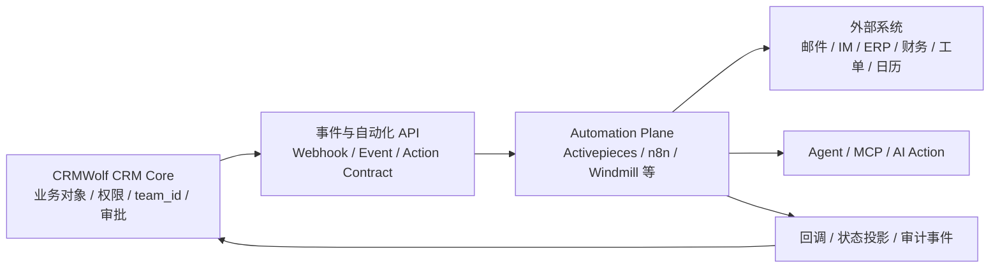
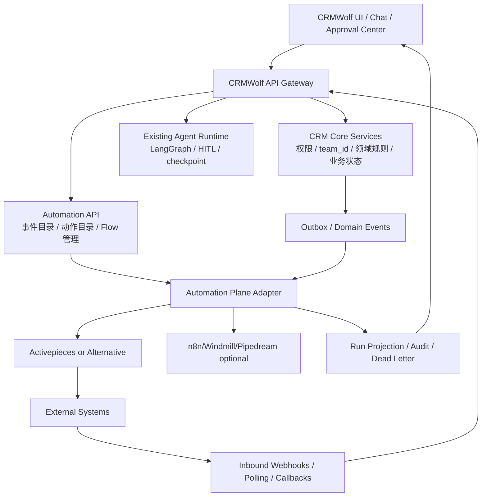

# CRMWolf 是否引入工作流 / 自动化编排层：Activepieces 与成熟替代方案调研

- **调研日期：**2026-08-31
- **截止口径：**以 2026-08-31 能访问到的官方文档、官方源码、官方产品/法律页面为准；产品能力和连接器数量会持续变化，数量仅作为当日快照，不作为长期承诺。
- **目标：**评估 CRMWolf 是否应引入独立的工作流/自动化编排层，重点核实 Activepieces，并与 n8n、Temporal、Windmill、Pipedream、Zapier、Make 对比。
- **资料边界：**只采用厂商官方文档、官方源码仓库、官方许可/合同页面和官方产品页面；没有使用第三方测评、博客或社区二手比较。Activepieces 官方 Community 论坛公告仅用于补充审批产品变更背景，并单独标注。
- **结论性质：**能力和许可章节是官方资料归纳；对 CRMWolf 的适配判断、架构建议和采购排序是基于本仓库代码/文档与上述资料作出的架构推论，不是厂商承诺。

## 一、执行摘要

### 1. 结论：应该引入“自动化能力层”，但不要把现有 CRM 核心流程整体外包给第三方编排器

CRMWolf 的下一阶段确实会遇到一个边界：当前系统擅长 CRM 内部业务、Agent、确认、审批和审计，但“连接其他系统、按事件或时间触发、暂停等待人工、失败重试、把 Agent 接到外部工具”会不断产生横向基础设施需求。把这些能力抽象成独立的 **Automation Plane（自动化能力层）** 是合理方向。

建议采用 **旁车（sidecar）+ 明确边界**，而不是现在就把 LangGraph、CRM API 和第三方工作流引擎混成一个运行时：



**CRM Core 仍然是业务事实来源（system of record）**；自动化平台只负责触发、编排、连接、等待和重试。任何影响客户、商机、合同、回款、发票、License 的写入，都必须回到 CRMWolf 的受控 API，经过当前用户/服务身份、`team_id`、权限、幂等、审批和审计规则。

### 2. Activepieces：最适合先做 CRMWolf 的自托管 POC，但要确认企业能力和嵌入许可

截至本次调研，Activepieces 的官方定位已经从“开源 Zapier 替代”扩展为 **AI automation / agents + flows + MCP + tables**。它提供 Docker / Docker Compose / Kubernetes 自托管、可视化 Flow、Webhook/轮询/定时触发、HTTP/Code/分支/循环、自动重试、暂停/人工审批、AI Agent、MCP，以及 Piece 连接器扩展。官方连接器目录在 2026-08-31 的页面快照显示为 **761 pieces**，包括 HubSpot、Pipedrive、Schedule Trigger、Webhook、HTTP、Human Input、Todos、MCP 等。

它和 CRMWolf 的匹配点很强：

- 自托管、网络隔离和数据留存边界较容易纳入企业部署；
- TypeScript Piece SDK 适合由 CRMWolf 团队维护一个一等的 `CRMWolf` Piece；
- Flow / Agent / MCP 的组合正好覆盖“系统打通 + 用户定时提醒 + Agent 对接外部系统”；
- Durable Execution、按失败步骤恢复、人工暂停和运行日志比自行开发一套通用自动化引擎更省时间。

但它不是“接上就完成产品化”的魔法：

- 官方 GitHub 许可文件明确将 `packages/ee/` 等企业目录与社区核心区分开：核心区是 MIT，企业区是商业许可；官网营销页的“MIT/open source”不能替代对实际使用版本和企业功能的法律核对；
- “把整个 Builder 嵌入 CRMWolf、让每个 CRM 租户都能建立自动化、白标、SSO/SCIM、细粒度治理”等能力涉及 Enterprise/Embedding 方案，不应按 Community Edition 推断；
- Piece 数量不等于每个连接器都具备 CRM 所需的事件覆盖、分页、批量、幂等、错误语义和中国区 SaaS 适配；
- 外部引擎的凭据、租户、运行历史、执行身份和 CRM 权限若没有先设计清楚，容易出现“自动化绕过 CRM 业务规则”的安全漏洞。

**建议：**Activepieces 值得作为第一候选进行 2–4 周技术 POC，但 POC 目标应是验证“CRMWolf 作为受控业务系统接入自动化层”，不是验证“把 Activepieces UI 直接卖给客户”。

### 3. 方案选择不是单一排名，而是按产品目标分层

| 方案 | 最适合的角色 | 对 CRMWolf 的初步判断 |
|---|---|---|
| **Activepieces** | 自托管、可视化自动化、AI/MCP、较低门槛的产品旁车 | **第一候选 POC**；适合提醒、跨系统同步和轻量 Agent 动作；需核对 EE/Embed 许可与连接器质量 |
| **n8n** | 成熟的可视化集成和 AI 工作流，开发者生态强 | **强替代候选**；能力丰富、连接器多；Sustainable Use License 对“把 n8n 作为客户可用能力/产品的一部分”需重点审查 |
| **Windmill** | 代码优先的内部平台、脚本、工作流、应用和 AI Agent | **工程团队优先候选**；适合复杂内部自动化和自定义 API；AGPL/自托管企业许可、运维和开发者门槛需评估 |
| **Pipedream** | 云端 API/连接器基础设施、面向终端用户的 Connect、MCP | **客户连接器/Agent 接入强候选**；不用自建连接器和 OAuth，但官方产品是托管型，数据驻留和供应商依赖明显 |
| **Temporal** | 代码优先的长事务、可靠执行、核心业务编排 | **不是 Zapier 替代品**；适合未来把关键跨系统业务做成可证明的 durable workflow，但不能解决连接器目录和低代码用户编排 |
| **Zapier** | 非技术用户快速做 SaaS 自动化 | **市场基准/客户可选出口**；连接器和易用性强，但云端、任务计费和产品内嵌控制不适合作为 CRMWolf 的核心运行时 |
| **Make** | 可视化、分支较丰富、企业用户自助自动化 | **市场基准/外部集成出口**；3,000+ 应用与可视化能力强，但云端、按 credits 计量，适合作为客户已有工具而非 CRMWolf 内核 |

### 4. 最重要的产品判断：先做“自动化合同”，再做“画布”

不建议第一步就做一个让用户拖拉节点的 Workflow Builder。第一步应先定义 CRMWolf 的 **Automation Contract**：

- 可触发的 CRM 事件：客户创建/更新、跟进记录提交、商机阶段变化、审批通过/驳回、回款到期、License 状态变化等；
- 可调用的 CRM 动作：创建任务、更新允许字段、追加跟进、发送审批、请求 Agent 建议等；
- 可读字段和可写字段；
- 当前用户、团队、租户、服务身份和权限范围；
- 幂等键、版本号、重复事件和重试语义；
- 回调状态、错误分类、人工审批和审计事件；
- 跨系统数据映射与脱敏策略。

没有这个合同，任何第三方工具都会把 CRM 当成“一个有 HTTP API 的数据库”，最终用户能成功连上系统，但流程不可治理、不可审计、不可安全演进。

---

## 二、CRMWolf 当前业务与架构基线

### 2.1 当前系统已经有“内部编排”，缺的是面向外部系统的通用自动化边界

本仓库已有的 Agent 设计并不是没有编排能力。`CRM-Docs/design-agent/foundations/architecture-boundary.md` 已规定：

- LangChain 负责模型调用、结构化输出和受控 tool-calling；
- LangGraph 负责 root graph、domain subgraph、checkpoint、thread、interrupt/resume、conditional edge 和 streaming；
- Agent Runtime 负责入口、tool 执行、guardrails、幂等、结果标准化和事件投影；
- CRM API 负责真实业务读写、权限、审批和通知；
- Agent 不得直接访问 CRM CRUD/model/table，不得绕过 CRM API，不得由 AI 直接决定写入。

`CRM-Docs/design-agent/foundations/product-positioning.md` 又明确了客户 → 商机 → 合同 → 回款计划 → 登记回款 → 发票 → License 的主链路，以及商机推进、跟进记录、上下文查询和用户确认的优先级。

所以未来引入工作流时，应该把问题拆成两个层次：

1. **CRM 内部业务工作流：**继续由 CRMWolf 的业务服务和 LangGraph/Agent Runtime 负责，确保业务规则、审批和状态机有单一事实来源；
2. **外部自动化编排：**由 Automation Plane 负责把 CRM 事件连接到外部系统，或把外部事件带回 CRM。

两者可以互相触发，但不能各自拥有一套“商机审批状态”或“回款最终状态”。

### 2.2 最值得自动化的 CRM 场景

按价值和风险排序，建议优先考虑：

#### A. 低风险通知和提醒（首个可交付范围）

- 每天/每周提醒销售处理逾期跟进任务；
- 商机超过 N 天没有活动时通知负责人；
- 合同审批通过后提醒部署/License 信息补齐；
- 回款计划临近到期时通知销售和财务；
- 重要审批待办同步到企业微信/飞书/钉钉/Slack/Teams/邮件；
- 每周把团队经营摘要发送到指定群组。

这类场景可以验证 Schedule、查询、条件、通知、失败重试和运行历史，写入风险较低。

#### B. 跨系统同步

- CRM 新客户/商机同步到 ERP、营销、客服、项目交付或财务系统；
- 外部工单、会议、邮件、表单、支付事件进入 CRM；
- CRM 状态变化驱动日历、任务管理、消息系统；
- 通过 HTTP/API/CSV/数据库/队列连接没有官方 Piece 的内部系统。

这类场景的关键不是“有没有连接器”，而是事件顺序、重复投递、字段映射、删除语义、权限和回滚。

#### C. Agent 作为受控动作执行器

- Agent 读取 CRM 上下文后，调用日历、邮件、消息、工单或知识库；
- Agent 生成跟进草稿，但发送前进入 CRM 审批中心；
- Agent 读取外部系统信息，回写结构化活动或建议；
- Agent 根据业务规则调用一个“申请同步/发起提醒/创建外部任务”的受控动作，而不是直接暴露整个外部 API。

对 CRMWolf 来说，MCP 可以是工具发现和调用协议，但不是权限模型，也不是业务审批模型。CRM 仍需在工具代理层实施 allowlist、租户范围、字段脱敏、读写分离和 HITL。

#### D. 高风险自动写入（后置范围）

- 自动修改商机金额、阶段、负责人；
- 自动创建合同、回款计划或 License；
- 自动执行退款、价格例外或财务动作；
- 自动向客户发送承诺性、法律性或报价性内容。

这些场景必须有明确的业务命令、审批策略、幂等和审计，不应因为工作流平台支持“HTTP Request”就直接开放。

---

## 三、能力维度与评价口径

本次比较使用以下能力维度：

1. **产品定位：**低代码 SaaS 自动化、开源/自托管平台、代码优先 durable execution，还是嵌入式连接器基础设施；
2. **部署与许可：**云端、自托管、网络隔离、开源许可、企业功能和嵌入/再分发限制；
3. **触发器：**Webhook、Polling、应用事件、定时、消息队列、数据库变更、人工输入和 API；
4. **动作：**预置连接器、HTTP、Code、脚本、子流程、分支、循环、并行和数据转换；
5. **可靠性：**超时、自动重试、指数退避、断点/步骤级恢复、补偿、失败队列、错误处理和可重放；
6. **审批/等待：**固定延迟、长时间暂停、人工批准、回调 URL、多人审批、超时和拒绝分支；
7. **AI：**AI 步骤、Agent、工具调用、MCP、AI 生成工作流、结构化输出、人工监督；
8. **连接器：**CRM、邮件、IM、日历、数据库、HTTP/自定义 API，以及维护和认证负担；
9. **CRM 适配：**多租户、权限、业务事实、幂等、审计、嵌入、用户自定义和运营成本。

需要特别区分：

- “有 Retry 选项”不等于“对外部副作用安全可重试”；
- “有 Approval/Wait”不等于“能够复用 CRMWolf 的审批中心”；
- “支持 MCP”不等于“自动拥有 CRMWolf 的 team_id 和字段级权限”；
- “有 CRM 连接器”不等于“支持 CRMWolf 的领域语义”。

---

## 四、Activepieces 评估

### 4.1 定位

Activepieces 官方 README 将其描述为 Zapier 的开源替代，并在当前产品资料中进一步定位为 AI automation platform：Flow、Agent、Table、MCP 可以组合，Agent 可以调用 Flow，Flow 可以运行 Agent，两者可以读写同一项目中的表。官方 Welcome 页面同时强调自然语言构建 Agent/Automation、Bring Your Own AI keys、自托管和治理能力。

官方资料：

- https://github.com/activepieces/activepieces
- https://www.activepieces.com/docs/overview/welcome
- https://www.activepieces.com/open-source
- https://www.activepieces.com/product/ai-agent-builder

### 4.2 部署与许可

官方安装文档提供：

- Docker Compose + PostgreSQL + Redis 的自托管方式；
- Kubernetes/Helm；
- Cloud 托管；
- Docker 一容器快速启动方式适合试用/开发。

官网 Deployment & Cost 页面强调 Cloud 或 Self-Hosted 均不按 executions 收费，Pricing 页面则显示 Cloud Standard 按 active flow 定价、Community Edition 自托管为核心功能。需要以实际合同和版本为准。

许可必须精确区分：

- GitHub `LICENSE` 文件写明，`packages/ee/` 和 `packages/server/api/src/app/ee`（若存在）按 `packages/ee/LICENSE` 的许可执行；上述目录外、在其他限制之外的内容按 MIT Expat 执行；
- GitHub README 将 Community Edition 标为 MIT，并说明 enterprise features 使用 Commercial License；
- 官网的“MIT Licensed”营销表述指向核心/社区版本，不能据此推断所有企业、治理、嵌入和白标能力都属于 MIT。

官方资料：

- https://www.activepieces.com/docs/install/overview
- https://www.activepieces.com/product/deployment-options
- https://www.activepieces.com/pricing
- https://github.com/activepieces/activepieces/blob/main/LICENSE
- https://github.com/activepieces/activepieces/blob/main/README.md

### 4.3 触发器与动作

Flow 由 Trigger + Actions 构成。官方 Building Flows 文档列出 Schedule Trigger、Webhook Trigger 和基于服务事件的 Event Trigger。Piece SDK 的官方文档区分 Polling、Webhook 和 App Webhook/Subscription 触发技术；当前文档仍提示部分开发者级 App Webhook 场景可能需要用 Polling 作为替代。

动作层包含：

- 外部服务动作；
- HTTP；
- Code/TypeScript 与 npm 依赖；
- 分支、循环、子流程；
- AI 动作/Run Agent；
- 人工输入、Approval/To-Do；
- Flow 版本和测试运行。

官方资料：

- https://www.activepieces.com/docs/flows/building-flows
- https://www.activepieces.com/docs/build-pieces/piece-reference/triggers/overview
- https://github.com/activepieces/activepieces/blob/main/README.md
- https://www.activepieces.com/pieces

### 4.4 重试、暂停和可靠性

官方 Durable Execution 文档说明：每次 Flow Run 会记录已完成步骤的输入、输出、状态、耗时和错误；Worker 崩溃、部署、长暂停和重试后，系统可以复用已完成步骤结果，从第一个未完成步骤继续，而不是从 Trigger 重新产生副作用。

官方 MCP Tools Reference 还暴露了失败运行的两种重试策略：

- `FROM_FAILED_STEP`：从失败步骤继续并保留之前的输出；
- `ON_LATEST_VERSION`：使用当前发布版本重新运行整个 Flow。

这对 CRM 同步很有价值，但需要在 Piece 元数据中声明动作是否幂等；官方 2026 年 8 月 Changelog 已提到 AI metadata 中包含 idempotency declaration，用于 AI 发现和安全重试。这个方向与 CRMWolf 的幂等键设计吻合，但不能代替 CRMWolf API 自己的幂等保护。

官方资料：

- https://www.activepieces.com/docs/install/architecture/durable-execution
- https://www.activepieces.com/docs/mcp/tools
- https://www.activepieces.com/docs/about/changelog

### 4.5 审批与人工输入

Activepieces 官方资料把 Human in the Loop 定义为在自动化和人工审批之间暂停：AI 先分析、生成或决定，To-Do/人工步骤要求人审核、修改或拒绝，随后 Flow 再继续。Piece 目录包含 Human Input、Todos 等与人工动作相关的 Piece。2026 年 1 月的官方 Community 公告又说明其审批能力逐步移动到 Slack、Discord、Telegram、Teams、Outlook、Gmail 等工作位置；这属于官方产品公告，具体可用性仍应按当前版本和部署方式验证。

对 CRMWolf 的意义：Activepieces 可以承担“等待外部人员批准”的执行暂停，但 CRMWolf 自己的审批中心仍应是 CRM 业务审批的权威入口。最佳集成方式是：自动化平台发起 CRM 审批 → CRMWolf 创建审批任务 → 用户在 CRM 审批中心处理 → CRM 通过回调/事件恢复外部 Flow。

官方资料：

- https://www.activepieces.com/resources/glossary/human-in-the-loop-ai
- https://www.activepieces.com/pieces
- https://community.activepieces.com/t/approvals-are-moving-where-you-actually-work/11471

### 4.6 AI、Agent 和 MCP

当前 Activepieces 的 AI 能力包括：

- Ask AI、Summarize Text、Classify Text、Extract Structured Data；
- Run Agent，可通过工具完成多步任务；
- Agent 与 Flow 互相调用；
- 内置 MCP Server，让 AI 客户端通过自然语言创建/修改/测试 Flow、管理表和查看运行；
- 2026 年 8 月 Changelog 中新增/强化了面向 AI 的 action/trigger semantic tool search、AI metadata、agent/human audience 和 output schema。

MCP 官方文档特别强调：OAuth 认证、凭据不会通过工具返回、按 project scope 限定操作。对 CRMWolf 来说，这说明 Activepieces 很适合作为“工具目录和自动化执行器”，但 CRMWolf 仍需将自己的 CRM 动作做成显式 Piece/HTTP API，并在服务端实施业务授权。

官方资料：

- https://www.activepieces.com/mcp/ai
- https://www.activepieces.com/docs/mcp/overview
- https://www.activepieces.com/docs/mcp/tools
- https://www.activepieces.com/docs/about/changelog

### 4.7 连接器与 CRM 适配

Activepieces 官方连接器目录在本次快照显示 761 pieces，目录包含 HubSpot、Pipedrive、邮件、日历、Webhook、HTTP、MCP、人工输入等，并按 Sales and CRM 分类。Piece 以 TypeScript/npm 包和 SDK 扩展，适合 CRMWolf 团队写一个官方/私有 `piece-crmwolf`，将以下能力显式暴露：

- Triggers：客户、活动、商机、审批、回款等领域事件；
- Actions：查询、创建任务、写入跟进、请求审批、触发同步；
- Auth：按工作区/租户配置的 OAuth/API token；
- Output schema：稳定的业务结果协议；
- AI metadata：告诉 Agent 哪些动作只读、哪些有副作用、是否幂等。

**优点：**自定义 Piece 的开发体验、可视化连接、HTTP/Code 兜底、AI/MCP 对接和自托管能力都贴合 CRMWolf。

**缺点/风险：**连接器维护由第三方生态分担，但关键 CRM 语义、权限和幂等仍必须由 CRMWolf 自己维护；用户若能直接使用通用 HTTP/Code，可能绕过 CRM 业务边界；运行历史和凭据需要纳入租户隔离、脱敏和数据保留策略。

### 4.8 Activepieces 对 CRMWolf 的判断

| 维度 | 判断 |
|---|---|
| 外部系统打通 | 强；Webhook/HTTP/Pieces/Code 足够覆盖大多数 SaaS 与内部 API |
| 定时提醒 | 强；Schedule Trigger + CRM 查询 + 条件 + 通知适合首个场景 |
| 长等待/人工审批 | 中强；有 HITL/暂停能力，但 CRM 业务审批不应迁移到其内部状态 |
| Agent 对接外部系统 | 强；Run Agent + MCP + AI metadata 方向明确 |
| CRM 领域语义 | 中；需要自建 CRMWolf Piece 和 Automation Contract |
| 自托管/数据控制 | 强；Docker/Helm，适合内网/网络隔离 |
| 产品化嵌入 | 中；官方有 Embed，但指向 Enterprise，应单独谈许可和隔离模型 |
| 运行可靠性 | 中强；Durable Execution 和失败步骤恢复可用，但仍需验证并发、队列、租户和副作用幂等 |
| 对现有 LangGraph 的替代性 | 低；它不是 CRMWolf Agent 的直接替代，应该先作为外部自动化旁车 |

**结论：**Activepieces 是目前最值得 CRMWolf 先做 POC 的方案；首期不要启用“任意用户任意 Code/HTTP”，而是只提供 CRMWolf Piece、允许的外部 Pieces、受控 HTTP 域名和审批回调。

---

## 五、成熟替代方案评估

## 5.1 n8n

### 定位与部署/许可

n8n 是成熟的可视化工作流和 AI 自动化平台，提供 Cloud 和 Self-hosted。官方文档索引包含内置节点、触发器、Flow Logic、AI Agent、MCP、部署、环境、凭据、队列模式、SSO 和错误处理等完整产品面。

许可不是 MIT/Apache：

- 官方 Sustainable Use License 文档称 n8n 使用 Sustainable Use License 和 n8n Enterprise License，属于 fair-code 模型；
- Sustainable Use License 允许内部业务或非商业/个人使用，但对向第三方收费提供、再托管、把软件/界面作为外部产品能力提供等场景有限制；
- 官方法律页面另有 Enterprise、Embed 和商业条款。

对 CRMWolf 来说，这个差异很关键：**内部部署 n8n 作为 CRMWolf 自己的后台工具，与把 n8n Builder 或执行能力作为多租户 CRM 产品功能交给客户，不是同一个许可问题。**必须在采购/法务阶段确认。

官方资料：

- https://docs.n8n.io/hosting/
- https://docs.n8n.io/privacy-and-security/sustainable-use-license
- https://github.com/n8n-io/n8n
- https://n8n.io/legal/
- https://n8n.io/legal/eula/

### 触发器、动作、重试和审批

官方文档和集成目录显示：

- Webhook、Schedule Trigger、应用 Trigger、Email、队列等；
- 内置节点、HTTP、Code、子工作流、If/Switch、循环、Wait；
- 官方集成目录在本次快照显示 **1,905 integrations**，覆盖 Sales、CRM、AI、MCP、数据库、邮件、IM 等；
- 节点支持 Retry on Fail，另有 Error Trigger、错误工作流和 Wait；
- AI Agent 可以连接工具，官方文档包含 Human fallback for AI workflows 与 Human-in-the-loop for tool calls；具体连接器动作（例如 Gmail 的“Send a message and wait for approval”）可以作为人工审核点。

官方资料：

- https://n8n.io/integrations
- https://docs.n8n.io/flow-logic/error-handling/
- https://docs.n8n.io/flow-logic/waiting/
- https://docs.n8n.io/integrations/builtin/core-nodes/n8n-nodes-base.scheduletrigger/
- https://docs.n8n.io/integrations/builtin/app-nodes/n8n-nodes-base.gmail/message-operations/
- https://docs.n8n.io/advanced-ai/

### CRM 适配优缺点

**优点：**生态和连接器数量强；可视化编排成熟；HTTP/Code/社区节点能覆盖长尾系统；AI Agent、MCP、HITL 资料完整；Self-hosted 适合开发团队。

**缺点：**许可对嵌入式产品、多租户和对外提供访问有明显边界；不同计划的项目共享、RBAC、SSO、审计、环境和队列能力需要核对；节点共享凭据的权限语义要特别小心；用户直接修改 Code/HTTP 可能绕过 CRMWolf 的领域规则。

**适用判断：**若 CRMWolf 主要是内部部署，并且希望团队使用一个成熟的视觉编排器，n8n 是 Activepieces 的强替代；若目标是把编排器作为 CRM 的白标能力出售，需先解决许可和隔离，不应把 Community/Self-hosted 的默认许可当成 Embed 许可。

---

## 5.2 Temporal

### 定位

Temporal 官方定位是 **durable execution platform**，不是面向非技术用户的 Zapier/Make 式连接器目录。Workflow 用 Go、Java、TypeScript、Python 等语言编写，Activity 承担 API、数据库、LLM 和文件等外部副作用；Workflow Event History 是恢复和重放的事实依据。官方服务端源码和 TypeScript SDK 为 MIT。

官方资料：

- https://docs.temporal.io/workflows
- https://docs.temporal.io/activities
- https://github.com/temporalio/temporal
- https://github.com/temporalio/temporal/blob/main/LICENSE
- https://github.com/temporalio/sdk-typescript/blob/main/LICENSE

### 触发器、动作、重试、审批和定时

Temporal 的“动作”不是预制 SaaS 节点，而是开发者编写的 Activity/Child Workflow。它的优势在于：

- Activity timeout、heartbeat、Retry Policy；
- Worker 崩溃、部署、网络问题后从事件历史恢复；
- Timer 持久化，等待数年也不占 Worker 资源；
- Schedule 支持 interval、calendar/cron、时区、重叠策略、catch-up、backfill、pause-on-failure 等；
- Workflow 可接受 Query、Signal、Update：分别适合读、异步写和有结果/校验的同步写；
- 审批不是内置低代码 Approval 节点，而是通过 Signal/Update + Timer + Activity 通知实现应用级人机协作。

官方资料：

- https://docs.temporal.io/encyclopedia/failures-and-error-handling
- https://docs.temporal.io/schedule
- https://docs.temporal.io/workflow-execution/timers-delays
- https://docs.temporal.io/encyclopedia/workflow-message-passing
- https://docs.temporal.io/cloud

### CRM 适配优缺点

**优点：**长事务、跨多个系统的关键业务流程、审批等待、补偿、重试、事件历史和强可观测性非常强；适合合同审批、回款确认、License 发放、客户 onboarding 等需要多年演进和明确代码所有权的流程。

**缺点：**没有现成的 700/1,000/3,000 个连接器目录；需要开发 Worker、Activity、部署、版本兼容和业务 UI；不适合让 CRM 终端用户直接拖拉自定义简单提醒；如果 CRMWolf 已经用 LangGraph 承担 Agent checkpoint/interrupt/resume，再引入 Temporal 会产生两套 durable runtime，需要明确谁是权威。

**适用判断：**Temporal 应作为 CRMWolf **核心长事务/可靠执行的潜在底座**，而不是 Activepieces/n8n 的直接替代。短期不建议和现有 LangGraph 同时引入；如果后续需要把关键业务流程独立成平台级长期运行服务，再做专项评估。

---

## 5.3 Windmill

### 定位与部署/许可

Windmill 官方定位为开源、可自托管的 **workflow engine + developer platform**，把脚本、API、工作流、内部应用、数据流水线和 AI Agent 放在一起。支持 TypeScript、Python、Go、Bash、SQL 等多种语言，既有 Web IDE/Low-code Flow Editor，也支持 YAML、CLI、Git Sync 和本地开发。

官方自托管文档说明生产部署由 PostgreSQL、Server、Worker 组成，可用 Docker Compose 或 Kubernetes/Helm。GitHub 仓库标注 AGPL-3.0，同时保留 Apache-2.0 许可文件；企业自托管又通过 `windmill-ee` 和 license key 提供额外企业能力，许可和计量要按实际组件核对。

官方资料：

- https://www.windmill.dev/docs/intro
- https://www.windmill.dev/docs/advanced/self_host
- https://github.com/windmill-labs/windmill
- https://www.windmill.dev/docs/enterprise/plans_details
- https://www.windmill.dev/terms/2025-12-01

### 触发器、动作、重试、审批和 AI

官方资料显示：

- Schedule、Webhook、Email、WebSocket、Postgres CDC、Kafka、NATS、SQS、MQTT、GCP Pub/Sub、原生 Google Drive/Calendar/Nextcloud、CLI/API、MCP 等触发方式；
- 任意脚本可以成为 API、UI、定时任务或共享工具；
- Flow 由脚本构成，支持分支、循环、并行、子任务；
- 步骤支持固定重试、指数退避、最大尝试次数和 Continue on Error；
- Suspend/Approval 可以生成每个审批人的 resume URL，指定需要几个批准事件，并配置超时、拒绝分支；等待审批不占 Worker slot；
- AI Agent step 支持多模型提供商、MCP 工具、结构化输出、Flow 内 Agent 和最多两级嵌套 Agent；
- AI Flow Chat 可用自然语言创建和修改 Flow，AI Sessions 可生成、审查和部署项目。

官方资料：

- https://www.windmill.dev/docs/platform/triggers
- https://www.windmill.dev/docs/flows/retries
- https://www.windmill.dev/docs/flows/flow_approval
- https://www.windmill.dev/docs/core_concepts/workflows_as_code
- https://www.windmill.dev/docs/core_concepts/ai_agents
- https://www.windmill.dev/docs/core_concepts/ai_generation

### CRM 适配优缺点

**优点：**对工程团队友好；复杂逻辑可以直接写代码；自定义 CRM API、数据库和队列很自然；脚本自动生成 API/UI；审批、重试、长时间暂停、版本、Git、审计和 Worker 隔离完整；比纯 no-code 工具更适合内部运营平台。

**缺点：**面向终端 CRM 用户的低代码体验和连接器生态不是其最强卖点；AGPL/企业许可对闭源产品嵌入与派生部署需要法务确认；多个语言、脚本、资源、Worker 和 Git workspace 会增加平台治理复杂度；若目标只是简单提醒，可能过度建设。

**适用判断：**如果 CRMWolf 未来要成为“CRM + 内部运营自动化平台”，且主要用户是有工程支持的企业团队，Windmill 值得与 Activepieces 并行 POC；如果目标是业务人员自助搭流程，Activepieces/n8n 的低代码体验更直接。

---

## 5.4 Pipedream

### 定位与部署/许可

Pipedream 官方定位更接近 **serverless workflow + integrations/Connect platform**：提供托管运行时、Workflow Builder、应用认证和面向产品/Agent 的 Connect SDK。官方 Connect 文档强调可以把预构建的 triggers/actions、Managed Auth、Connect Proxy 和复杂工作流嵌入自己的 SaaS 或 AI Agent，并以 10,000+ tools、3,000+ APIs 为当前产品口径。

官方 Workflow 文档把它描述为无需自建服务器/基础设施的工作流；本次资料没有看到官方自托管发行版文档，官方历史帮助帖明确回答“目前不提供 self hosting”。因此它应按云端供应商评估，而不是按自托管引擎评估。

官方资料：

- https://pipedream.com/docs
- https://pipedream.com/docs/workflows
- https://pipedream.com/docs/connect
- https://pipedream.com/docs/connect/components
- https://pipedream.com/docs/connect/managed-auth/quickstart
- https://pipedream.com/docs/connect/mcp
- https://pipedream.com/community/t/can-i-install-pipedream-on-my-own-linux-server/2922

### 触发器、动作、重试、审批和 AI

官方资料显示：

- HTTP/Webhook、Schedule/Cron、Email、RSS、应用 Event Sources；一个 Workflow 可以有多个 Trigger；
- 预构建 Actions + Node.js/Python/Go/Bash Code；支持 If/Else、Filter、Delay、End Workflow，更多并行/循环能力仍应按当前版本核对；
- Advanced plan 的 Auto-retry 会从失败步骤重试，最多 8 次、10 小时窗口、指数退避；Step 和 Workflow 错误均可通知或接入错误处理 Workflow；
- `$.flow.delay` 可暂停 1ms 到 1 年，`$.flow.suspend` 可生成 resume/cancel URL，人工批准或外部系统回调后恢复，默认 24 小时超时；
- Pipedream Connect 可以为终端用户管理 OAuth/API key，并把预构建工具直接提供给应用或 Agent；Pipedream MCP 提供 10,000+ tools、OAuth 和加密凭据存储。

官方资料：

- https://pipedream.com/docs/workflows/building-workflows/triggers
- https://pipedream.com/docs/workflows/building-workflows/control-flow
- https://pipedream.com/docs/workflows/building-workflows/settings
- https://pipedream.com/docs/workflows/building-workflows/errors
- https://pipedream.com/docs/workflows/building-workflows/code/nodejs/rerun
- https://pipedream.com/docs/connect/use-cases
- https://pipedream.com/docs/connect/mcp/users

### CRM 适配优缺点

**优点：**如果 CRMWolf 的核心痛点是“让每个客户连接 Salesforce/HubSpot/Slack/Google/ERP，而不是我们自己实现几千个 OAuth 和 API 适配”，Pipedream Connect 很有吸引力；Managed Auth、用户级 account、预构建工具、MCP 和 CRM sync 用例都直接命中需求。

**缺点：**云端数据、凭据和执行链路引入供应商依赖；无法按 CRMWolf 的要求把运行时放到私有网络；第三方工具数量多但 Agent 工具选择、最小权限、写入确认和租户隔离仍需 CRMWolf 包装；Workflow 自身更偏 serverless/开发者体验，复杂状态机和长期强一致业务不如 Temporal。

**适用判断：**如果 CRMWolf 的商业战略是“嵌入式集成市场/用户连接器”，Pipedream Connect 应进入第二阶段评估；如果客户要求私有化、内网或数据不出域，不应作为唯一方案。

---

## 5.5 Zapier

### 定位与部署

Zapier 是最成熟的消费级/业务用户自动化品牌之一，核心是 Zap：Trigger + Actions + Paths/Filters/Formatter/Delay 等。官方 2026 文档显示 Zapier 同时提供 Zaps、Tables、Forms、Chatbots、Canvas、Agents 等产品资产，Agent 可以由 Schedule by Zapier、应用事件、Zap 或 MCP 触发。

官方资料定位为云端 SaaS 自动化产品；本次资料未发现官方自托管部署路径。因此应把 Zapier 视为：

- 客户可能已经在使用的外部自动化平台；
- CRMWolf 可以通过 Webhook/API/官方 App 接入的生态；
- 产品设计和连接器数量的市场基准。

官方资料：

- https://help.zapier.com/hc/en-us/articles/8496181725453-Learn-key-concepts-in-Zap-workflows
- https://help.zapier.com/hc/en-us/articles/8496288648461-Schedule-Zap-workflows-to-run-at-specific-intervals
- https://help.zapier.com/hc/en-us/articles/8495924437005-Control-when-your-Zap-runs
- https://help.zapier.com/hc/en-us/articles/8496037690637-How-to-troubleshoot-errors-in-Zaps
- https://help.zapier.com/hc/en-us/articles/19220226086797-What-is-replay
- https://help.zapier.com/hc/en-us/articles/45394909914381-Set-up-your-agent-s-trigger

### 触发器、动作、重试和 AI

官方资料显示：

- Schedule by Zapier 支持小时、天、周、月和自定义频率；
- Delay 支持 Delay for、Delay until、Delay after queue；
- Autoreplay 可重试失败步骤，官方资料写明最多 5 次，且不同计划可用性不同；
- 可手动 Replay 失败步骤，错误处理器可转到替代路径；
- Agent 支持按需、定时、应用触发、Zap/MCP 触发；
- Zapier 的 AI、Agents、MCP 和 9,000+ apps（官方帮助文档口径）适合非技术用户快速搭建跨 SaaS 流程。

### CRM 适配优缺点

**优点：**非技术用户学习成本低；连接器和模板丰富；对销售、营销、表单、邮件、日历等简单自动化很友好；客户可能已经有 Zapier 经验。

**缺点：**云端和任务计量；长事务、复杂分支、强审计、多租户内嵌和 CRM 领域状态机不是核心优势；审批通常依赖外部应用/Agent/表单组合，不应直接当作 CRMWolf 业务审批中心；如果 CRMWolf 把 Zapier 作为核心运行时，将受平台价格、限额、连接器版本和数据保留策略制约。

**适用判断：**提供 CRMWolf Webhook/API，让客户可在 Zapier 中使用，是低成本生态策略；不建议采购 Zapier 作为 CRMWolf 自己的工作流后端。

---

## 5.6 Make

### 定位与部署

Make 官方定位为 visual automation platform，使用 Scenario、Module、Webhook、Router/Filter 和数据映射构建跨应用流程；当前产品页强调 **3,000+ pre-built apps**、Custom Apps、Make Code、AI Toolkit、AI Agents、MCP Server/Client 和 Make Grid。

官方资料显示它是云端平台，按 credits/operations/计划计量；本次资料未发现官方自托管发行版。与 Zapier 相比，Make 更突出可视化数据流、分支和复杂 Scenario。

官方资料：

- https://www.make.com/en/product
- https://www.make.com/en/integrations
- https://www.make.com/en/ai-agents
- https://help.make.com/schedule-a-scenario
- https://help.make.com/scenario-settings
- https://help.make.com/retry-error-handler
- https://help.make.com/webhooks
- https://www.make.com/en/pricing

### 触发器、动作、重试、审批和 AI

官方资料显示：

- Schedule 支持 regular intervals、daily、weekdays、weekly、monthly、specified dates、on demand；
- Webhook 可以即时触发，也可以先入队后按计划批量处理；支持顺序处理、速率限制和队列；
- Scenario settings 支持 incomplete executions，把失败 bundle/剩余流程保存后手动或自动继续；Retry error handler 可以配置尝试次数和间隔；
- 通过 HTTP/Custom Apps 连接没有原生模块的 API；
- Make AI Agents 支持跨 3,000+ apps 运行可复用 Agent；Make Code 支持 JavaScript/Python；MCP Server/Client 可以让 Agent 访问工具和场景；
- 本次核查的官方资料没有将“CRM 业务审批中心”作为一个与 CRMWolf 对等的一等领域能力；人工审批应通过外部系统、Webhook 或自建模块实现。

### CRM 适配优缺点

**优点：**视觉化数据流和分支能力好；适合复杂同步、批量处理、队列、数据转换和已有 SaaS 生态；Custom Apps/HTTP 能覆盖内部系统；AI Agents 和 MCP 已进入产品主线。

**缺点：**云端、credits 计量和队列/日志留存需要运营预算；把 CRMWolf 的大批量事件送入 Make 必须设计速率、重复、失败和回放；企业内部/私有化需求不如自托管方案；审批和 CRM 领域权限需要由 CRMWolf 包装。

**适用判断：**与 Zapier 一样，适合把 CRMWolf 做成一个可连接 App，或允许客户自行选择 Make；不建议作为 CRMWolf 核心自动化运行时。若更看重视觉分支、数据流和 SaaS 生态，Make 是 Zapier 之外的重要市场基准。

---

## 五、方案横向能力矩阵

> “强/中/弱”是针对 CRMWolf 目标的相对判断，不是厂商官方评级。连接器数量使用官方页面当日口径，不能横向当作质量指标。

| 能力 | Activepieces | n8n | Temporal | Windmill | Pipedream | Zapier | Make |
|---|---|---|---|---|---|---|---|
| 主要形态 | 自托管/云 + Flow/Agent | 自托管/云 + Node/AI | 代码优先 durable execution | 自托管/云 + 脚本/Flow/App | 云端 Workflow/Connect | 云端 Zap/Agents | 云端 Scenario/Agents |
| 自托管 | 强 | 强 | 强 | 强 | 未提供官方自托管发行版 | 未发现官方自托管 | 未发现官方自托管 |
| 许可对 CRMWolf 嵌入 | 核心 MIT，EE/Embed 商业核对 | SUL/Enterprise/Embed 核对 | MIT 服务端/SDK | AGPL + 企业许可核对 | 商业托管服务 | 商业 SaaS/平台条款 | 商业 SaaS/平台条款 |
| Webhook/API | 强 | 强 | 需自建入口/Worker | 强 | 强 | 强 | 强 |
| 应用触发器 | 中强，Piece 生态 | 强，官方/社区节点多 | 需自行开发 Activity | 中，原生触发 + 脚本 | 强，Event Sources | 强 | 强 |
| 定时 | 强 | 强 | **很强**，Schedule/Timer/Overlap/Catch-up | 强 | 强 | 强 | 强 |
| Code/自定义 API | TS/HTTP | Code/HTTP/社区节点 | 任意支持语言 | 多语言脚本，**很强** | Node/Python/Go/Bash | 有限，依赖 Code/平台能力 | JS/Python/Custom App |
| 步骤级重试/恢复 | 强，Durable/failed step retry | 强，Retry/Error Workflow | **很强**，Activity/History/Policy | **很强**，backoff/checkpoint | 中强，计划相关，8 次/10h口径 | 中，Autoreplay/Replay | 强，Incomplete/Retry Handler |
| 长时间等待 | 强 | 强，Wait | **很强** | **很强** | 强，Delay/Suspend | 中，Delay | 中强，队列/Incomplete |
| 人工审批 | 有 HITL/To-Do/Approval | Wait/HITL 工具调用/应用动作 | 需自己用 Signal/Update/Timer 实现 | **很强**，Suspend/Approval URL | 强，Suspend/Resume URL | 组合式，非核心 CRM 审批 | 组合式，需外部实现 |
| AI Agent | 强 | 强 | 需自行集成/Activity | 强 | 强，Connect/MCP | 强，Agents | 强，AI Agents |
| MCP | 强，内置 MCP | 强，MCP 节点/Server | 可自行实现/集成 | 强 | **很强** | 支持 Agent/MCP 触发 | Server/Client |
| CRM 领域语义 | 需自建 Piece | 需自建 Node/封装 | 需自建 Activity/API | 需自建脚本/API | 需 CRMWolf 包装 Connect tools | 需官方 App/API | 需 Custom App/API |
| 多租户/嵌入 | Enterprise/Embed 核对 | Embed/商业核对 | 自己构建 | Workspace/RBAC/企业许可核对 | Connect 设计强 | Platform 条款核对 | Partner/App 方式，嵌入模型另行核对 |
| 适合 CRM 内核 | 否，旁车 | 否，旁车 | 未来可选 | 否，旁车/内部平台 | 否，外部连接基础设施 | 否 | 否 |

---

## 六、对 CRMWolf 的架构建议

### 6.1 推荐目标架构：双层编排，而不是双重业务事实



**职责边界：**

- CRMWolf Core：业务对象最终状态、权限、team_id、字段校验、审批规则、幂等和审计；
- Existing Agent Runtime：CRM 内部语义理解、需要确认的业务写入、对话线程和 LangGraph 恢复；
- Automation Plane：事件触发、调度、外部动作、等待、重试、连接凭据、外部系统适配；
- Adapter：将外部平台的 Flow/Run/Connection/Approval 映射成 CRMWolf 可理解的稳定协议；
- Run Projection：把执行状态、错误、重试、等待和关联 CRM 对象投影回来，但不反向成为 CRM 业务真相。

### 6.2 必须先定义的四个公共契约

#### A. Domain Event Contract

事件至少应包含：

```json
{
  "event_id": "evt_...",
  "event_type": "crm.opportunity.stage_changed.v1",
  "occurred_at": "2026-08-31T10:00:00Z",
  "tenant_id": "team_...",
  "actor": {"type": "user", "id": "..."},
  "subject": {"type": "opportunity", "id": "..."},
  "data": {"from_stage": "qualified", "to_stage": "proposal"},
  "schema_version": 1,
  "idempotency_key": "..."
}
```

不要把整个 CRM 数据库行作为默认事件；应按事件类型暴露最小必要字段，并允许 Flow 通过 CRMWolf API 读取有权限的最新上下文。

#### B. CRM Action Contract

动作应声明：

- `action_id` / 版本；
- read 或 write；
- 需要的资源和字段；
- 是否有外部副作用；
- 幂等键生成方式；
- 失败类型和可重试性；
- 是否必须审批；
- 输出 schema；
- 关联的 `team_id`、用户、CRM 对象。

例如不要暴露一个无边界的 `POST /api/anything`，而是暴露 `create_follow_up_task`、`request_opportunity_approval`、`send_customer_message_draft` 等受控动作。

#### C. Identity / Credential Contract

要分清三类身份：

1. 创建/编辑 Flow 的人；
2. 触发本次执行的 CRM 用户或系统事件；
3. Flow 调用外部系统时使用的连接账户。

默认不允许“Flow 创建者拥有所有执行权限”。CRM 动作必须带上原始 actor/tenant context，并由 CRM API 再授权；外部系统凭据应按租户、连接和用途隔离。

#### D. Run / Approval / Callback Contract

CRMWolf 应能看到：

- Flow ID、版本、Run ID、关联业务对象；
- 当前步骤、状态、开始/结束时间；
- retry count、错误分类、下一次 retry 时间；
- paused/waiting reason、审批人、deadline；
- 外部回调是否已消费；
- replay/retry 是否会重新执行副作用。

审批回调要使用一次性、短期、签名或 OAuth 保护的 token，并能关联到 CRM 审批任务，不要把第三方生成的裸 resume URL 直接当成 CRM 权限凭证。

### 6.3 选型建议：分两条产品路线

#### 路线 A：先解决“用户自定义提醒 + 跨系统轻自动化”

推荐：**Activepieces POC → n8n 作为对照**。

- 先做 5 个 CRM 原生事件和 8–12 个 CRM 动作；
- 提供 Schedule、Webhook、HTTP、邮件、IM、日历；
- Flow 只允许读 CRM、创建提醒/任务、发送草稿和请求审批；
- 在 CRMWolf 中显示 Flow 运行和审批关联；
- 暂时禁止任意 SQL、任意 CRM 数据库访问和未审查的 Code；
- 通过 POC 验证租户、凭据、幂等、失败恢复、数据驻留和升级成本。

#### 路线 B：未来成为“面向客户的集成与 Agent 平台”

推荐：**自建 Automation Contract + Pipedream Connect/自建连接层对比**。

- 重点不是给用户一个完整 n8n/Activepieces 画布，而是让客户连接自己的 SaaS；
- 客户连接账户、OAuth、scope、工具目录和 Agent Tool calling 是核心；
- Pipedream Connect 的 Managed Auth、预构建 tools、MCP 和 CRM sync 方向值得重点验证；
- 但高合规客户仍需要自托管/私有连接代理，不能只有云端路径。

#### 路线 C：未来把核心跨系统流程做成可靠业务执行

推荐：**保留 LangGraph 当前 Agent 编排，必要时专项引入 Temporal；不要双轨同时落地**。

- Temporal 用于合同、回款、License、客户 onboarding 等长事务；
- LangGraph 继续负责 Agent 对话、语义理解、HITL 和查询；
- 或者在确认 Temporal 能覆盖 Agent checkpoint/interrupt 后，再制定迁移边界；
- 不要让 Activepieces/n8n/Windmill 成为合同、回款或 License 的最终状态机。

### 6.4 是否自己开发一个 CRMWolf Workflow Builder

**当前不建议从零开发通用画布。**原因：连接器、OAuth、运行时、队列、暂停、重试、版本、审计、数据保留、权限、错误恢复和调试工具的总成本远高于画布本身。

但建议自己开发一个薄的 **CRMWolf Automation Control Plane**，至少包括：

- 事件目录；
- 动作目录；
- Flow/Connection/Run 的租户映射；
- 权限和 allowlist；
- 审批中心集成；
- 运行历史投影；
- 幂等/去重/死信；
- 选择和替换底层引擎的 Adapter。

如果经过 6–12 个月验证，用户真正需要的是高度 CRM 领域化的流程建模，而不是通用 SaaS 连接，那么再考虑自己做领域 Builder。

---

## 七、建议的 POC 设计

### 7.1 POC 范围

用 Activepieces 自托管 + CRMWolf 私有 Piece 完成以下流程：

1. **定时提醒：**每天 09:00 查询当前团队逾期跟进任务 → 按负责人分组 → 发送邮件/IM 摘要 → 记录 `notification_sent` 幂等键；
2. **事件通知：**商机阶段从 `qualified` 变为 `proposal` → 通知负责人和管理者 → 不直接修改商机；
3. **审批回调：**Flow 申请“发送客户跟进草稿” → CRMWolf 创建审批任务 → 用户在 CRMWolf 审批中心批准/驳回 → Flow 继续/结束；
4. **外部同步：**客户创建事件 → HTTP/Piece 写入一个沙盒外部系统 → 模拟 429、503、重复事件和超时 → 检查重试与幂等；
5. **Agent 工具：**Agent 只能调用 `search_customer`、`get_opportunity_summary`、`create_follow_up_draft`、`request_approval`，不允许直接使用任意 CRM HTTP。

### 7.2 POC 通过标准

#### 可靠性

- 相同事件投递 2–5 次不会重复创建任务或外部记录；
- 外部 429/503 可以按策略重试，最终失败进入可见死信/人工恢复；
- Worker 重启、Flow 暂停和部署后不会重复发送已经成功的副作用；
- 能区分“可重试技术错误”和“不可重试业务校验错误”；
- 可以从失败步骤恢复，并能说明是否使用旧版本/新版本 Flow。

#### 安全与多租户

- Flow 无法跨 `team_id` 读取或写入 CRM；
- 用户只能看到和管理有权访问的 Flow/Connection/Run；
- 外部凭据不会出现在 Agent 上下文、日志、错误通知和 CRM 运行投影中；
- 可限制允许的 Piece、HTTP 域名、Code 能力和 AI 模型；
- 所有 CRM 写入仍经过 CRM API、权限和 HITL。

#### 产品体验

- 非技术管理员能在 10 分钟内配置一条定时提醒；
- 业务用户能看懂“为什么触发、做了什么、卡在哪里、下一步怎么办”；
- 审批中心不需要用户在 CRM 和第三方工具间猜测状态；
- 可以从 CRM 客户/商机详情跳到相关 Flow Run，而不会泄露其他租户数据；
- Flow 失败时，产品能给出可执行的恢复动作，而不是只展示第三方 stack trace。

#### 运维与成本

- PostgreSQL/Redis/Worker 的备份、升级、监控、扩容有清晰 runbook；
- 能估算每个租户的 Flow 数量、运行次数、并发和外部 API 限额；
- 能保留审计所需数据，同时对客户内容、访问令牌和敏感 payload 脱敏；
- 能在不迁移 CRM 业务数据的情况下替换底层自动化引擎。

### 7.3 POC 必须对照的替代方案

至少做同一组流程的窄对照：

- Activepieces Community/self-host；
- n8n self-host Community/对应商业能力边界；
- Windmill self-host；
- Pipedream Connect（只验证外部连接和用户 OAuth，不验证私有化）；
- 现有 CRMWolf + 手写定时任务/队列作为基线。

Temporal 不必在第一轮用同样的画布流程对照；应单独用一个长事务样例评估“是否值得成为未来 durable core”。

---

## 八、最终建议与决策门槛

### 现在应做什么

1. **确认引入 Automation Plane 的产品方向。**这不是为了追逐“工作流产品”，而是为了让 CRM 的事件、提醒、外部连接和 Agent 动作可扩展、可恢复、可审计。
2. **先定义 Automation Contract 和 CRM Piece/Connector。**先有业务边界，再接画布。
3. **以 Activepieces 为第一 POC，n8n 为第二对照，Windmill 为工程型对照。**
4. **将 Pipedream Connect 作为面向客户连接器/Agent 的专项方案，不和自托管方案混为一谈。**
5. **保留现有 LangGraph 的 CRM Agent 责任边界。**暂时不要再引入 Temporal；等出现确切的长事务、跨服务可靠执行需求后专项评估。
6. **把 CRMWolf 做成一等连接器，而不是让第三方工作流引擎直连 CRM 数据库。**

### 何时不应接入第三方工作流平台

如果满足以下任一条件，应先暂停采购/集成：

- 没有可用的事件、动作、身份和幂等合同；
- 第三方 Flow 可以绕过 CRM API 直接写数据库；
- 不能把审批、运行、错误和租户边界投影回 CRMWolf；
- 许可不允许将能力提供给 CRMWolf 的客户或嵌入产品；
- 关键客户要求数据、凭据和执行都在私有网络，而方案只有云端；
- 团队还没有能力运维队列、Worker、备份、升级和连接器版本；
- 只是为了实现一个简单提醒，却引入了比业务复杂度更大的运行平台。

### 决策建议（一句话）

**CRMWolf 应引入工作流/自动化能力层；短期以 Activepieces 自托管旁车验证用户自定义提醒、跨系统连接和受控 Agent 动作，中期保持底层引擎可替换，并把 CRM 事件/动作/权限/审批/幂等契约掌握在自己手中；不要把 Activepieces、n8n、Make 或 Zapier 直接当作 CRM 核心业务状态机。**

---

## 九、官方资料索引

### Activepieces

- https://www.activepieces.com/docs/overview/welcome
- https://www.activepieces.com/docs/flows/building-flows
- https://www.activepieces.com/docs/build-pieces/piece-reference/triggers/overview
- https://www.activepieces.com/docs/install/overview
- https://www.activepieces.com/docs/install/architecture/durable-execution
- https://www.activepieces.com/docs/mcp/overview
- https://www.activepieces.com/docs/mcp/tools
- https://www.activepieces.com/docs/about/changelog
- https://www.activepieces.com/resources/glossary/human-in-the-loop-ai
- https://www.activepieces.com/pieces
- https://www.activepieces.com/pricing
- https://www.activepieces.com/product/deployment-options
- https://www.activepieces.com/product/ai-agent-builder
- https://github.com/activepieces/activepieces
- https://github.com/activepieces/activepieces/blob/main/README.md
- https://github.com/activepieces/activepieces/blob/main/LICENSE
- https://community.activepieces.com/t/approvals-are-moving-where-you-actually-work/11471

### n8n

- https://docs.n8n.io/hosting/
- https://docs.n8n.io/privacy-and-security/sustainable-use-license
- https://n8n.io/integrations
- https://docs.n8n.io/flow-logic/error-handling/
- https://docs.n8n.io/flow-logic/waiting/
- https://docs.n8n.io/integrations/builtin/core-nodes/n8n-nodes-base.scheduletrigger/
- https://docs.n8n.io/integrations/builtin/app-nodes/n8n-nodes-base.gmail/message-operations/
- https://docs.n8n.io/advanced-ai/
- https://n8n.io/legal/
- https://n8n.io/legal/eula/
- https://github.com/n8n-io/n8n

### Temporal

- https://docs.temporal.io/workflows
- https://docs.temporal.io/activities
- https://docs.temporal.io/encyclopedia/failures-and-error-handling
- https://docs.temporal.io/encyclopedia/workflow-message-passing
- https://docs.temporal.io/workflow-execution/timers-delays
- https://docs.temporal.io/schedule
- https://docs.temporal.io/cloud
- https://github.com/temporalio/temporal
- https://github.com/temporalio/temporal/blob/main/LICENSE
- https://github.com/temporalio/sdk-typescript/blob/main/LICENSE

### Windmill

- https://www.windmill.dev/docs/intro
- https://www.windmill.dev/docs/advanced/self_host
- https://www.windmill.dev/docs/platform/triggers
- https://www.windmill.dev/docs/flows/retries
- https://www.windmill.dev/docs/flows/flow_approval
- https://www.windmill.dev/docs/core_concepts/workflows_as_code
- https://www.windmill.dev/docs/core_concepts/ai_agents
- https://www.windmill.dev/docs/core_concepts/ai_generation
- https://www.windmill.dev/docs/enterprise/plans_details
- https://www.windmill.dev/terms/2025-12-01
- https://github.com/windmill-labs/windmill

### Pipedream

- https://pipedream.com/docs
- https://pipedream.com/docs/workflows
- https://pipedream.com/docs/workflows/building-workflows/triggers
- https://pipedream.com/docs/workflows/building-workflows/control-flow
- https://pipedream.com/docs/workflows/building-workflows/settings
- https://pipedream.com/docs/workflows/building-workflows/errors
- https://pipedream.com/docs/workflows/building-workflows/code/nodejs/rerun
- https://pipedream.com/docs/connect
- https://pipedream.com/docs/connect/components
- https://pipedream.com/docs/connect/use-cases
- https://pipedream.com/docs/connect/managed-auth/quickstart
- https://pipedream.com/docs/connect/mcp
- https://pipedream.com/docs/connect/mcp/users
- https://pipedream.com/community/t/can-i-install-pipedream-on-my-own-linux-server/2922

### Zapier

- https://help.zapier.com/hc/en-us/articles/8496181725453-Learn-key-concepts-in-Zap-workflows
- https://help.zapier.com/hc/en-us/articles/8496288648461-Schedule-Zap-workflows-to-run-at-specific-intervals
- https://help.zapier.com/hc/en-us/articles/8495924437005-Control-when-your-Zap-runs
- https://help.zapier.com/hc/en-us/articles/8496037690637-How-to-troubleshoot-errors-in-Zaps
- https://help.zapier.com/hc/en-us/articles/19220226086797-What-is-replay
- https://help.zapier.com/hc/en-us/articles/45394909914381-Set-up-your-agent-s-trigger

### Make

- https://www.make.com/en/product
- https://www.make.com/en/integrations
- https://www.make.com/en/ai-agents
- https://help.make.com/schedule-a-scenario
- https://help.make.com/scenario-settings
- https://help.make.com/retry-error-handler
- https://help.make.com/webhooks
- https://www.make.com/en/pricing
