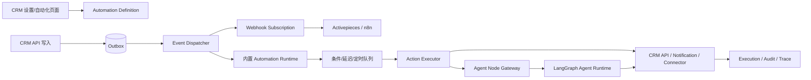

# CRMWolf 工作流与自动化能力策略分析

- **分析日期：**2026-08-31
- **分析对象：**CRMWolf 当前业务与 Agent 架构、Activepieces，以及 n8n、Temporal、Windmill、Pipedream、Zapier/Make 等成熟方案
- **结论性质：**“当前系统判断”基于本仓库代码和设计文档；“市场方案”基于厂商官方文档/源码；“产品建议”是结合 CRMWolf 现状做出的架构推论。

## 一、先给结论

CRMWolf **应该引入工作流/自动化能力**，但不建议现在直接把 Activepieces、n8n 或其他通用自动化引擎作为 CRM 核心业务流程的运行时真相。

推荐方向是：

> **先建设 CRM-native Automation（以 CRM 业务对象、领域事件和权限模型为中心的自动化层），再通过标准 Webhook/API/Connector 对接 Activepieces 或 n8n；核心事务流程继续由 CRM API + LangGraph 负责。**

这不是“要不要工作流”的问题，而是要把不同性质的流程分层：

| 流程类型 | 典型例子 | 推荐运行时 |
|---|---|---|
| CRM 核心事务流程 | 创建客户、推进商机、合同审批、回款登记、权限校验、写入前确认 | CRM API + 现有 LangGraph Workflow Agent |
| 跨系统自动化 | 客户创建后同步 ERP/飞书、审批通过后通知财务、向外部系统推送变更 | CRM 事件/Outbox + Automation Engine |
| 用户定时提醒 | 进入某阶段 3 天未跟进、回款到期前提醒、每日销售摘要 | CRM Automation Scheduler；后续可由外部引擎消费事件 |
| Agent 增强动作 | 总结客户动态、生成跟进建议、分类线索、生成外部系统草稿 | 受控 Agent Node + CRM 权限/HITL |
| 长时间、强可靠、跨服务流程 | 多日等待、信号、补偿、重试、人工介入和恢复 | 继续 LangGraph；规模和复杂度显著上升后评估 Temporal |

因此，Activepieces 的位置更适合是 **外围自动化扩展层或可选嵌入层**，而不是替代 CRMWolf 当前的 CRM 领域工作流。

## 二、方向修正：先做“飞书式轻量自动化”，不要先做通用工作流平台

上一版分析把 Outbox、执行引擎、连接器、长流程和运行时治理放得太靠前，容易把问题理解成“CRMWolf 要建设一个工作流平台”。结合飞书多维表格工作流的产品形态，更合适的第一阶段应该是一个轻量的 **Automation（自动化）** 模块：

> **当某个 CRM 对象发生某个事件，并且满足一些条件时，自动执行一个动作。**

飞书多维表格工作流的核心体验就是“触发条件 + 条件判断 + 执行动作”，常见触发包括新增/修改记录、到达记录时间、定时和 Webhook，常见动作包括发送消息、查找/新增记录、HTTP 请求、条件判断和延迟执行。飞书项目自动化也采用“触发场景 + 筛选条件 + 执行动作”的配置方式。citeturn0search0turn0search7

这与 CRMWolf 第一阶段真正需要的能力高度一致，不必一开始引入完整的通用画布、插件市场、复杂子流程或独立的 durable workflow platform。

### 2.1 第一阶段的用户体验

先不要让用户面对空白画布，而是提供一个四步配置器：

```text
选择对象/事件
  → 设置筛选条件
  → 选择动作
  → 保存并启用
```

例如：

```text
当：商机进入“报价”阶段
并且：负责人属于“华东销售组”
延迟：3 个工作日
如果：商机仍处于“报价”且最近 3 天没有跟进
执行：给负责人发送飞书提醒
```

第一版需要的是“自由组合几个有限节点”，而不是让用户编排任意流程。可以把配置表达成一句自然语言，但最终落地为结构化规则。

### 2.2 第一阶段只需要三类触发和五类动作

**触发器：**

1. 对象事件：客户创建/更新、商机阶段变化、任务逾期、回款到期；
2. 时间触发：到达日期字段、每天/每周定时；
3. 外部/人工触发：Webhook、手动测试或手动运行。

**动作：**

1. 发送站内/飞书/邮件提醒；
2. 创建跟进任务；
3. 修改有限的 CRM 字段或添加标签；
4. 调用 Webhook/HTTP；
5. 调用 Agent 生成摘要、建议或草稿。

审批不必在 Automation 中重新实现。Automation 可以“发起 CRM 审批”或“审批通过后继续”，但审批人、审批状态和审批记录仍归现有 CRM 审批模块。

### 2.3 第一阶段明确不做什么

暂时不做：

- 任意多层嵌套和复杂循环；
- 用户上传 Python/JavaScript；
- 自由 SQL；
- 插件市场和连接器市场；
- 多租户通用工作流画布；
- 跨月甚至跨年的复杂长事务；
- 让外部引擎管理 CRMWolf 的审批和 Agent pending 状态。

这些是平台化阶段的问题，不是“提醒和数据流转”MVP 的问题。

### 2.4 基础设施也应分阶段

产品体验可以先轻，底层可靠性按风险逐步增强：

- **MVP：**复用 CRMWolf 现有后台任务、Redis 和恢复扫描能力，增加持久化的规则、计划时间、启停状态和执行日志；
- **增长期：**对高价值事件补充 Transactional Outbox、签名 Webhook、幂等和死信；
- **平台期：**当出现大量跨系统长流程，再评估 Activepieces/n8n/Temporal 等专门运行时。

也就是说，不能因为未来可能需要 Outbox 和 durable execution，就把第一版产品做成复杂工作流平台。

## 三、为什么 CRMWolf 现在确实需要工作流

### 2.1 当前系统已经有流程，但流程是“垂直内建”的

CRMWolf 已有：

- FastAPI + SQLAlchemy + MySQL + Redis；
- 飞书/OAuth/IM Bot 集成；
- LangGraph root graph、checkpoint、interrupt/resume；
- 写入确认、HITL、幂等、审计和恢复机制；
- 客户活动后处理、智能档案、审批提醒等后台任务。

这些能力说明系统已经具备流程执行基础，但它们主要针对固定业务场景。新增“同步某个外部系统”“每周提醒某类客户”“审批通过后触发一串动作”时，当前倾向于新增一段专用服务、scheduler 或任务扫描逻辑，造成：

1. 触发条件分散在代码中；
2. 定时任务和业务写入缺少统一定义；
3. 外部系统接入难以复用；
4. 用户无法自行配置；
5. Agent 与外部系统之间没有稳定的动作协议；
6. 重试、幂等、失败告警、执行历史容易各自实现。

所以，引入工作流的价值主要不是“让 Agent 更聪明”，而是把 **触发器、条件、延迟、动作、连接、执行状态和审计** 从固定代码提升为可配置能力。

### 2.2 但不能把所有流程都交给通用工作流

CRMWolf 当前架构边界已经明确：

- Agent tool 不得直接访问业务 model/table；
- Agent 不得绕过 CRM API 的权限、审批和通知；
- 写入动作必须经过 HITL；
- LangGraph checkpoint 是可恢复运行时真相，不能在图外再造一套 pending 状态机。

这些规则同样适用于工作流引擎。外部工作流只能调用 CRM 的公开 API 或事件接口，不能直接连接 CRM 数据库；对于客户、商机、合同、回款等敏感写入，CRM API 仍是最终裁决者。

### 2.3 Automation 与 Agent 的边界

这里需要特别澄清：**CRM-native Automation 不是再做一个 Agent**。此前使用“懂客户、懂商机”的表述容易造成重叠，准确说法应是：

> **面向 CRM 业务对象和业务事件的自动化编排层。**

二者的分工如下：

| 对比项 | Automation | Agent |
|---|---|---|
| 主要职责 | 发现事件、判断规则、等待、调度、通知、同步、调用动作 | 理解自然语言、处理歧义、总结、推理、生成建议/草稿 |
| 触发方式 | 客户创建、阶段变化、任务逾期、定时、Webhook | 用户提问、用户指令、Automation 调用 |
| 是否需要模型 | 通常不需要；条件应尽量确定性执行 | 通常需要；用于语义理解和建议 |
| 是否主动 | 可以主动推送或主动执行 | 默认响应用户；也可以被 Automation 触发 |
| 失败处理 | 重试、暂停、死信、人工处理 | 重新询问、降级、转人工、进入 HITL |
| 典型结果 | 发通知、创建任务、同步外部系统 | 返回答案、生成摘要、生成待确认动作 |

所以，用户说的“主动推送”确实是 Automation 的一个重要表现，但不是全部。Automation 还包括跨系统同步、定时任务、延迟判断、Webhook 回调和执行审计。

最清晰的组合方式是：

```text
事件/定时触发
  → Automation 判断规则
  → 直接执行确定性动作，或调用 Agent 做分析
  → 必要时进入 CRM HITL
  → 通知/写回/同步外部系统
```

例如：

- “商机进入报价阶段后 3 天没有新跟进，提醒负责人”是 Automation；
- “请告诉我这个客户下一步该怎么跟进”是 Agent；
- “商机逾期后自动调用 Agent 生成建议，再把建议推送给负责人”是 Automation + Agent；
- “客户创建后同步 ERP”主要是 Automation，不需要 Agent；
- “把客户历史活动整理成 ERP 所需摘要”才需要 Agent。

因此，CRMWolf 的 Automation 应定位成 **主动触发和可靠执行层**，Agent 则是其中可选的 **智能决策/内容生成节点**。

## 三、Activepieces 是否适合 CRMWolf

### 3.1 Activepieces 解决的是相邻问题

Activepieces 官方产品和文档采用 Flow、Trigger、Action、Piece 等概念，面向业务自动化、SaaS 连接和 AI workflow，并提供云端与自托管方向。它的价值在于：

- 用可视化方式组合触发器和动作；
- 通过连接器接入常见 SaaS/API；
- 支持 webhook、定时和应用事件等自动化入口；
- 允许把 AI/Agent 能力作为流程中的一个步骤；
- 让非纯后端开发人员能够配置跨系统自动化。

官方入口：

- [Activepieces 官网](https://www.activepieces.com/)
- [Activepieces 文档](https://www.activepieces.com/docs/overview/welcome)
- [Activepieces 源码](https://github.com/activepieces/activepieces)

这些能力与用户提出的“数据打通、流程打通、自定义提醒、Agent 对接其他系统”高度相关。但产品边界也很清楚：通用引擎不知道 CRMWolf 的客户归属、商机状态约束、审批规则、团队权限和业务幂等语义。它可以编排动作，却不应该成为 CRM 业务规则的唯一拥有者。

### 3.2 最合适的接入方式是“外接优先”

建议按以下顺序使用 Activepieces：

1. CRMWolf 产生标准化事件；
2. Activepieces 通过 Webhook 接收事件；
3. 用户在 Activepieces 配置外部动作；
4. 回调 CRMWolf API 时使用正式 API、OAuth/API Key 和幂等键；
5. CRMWolf 对每次写入重新执行权限、状态和审批校验；
6. CRMWolf 保存事件投递、外部调用和回调结果的审计记录。

这样做的好处是可以快速验证市场价值，同时不会把 CRMWolf 的核心模型绑定到某个具体引擎：未来替换为 n8n、Windmill、自研 worker 或 Temporal，CRM 事件和 API 契约仍然有效。

### 3.3 不建议一开始深度嵌入 Activepieces

暂时不建议：

- 让 Activepieces 直接读写 CRMWolf 数据库；
- 把 CRMWolf 的审批状态迁移到 Activepieces；
- 让 Activepieces 持有 LangGraph pending/interrupt 的最终状态；
- 为了嵌入画布而引入一整套独立租户、凭证、执行、队列和升级运维体系；
- 在还没有事件契约和权限边界时先开发大量 Pieces。

只有当以下信号成立，才值得评估深度嵌入或二次开发：

- 用户明确需要在 CRMWolf 内配置跨系统流程，而不是跳转到外部工具；
- 已有足够多的 CRM-native connectors 和高频模板；
- 运行实例、连接凭证、租户隔离和失败运维责任已经被产品定义；
- 外部引擎的版本、许可证、升级和安全边界经过验证；
- 接入带来的激活率/留存提升足以覆盖长期维护成本。

## 四、成熟方案对比

| 方案 | 强项 | 适合 CRMWolf 的位置 | 主要限制/风险 |
|---|---|---|---|
| **Activepieces** | 开源/可自托管取向、可视化 Flow、Pieces/Triggers/Actions、面向业务自动化和 AI workflow | 外围自动化扩展层；验证用户自定义自动化；后续评估嵌入 | CRM 领域语义、权限、审批、核心事务一致性需要 CRMWolf 自己保证 |
| **n8n** | 成熟的节点式集成生态、Webhook/API 编排、队列模式和较强工程可操作性 | 作为企业客户自托管或内部集成层；适合连接器多、工程团队强的客户 | 产品体验、凭证隔离、租户边界和商业分发策略需要单独评估 |
| **Temporal** | Code-first Durable Execution，适合长流程、定时器、重试、信号、恢复和补偿 | 未来承载跨服务强可靠长流程；不作为第一版用户可视化自动化画布 | 开发者中心，接入和运营复杂；不是开箱即用的业务用户 Flow Builder |
| **Windmill** | Script/Flow/Job、开发者体验、定时和内部工具自动化 | 内部运营工具、工程团队编排、定制脚本 | 对 CRM 业务用户而言需要更多产品化封装；脚本自由度带来安全治理成本 |
| **Pipedream** | 面向开发者的 API/事件集成和快速连接器开发 | 早期外部集成实验、开发者生态 | 云依赖、数据驻留、成本和多租户控制需要谨慎 |
| **Zapier / Make** | SaaS 连接器和非技术用户体验成熟 | 作为客户已经在使用的外部系统；通过 Webhook/API 互通 | 核心自动化控制权在第三方；复杂权限、审计、数据驻留和事务语义不由 CRMWolf 完全掌控 |

官方参考：

- [n8n Queue Mode](https://docs.n8n.io/deploy/host-n8n/configure-n8n/scaling/enable-queue-mode)
- [n8n 源码](https://github.com/n8n-io/n8n)
- [Temporal Workflows](https://docs.temporal.io/workflows)
- [Temporal Schedules](https://docs.temporal.io/schedule)
- [Windmill 文档](https://www.windmill.dev/docs)
- [Pipedream 文档](https://pipedream.com/docs)
- [Zapier Webhooks](https://help.zapier.com/hc/en-us/articles/8496289231501-How-to-get-started-with-Webhooks-by-Zapier)
- [Make Webhooks](https://www.make.com/en/help/tools/webhooks)

### 4.1 选型建议

不要用“哪个平台功能最多”作为第一判断，而要按流程特征选型：

- **用户自定义、连接器多、流程中短步骤较多：**Activepieces/n8n；
- **开发者自定义脚本和内部工具：**Windmill；
- **必须可靠执行数小时到数月、支持恢复/信号/补偿：**Temporal 或继续增强 LangGraph runtime；
- **只想快速验证少数外部集成：**先用 Webhook/API 接入 Activepieces、n8n 或 Pipedream，不把执行引擎内化。

我的建议是：**产品层先做与引擎无关的 CRM Automation Contract，技术层先用 CRMWolf 自有 worker/scheduler 跑最小闭环，外围用 Activepieces/n8n 验证需求。**

## 五、CRMWolf 推荐目标架构



### 5.1 四条必须守住的边界

**边界一：CRM API 是业务真相。**

工作流动作只提交命令或调用 API；客户、商机、合同、支付等状态仍由 CRM API 按权限和业务规则决定。

**边界二：Outbox 是事件可靠性的基础。**

业务事务提交时，同事务写入 `domain_event_outbox`。异步 dispatcher 再负责投递，避免“数据库已成功、事件未发出”的双写丢失。投递应有租约、重试、退避、死信和幂等键。

**边界三：LangGraph 是 Agent 可恢复执行的真相。**

工作流可以调用 Agent，但不能复制一份 pending/interrupt 状态。涉及用户确认的 Agent 任务必须回到现有 LangGraph interrupt/resume 和 CRM HITL 流程。

**边界四：凭证和租户隔离必须在平台层实现。**

外部连接不能把 access token 放在流程 JSON 或日志中。凭证应使用加密存储、租户/团队作用域、最小权限、轮换、撤销和脱敏审计。

### 5.2 建议的核心领域模型

第一版不需要完整复制 Activepieces 的内部模型，但应先建立稳定的 CRM 侧合同：

```text
automation_definition
- id, tenant_id, name, description
- status: draft | active | paused | archived
- trigger_type, filter_expression, timezone
- created_by, updated_by

automation_version
- automation_id, version, definition_json, published_at
- immutable after publish

domain_event_outbox
- event_id, tenant_id, event_type, aggregate_type, aggregate_id
- occurred_at, schema_version, payload_json
- delivery_status, attempts, next_attempt_at

automation_run
- run_id, automation_id, version, trigger_event_id
- status, started_at, finished_at, error_code

automation_step_run
- run_id, step_key, status, input_snapshot, output_snapshot
- idempotency_key, attempt, error_code, duration_ms

external_connection
- id, tenant_id, provider, credential_ref, scopes, status
```

事件最小协议建议：

```json
{
  "event_id": "evt_01...",
  "event_type": "crm.opportunity.stage_changed",
  "schema_version": 1,
  "tenant_id": "tenant_01",
  "occurred_at": "2026-08-31T10:30:00Z",
  "actor": {"type": "user", "id": "user_01"},
  "aggregate": {"type": "opportunity", "id": "opp_01"},
  "data": {"from_stage": "proposal", "to_stage": "contract"},
  "trace_id": "trace_01..."
}
```

事件必须支持版本化、去重、重放和脱敏；不能把内部 ORM 对象直接序列化为公共事件。

### 5.3 Trigger、Condition、Action 的产品抽象

**Trigger：**

- 客户创建/更新；
- 商机阶段变化；
- 跟进任务到期/逾期；
- 合同审批通过；
- 回款计划临近或逾期；
- 收到 webhook；
- 定时（cron/固定时间/业务日历）；
- 手动运行。

**Condition：**

- 对象字段匹配；
- 负责人/团队/客户分群；
- 阶段和金额阈值；
- 相对时间条件，如“进入阶段超过 3 天”；
- 最近是否已有活动；
- 权限和数据范围。

**Action：**

- 创建/更新跟进任务；
- 发送站内、飞书、邮件或 webhook 通知；
- 调用已授权外部 API；
- 创建审批请求；
- 调用 Agent 生成摘要/建议/草稿；
- 请求人工确认；
- 延迟后继续；
- 记录备注、标签或活动。

第一版应只开放白名单动作，不允许用户提交任意 Python/JavaScript 作为生产动作，也不允许自由 SQL。

## 六、Agent 如何接入工作流

Agent 可以成为工作流中的一种 **受控节点**，但必须区分三类能力：

### 6.1 低风险：直接自动执行

适合：

- 客户动态摘要；
- 线索分类；
- 从活动记录抽取结构化事实；
- 生成内部提醒文本；
- 判断是否满足规则的候选条件。

输出必须是结构化 schema，并附带来源/置信度/模型版本；不得把模型生成内容伪装成已写入的业务事实。

### 6.2 中风险：生成草稿，交给后续节点

适合：

- 生成客户跟进建议；
- 生成飞书/邮件草稿；
- 根据回款逾期情况生成催收话术；
- 将 CRM 数据转换成 ERP/项目系统所需的请求草稿。

### 6.3 高风险：必须 HITL/审批

适合：

- 写入客户、商机、合同、回款等核心对象；
- 对外发送客户可见消息；
- 改变商机阶段或财务状态；
- 触发有业务后果的外部系统写入。

此类节点应创建 CRM 可见的确认任务，由 LangGraph interrupt/resume 管理等待态，而不是由通用工作流平台自行模拟一份确认状态。

## 七、最值得优先做的用户场景

### 场景 A：新增客户后同步外部系统

```text
客户创建成功
→ crm.customer.created
→ 判断客户行业/团队
→ 调用飞书/ERP webhook
→ 外部系统返回 external_id
→ 写入“外部关联记录”
→ 失败则重试并通知管理员
```

注意：回写 external_id 仍通过 CRM API，并以 `event_id + target_system` 作为幂等键。

### 场景 B：商机阶段变化后延迟提醒

```text
商机进入“方案/报价”阶段
→ 等待 3 个工作日
→ 若阶段仍未变化且没有新的跟进活动
→ 给负责人发送提醒
→ 可选：Agent 生成下一步建议
```

延迟不是简单的 sleep；应持久化计划时间、时区、取消条件、租约和重试。

### 场景 C：合同审批通过后通知财务

```text
合同审批完成
→ crm.contract.approved
→ 校验合同金额/客户/收款信息完整
→ 创建财务通知或调用 ERP API
→ 记录外部响应
→ 失败进入重试/人工处理
```

审批通过事件只能表示 CRM 审批状态已完成，不代表外部财务系统已成功接收。

### 场景 D：回款逾期后 Agent 辅助跟进

```text
回款计划逾期
→ crm.payment.overdue
→ Agent 读取权限范围内客户上下文和历史活动
→ 生成风险摘要、建议动作和消息草稿
→ 负责人确认
→ CRM 创建跟进任务/发送消息
```

Agent 只负责建议和草稿；最终写入/发送继续走现有工具、API 和 HITL。

## 八、推荐分阶段路线图

### Phase 0：轻量 Automation MVP

目标是先验证“用户能否自己配置出有价值的主动提醒和数据流转”，而不是先建设通用工作流平台。

1. 提供对象事件、时间触发和 Webhook 三类触发；
2. 提供条件筛选、延迟和五类白名单动作；
3. 增加“商机阶段变化 → 延迟提醒”内置模板；
4. 保存启停状态、下次执行时间、运行结果和失败原因；
5. 使用现有后台任务能力跑通闭环；
6. 对外提供一个简单 Webhook，先验证 Activepieces/n8n 是否有接入价值。

验收重点：事件不丢、重复不产生重复业务结果、权限不越界、失败可见且可恢复。

### Phase 1：CRM 内置 Automation MVP

加入最小管理界面：

- 选择触发对象和事件；
- 配置简单条件；
- 配置延迟/定时和时区；
- 选择白名单动作；
- 草稿、发布、暂停、复制；
- 执行历史、失败重试、手动重放；
- 模板化创建，而不是一开始支持任意图编辑。

建议先面向管理员/销售运营，而不是面向所有普通用户开放无限自由度。

### Phase 2：外部自动化生态

- 提供 API v1、事件订阅、签名验证和 replay；
- 提供 Activepieces Piece 或通用 HTTP/Webhook 模板；
- 提供 n8n node/credential 文档，或先支持 HTTP 节点；
- 增加 OAuth 连接和连接测试；
- 增加外部系统关联 ID、同步游标和冲突策略；
- 建立跨租户、数据驻留、凭证脱敏和审计要求。

### Phase 3：复杂编排和引擎评估

当出现以下需求时，再评估引入专门 durable execution engine：

- 跨系统流程持续数周或数月；
- 需要大量 signal、人工等待和补偿；
- 需要高吞吐 worker、严格重放和版本化；
- 单靠当前 worker/scheduler 已无法稳定运维；
- 运行实例与业务流程版本管理成为主要成本。

届时可以比较：继续增强 LangGraph runtime、将部分流程交给 Temporal，或通过事件/API 接入 Activepieces/n8n。不要因为需要一个提醒功能就提前引入 Temporal。

## 九、暂不建议做的事情

- 把 Activepieces/n8n 直接接到 MySQL；
- 让第三方工作流绕过 CRM API 的权限和审批；
- 把所有内部表发布为公共事件；
- 让 Agent 直接拥有任意外部系统写权限；
- 先做通用画布，再反向寻找业务场景；
- 为每个外部系统复制一套不可复用的同步服务；
- 把 cron/sleep 和内存队列当作长期可靠的调度机制；
- 用自由脚本替代白名单 Connector 和审计；
- 让 CRM 内置 Automation 与 LangGraph 各自维护一套 HITL/pending 状态；
- 把“流程执行成功”与“外部系统已成功落库”混为一谈。

## 十、决策与验证指标

### 建议的产品决策

1. **现在就做工作流能力，但先做 CRM-native Automation Contract。**
2. **Activepieces 先以外部扩展引擎接入，而不是核心依赖。**
3. **核心 CRM 写入和 Agent HITL 继续由 CRM API + LangGraph 承担。**
4. **用事件、Webhook、Connector 和执行记录建立引擎无关的扩展面。**
5. **先以提醒和通知验证需求，再扩展到双向数据同步和 Agent 动作。**

### 验证指标

- 事件投递成功率、重复投递率、死信率；
- 自动化规则发布后实际触发率和完成率；
- 失败重试后恢复率、人工介入率；
- 用户配置一个提醒所需时间；
- 外部系统同步延迟和冲突率；
- Agent 建议被采纳/修改/拒绝的比例；
- 自动化造成的重复写入、越权和错误外发事件数（目标为 0）；
- 简单流程的平均延迟和执行成本；
- 模板复用率，以及新增一个连接器所需工程工作量。

## 十一、最终建议

CRMWolf 不应该把自己定位成另一个通用 Zapier。更有价值的产品定位是：

> **一个面向 CRM 业务对象和业务事件，提供主动提醒、跨系统同步与受控 Agent 动作的自动化编排平台。**

具体策略是“内核自有、生态开放”：

- **内核自有：**CRM API、权限、审批、业务状态、HITL、事件契约、审计和 Agent runtime；
- **生态开放：**Webhook、OAuth、Connector、公开 API，以及与 Activepieces/n8n/Make/Zapier 的互操作；
- **逐步产品化：**先模板化自动化，再开放条件/延迟，最后根据真实需求提供画布和更多连接器。

如果只能选择一个下一步，我建议不是立刻部署 Activepieces，而是先实现：

> `Automation 配置器 + 规则持久化 + 定时/事件触发 + 执行日志 + 一个“商机阶段变化后 3 天提醒”的内置模板`。
>
> Outbox、签名 Webhook 和更强的执行可靠性作为增长期基础设施逐步补上，而不是第一版产品的前置条件。

这条路径既能验证用户是否真正需要工作流，也能为后续接入 Activepieces、n8n、Agent Node 和更强的 durable execution 保留清晰的技术演进空间。
