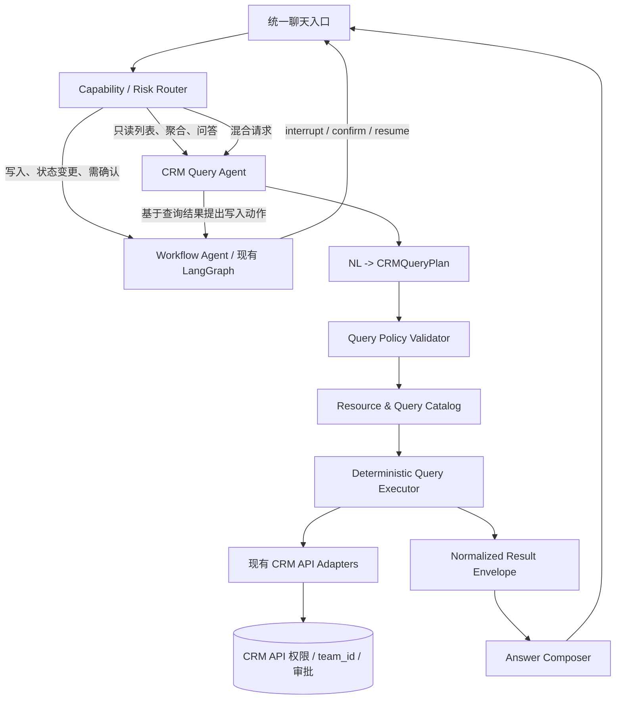

# CRM Agent 查询架构与多 Agent 演进调研

- **调研日期：**2026-08-21
- **范围：**CRMWolf 当前 Agent、Salesforce Agentforce、Microsoft Copilot Studio / Fabric data agent、HubSpot Breeze、LangChain / LangGraph 官方架构建议
- **结论性质：**“官方方案”章节总结一手资料；“对 CRMWolf 的判断”是结合本仓库代码得出的架构推论。

## 一、结论摘要

CRMWolf 当前查询扩展困难的主要原因不是 LangGraph，而是只读查询被实现成了“封闭意图枚举 + 手写 planner 分支 + 单工具调用 + 每类结果一个固定 presenter”。

用户提出的“保留现有 Agent，再增加问答 Agent”方向部分合理，但不应先升级成大量自治 Agent。优先级更高的是建立一个统一的 **CRM 查询语义层（CRM Query Semantic Layer）**，再把它封装成受控的 **CRM Query Agent**，接入现有 Root graph。现有图继续作为 **Workflow Agent / 工作流编排层**，负责写入、确认、恢复、幂等和审计。

推荐形态：

1. 一个统一聊天入口；
2. 一个确定性的能力/风险 Router；
3. 两类执行路径：
   - Workflow Agent：写入、跟进、商机推进、字段补充、HITL；
   - CRM Query Agent：结构化查询、列表、聚合、跨对象钻取和答案解释；
4. 所有事实查询仍经过现有 CRM API、权限和 `team_id` 范围；
5. LLM 负责把自然语言转换为受约束的查询计划以及解释结果，不直接生成 SQL，也不负责事实过滤、排序、聚合和权限裁决。

## 二、CRMWolf 当前实现分析

### 2.1 LangGraph 不是查询能力受限的直接原因

仓库中的 LangGraph 已经承担适合它的职责：

- Root graph；
- thread/checkpoint；
- interrupt/resume；
- pending/confirmed task；
- 多个领域 subgraph；
- 写入确认、恢复和结果投影。

仓库现有规范也明确将职责分为：LangChain 负责模型调用和 tool-calling 子 Agent，LangGraph 负责可恢复编排，CRM API 负责真实业务和权限。参见：

- `CRM-Docs/design-agent/foundations/architecture-boundary.md`
- `CRM-Docs/design-agent/roadmap/current-state.md`

因此，没有必要因为只读问答弱而推翻 Root graph 或写入工作流。

### 2.2 当前只读查询是一个封闭分发器

`CRM-Server/app/services/agent/schemas.py:23-33` 声明了多种查询类型：

- `FOLLOW_UP_TASKS`
- `WORK_SUMMARY`
- `CUSTOMER_PROFILE`
- `OPPORTUNITY`
- `CONTRACT`
- `PAYMENT`
- `INVOICE`
- `LICENSE`
- `UNKNOWN_READ`

但 `CRM-Server/app/services/agent/read_query_planner.py:89-109` 实际只为两类生成执行计划：

- `FOLLOW_UP_TASKS` → `list_follow_up_tasks`
- `WORK_SUMMARY` → `summarize_completed_work`

其余类型最终返回 `None`。planner 中还存在 `_WORK_SUMMARY_PHRASES`、`_FOLLOW_UP_TASK_QUERY_PHRASES` 等关键词表。这意味着新增一种查询通常需要同时修改：

1. 语义 schema / prompt；
2. planner 分支；
3. tool schema；
4. tool 注册和调用；
5. presenter；
6. 测试。

用户感受到的“每加一种搜索都要专门开发”是真实的，但这是当前查询模块接口太浅、知识散落在多个调用方造成的，不是 LangGraph 的必然特性。

### 2.3 “我在上海有哪些客户”是查询能力没有暴露，不是 CRM API 不支持

客户列表 API `CRM-Server/app/api/customers.py:851-873` 已经支持：

- `city`
- `industry`
- `status`
- `owner_id`
- `keyword`
- 创建时间
- 动态 `filters`
- 动态 `sorts`
- `scope=accessible`

同一 API 内部还执行当前用户权限和可访问范围约束（`CRM-Server/app/api/customers.py:878-921`）。

但 Agent 的输入模型 `CRM-Server/app/services/agent/tool_registry.py:111-114` 和实现 `CRM-Server/app/services/agent/tools/service.py:123-148` 只向 `search_customers` 暴露 `keyword` 与 `limit`，并固定传递 `scope=accessible`，没有暴露 `city`、`industry`、`status`、`owner_id`、排序等结构化筛选条件。

同时，`AgentReadQueryEntity` 只包含任务状态、任务时间窗口、工作总结窗口、归属、客户名和自由文本，缺少通用的资源、字段、过滤、排序、聚合结构（`CRM-Server/app/services/agent/schemas.py:205-213`）。

所以当前无法稳定回答“上海有哪些客户”的根因是：

- 模型没有可输出的 `city=上海` 查询计划字段；
- planner 没有客户列表查询计划；
- tool 没有暴露底层 API 已有的城市过滤能力；
- presenter 也没有客户列表结果类型。

### 2.4 输出固定是后端 presenter 的明确设计

`CRM-Server/app/services/agent/read_query_presenters.py` 为跟进任务手工拼接固定 Markdown，包括：

- 固定标题；
- 固定任务行格式；
- 最多展示十条；
- 固定的剩余条数提示。

`CRM-Server/app/services/agent/action_planning_graph.py:327-338` 只认识两个查询工具的结果。其他查询即使执行成功，也会返回“已完成查询，但当前还不能可靠整理这类结果”。

前端 `CRM-Client/src/components/agent/AgentMessageBody.vue` 已支持 Markdown，`CRMAgentChat.vue` 也会依据 `content_format` 选择渲染。因此主要瓶颈不是前端不能展示，而是后端只返回固定文案，缺少统一、可扩展的结果协议。

### 2.5 当前已经有多个领域子图，不等于需要马上建立大量自治 Agent

`CRM-Server/app/services/agent/` 已存在客户识别、客户活动、商机、联系人、业务上下文、跟进质量、行动规划、pending/confirmed task、工作总结等多个领域图。

这些子图主要解决确定性业务流程的模块化和恢复问题。把每个领域图都升级为拥有独立模型循环的自治 Agent，会新增：

- 路由不确定性；
- 更多模型调用、token 和延迟；
- 权限上下文复制；
- 跨 Agent 交接错误；
- trace 和测试组合爆炸。

仓库路线图其实已经给出更稳妥的方向：`CRM-Docs/design-agent/roadmap/enhancement-priority.md` 的 P2 是“为只读 tool 引入受控 LangChain tool-calling 子 Agent”，并要求管理查询的聚合、排序、过滤和分页由代码完成，模型只做摘要和解释。

## 三、市面成熟方案的共同模式

### 3.1 Salesforce Agentforce：受控主题、动作、数据与权限，而不是任意查询

Salesforce 的官方架构将 Agent 能力组织为 topics、instructions 和 actions。推理引擎根据用户请求选择主题与动作；动作可以是预置动作、Flow、Apex、Prompt Template 等。Agent 的数据访问遵循配置用户的权限、共享和字段安全；官方架构指南也强调 grounding、retrieval、guardrails、observability 和可审计性。

Agentforce 还提供 Query Records / Query Records with Aggregate 等标准动作，以及通过变量和 filters 约束查询的方式。这体现的不是“为每一句自然语言开发一次”，而是先建设可复用的业务动作/查询能力，然后让模型在受约束的动作集合内选择和填参。

官方资料：

- [Agentforce Agents Overview](https://developer.salesforce.com/docs/einstein/genai/overview/agents)
- [Agentforce Guide: Create Topics and Actions](https://developer.salesforce.com/docs/einstein/genai/guide/agent-topics.html)
- [Agentforce Guide: Agent User](https://developer.salesforce.com/docs/einstein/genai/guide/agent-user.html)
- [Query Records with Aggregate Action](https://developer.salesforce.com/docs/einstein/genai/guide/agent-action-query-records-aggregate.html)
- [Well-Architected Agentforce Solutions](https://architect.salesforce.com/fundamentals/agentforce)

### 3.2 Microsoft Copilot Studio：生成式编排选择知识、工具、主题和其他 Agent

Microsoft Copilot Studio 的 generative orchestration 会根据指令、对话上下文和可用能力，在运行时选择 topics、tools、knowledge sources 和其他 agents。官方同时提供 connected agents，但其用途是委派到专门能力，不是要求所有应用都拆成多 Agent。

Microsoft Fabric data agent 更接近 CRM 结构化问答场景：它让用户用自然语言询问 lakehouse、warehouse、Power BI semantic model 等结构化数据源，并将问题转换为 DAX、SQL 或 KQL。为了提高可靠性，配置者需要限定数据源、提供 AI instructions、示例查询，并建立验证和权限边界。

共同点是：动态问答的基础不是“另一个聊天模型”，而是可描述的数据语义、可执行查询能力、权限和验证。

官方资料：

- [Use generative orchestration to select topics, tools, and knowledge](https://learn.microsoft.com/en-us/microsoft-copilot-studio/advanced-generative-actions)
- [Generative orchestration guidance](https://learn.microsoft.com/en-us/microsoft-copilot-studio/guidance/generative-orchestration)
- [Connected agents](https://learn.microsoft.com/en-us/microsoft-copilot-studio/authoring-add-other-agents)
- [Microsoft Fabric data agent overview](https://learn.microsoft.com/en-us/fabric/data-science/concept-data-agent)
- [Create a Fabric data agent](https://learn.microsoft.com/en-us/fabric/data-science/how-to-create-data-agent)

### 3.3 HubSpot Breeze：CRM 上下文、知识源和明确动作

HubSpot Breeze Customer Agent 使用配置好的内容作为知识来源，并可授予明确动作，例如读取或更新 CRM 数据、执行特定业务操作。HubSpot 的 agent tools 由应用声明 tool、输入、执行函数和输出字段；工具可访问 CRM 数据或执行记录修改，但能力仍通过显式工具和权限被限定。

这说明成熟 CRM Agent 通常不是开放数据库访问，而是：

- 让 Agent 获得可信 CRM 上下文；
- 配置有限、可解释的动作；
- 对输出字段和用户可见结果进行声明；
- 保持平台权限和审计。

官方资料：

- [Create and customize a customer agent](https://knowledge.hubspot.com/customer-agent/create-a-customer-agent)
- [Give your customer agent access to CRM data](https://knowledge.hubspot.com/customer-agent/give-your-customer-agent-access-to-crm-data)
- [Create agent tools](https://developers.hubspot.com/docs/apps/developer-platform/build-apps/agent-tools)

### 3.4 LangChain / LangGraph：先做单 Agent + 动态工具，再按上下文边界拆分

LangChain 官方 multi-agent 文档明确指出，并非所有复杂任务都需要多 Agent。常见拆分动机包括：

- 单 Agent 工具过多，选择能力下降；
- 不同领域需要专门上下文或提示；
- 需要并行处理；
- 团队或能力有清晰独立边界。

Subagents 模式由主 Agent 统一控制并把专门 Agent 当作工具调用；middleware 还能根据运行时状态动态过滤工具。对于 CRMWolf，这支持“一个统一入口 + 受控 Query Agent / subagent”的方案，而不是先建立 customer/opportunity/contract/payment 等一群自治 Agent。

官方资料：

- [Multi-agent overview](https://docs.langchain.com/oss/python/langchain/multi-agent)
- [Subagents](https://docs.langchain.com/oss/python/langchain/multi-agent/subagents)
- [Agents and middleware](https://docs.langchain.com/oss/python/langchain/agents)
- [Custom middleware and dynamic tool selection](https://docs.langchain.com/oss/python/langchain/middleware/custom)

## 四、从市场方案抽象出的成熟架构模式

各厂商名称不同，但共同模式高度一致：

1. **统一入口与编排层**：理解本轮目标，选择知识、查询或业务动作。
2. **能力目录**：显式描述可用资源、动作、输入、输出和权限。
3. **语义层**：把“客户”“城市”“负责人”“合同金额”等业务概念映射到可执行字段和关联关系。
4. **确定性执行**：过滤、排序、分页、聚合、权限由代码或数据引擎执行。
5. **Grounding**：答案只能基于工具返回的数据，并能回到 CRM 实体。
6. **稳定结果协议**：列表、指标、明细、解释分离；自然语言可变化，但业务数据结构稳定。
7. **Guardrails 与审计**：工具 allowlist、读写权限、HITL、trace、失败分类。
8. **按需多 Agent**：只有上下文、权限、团队或领域自主性确实需要隔离时才拆分。

## 五、推荐的 CRMWolf 目标架构



### 5.1 Workflow Agent：保留现有 LangGraph 优势

职责：

- 跟进记录；
- 商机创建/推进；
- 客户资料维护；
- 缺字段补充；
- 对象消歧；
- HITL 确认、修改、拒绝；
- checkpoint、interrupt/resume；
- 幂等、审计和 API 失败处理。

不要把它缩窄成“只有跟进记录”的 Agent，因为当前 Root graph 已经是更通用的 CRM 工作流编排层。

### 5.2 CRM 查询语义层：真正需要新增的深模块

建议定义一个小而稳定的外部接口：

```python
class CRMQueryPlan(BaseModel):
    resource: Literal["customer", "opportunity", "contract", "payment", "activity", "follow_up_task"]
    select: list[str]
    filters: list[CRMFilter]
    group_by: list[str] = []
    metrics: list[CRMMetric] = []
    sorts: list[CRMSort] = []
    scope: Literal["accessible", "mine", "team"] = "accessible"
    limit: int = 50
    cursor: str | None = None
```

内部实现隐藏：

- 字段别名和枚举映射；
- 城市、行业、状态、负责人等过滤；
- 可关联对象与 join 路径；
- 时间表达转换；
- API 参数适配；
- 权限 scope；
- 排序、分页、聚合；
- 最大行数、最大调用数和超时策略。

Resource catalog 可声明：

```yaml
customer:
  selectable: [id, account_name, city, industry, status, owner]
  filterable: [city, industry, status, owner_id, created_time]
  sortable: [created_time, account_name, city, status, industry]
  relations: [opportunities, contracts, activities]
  adapter: customers_api
  default_scope: accessible
```

这样，“上海客户”“上海制造业客户”“我负责的上海客户”“这些客户最近有哪些商机”可以复用同一个查询模块，而不是每个问句增加一个 intent 和 presenter。

需要明确：新资源、新字段、新业务指标仍然需要开发和注册；成熟架构解决的是“开发一次资源能力后，可以覆盖大量自然语言组合”，而不是让模型无边界地访问所有数据。

### 5.3 CRM Query Agent：受控 tool-calling，而不是自由 SQL Agent

Query Agent 可以：

- 根据问题选择有限的只读工具；
- 生成结构化 `CRMQueryPlan`；
- 在 validator 拒绝非法字段、scope 或大查询后修正一次；
- 进行有限的多步查询/钻取；
- 基于结构化结果生成解释和下一步建议。

建议限制：

- 默认只读；
- 只提供与当前问题相关的动态工具集合；
- 最大 tool calls，例如 3–5 次；
- 单次和整轮最大结果行数；
- 禁止任意 SQL；
- 禁止绕过现有 CRM API；
- 所有聚合、金额计算、排序由代码执行；
- 每条回答保留实体引用和 query trace。

### 5.4 输出：稳定数据协议 + 动态自然语言

不要在“完全固定模板”和“只有自由 Markdown”之间二选一。推荐同时返回：

```json
{
  "answer": "你可访问的上海客户共有 18 家，下面先展示最近更新的 10 家。",
  "content_format": "markdown",
  "result": {
    "kind": "entity_list",
    "entity": "customer",
    "columns": ["account_name", "industry", "status", "owner"],
    "rows": [],
    "total": 18,
    "next_cursor": null
  },
  "entity_refs": [],
  "suggested_followups": [
    "只看我负责的客户",
    "查看这些客户的进行中商机"
  ]
}
```

原则：

- `answer` 可由模型根据用户问题灵活组织；
- `result` 是稳定协议，前端可渲染表格、卡片、指标或时间线；
- `entity_refs` 让用户能跳转真实 CRM 对象；
- 前端不解析自然语言来恢复业务数据；
- 空结果、权限不足、截断和分页必须是结构化状态。

## 六、是否需要多 Agent

### 适合现在做的拆分

- 一个统一入口；
- 现有 LangGraph 作为 Workflow Agent / orchestration；
- 一个 CRM Query Agent 作为只读 subgraph 或 callable agent；
- Router 优先依据结构化 intent、风险和 capability 做确定性裁决；
- 混合问题先查询事实，再把写入动作交给 Workflow Agent 确认。

### 暂时不适合的拆分

不建议立即建立：

- Customer Agent
- Opportunity Agent
- Contract Agent
- Payment Agent
- Invoice Agent
- License Agent
- 再加一个自由 Supervisor

除非以后出现以下真实边界：

- 每个领域有完全不同且很大的上下文；
- 权限和合规策略必须独立；
- 各领域由独立团队和发布周期维护；
- 单 Query Agent 的工具选择在评测中明显退化；
- 领域 Agent 需要独立的长期任务和自主循环。

在这些条件出现前，resource adapter / domain tool 比独立 Agent 更简单、更可测。

## 七、建议落地路线

### Phase 0：用“上海客户”验证正确接口

目标：不用构造一整套多 Agent，就打通一个真实结构化查询。

1. 扩展 `SearchCustomersInput`，或新增语义更清晰的 `query_customers`；
2. 支持 `city`、`industry`、`status`、`owner_scope`、`sort`、`limit`；
3. 继续调用现有 `GET /v1/customers/`；
4. 增加 `CUSTOMER_LIST` / 通用客户查询计划；
5. 返回 `entity_list` result envelope；
6. 覆盖权限、空结果、分页、城市别名和模型填参测试。

该阶段可以证明根因在查询 seam，而不是 LangGraph。

### Phase 1：建设通用 CRM Query 模块

1. 定义 `CRMQueryPlan`、filter/sort/metric schema；
2. 建立 resource/query catalog；
3. 建立 CRM API adapter registry；
4. 实现 query policy validator；
5. 实现 normalized result envelope；
6. 实现基于结果的 answer composer；
7. 建立自然语言到查询计划的评测集。

优先资源建议：

1. customer；
2. opportunity；
3. follow_up_task / activity；
4. contract；
5. payment。

### Phase 2：引入受控 Query Agent

1. 将 read tools 交给 LangChain tool-calling 子 Agent；
2. 根据用户权限、问题和阶段动态筛选工具；
3. 支持有限多步查询，例如“上海客户 → 进行中商机”；
4. 设置 tool calls、rows、timeout 和 token budget；
5. trace 中记录模型生成的 plan、validator 修改、tool 请求、结果摘要和实体引用；
6. 保留现有 Workflow graph，不做大规模重构。

### Phase 3：有评测证据后再决定是否拆多个 specialist agents

只有当 Query Agent 的上下文或工具集合确实过大，并有离线/线上评测显示动态工具过滤仍不足时，再把高复杂领域拆成 subagents。

## 八、验收指标

建议不要只测“回答看起来对”。至少包括：

- **Query plan accuracy**：资源、字段、过滤、排序、时间范围是否正确；
- **Execution accuracy**：返回集合是否与直接调用 CRM API 一致；
- **Permission isolation**：不可访问客户泄露数必须为 0；
- **Answer faithfulness**：答案中的数字和实体均可由 tool result 证明；
- **Empty/error behavior**：空数据、403、超时、截断不被改写为成功；
- **Latency/tool calls**：简单列表查询不应触发不必要的多 Agent 往返；
- **Cross-object success rate**：多步查询的关联和分页是否完整；
- **Presentation compatibility**：相同 result envelope 可被 Web、移动端和未来其他渠道复用。

## 九、不推荐做法

- 把问题归因于 LangGraph 并重写现有可恢复工作流；
- 为每个问句新增一个 intent enum、planner 分支和 presenter；
- 让模型直接生成任意 SQL；
- 把所有 CRM API 同时暴露给一个无限循环 Agent；
- 用向量检索替代城市、负责人、状态、金额等结构化过滤；
- 让模型自己计算总额、计数、排序和权限范围；
- 用自由 Markdown 作为前后端唯一数据协议；
- 在没有评测证据时先拆成大量自治 Agent。

## 十、最终建议

用户的判断“需要把查询问答从当前固定工作流中独立出来”是对的；但真正的第一步不是多 Agent，而是建立 **CRM 查询语义层这个深模块**。

推荐决策：

> 保留现有 LangGraph Workflow Agent；新增一个受控 CRM Query Agent；二者共享统一 CRM API 和权限边界，由 Root graph 路由。先做统一查询计划、资源目录和结果协议，再根据上下文与评测证据决定是否拆更多 specialist agents。
