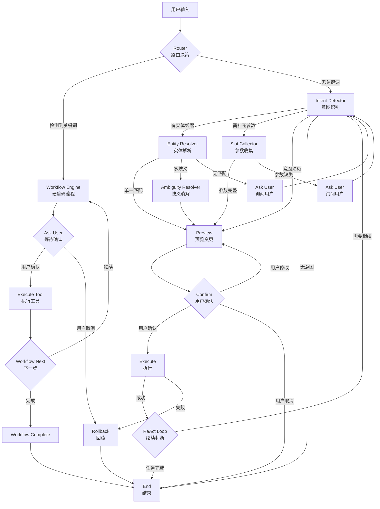

# AI 助手完整工作流说明

**适用范围**：CRMWolf AI 助手系统（LangGraph 架构）
**文档用途**：完整梳理 AI 助手从用户输入到结果反馈的全链路流程

---

## 一、架构概览

### 1.1 核心架构

**LangGraph StateGraph 引擎**：
- ✅ 替代原有 `ai_tool_service.py`（108KB）
- ✅ 使用 StateGraph 编排节点流程
- ✅ 支持条件路由 + Human-in-the-Loop
- ✅ Redis Checkpointer 持久化状态

**双引擎模式**：
- ✅ **Workflow Engine**：硬编码流程（赢单、转化等关键场景）
- ✅ **ReAct Engine**：自主推理循环（通用业务操作）

---

### 1.2 技术栈

| 层级 | 技术 | 用途 |
|------|------|------|
| **编排引擎** | LangGraph StateGraph | 流程编排 + 状态管理 |
| **状态持久化** | Redis Checkpointer | Session 持久化 + 幂等恢复 |
| **LLM 调用** | OpenAI API | Intent Recognition + ReAct Reasoning |
| **工具执行** | Handler Tools | 17+ 业务工具（跟进、赢单、转化等） |
| **前端交互** | SSE (Server-Sent Events) | 实时流式反馈 |

---

## 二、完整工作流流程图

### 2.1 LangGraph StateGraph 流程



---

### 2.2 简化流程（实际执行路径）

```
用户输入
  ↓
Router（路由决策）
  ├─ 检测关键词 → Workflow Engine（硬编码流程）
  │    ├─ ask_user → 用户确认 → execute → workflow_next → workflow_complete
  │    └─ rollback → end
  │
  └─ 无关键词 → Intent Detector（意图识别）
       ├─ entity_resolver → ambiguity_resolver → preview
       ├─ slot_collector → ask_user → preview
       ├─ preview → confirm → execute
       │    ├─ execute → react_loop → intent_detector（ReAct 循环）
       │    └─ execute → end（任务完成）
       └─ end（无意图）
```

---

## 三、核心节点详解

### 3.1 Router（路由决策）

**职责**：判断用户输入是否触发 Workflow

**决策逻辑**：
```python
def route_after_router(state: AgentState) -> str:
    """
    路由决策：
    1. 检查用户输入是否包含 Workflow 触发关键词
    2. 检查 entity_context 是否匹配 Workflow 触发条件
    
    Returns:
        "workflow": 触发 Workflow Engine
        "react": 进入 ReAct 循环
    """
    user_input = state["messages"][-1]["content"]
    entity_type = state["entity_context"]["entity_type"] if state["entity_context"] else None
    
    # 检查 Workflow 匹配
    workflow_id = workflow_definitions.match_workflow(
        user_input=user_input,
        intent_types=[],  # Router 阶段还没有 intent
        entity_type=entity_type
    )
    
    if workflow_id:
        state["workflow_id"] = workflow_id
        return "workflow"
    
    return "react"
```

**触发关键词示例**：
| Workflow ID | 触发关键词 | entity_type |
|-------------|-----------|-------------|
| `customer_win_flow` | 确认采购、已签约、赢单、成交 | `customer` |
| `lead_convert_flow` | 转客户、转化、线索转化 | `lead` |

---

### 3.2 Workflow Engine（硬编码流程）

**职责**：执行硬编码的业务流程

**流程结构**：
```python
# customer_win_flow（赢单流程）
steps = [
    {"id": "create_follow_up", "type": "tool", ...},
    {"id": "get_entity_context", "type": "tool", ...},
    {"id": "check_opportunity", "type": "decision", ...},
    {"id": "ask_confirm_win_single", "type": "ask_user", ...},
    {"id": "win_opportunity", "type": "tool", ...},
    {"id": "ask_create_contract", "type": "ask_user", ...},
    {"id": "create_contract", "type": "tool", ...},
]
```

**执行逻辑**：
```python
async def workflow_node(state: AgentState, config: RunnableConfig) -> Dict[str, Any]:
    """
    Workflow 执行逻辑：
    1. 从 workflow_definitions 获取流程定义
    2. 按步骤执行（tool/decision/ask_user）
    3. 处理用户回复后继续流程
    4. 流程完成或失败时结束
    """
    workflow_id = state["workflow_id"]
    step_index = state["workflow_step_index"]
    
    workflow = workflow_definitions.get(workflow_id)
    steps = workflow["steps"]
    
    # 执行当前步骤
    step = steps[step_index]
    
    if step["type"] == "tool":
        result = await execute_tool(step, state, config)
        return {"workflow_step_index": step_index + 1, "exec_result": result}
    
    elif step["type"] == "decision":
        branch = evaluate_decision(step, state)
        next_step_id = step["branches"][branch]["next_step"]
        next_step_index = find_step_index(steps, next_step_id)
        return {"workflow_step_index": next_step_index}
    
    elif step["type"] == "ask_user":
        return {
            "waiting_for_user": True,
            "pending_question": step["question"],
            "pending_options": step["options"]
        }
```

**关键特性**：
- ✅ **步骤固定**：AI 无法改变流程顺序
- ✅ **人机协同**：关键步骤等待用户确认
- ✅ **回滚机制**：失败时自动回滚已执行步骤

---

### 3.3 Intent Detector（意图识别）

**职责**：识别用户意图和所需工具

**识别流程**：
```python
async def intent_detector_node(state: AgentState, config: RunnableConfig) -> Dict[str, Any]:
    """
    意图识别流程：
    1. 提取用户输入和实体上下文
    2. 调用 LLM 进行意图识别
    3. 解析意图结果（action_id + entity_hint + missing_slots）
    
    Returns:
        intent_result: {
            "action_id": "create_customer",
            "entity_type": "customer",
            "entity_hint": "张三科技",
            "missing_slots": ["contact_phone", "customer_source"]
        }
    """
    user_input = state["messages"][-1]["content"]
    entity_context = state["entity_context"]
    
    # 调用 LLM 意图识别
    prompt = build_intent_prompt(user_input, entity_context)
    response = await llm_client.chat(prompt)
    
    # 解析意图
    intent_result = parse_intent_response(response)
    
    return {"intent_result": intent_result, "round_num": state["round_num"] + 1}
```

**意图结果结构**：
```python
intent_result = {
    "action_id": "create_customer",       # 工具 ID
    "entity_type": "customer",            # 实体类型
    "entity_hint": "张三科技",            # 实体线索（用于 Entity Resolver）
    "missing_slots": ["contact_phone"],   # 缺失参数
    "confidence": 0.85                    # 置信度
}
```

---

### 3.4 Entity Resolver（实体解析）

**职责**：解析实体线索，匹配具体实体 ID

**解析流程**：
```python
async def entity_resolver_node(state: AgentState, config: RunnableConfig) -> Dict[str, Any]:
    """
    实体解析流程：
    1. 从 intent_result 提取 entity_hint
    2. 调用 EntitySearch 工具搜索实体
    3. 根据匹配数量返回结果
    
    Returns:
        - 单一匹配：{"entity_id": 101, "confidence": 0.90}
        - 多歧义：{"candidates": [...], "confidence": 0.50}
        - 无匹配：{"candidates": [], "confidence": 0.0}
    """
    intent_result = state["intent_result"]
    entity_hint = intent_result["entity_hint"]
    entity_type = intent_result["entity_type"]
    
    # 调用 EntitySearch 工具
    candidates = await entity_search_tool(
        entity_type=entity_type,
        query=entity_hint,
        db=config["configurable"]["db"],
        team_id=state["team_id"]
    )
    
    if len(candidates) == 1:
        # 单一匹配，直接返回
        return {"entity_result": {"entity_id": candidates[0]["id"], "confidence": 0.90}}
    
    elif len(candidates) > 1:
        # 多歧义，需消解
        return {"entity_result": {"candidates": candidates, "confidence": 0.50}}
    
    else:
        # 无匹配
        return {"entity_result": {"candidates": [], "confidence": 0.0}}
```

**匹配策略**（三阶降级）：
| 阶级 | 匹配方式 | 置信度 | 示例 |
|------|----------|--------|------|
| **Exact** | 精确匹配归一化列 | 0.95 | "张三科技" → "张三科技" |
| **Norm** | 归一化后模糊匹配 | 0.80 | "张三科技有限公司" → "张三科技" |
| **Fuzzy** | 全字段模糊搜索 | 0.60 | "张三" → "张三科技" |

---

### 3.5 Slot Collector（参数收集）

**职责**：收集缺失参数，补充工具调用所需参数

**收集流程**：
```python
async def slot_collector_node(state: AgentState, config: RunnableConfig) -> Dict[str, Any]:
    """
    参数收集流程：
    1. 从 intent_result 提取 missing_slots
    2. 尝试从对话历史提取参数值
    3. 无法提取的参数返回给用户
    
    Returns:
        - 参数完整：返回 collected_slots
        - 参数缺失：返回 pending_missing_fields
    """
    intent_result = state["intent_result"]
    missing_slots = intent_result["missing_slots"]
    
    # 尝试从对话历史提取参数
    collected_slots = {}
    uncollected_slots = []
    
    for slot in missing_slots:
        # 调用 LLM 提取参数值
        value = await extract_slot_value(slot, state["messages"])
        
        if value:
            collected_slots[slot] = value
        else:
            uncollected_slots.append(slot)
    
    if not uncollected_slots:
        # 参数完整，返回收集结果
        return {"collected_slots": collected_slots}
    
    else:
        # 参数缺失，询问用户
        return {
            "waiting_for_user": True,
            "pending_missing_fields": uncollected_slots,
            "pending_field_options": get_field_options(uncollected_slots)
        }
```

---

### 3.6 Preview（预览变更）

**职责**：生成变更预览，供用户确认

**预览内容**：
```python
async def preview_node(state: AgentState, config: RunnableConfig) -> Dict[str, Any]:
    """
    预览流程：
    1. 构建 Preview 请求（preview=True）
    2. 调用 Handler Tool 执行 Preview
    3. 返回预览结果（不实际执行）
    
    Returns:
        preview_result: {
            "action_id": "create_customer",
            "plan": {
                "description": "创建客户「张三科技」",
                "changes": [
                    {"field": "account_name", "to_value": "张三科技"},
                    {"field": "industry", "to_value": "互联网"},
                    {"field": "contact_phone", "to_value": "138****1234"}
                ]
            },
            "risk_level": "medium",
            "requires_confirmation": True
        }
    """
    intent_result = state["intent_result"]
    entity_result = state["entity_result"]
    collected_slots = state.get("collected_slots", {})
    
    # 调用 Handler Tool Preview
    preview_result = await handler_tool.preview(
        action_id=intent_result["action_id"],
        params={**entity_result, **collected_slots},
        db=config["configurable"]["db"],
        user=config["configurable"]["user"],
        team_id=state["team_id"]
    )
    
    return {"preview_result": preview_result}
```

---

### 3.7 Confirm（用户确认）

**职责**：等待用户确认预览

**确认逻辑**：
```python
async def confirm_node(state: AgentState, config: RunnableConfig) -> Dict[str, Any]:
    """
    确认流程：
    1. 检查 preview_result 是否需要确认
    2. 等待用户回复（通过 interrupt_before）
    3. 根据用户回复决定下一步
    
    Returns:
        - 用户确认：返回 confirmed=True
        - 用户修改：返回 preview（重新预览）
        - 用户取消：返回 end
    """
    preview_result = state["preview_result"]
    
    if preview_result["requires_confirmation"]:
        # 需要用户确认，等待用户回复
        return {
            "waiting_for_user": True,
            "pending_question": preview_result["plan"]["description"],
            "pending_options": ["确认执行", "修改参数", "取消"]
        }
    
    else:
        # 无需确认，直接执行
        return {"confirmed": True}
```

---

### 3.8 Execute（执行工具）

**职责**：实际执行工具，完成业务操作

**执行流程**：
```python
async def execute_node(state: AgentState, config: RunnableConfig) -> Dict[str, Any]:
    """
    执行流程：
    1. 构建 Execute 请求（preview=False, action_id 必填）
    2. 调用 Handler Tool 执行实际操作
    3. 记录执行历史
    4. 返回执行结果
    
    Returns:
        exec_result: {
            "success": True,
            "entity_id": 101,
            "message": "客户创建成功",
            "data": {...}
        }
    """
    intent_result = state["intent_result"]
    entity_result = state["entity_result"]
    collected_slots = state.get("collected_slots", {})
    preview_result = state["preview_result"]
    
    # 调用 Handler Tool Execute
    exec_result = await handler_tool.execute(
        action_id=intent_result["action_id"],
        action_id_for_idempotency=preview_result["action_id"],  # 幂等 ID
        params={**entity_result, **collected_slots},
        db=config["configurable"]["db"],
        user=config["configurable"]["user"],
        team_id=state["team_id"]
    )
    
    # 记录执行历史
    execution_history = state["execution_history"] + [{
        "tool": intent_result["action_id"],
        "params": {**entity_result, **collected_slots},
        "result": exec_result,
        "timestamp": datetime.now().isoformat()
    }]
    
    return {"exec_result": exec_result, "execution_history": execution_history}
```

---

### 3.9 ReAct Loop（推理循环）

**职责**：判断是否需要继续操作

**循环逻辑**：
```python
def route_after_execute(state: AgentState) -> str:
    """
    ReAct 循环决策：
    1. 检查 exec_result 是否成功
    2. 调用 LLM 判断是否需要继续操作
    3. 决定下一步：intent_detector（继续）或 end（完成）
    
    Returns:
        "intent_detector": 继续 ReAct 循环
        "end": 任务完成
    """
    exec_result = state["exec_result"]
    
    if not exec_result["success"]:
        # 执行失败，回滚
        return "rollback"
    
    # 调用 LLM 判断是否继续
    should_continue = await llm_client.should_continue(
        user_intent=state["messages"][0]["content"],
        exec_result=exec_result,
        round_num=state["round_num"]
    )
    
    if should_continue and state["round_num"] < MAX_ROUNDS:
        # 需要继续，回到 Intent Detector
        return "intent_detector"
    
    else:
        # 任务完成
        return "end"
```

**循环限制**：
- ✅ **最大轮数**：5 轮（防止无限循环）
- ✅ **LLM 判断**：AI 自主判断是否需要继续
- ✅ **置信度拦截**：Guardrails 检查每次执行

---

### 3.10 Ask User（询问用户）

**职责**：等待用户回复，处理 Human-in-the-Loop

**询问场景**：
1. **Entity Resolver 无匹配**：询问用户提供更多信息
2. **Slot Collector 参数缺失**：询问用户补充参数
3. **Preview 需确认**：询问用户确认操作
4. **Workflow 步骤需确认**：询问用户确认流程步骤

**询问逻辑**：
```python
async def ask_user_node(state: AgentState, config: RunnableConfig) -> Dict[str, Any]:
    """
    询问用户流程：
    1. 检查 pending_question 和 pending_options
    2. 通过 interrupt_before 暂停执行
    3. 等待用户回复（通过 SSE 事件）
    
    Returns:
        - 用户回复后：返回 user_response
    """
    pending_question = state["pending_question"]
    pending_options = state["pending_options"]
    pending_missing_fields = state["pending_missing_fields"]
    
    # 发送 SSE 事件 waiting_for_user
    yield {
        "event": "waiting_for_user",
        "data": {
            "question": pending_question,
            "options": pending_options,
            "missing_fields": pending_missing_fields,
            "field_options": state["pending_field_options"]
        }
    }
    
    # 等待用户回复（通过 interrupt_before）
    # 用户回复后，通过 workflow_continue 接口恢复
```

---

## 四、SSE 事件流

### 4.1 SSE 事件类型

| 事件类型 | 触发时机 | 数据结构 |
|----------|----------|----------|
| **start** | Session 启动 | `{session_id, user_id, team_id}` |
| **node_start** | Node 开始执行 | `{node_name, round_num}` |
| **node_result** | Node 执行结果 | `{node_name, result}` |
| **tool_call** | 工具调用开始 | `{tool_name, params, preview}` |
| **tool_result** | 工具执行结果 | `{tool_name, success, message, data}` |
| **waiting_for_user** | Human-in-the-Loop 暂停 | `{question, options, missing_fields}` |
| **react_complete** | ReAct 循环完成 | `{round_num, execution_history}` |
| **workflow_complete** | Workflow 流程完成 | `{workflow_id, message}` |
| **error** | 错误信息 | `{error_code, message, trace_id}` |

---

### 4.2 SSE 事件流示例（赢单场景）

```javascript
// 1. 用户输入："微信跟进客户 POC 情况，客户反馈产品适用，确认采购"

// SSE 事件流：
event: start
data: {session_id: "wf_2_1781258459919"}

event: node_start
data: {node_name: "router"}

event: node_result
data: {node_name: "router", result: {workflow_id: "customer_win_flow"}}

event: workflow_start
data: {workflow_id: "customer_win_flow", workflow_name: "客户确认采购（赢单场景）"}

event: step_start
data: {step_id: "create_follow_up", step_type: "tool", description: "创建跟进记录"}

event: step_result
data: {step_id: "create_follow_up", success: true, message: "跟进记录添加成功"}

event: step_start
data: {step_id: "get_entity_context", step_type: "tool", description: "获取客户商机列表"}

event: step_result
data: {step_id: "get_entity_context", success: true, result: {opportunities: [...]}}

event: decision_made
data: {step_id: "check_opportunity", branch: "single_opportunity", next_step: "ask_confirm_win_single"}

event: step_start
data: {step_id: "ask_confirm_win_single", step_type: "ask_user", description: "确认赢单（单个商机）"}

event: waiting_for_user
data: {question: "客户确认采购，是否标记商机「央广云听文化传媒有限公司-50人1年订阅」为赢单？", options: ["是，标记赢单", "否，暂不标记"]}

// 用户点击"是，标记赢单"后，发送 workflow_continue 请求

event: workflow_resume
data: {session_id: "wf_2_1781258459919", user_response: "是，标记赢单"}

event: step_start
data: {step_id: "win_opportunity", step_type: "tool", description: "标记商机为赢单"}

event: step_result
data: {step_id: "win_opportunity", success: true, message: "商机已标记为赢单"}

event: workflow_complete
data: {session_id: "wf_2_1781258459919", message: "流程执行完成"}
```

---

## 五、关键流程场景对比

### 5.1 Workflow vs ReAct 对比

| 维度 | Workflow Engine | ReAct Engine |
|------|-----------------|--------------|
| **触发方式** | 关键词触发 | Intent Recognition |
| **流程控制** | 硬编码步骤 | AI 自主决策 |
| **步骤顺序** | 固定顺序 | 动态决策 |
| **人机协同** | 关键步骤等待用户确认 | Preview + Confirm |
| **适用场景** | 关键业务场景（赢单、转化） | 通用业务操作 |
| **灵活性** | 低（固定流程） | 高（自主推理） |
| **安全性** | 高（业务不变量检查） | 中（Guardrails 检查） |

---

### 5.2 典型场景流程对比

#### 场景 1：客户赢单（Workflow）

```
用户输入："微信跟进客户 POC 情况，客户反馈产品适用，确认采购"
  ↓
Router 检测关键词 → "customer_win_flow"
  ↓
Workflow Engine 执行：
  1. create_follow_up（创建跟进记录）
  2. get_entity_context（获取商机列表）
  3. check_opportunity（决策：单个商机）
  4. ask_confirm_win_single（等待用户确认）
  5. win_opportunity（标记赢单）
  6. ask_create_contract（询问是否创建合同）
  7. workflow_complete
```

---

#### 场景 2：创建客户（ReAct）

```
用户输入："创建客户 张三科技，电话 138****1234"
  ↓
Router 无关键词 → Intent Detector
  ↓
Intent Detector 识别：
  - action_id: "create_customer"
  - entity_hint: "张三科技"
  - missing_slots: ["industry"]
  ↓
Entity Resolver：
  - 无匹配（新客户）→ 无 entity_id
  ↓
Slot Collector：
  - 提取到 industry=None → 询问用户
  ↓
Ask User："请提供行业信息"
  ↓
用户回复："互联网"
  ↓
Preview：
  - plan: 创建客户「张三科技」，行业「互联网」，电话「138****1234」
  ↓
Confirm：等待用户确认
  ↓
Execute：创建客户成功
  ↓
ReAct Loop：LLM 判断任务完成 → end
```

---

#### 场景 3：跟进客户（ReAct 单轮）

```
用户输入："跟进客户 张三科技，明天电话联系"
  ↓
Router 无关键词 → Intent Detector
  ↓
Intent Detector 识别：
  - action_id: "follow_up_customer"
  - entity_hint: "张三科技"
  ↓
Entity Resolver：
  - 单一匹配：entity_id=101, confidence=0.90
  ↓
Preview：
  - plan: 创建跟进记录，内容「明天电话联系」
  ↓
Confirm：用户确认
  ↓
Execute：创建跟进记录成功
  ↓
ReAct Loop：LLM 判断任务完成 → end
```

---

## 六、关键机制详解

### 6.1 Guardrails 置信度拦截

| 置信度范围 | 拦截策略 | 处理方式 |
|-----------|----------|----------|
| **≥ 0.7** | 无拦截 | 直接执行 |
| **0.4 - 0.7** | human_loop | 询问用户确认 |
| **< 0.4** | block | 阻断操作，返回错误 |

---

### 6.2 幂等性管理

**幂等 ID**：`action_id`（UUID）

**幂等检查**：
```python
# Redis 存储
if redis.exists(f"action:{action_id}"):
    # 已执行过，返回缓存结果
    return cached_result
else:
    # 首次执行，存储结果
    result = execute_tool(...)
    redis.set(f"action:{action_id}", result, ttl=1800)
    return result
```

---

### 6.3 Session 持久化

**Redis Checkpointer**：
```python
# Session TTL：30 分钟
checkpointer = RedisCheckpointer(ttl=1800)

# 每次节点执行后自动持久化状态
await app.ainvoke(inputs, config={
    "configurable": {
        "thread_id": session_id,
        "db": db,
        "user": user
    }
})
```

---

### 6.4 撤销机制

**撤销窗口**：10 秒内

**撤销流程**：
```python
async def rollback_node(state: AgentState, config: RunnableConfig) -> Dict[str, Any]:
    """
    回滚流程：
    1. 从 execution_history 提取已执行操作
    2. 调用 Handler.undo() 执行撤销
    3. 清除 execution_history
    """
    for exec_record in state["execution_history"]:
        await handler_tool.undo(
            action_id=exec_record["tool"],
            params=exec_record["params"],
            db=config["configurable"]["db"]
        )
    
    return {"execution_history": []}
```

---

## 七、前端交互流程

### 7.1 前端 SSE 处理

```typescript
// CRM-Client/src/components/MagicWandDialog.vue

async function handleSend() {
  stage.value = 'sidebar-loading'
  isLoading.value = true
  
  await chatSSE(
    {content: userInput.value, entity_context: entityContext.value},
    (event) => {
      handleSSEEvent(event)
    },
    token
  )
}

function handleSSEEvent(event: AIAssistantSSEEvent) {
  switch (event.event) {
    case 'workflow_start':
      replyText.value = `启动流程: ${event.data.workflow_name}`
      break
    
    case 'step_start':
      replyText.value = `正在执行: ${event.data.description}`
      break
    
    case 'step_result':
      replyText.value = event.data.message
      break
    
    case 'waiting_for_user':
      handleWorkflowWaiting(event)
      break
    
    case 'workflow_complete':
      success.value = true
      resultMessage.value = event.data.message
      stage.value = 'result'
      break
  }
}
```

---

### 7.2 用户回复流程

```typescript
// 用户点击确认按钮后
async function handleWorkflowChoice(option: string) {
  isLoading.value = true
  stage.value = 'sidebar-loading'
  
  await continueWorkflowSSE(
    {session_id: workflowSessionId.value, user_response: option},
    (event) => {
      handleSSEEvent(event)
    },
    token
  )
}
```

---

## 八、总结

### 8.1 核心工作流总结

| 流程 | 触发方式 | 执行引擎 | 人机协同 | 适用场景 |
|------|----------|----------|----------|----------|
| **Workflow Engine** | 关键词触发 | 硬编码流程 | 关键步骤等待用户确认 | 关键业务场景（赢单、转化） |
| **ReAct Engine** | Intent Recognition | 自主推理循环 | Preview + Confirm | 通用业务操作 |

---

### 8.2 关键特性

- ✅ **LangGraph StateGraph 编排**：替代原有 ai_tool_service
- ✅ **双引擎模式**：Workflow + ReAct
- ✅ **Human-in-the-Loop**：关键操作等待用户确认
- ✅ **Guardrails 置信度拦截**：防止 AI 误操作
- ✅ **Redis Checkpointer**：Session 持久化 + 幂等恢复
- ✅ **SSE 实时反馈**：前端实时看到执行进度
- ✅ **撤销机制**：10 秒内可撤销

---

**版本**：1.0 | 最后更新：2026-06-12