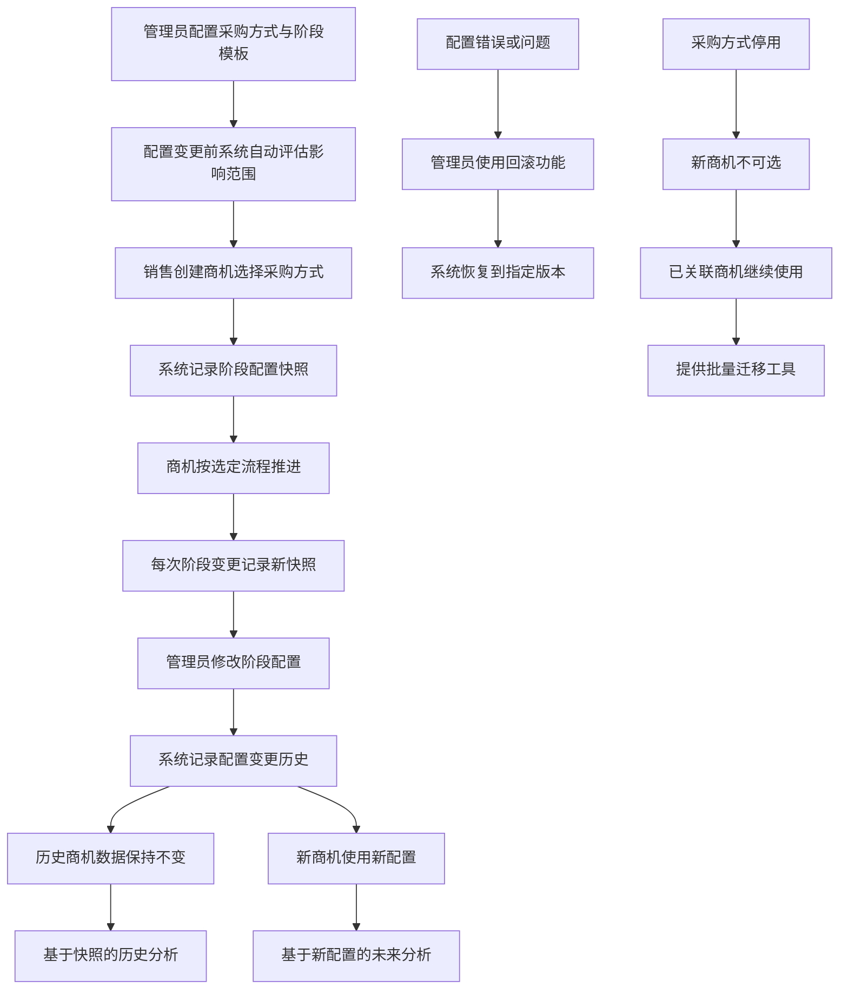
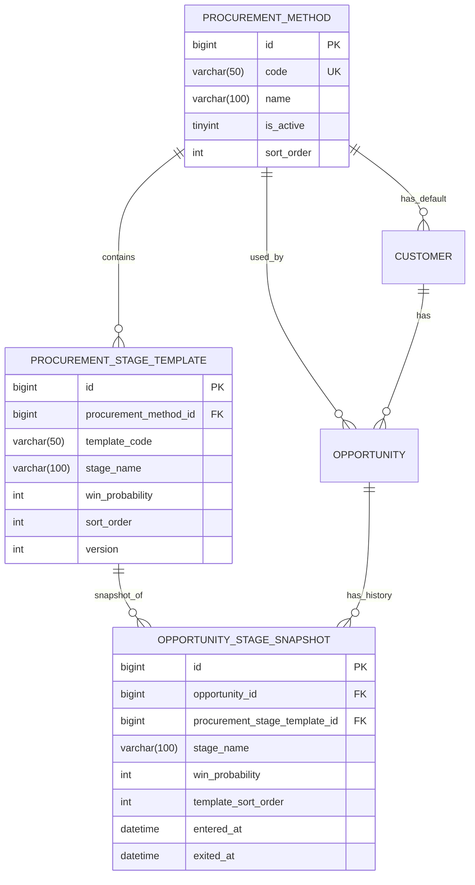

# 飞书轻量化CRM系统 - 客户采购阶段管理模块优化PRD（最终完整版）

## 1. 模块概述

### 1.1 优化背景
当前CRM系统的销售阶段采用统一标准配置，无法适应客户多样化的采购方式。不同采购方式（如公开招标、竞争性谈判、单一来源等）具有完全不同的决策流程和阶段划分，统一阶段配置导致销售漏斗失真、赢率预测不准、过程管理混乱。同时，缺乏对阶段配置变更的历史追溯能力，影响数据分析和合规审计。

### 1.2 核心目标
1. **多采购方式支持**：支持公开招标、邀请招标、竞争性谈判、单一来源、询价比价、电商化采购、代理采购等7种标准采购方式
2. **流程差异化配置**：每种采购方式可独立配置专属的阶段流程、阶段顺序、赢率和流转规则
3. **历史数据完整性**：通过快照机制确保阶段配置变更不影响已发生的业务记录
4. **精准赢率分析**：基于历史快照数据进行漏斗分析和赢率计算，确保数据准确性
5. **企业级管理**：提供完整的配置变更审计、影响评估、回滚和批量操作能力

## 2. 核心业务流程

## 3. 数据模型设计

### 3.1 核心实体关系

### 3.2 采购方式表 (`crm_procurement_methods`)
| 字段名 | 类型 | 必填 | 描述 | 约束与默认值 |
| :--- | :--- | :--- | :--- | :--- |
| `id` | `bigint` | 是 | 主键 | 自增 |
| `code` | `varchar(50)` | 是 | 采购方式编码 | 唯一，如: `PUBLIC_BIDDING` |
| `name` | `varchar(100)` | 是 | 采购方式名称 | 如：公开招标 |
| `description` | `varchar(500)` | 否 | 描述说明 | |
| `is_active` | `tinyint` | 是 | 是否启用 | 1:启用, 0:停用；默认1 |
| `sort_order` | `int` | 是 | 排序号 | 用于前端展示排序 |
| `created_by` | `varchar(100)` | 是 | 创建人 | 飞书用户ID |
| `updated_by` | `varchar(100)` | 否 | 最后更新人 | 飞书用户ID |
| `created_time` | `datetime` | 是 | 创建时间 | CURRENT_TIMESTAMP |
| `updated_time` | `datetime` | 是 | 最后更新时间 | CURRENT_TIMESTAMP |

### 3.3 采购阶段模板表 (`crm_procurement_stage_templates`)
| 字段名 | 类型 | 必填 | 描述 | 约束与默认值 |
| :--- | :--- | :--- | :--- | :--- |
| `id` | `bigint` | 是 | 主键 | 自增 |
| `procurement_method_id` | `bigint` | 是 | 采购方式ID | 外键 |
| `template_code` | `varchar(50)` | 是 | 模板阶段编码 | 同一方式下唯一 |
| `stage_name` | `varchar(100)` | 是 | 阶段名称 | |
| `win_probability` | `int` | 是 | 阶段赢率 | 0-100 |
| `sort_order` | `int` | 是 | 阶段顺序 | 同一方式下唯一，决定流程顺序 |
| `is_default_start` | `tinyint` | 是 | 默认起始阶段 | 1:是, 0:否；同一方式下仅一个阶段为1 |
| `can_skip` | `tinyint` | 是 | 是否可跳过 | 1:是, 0:否 |
| `description` | `varchar(500)` | 否 | 阶段描述 | |
| `version` | `int` | 是 | 版本号 | 从1开始，每次修改递增 |
| `version_lock` | `int` | 是 | 乐观锁版本 | 默认0，每次更新递增 |
| `created_by` | `varchar(100)` | 是 | 创建人 | 飞书用户ID |
| `updated_by` | `varchar(100)` | 否 | 最后更新人 | 飞书用户ID |
| `created_time` | `datetime` | 是 | 创建时间 | CURRENT_TIMESTAMP |
| `updated_time` | `datetime` | 是 | 最后更新时间 | CURRENT_TIMESTAMP |

### 3.4 商机阶段快照表 (`crm_opportunity_stage_snapshots`)
| 字段名 | 类型 | 必填 | 描述 | 约束与默认值 |
| :--- | :--- | :--- | :--- | :--- |
| `id` | `bigint` | 是 | 主键 | 自增 |
| `opportunity_id` | `bigint` | 是 | 商机ID | 外键 |
| `procurement_stage_template_id` | `bigint` | 是 | 阶段模板ID | 外键 |
| `stage_name` | `varchar(100)` | 是 | **快照：阶段名称** | 记录进入时的名称 |
| `win_probability` | `int` | 是 | **快照：阶段赢率** | 0-100，记录进入时的赢率 |
| `template_sort_order` | `int` | 是 | **快照：阶段顺序** | 记录进入时模板的sort_order |
| `template_code` | `varchar(50)` | 是 | **快照：阶段编码** | 记录进入时模板的编码 |
| `snapshot_version` | `int` | 是 | 快照版本 | 对应模板版本 |
| `entered_at` | `datetime` | 是 | 进入时间 | 进入该阶段的时间 |
| `exited_at` | `datetime` | 否 | 退出时间 | 离开该阶段的时间，NULL表示当前阶段 |

### 3.5 阶段模板变更日志表 (`crm_stage_template_change_logs`)
| 字段名 | 类型 | 必填 | 描述 | 约束与默认值 |
| :--- | :--- | :--- | :--- | :--- |
| `id` | `bigint` | 是 | 主键 | 自增 |
| `template_id` | `bigint` | 是 | 阶段模板ID | 外键 |
| `change_type` | `varchar(20)` | 是 | 变更类型 | CREATE, UPDATE, DELETE |
| `old_data` | `json` | 否 | 变更前数据 | 旧值的JSON快照 |
| `new_data` | `json` | 否 | 变更后数据 | 新值的JSON快照 |
| `changed_by` | `varchar(100)` | 是 | 变更人 | 飞书用户ID |
| `changed_at` | `datetime` | 是 | 变更时间 | CURRENT_TIMESTAMP |
| `reason` | `varchar(500)` | 否 | 变更原因 | |

### 3.6 客户表 (`crm_customers`) 修改
- `default_procurement_method_id` (`bigint`, 可为NULL): 客户的默认采购方式ID，仅为建议值。

### 3.7 商机表 (`crm_opportunities`) 修改
- `procurement_method_id` (`bigint`, 可为NULL): 商机实际采用的采购方式ID。
- `current_stage_snapshot_id` (`bigint`, 可为NULL): 当前阶段快照ID，外键。
- `current_stage_name` (`varchar(100)`, 可为NULL): 当前阶段名称（冗余，用于快速查询）。
- `current_win_probability` (`int`, 可为NULL): 当前阶段赢率（冗余，用于快速查询）。
- `current_stage_entered_at` (`datetime`, 可为NULL): 当前阶段进入时间（冗余，用于时间范围查询）。

## 4. 核心业务规则

### 4.1 阶段模板管理规则
1. **版本控制**：每次修改采购阶段模板时，`version`字段自动递增，并记录变更日志。
2. **乐观锁控制**：更新阶段模板时使用`version_lock`字段，防止并发修改导致的数据不一致。
3. **默认阶段唯一性**：每个采购方式下，有且仅有一个阶段的`is_default_start`字段值为1。
4. **阶段编码唯一性**：在同一采购方式下，`template_code`必须唯一。

### 4.2 商机阶段流转规则
1. **快照创建时机**：商机每次进入新阶段时，创建阶段快照记录，记录模板的当前状态。
2. **快照内容冻结**：快照记录进入时模板的阶段名称、赢率、编码、顺序，不受后续模板变更影响。
3. **阶段推进验证**：
   - 只能推进到同一采购方式下的阶段。
   - 目标阶段的`sort_order`必须大于当前阶段的`template_sort_order`，除非目标阶段`can_skip=1`。
4. **当前状态同步**：阶段变更时，必须同步更新商机表的当前阶段相关信息（包括冗余字段）。

### 4.3 采购方式管理规则
1. **启用/停用控制**：停用采购方式时，新商机不能选择该方式，但已关联的商机不受影响。
2. **停用前提校验**：停用采购方式前，需校验是否有活跃商机使用该方式，如有则提示不可停用（或提供迁移工具）。
3. **排序控制**：采购方式按`sort_order`排序，用于前端展示。

### 4.4 数据一致性保障规则
1. **事务性操作**：商机阶段推进、阶段模板创建/更新等关键操作必须放在数据库事务中，确保原子性。
2. **外键约束**：所有外键关系必须设置适当的约束，确保数据完整性。
3. **冗余字段同步**：商机表的当前阶段冗余字段必须与快照表保持同步。

## 5. API接口规范

### 5.1 采购方式管理接口
| 功能 | 方法 | 端点 | 请求体/参数 | 响应与核心逻辑 |
| :--- | :--- | :--- | :--- | :--- |
| 获取采购方式列表 | `GET` | `/api/v1/procurement-methods` | `is_active`(可选) | 返回列表，按`sort_order`排序。 |
| 创建采购方式 | `POST` | `/api/v1/procurement-methods` | 采购方式对象 | 校验`code`唯一性。仅管理员可操作。 |
| 更新采购方式 | `PUT` | `/api/v1/procurement-methods/{id}` | 采购方式对象 | 更新信息。停用前需校验无活跃关联商机。 |
| 获取采购方式详情 | `GET` | `/api/v1/procurement-methods/{id}` | - | 返回详情，包括阶段模板列表。 |

### 5.2 采购阶段模板管理接口
| 功能 | 方法 | 端点 | 请求体/参数 | 响应与核心逻辑 |
| :--- | :--- | :--- | :--- | :--- |
| 获取阶段模板列表 | `GET` | `/api/v1/procurement-methods/{methodId}/stage-templates` | - | 返回该采购方式下所有阶段模板，按`sort_order`排序。 |
| 创建阶段模板 | `POST` | `/api/v1/procurement-stage-templates` | 阶段模板对象 | 校验同一方式下`template_code`唯一性，以及默认起始阶段的唯一性。 |
| 更新阶段模板 | `PUT` | `/api/v1/procurement-stage-templates/{id}` | 阶段模板对象 | 版本号自动递增，记录变更日志。更新前评估影响范围。 |
| 删除阶段模板 | `DELETE` | `/api/v1/procurement-stage-templates/{id}` | - | 逻辑删除（标记为停用），校验是否被商机使用。 |
| 获取模板变更历史 | `GET` | `/api/v1/procurement-stage-templates/{id}/change-logs` | - | 返回该模板的所有变更记录。 |

### 5.3 商机阶段管理接口
| 功能 | 方法 | 端点 | 请求体/参数 | 响应与核心逻辑 |
| :--- | :--- | :--- | :--- | :--- |
| 创建商机 | `POST` | `/api/v1/customers/{customerId}/opportunities` | 商机对象（含采购方式） | 1. 确定采购方式（优先用传入的，否则用客户默认） 2. 获取默认起始阶段模板 3. 创建初始阶段快照 4. 设置商机当前状态 |
| 推进商机阶段 | `PATCH` | `/api/v1/opportunities/{id}/advance-stage` | `{"target_stage_template_id": 5}` | 1. 验证目标阶段模板有效性 2. 校验阶段顺序 3. 结束当前快照 4. 创建新阶段快照 5. 更新商机当前状态（事务内） |
| 获取商机阶段历史 | `GET` | `/api/v1/opportunities/{id}/stage-history` | - | 返回快照列表，按`entered_at`排序。 |
| 获取商机可用阶段 | `GET` | `/api/v1/opportunities/{id}/available-stages` | - | 返回当前采购方式下所有阶段模板。 |

### 5.4 客户采购方式接口
| 功能 | 方法 | 端点 | 请求体/参数 | 响应与核心逻辑 |
| :--- | :--- | :--- | :--- | :--- |
| 设置客户默认方式 | `PUT` | `/api/v1/customers/{customerId}/default-procurement-method` | `{"procurement_method_id": 1}` | 更新客户`default_procurement_method_id`字段。 |
| 获取客户采购历史统计 | `GET` | `/api/v1/customers/{customerId}/procurement-stats` | - | 统计客户各采购方式使用情况、阶段分布等。 |

### 5.5 管理工具接口
| 功能 | 方法 | 端点 | 请求体/参数 | 响应与核心逻辑 |
| :--- | :--- | :--- | :--- | :--- |
| 评估模板变更影响 | `GET` | `/api/v1/procurement-stage-templates/{id}/impact-assessment` | - | 返回使用此模板的商机数量、活跃商机列表等。 |
| 批量迁移商机采购方式 | `POST` | `/api/v1/admin/batch-migrate-procurement-method` | `{"source_method_id":1, "target_method_id":2, "opportunity_ids":[]}` | 批量将商机从一个采购方式迁移到另一个，并重新建立阶段快照。 |
| 配置回滚 | `POST` | `/api/v1/procurement-stage-templates/{id}/rollback` | `{"target_version": 2}` | 将阶段模板回滚到指定版本，并记录回滚日志。 |

## 6. 关键业务场景处理

### 6.1 商机创建流程
1. 确定采购方式：优先使用传入的`procurement_method_id`，否则使用客户的`default_procurement_method_id`。
2. 获取该采购方式的默认起始阶段模板（`is_default_start=1`）。
3. 在事务中：
   - 创建商机记录。
   - 创建初始阶段快照，记录模板的当前状态。
   - 更新商机的当前阶段相关信息。

### 6.2 阶段推进流程
1. 验证目标阶段模板是否属于当前商机的采购方式。
2. 验证阶段顺序：目标模板的`sort_order`必须大于当前快照的`template_sort_order`，除非目标模板`can_skip=1`。
3. 在事务中：
   - 结束当前快照（设置`exited_at`）。
   - 创建新阶段快照，记录目标模板的当前状态。
   - 更新商机的当前阶段相关信息。

### 6.3 阶段模板修改流程
1. 管理员在界面上修改阶段模板，系统自动评估影响范围（展示使用此模板的商机数量）。
2. 管理员确认修改，系统在事务中：
   - 记录变更前的快照到变更日志表。
   - 更新阶段模板，递增版本号。
   - 记录变更日志。
3. 修改仅对未来进入此阶段的商机生效，已存在的快照保持不变。

### 6.4 采购方式停用流程
1. 管理员尝试停用采购方式，系统检查是否有活跃商机使用此方式。
2. 若无活跃商机，则直接停用（`is_active=0`）。
3. 若有活跃商机，则提示不可停用，或提供批量迁移工具。

## 7. 数据迁移与初始化策略

### 7.1 初始化默认采购方式
系统预置7种标准采购方式，并为每种方式预置一套常用的阶段模板。

### 7.2 历史数据迁移策略
1. **采购方式迁移**：为所有现有客户设置默认采购方式为“标准销售流程”。
2. **商机采购方式迁移**：将所有现有商机的`procurement_method_id`设置为“标准销售流程”。
3. **阶段快照迁移**：为每个商机创建阶段快照，根据其当前阶段映射到对应模板，记录快照信息。

### 7.3 迁移验证
1. 验证迁移前后商机数量一致。
2. 验证每个商机都有对应的阶段快照。
3. 验证赢率数据迁移正确性。

## 8. 权限与审计

### 8.1 角色权限矩阵
| 操作 | 系统管理员 | 销售总监 | 销售成员 |
| :--- | :--- | :--- | :--- |
| 配置采购方式 | ✅ | ❌ | ❌ |
| 配置阶段模板 | ✅ | ❌ | ❌ |
| 查看所有配置 | ✅ | ✅ | 仅启用 |
| 创建/推进商机 | ❌ | ✅ | ✅ |
| 查看历史快照 | ✅ | ✅ | 仅自己负责 |
| 使用管理工具 | ✅ | ❌ | ❌ |

### 8.2 审计要求
1. 所有阶段模板修改记录版本变更日志，保留至少2年。
2. 商机阶段变更记录完整操作日志（谁、何时、从何阶段到何阶段）。
3. 采购方式停用记录停用原因和操作人。
4. 所有审计日志支持导出和条件查询。

## 9. 非功能性需求

### 9.1 性能指标
1. 商机阶段推进响应时间 < 500ms。
2. 获取商机阶段历史响应时间 < 1s（支持分页）。
3. 阶段模板列表查询响应时间 < 200ms。

### 9.2 数据一致性
1. 商机阶段变更必须保证快照创建和状态更新的原子性（事务）。
2. 阶段模板版本更新必须记录完整变更历史。

### 9.3 可扩展性
1. 支持未来新增采购方式类型。
2. 支持阶段模板的多版本管理和回滚。
3. 支持按采购方式定制化报表。

### 9.4 数据归档策略
1. 对已关闭（赢单/输单）超过2年的商机，其阶段快照可归档到历史表。
2. 归档数据支持按需查询。

## 10. 风险与应对

| 风险 | 可能性 | 影响 | 应对措施 |
| :--- | :--- | :--- | :--- |
| 历史数据迁移失败 | 中 | 高 | 分批次迁移，保留回滚方案，迁移前备份数据。 |
| 阶段模板版本混乱 | 低 | 中 | 严格版本控制，提供版本对比工具。 |
| 快照数据量过大 | 高 | 中 | 实施数据归档策略，定期清理旧快照。 |
| 采购方式配置错误 | 中 | 中 | 提供配置预览和测试功能，支持快速回滚。 |
| 并发修改冲突 | 中 | 低 | 使用乐观锁机制，提示用户重新加载。 |