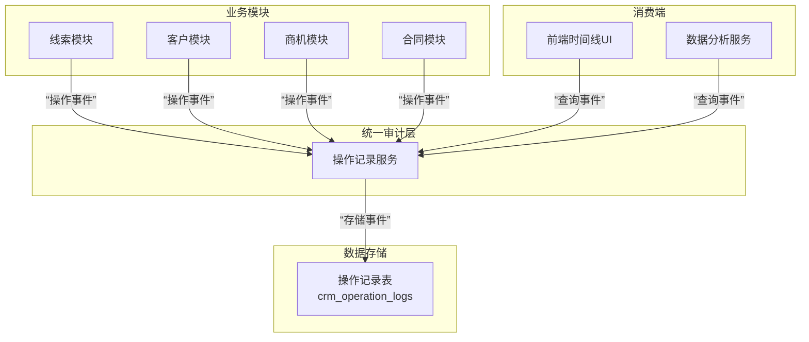

统一操作记录审计服务端PRD

## 1. 文档概述

### 1.1 产品背景
当前CRM系统的“线索”与“客户”模块仅支持手动添加跟进记录，缺乏对系统自动操作（如状态变更、创建商机合同等）的追踪。这导致了客户生命周期信息链的断层，影响了销售流程的透明度、团队协作效率以及后续的数据分析。本PRD旨在定义一个统一的审计日志系统，将离散的操作记录整合为连贯的客户时间线。

### 1.2 核心目标
1.  **全生命周期追溯**：记录从线索创建到回款完结的所有关键操作，形成完整的客户故事线。
2.  **提升运营透明度**：使销售、管理及财务人员能清晰了解客户状态的每一次变化及其原因。
3.  **支持深度分析**：为分析销售漏斗效率、团队活跃度、客户转化路径等提供坚实的数据基础。
4.  **增强系统可维护性**：通过标准化日志记录，便于问题排查与系统审计。

## 2. 系统架构与设计原则

### 2.1 核心设计理念
本系统将采用**事件溯源（Event Sourcing）** 的简化理念。不再仅仅记录对象的最终状态，而是将每一次状态变化作为一个不可变的事件（Event）持久化存储。通过按顺序回放这些事件，可以重建出任意时间点的业务对象状态。

### 2.2 架构示意图
为了实现统一审计，我们将建立一个中心化的操作记录服务，其架构如下：



## 3. 数据模型设计 (MySQL)

### 3.1 核心表 `crm_operation_logs`
此表作为整个系统的操作记录中枢。

| 字段名 | 类型 | 必填 | 描述 | 备注与约束 |
| :--- | :--- | :--- | :--- | :--- |
| `id` | `bigint` | 是 | 主键 | 自增 |
| **事件标识** | | | | |
| `event_id` | `varchar(64)` | 是 | 事件唯一ID | 可使用Snowflake算法或`<业务类型>-<时间戳>-<随机数>`生成，确保全局唯一。 |
| `event_type` | `varchar(50)` | 是 | 事件类型 | 核心字段，定义操作的本质。如：`LEAD_CREATED`, `LEAD_CONVERTED`, `CUSTOMER_FOLLOW_UP`, `OPPORTUNITY_CREATED`。 |
| `event_action` | `varchar(20)` | 是 | 事件动作 | 枚举: `CREATE`, `UPDATE`, `DELETE`, `SUBMIT`, `APPROVE`等，描述操作类型。 |
| **关联主体** | | | | |
| `primary_resource_type` | `varchar(20)` | 是 | 主资源类型 | 枚举: `LEAD`, `CUSTOMER`, `OPPORTUNITY`, `CONTRACT`等。 |
| `primary_resource_id` | `bigint` | 是 | 主资源ID | 如事件发生的客户ID或线索ID。 |
| `secondary_resource_type` | `varchar(20)` | 否 | 次资源类型 | 可选。如：当事件类型为`LEAD_CONVERTED`时，次资源为`CUSTOMER`。 |
| `secondary_resource_id` | `bigint` | 否 | 次资源ID | 可选。如：转化后新创建的客户ID。 |
| **操作详情** | | | | |
| `operator_id` | `varchar(100)` | 是 | 操作人ID | 关联飞书用户ID，系统操作可记为`system`。 |
| `operated_at` | `datetime` | 是 | 操作时间 | |
| `content` | `json` | 是 | 事件内容 | 以JSON格式灵活存储不同事件的详细信息。如：跟进内容、状态变更前后值、创建的商机金额等。 |
| `remark` | `varchar(500)` | 否 | 备注 | 人工输入的补充信息。 |

## 4. 事件类型与内容规范

### 4.1 事件定义举例
| 事件类型 (event_type) | 触发场景 | 事件内容 (content) JSON示例 |
| :--- | :--- | :--- |
| `LEAD_CREATED` | 创建新线索 | `{"leadName": "XX公司", "source": "线上咨询", "city": "北京"}` |
| `MANUAL_FOLLOW_UP` | 添加手动跟进 | `{"content": "电话沟通，需求明确", "method": "电话", "nextFollowTime": "2026-02-15"}` |
| `LEAD_CONVERTED` | 线索转化为客户 | `{"originalLeadName": "XX公司", "newCustomerName": "XX科技有限公司", "newCustomerId": 1001}` |
| `OPPORTUNITY_CREATED` | 创建商机 | `{"opportunityName": "XX项目", "expectedAmount": 500000.00, "stage": "初步接触"}` |
| `CONTRACT_STATUS_CHANGED` | 合同状态变更 | `{"previousStatus": "DRAFT", "currentStatus": "PENDING_REVIEW"}` |

## 5. API接口规范

### 5.1 写入接口：记录操作事件
- **端点**： `POST /api/v1/operation-logs`
- **权限**： 内部接口，主要供系统内部各业务模块调用，不直接对前端开放。需通过API网关或服务间认证。
- **请求体**：
```json
{
  "eventType": "MANUAL_FOLLOW_UP",
  "eventAction": "CREATE",
  "primaryResourceType": "CUSTOMER",
  "primaryResourceId": 1001,
  "operatorId": "ou_xxxxxx",
  "content": {
    "content": "首次拜访，沟通顺利",
    "method": "拜访",
    "nextFollowTime": "2026-02-20"
  }
}
```
- **逻辑**： 接口负责生成`event_id`，记录`operated_at`时间，并将数据存入`crm_operation_logs`表。

### 5.2 查询接口：获取操作记录
- **端点**： `GET /api/v1/operation-logs`
- **用途**： 供前端客户/线索详情页的时间线组件调用。
- **查询参数**：
| 参数 | 类型 | 必填 | 描述 |
| :--- | :--- | :--- | :--- |
| `primaryResourceType` | `string` | 是 | 要查询的主资源类型，如 `CUSTOMER`。 |
| `primaryResourceId` | `bigint` | 是 | 要查询的主资源ID，如客户ID。 |
| `eventTypes` | `string` | 否 | 事件类型过滤，多个用逗号分隔。如 `MANUAL_FOLLOW_UP,OPPORTUNITY_CREATED`。 |
| `pageNo` | `int` | 否 | 页码，默认1。 |
| `pageSize` | `int` | 否 | 每页数量，默认20。 |

- **响应**：
```json
{
  "code": 200,
  "data": {
    "list": [
      {
        "eventId": "event_123456",
        "eventType": "MANUAL_FOLLOW_UP",
        "eventAction": "CREATE",
        "operatorId": "ou_xxxxxx",
        "operatorName": "张三",
        "operatedAt": "2026-02-10 14:30:00",
        "content": {...},
        "remark": null
      }
    ],
    "total": 150,
    "pageNo": 1,
    "pageSize": 20
  }
}
```

## 6. 集成与实施策略

### 6.1 业务模块改造点
各业务模块需在关键操作执行成功后，同步调用操作记录服务的写入接口。

| 模块 | 需要记录的操作事件示例 |
| :--- | :--- |
| **线索管理** | `LEAD_CREATED`, `LEAD_UPDATED`, `LEAD_CONVERTED`, `LEAD_FOLLOW_UP`（现有跟进） |
| **客户管理** | `CUSTOMER_CREATED`（来自转化）, `CUSTOMER_UPDATED`, `CUSTOMER_FOLLOW_UP` |
| **商机管理** | `OPPORTUNITY_CREATED`, `OPPORTUNITY_STAGE_CHANGED`, `OPPORTUNITY_WON` |
| **合同管理** | `CONTRACT_CREATED`, `CONTRACT_STATUS_CHANGED` |
| **回款管理** | `PAYMENT_PLAN_CREATED`, `PAYMENT_RECEIVED` |

### 6.2 数据一致性保障
- **异步写入**：为避免影响主业务性能，业务模块调用写入接口时可采用**异步非阻塞**方式（如发出事件消息，由消费者处理）。
- **保证最终一致性**：必须确保操作记录**至少被成功写入一次**，避免因记录丢失导致审计信息不完整。

## 7. 非功能性需求

1.  **性能**：查询接口的响应时间应控制在500毫秒以内，尤其在客户详情页需要频繁调用。需对`(primary_resource_type, primary_resource_id, operated_at)`建立复合索引。
2.  **可靠性**：操作记录服务应具备高可用性，日志数据不允许丢失。
3.  **安全性**：查询接口必须严格校验数据权限，确保用户只能查询其有权访问的客户或线索的操作记录。
4.  **可扩展性**：事件类型`event_type`应设计为可配置，便于未来轻松扩展新的操作记录。

## 8. 总结
本PRD定义了一套通过**中心化事件记录**来构建统一客户操作时间线的服务端方案。该方案通过标准化的事件模型和API，将分散在各业务模块的操作痕迹有效整合，最终为前端提供一份连续、完整、可分类筛选的客户生命周期档案，彻底解决信息断层问题，为精细化运营和数据分析赋能。